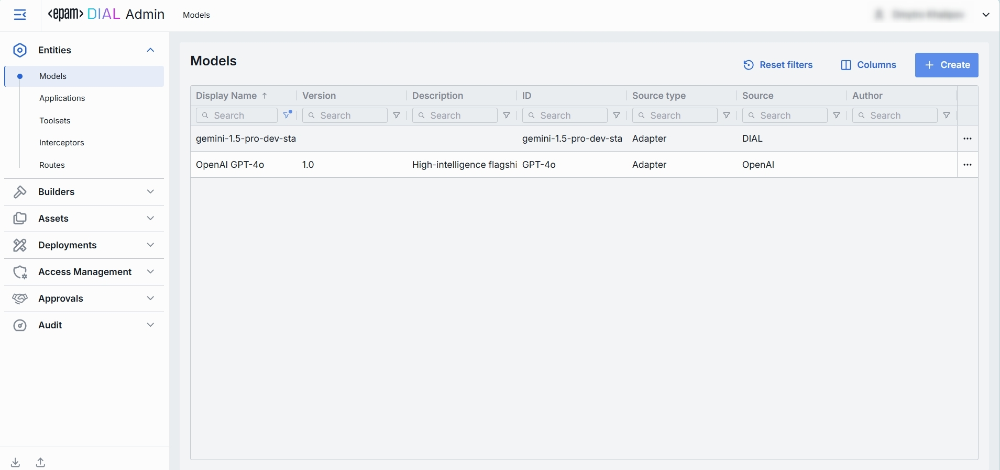
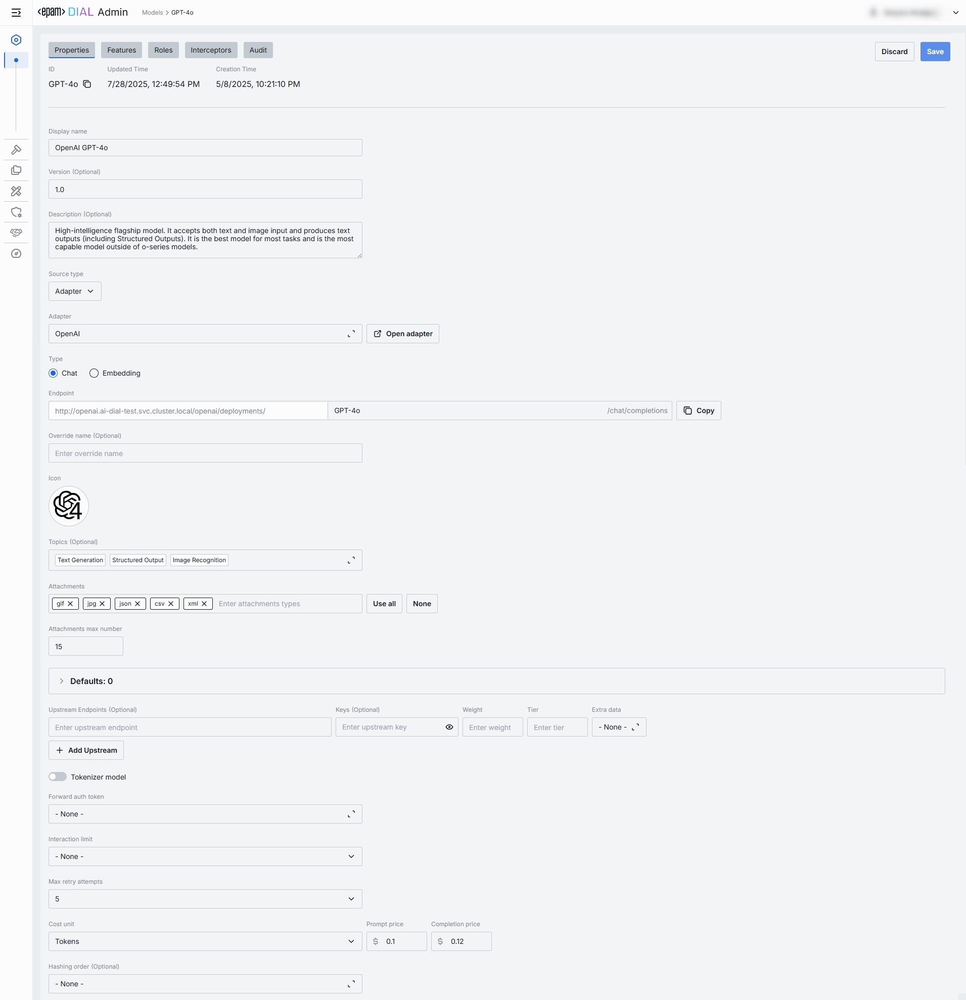
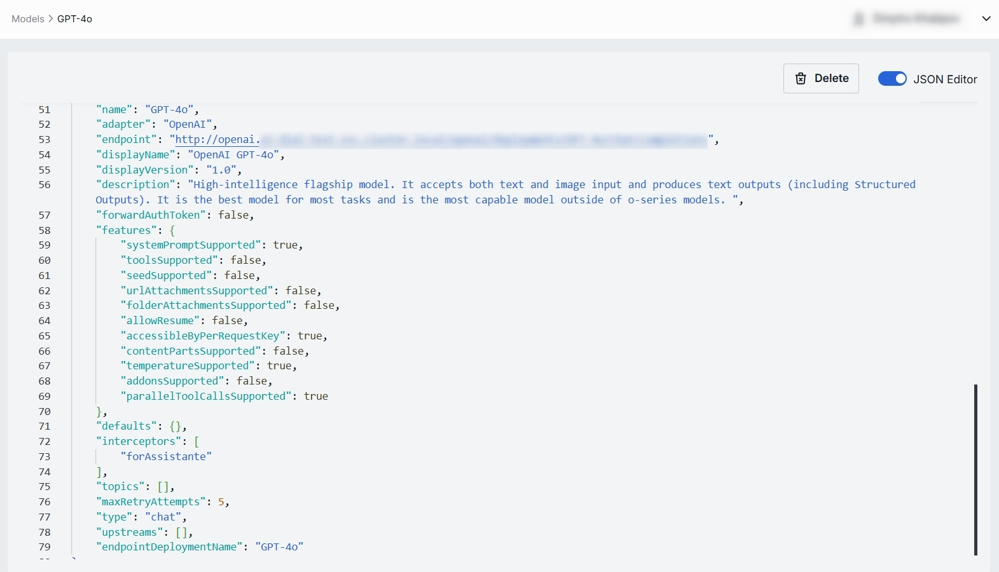

# Models

## About Models

In Models, you can find all language models deployed in DIAL and also add new model deployments. 

DIAL allows you to access models from all major LLM providers, language models from the open-source community, alternative vendors, and fine-tuned micro models, as well as self-hosted models or models listed on HuggingFace or DeepSeek.

DIAL can function as an [agentic platform](/docs/platform/0.architecture-and-concepts/4.agentic-platform.md), where language models can be used as building blocks in your apps to create multi-modal and multi-agentic solutions.

You can use the [DIAL SDK](https://github.com/epam/ai-dial-sdk) to create custom model adapters. Applications and model adapters implemented using this framework will be compatible with the DIAL API that was designed based on the Azure OpenAI API.

> Refer to the [Supported Models](/docs/platform/2.supported-models.md) page for a list of all supported models and  model adapters.

## Models List

On the **Models** page, you can find all language models (LLMs) deployed on your DIAL instance. Here you can view, filter, and add new model definitions.

> **TIP**: Click **Columns** to open the columns selector to define what columns to display.

##### Models grid

| Field                     | Definition                                                                                                                                                                                                                                                                                                                                                                                           |
|---------------------------|------------------------------------------------------------------------------------------------------------------------------------------------------------------------------------------------------------------------------------------------------------------------------------------------------------------------------------------------------------------------------------------------------|
| **Display Name**          | A user-friendly label for a model (e.g. "GPT-4 Turbo"). Display name is shown in all DIAL client UI dropdowns, tables, and logs so operators can quickly identify the model.                                                                                                                                                                                                                         |
| **Version**               | An **optional** tag or a label for this model deployment (e.g. `0613`, `v1`). Use it to distinguish between "latest," "beta," or date-stamped builds.                                                                                                                                                                                                                                                |
| **Description**           | Free-text notes about this model’s purpose, training data, cost tier, or any other relevant details.                                                                                                                                                                                                                                                                                                 |
| **ID**                    | This is a unique key under the `models` section of [DIAL Core’s config](https://github.com/epam/ai-dial-core?tab=readme-ov-file#dynamic-settings). Must match the upstream service’s model or deployment name (e.g. `gpt-4-0613`).                                                                                                                                                                   |
| **Source Type**           | Can be one of the following options: Adapter, Model Container, External Endpoint.                                                                                                                                                                                                                                                                                                                    |
| **Source**                | Exact Adapter Id, Model deployment Id or Endpoint of the model.                                                                                                                                                                                                                                                                                                                                      |
| **Author**                | Contains e-mail of model's author.                                                                                                                                                                                                                                                                                                                                                                   |
| **Type**                  | Defines **Chat** (conversational completions) and **Embedding** models (vector generation). DIAL Core uses this to choose the correct API endpoint and a payload schema.                                                                                                                                                                                                                             |
| **Override Name**         | An optional, context-specific display label that supersedes **Display Name** in dropdowns or tables for certain routes or applications. Use it to give a model different aliases in different workflows without redefining the model.                                                                                                                                                                |
| **Topics**                | Tags or categories (e.g. "finance," "support," "image-capable") you can assign for discovery, filtering, or grouping in large deployments. Helps end users and admins find the right model by the use case. Topics are also used to filter models in [DIAL Marketplace](/docs/platform/4.chat/1.marketplace.md).                                                                                     |
| **Attachment types**      | Controls which types of attachments this model can accept.                                                                                                                                                                                                                                                                                                                                           |
| **Max attachment number** | Maximum number of attachments allowed per single request. Leave blank for an unlimited number. Prevents requests with an excessive number of files.                                                                                                                                                                                                                                                  |
| **Tokenizer model**       | Identifies the specific model with a tokenization algorithm identical to the referenced model's. This is typically the name of the earliest released model in a series of models sharing an identical tokenization algorithm. This parameter is essential for DIAL clients that reimplement tokenization algorithms on their side, instead of utilizing the tokenize Endpoint provided by the model. |
| **Forward auth token**    | Optionally, configure the system to forward the Auth Token from the caller's session to the upstream API call. This enables multi-tenant scenarios or pass-through authentication for downstream services.                                                                                                                                                                                           |
| **Interaction limit**     | The interaction limit parameter in models refers to the maximum number of tokens that can be transmitted in a completion request and response combined. This parameter ensures that the model does not exceed a specified token limit during interactions.                                                                                                                                           |
| **Prompt price**          | Cost per unit (according to **Cost unit**, typically "token" or "request") applied to the *input* portion of each call. Used by the [Dashboard and Usage Logs](/docs/tutorials/3.admin/telemetry-dashboard.md) to estimate spending in real time.                                                                                                                                                    |
| **Completion price**      | The cost per unit is charged for the output portion of each call. Combined with the prompt price, it determines your per-model cost calculations.                                                                                                                                                                                                                                                    |

## Create Model

1. Click **+ Create** to invoke a **Create Model** modal.
2. Define parameters:

| Field            | Required     | Definition & Guidance                                                                                                                                                                                |
|------------------|--------------|------------------------------------------------------------------------------------------------------------------------------------------------------------------------------------------------------|
| **ID**           | Yes          | A unique identifier used by the model adapter to invoke the model's backend.                                                                                                                         |
| **Display Name** | Yes          | A user-friendly label shown across the UI (e.g. "GPT-4 Turbo").                                                                                                                                      |
| **Version**      | No           | Version is an optional tag to track releases when you register multiple variants of the same model. (e.g. `2024-07-18`, `v1`)                                                                        |
| **Description**  | No           | Free-text note about the model’s purpose or distinguishing traits.                                                                                                                                   |
| **Source Type**  | Yes          | Allows to select one of the following options: Adapter, Model Container, External Endpoint.                                                                                                          |
| **Adapter**      | Conditional  | Required if Source Type is 'Adapter'. A model adapter that will handle requests to this model (e.g. OpenAI, DIAL). The chosen adapter supplies authentication, endpoint URL, and request formatting. |
| **Container**    | Conditional  | Required if Source Type is 'Model Container'. Allows to select one of Model deployments in DIAL instance (must be in Running state).                                                                 |
| **Endpoint**     | Conditional  | Required if Source Type is 'External Endpoint'. URL that DIAL Core will invoke for this model.                                                                                                       |

3. Click **Create** to close the dialog and open the [configuration screen](#model-configuration). When done with model configuration, click **Save**. It may take some time for the changes to take effect after saving. Once added, the model appears in the **Models** listing and can be used by Routes and Applications.

## Model Configuration

You can access the model configuration screen by clicking any model in the models grid and also when adding a new model. In this section, you can view and configure all settings for the selected language model deployment.

* [Properties](#properties): Main definitions and runtime settings.
* [Features](#features): Optional capabilities and custom endpoints.
* [Roles](#roles): User groups that can invoke this model and their rate limits.
* [Interceptors](#interceptors): Custom logic to modify requests or responses.
* [Audit](#audit): Provides aggregated audit metrics and detailed logs of individual configuration changes.

##### Top Bar Controls

* **Delete**: Permanently removes the selected model's definition from DIAL Core. All Routes referencing it will throw an error until a replacement is created.
* **JSON Editor** (Toggle): Switch between the form-based UI and raw [JSON view](#json-editor) of the model’s configuration. Use JSON mode for copy-paste or advanced edits.

### Properties

In the **Properties** tab, you can view and edit main definitions and runtime settings for model deployment. 

* [Basic identification](#basic-identification): ID, Display Name, Version, Description.
* [Adapter & Endpoint](#adapter--endpoint): Select the Adapter, API Type (Chat or Embedding), and read-only Endpoint URL.
* [Presentation & Attachments](#presentation--attachments): Override name, icon, topics, and attachment types.
* [Upstream Configuration](#upstream-configuration): Define upstream endpoints, authentication keys, weights, and extra data.
* [Advanced Options](#advanced-options): Tokenizer model, forward auth token, interaction limits, retry attempts.
* [Cost Configuration](#cost-configuration): Set cost unit, prompt price, and completion price for real-time billing.

##### Basic Identification and Information

| Field             | Required | Description                                                                                                                                                                   |
|-------------------|----------|-------------------------------------------------------------------------------------------------------------------------------------------------------------------------------|
| **ID**            | -        | A unique key DIAL Core uses in the `models` section. Must match the upstream’s deployment or model name (e.g. `gpt-4o`, `gpt-4-turbo`). Non-editable after the model created. |
| **Updated Time**  | -        | Date and time when the model's configuration was last updated.                                                                                                                |
| **Creation Time** | -        | Date and time when the model's configuration was created.                                                                                                                     |
| **Display Name**  | Yes      | User-friendly label shown in tables and dropdowns in DIAL clients (e.g. "GPT-4o").   Helps users identify and select models on UI.                                            |
| **Version**       | No       | An optional version tag for tracking releases (e.g. `0613`, `v1`).   Useful for A/B testing or canary rollouts.                                                               |
| **Description**   | No       | Free-text note describing the model’s purpose, fine-tune details, or its cost tier.                                                                                           |
| **Maintainer**    | No       | Field used to specify the responsible person or team overseeing the model’s configuration.                                                                                    |
| **Source Type**   | Yes      | Allows to select one of the following options: Adapter, Model Container, External Endpoint.                                                                                   |

##### Adapter

The following properties need to be specified if selected Source Type is Adapter:

| Field        | Required | Description                                                                                                                                                                                                                                                                     |
|--------------|----------|---------------------------------------------------------------------------------------------------------------------------------------------------------------------------------------------------------------------------------------------------------------------------------|
| **Adapter**  | Yes      | An option to select a [model adapter](/docs/platform/0.architecture-and-concepts/3.components.md#llm-adapters) (connector)to  handle requests to this model deployment (e.g. **OpenAI**, **DIAL**).  Adapter defines how to authenticate, format payloads, and parse responses. |
| **Type**     | Yes      | A choice between **Chat** or **Embedding** API.   **Chat** - for conversational chat completions.   **Embedding** - for vector generation (semantic search, clustering).                                                                                              |
| **Endpoint** | Yes      | URL that DIAL Core will invoke for this model/type. The base URL is determined by the selected adapter, while the path can be partially customized.                                                                                                                             |

##### Model Container

The following properties need to be specified if selected Source Type is Model Container:

| Field          | Required | Description                                                                            |
|----------------|----------|----------------------------------------------------------------------------------------|
| **Container**  | Yes      | Allows to select one of Model deployments in DIAL instance (must be in Running state). |

##### External Endpoint

The following properties need to be specified if selected Source Type is External Endpoint:

| Field        | Required | Description                                                                                                                                                                        |
|--------------|----------|------------------------------------------------------------------------------------------------------------------------------------------------------------------------------------|
| **Type**     | Yes      | A choice between **Chat** or **Embedding** API.   **Chat** - for conversational chat completions.   **Embedding** - for vector generation (semantic search, clustering). |
| **Endpoint** | Yes      | URL that DIAL Core will invoke for this model.                                                                                                                                     |

##### Presentation & Attachments

| Field             | Required | Description        |
|-------------------|-----------|--------|
| **Override Name** | No        | Custom display name for specific contexts.    |
| **Icon**          | No        | A logo to visually distinguish models in the UI.  |
| **Topics**        | No        | A tag that associates a model with one or more topics or categories (e.g. "finance", "support").  |
| **Attachments**   | No        | An option to select the attachment types (images, files) this model can have.   **None** – no attachments allowed.   **All** – unrestricted types. Optionally specify max number of attachments.  **Custom** – specific [MIME types](https://developer.mozilla.org/en-US/docs/Web/HTTP/Basics_of_HTTP/MIME_types/Common_types). Optionally specify max number of attachments. |

##### Upstream Configuration

| Field                  | Required | Description   |
|------------------------|-----------|-----------------|
| **Upstream Endpoints** | Yes       | One or more backend URLs to send requests to.  Enables round-robin load balancing or fallback among multiple hosts. Refer to [Load Balancer](/docs/platform/3.core/5.load-balancer.md) to learn more.     |
| **Keys**               | No        | API key, token, or credential passed to the upstream.  Stored securely and masked—click the eye icon to reveal.|
| **Weight**             | Yes       | Numeric [weight](/docs/platform/3.core/5.load-balancer.md#weights) for this endpoint in a multi-upstream scenario.  Higher = more traffic share.                   |
| **Tier**               | No        | Specifies an endpoint group. In a regular scenario, all requests are routed to endpoints with the lowest tier, but in case of an outage or hitting the limits, the next one in the line helps to handle the load. |
| **Extra Data**         | No        | Free-form JSON or string metadata passed to the model adapter with each request.          |
| **+ Add Upstream**     | —         | An option form registering additional endpoints if you need fail-over or capacity scaling. |

##### Advanced Options

| Field                  | Required | Description                                                                                                                                                                                                                                                                                                                                                                                                                                                                                                                                                                                                                                                                                  |
|------------------------|----------|----------------------------------------------------------------------------------------------------------------------------------------------------------------------------------------------------------------------------------------------------------------------------------------------------------------------------------------------------------------------------------------------------------------------------------------------------------------------------------------------------------------------------------------------------------------------------------------------------------------------------------------------------------------------------------------------|
| **Tokenizer Model**    | No       | Identifies the specific model whose tokenization algorithm exactly matches that of the referenced model. This is typically the name of the earliest released model in a series of models sharing an identical tokenization algorithm. This parameter is essential for DIAL clients that reimplement tokenization algorithms on their side, instead of utilizing the tokenize endpoint provided by the model.                                                                                                                                                                                                                                                                                 |
| **Forward auth token** | No       | Select a downstream auth token to forward from the user’s session (for downstream multi-tenant).                                                                                                                                                                                                                                                                                                                                                                                                                                                                                                                                                                                             |
| **Interaction limit**  | No       | This parameter ensures that the model does not exceed a specified token limit during interactions. **Available values**: **None** - DIAL does not apply any additional interaction limits beyond limits that your model enforces natively. Ideal for early prototyping or when you trust the LLM’s built-in safeguards.  **Total Number of Tokens** - enforces a single, cumulative cap on the sum of all `prompt + completion` tokens across the entire chat.  **Separately Prompts and Completions** - two independent limits: one on the sum of all input (prompt) tokens and another on the sum of all output (completion) tokens over the course of a conversation. |
| **Max retry attempts** | No       | The number of times DIAL Core will retry a connection in case of upstream errors (e.g. on timeouts or 5xx responses).                                                                                                                                                                                                                                                                                                                                                                                                                                                                                                                                                                        |
| **Hashing Order**      | No       | Specifies the ordered components of a chat request used to compute its hash, reflecting how tools and messages are tokenized in LLMs. Enables DIAL Core to route requests with shared prefixes to the same upstream, supporting effective context caching. Refer to [DIAL Core documentation](https://github.com/epam/ai-dial-core/blob/development/README.md) to learn more.                                                                                                                                                                                                                                                                                                                |

##### Cost Configuration

Enables real-time cost estimation and quota enforcement. Powers the [telemetry dashboard](/docs/tutorials/3.admin/telemetry-dashboard.md) with per-model spending metrics.

| Field                | Required | Description|
|----------------------|-----------|---|
| **Cost unit**        | Yes       | Base unit for billing.  **Available values**: **None** - disables all cost tracking for this model.  **Tokens** - every token sent or received by the model is counted towards your cost metrics.  **Char without whitespace** - tells DIAL to count only non-whitespace characters (letters, numbers, punctuation) in each request as the billing unit. |
| **Prompt price**     | Yes       | Cost per unit for prompt tokens.     |
| **Completion price** | Yes       | Cost per unit for completion tokens (chat responses).                |

### Features

In the **Features** tab, you can enable, disable, or override optional capabilities for a specific model. You can use model's features to tailor DIAL Core’s [Unified Protocol](/docs/platform/3.core/0.about-core.md#unified-api) behavior—turning features on when your model supports them, or off when it doesn’t.

> **TIPs**:  Enable only the features you need. Extra toggles can cause errors if upstream doesn’t support them. After setting a custom endpoint, test it via a simple API call to confirm accessibility and authentication.

##### Custom Feature Endpoints

Some models adapters expose specialized HTTP endpoints for tokenization, rate estimation, prompt truncation, or live configuration. You can override the default Unified Protocol calls by specifying them in this section.

| Field | Description & When to Use |
|------------------------------|------|
| **Rate endpoint**            | URL to invoke the model’s cost‐estimation or billing API.   Call an endpoint that returns token counts & credit usage.   Override if your adapter supports a dedicated "rate" path. |
| **Tokenize endpoint**        | URL to invoke a standalone tokenization service.   Use when you need precise token counts before truncation or batching.   Models without built-in tokenization require this.       |
| **Truncate prompt endpoint** | URL to invoke a prompt‐truncation API.   Ensures prompts are safely cut to max context length.   Useful when working with very long user inputs.    |

##### Feature Flags (Toggles)

Each toggle corresponds to a capability in the [Unified Protocol](/docs/platform/3.core/0.about-core.md#unified-api-features). Enable them only if your model and adapter fully support that feature.

| Toggle                        | What It Does                                                                                                                                             |
|-------------------------------|----------------------------------------------------------------------------------------------------------------------------------------------------------|
| **System prompt**             | Allows injecting a system‐level message (the "agent’s instructions") at the start of every chat. Disable for models that ignore or block system prompts. |
| **Tools**                     | Enables the `tools` (a.k.a. functions) feature for safe external API calls. Enable if you plan to use DIAL Add-ons or function calling.                  |
| **Seed**                      | Enables the `seed` parameter for deterministic output. Use in testing or reproducible workflows.                                                         |
| **URL Attachments**           | Allows passing URLs as attachments (images, docs) to the model. Can be required for image-based or file-referencing prompts.                             |
| **Folder Attachments**        | Enables attaching folders (batching multiple files).                                                                                                     |
| **Accessible by request key** | Indicates whether the deployment is accessible using a [per-request API key](/docs/platform/3.core/3.per-request-keys.md).                               |
| **Content parts**             | Indicates whether the deployment supports requests with content parts or not.                                                                            |
| **Cache**                     | Whether the deployment supports [LLM caching](/docs/tutorials/1.developers/6.prompt-caching.md).                                                         |
| **Auto caching**              | Indicates whether the deployment supports [automatic caching](/docs/tutorials/1.developers/6.prompt-caching.md), where it's possible.                    |
| **Parallel tool calls**       | Indicates whether the deployment supports _parallel_tool_calls parameter_ in a chat completion request.                                                  |

### Roles

You can create and manage roles in the [Access Management](/docs/tutorials/3.admin/access-management-roles.md) section.

In the **Roles** tab, you can define user groups that are authorized to use a specific model, enforce per-role rate limits and configure invitation settings. 
This is essential for multi-tenant governance, quota enforcement, and cost control across teams or customers, preventing runaway costs by enforcing a hard ceiling.

**Important**: if roles are not specified for a specific model, the model will be available to all users.

> Refer to [Access & Cost Control](/docs/platform/3.core/2.access-control-intro.md) to learn more about roles and rate limits in DIAL.

##### Roles grid

| Column                | Description & Guidance                                                                                                                                                                                                                                                                                                                                                                                                                |
|-----------------------|---------------------------------------------------------------------------------------------------------------------------------------------------------------------------------------------------------------------------------------------------------------------------------------------------------------------------------------------------------------------------------------------------------------------------------------|
| **Name**              | A unique role's identifier.                                                                                                                                                                                                                                                                                                                                                                                                           |
| **Description**       | A user-friendly explanation of the role’s purpose (e.g., "DIAL Prompt Engineering Team").                                                                                                                                                                                                                                                                                                                                             |
| **Tokens per minute** | Per Minute tokens limit for a specific role. Blank = no limits. Inherits the [default value](#default-rate-limits). Can be overridden.                                                                                                                                                                                                                                                                                                |
| **Tokens per day**    | Daily tokens limit for a specific role. Blank = no limits. Inherits the [default value](#default-rate-limits). Can be overridden.                                                                                                                                                                                                                                                                                                     |
| **Tokens per week**   | Weekly tokens limit for a specific role. Blank = no limits. Inherits the [default value](#default-rate-limits). Can be overridden.                                                                                                                                                                                                                                                                                                    |
| **Tokens per month**  | Monthly tokens limit for a specific role. Blank = no limits. Inherits the [default value](#default-rate-limits). Can be overridden.                                                                                                                                                                                                                                                                                                   |
| **Expiration time**   | The maximum number of users who can accept a shared resource.                                                                                                                                                                                                                                                                                                                                                                         |
| **Max users**         | TTL (Time To Live) of the invitation link to a shared resource.                                                                                                                                                                                                                                                                                                                                                                       |
| **Actions**           | Additional role-specific actions.   When **Make available to specific roles** toggle is off - opens the [Roles](/docs/tutorials/3.admin/access-management-roles.md) section in a new tab.   When **Make available to specific roles** toggle is on, you can open the [Roles](/docs/tutorials/3.admin/access-management-roles.md) section in a new tab, set **no limits** or  [remove](#remove-role) the role from the list. |

#### Set Rate Limits

The grid on the Roles screen lists the roles that can access a specific model. Here, you can also set individual limits for selected roles. For example, you can give "Admin" role unlimited monthly tokens but throttle "Developer" to 100,000 tokens/day or allow the "External Partner" role a small trial quota (e.g., 10,000 tokens/month) before upgrade.

##### To set or change rate limits for a role:

1. **Click** in the desired cell (e.g., **Tokens per day** for the "ADMIN").
2. **Enter** a numeric limit or leave blank to enable an unlimited access. Click **Reset to default limits** to restore [default settings](#default-rate-limits) for all roles.
3. Click **Save** to apply changes.

#### Default Rate Limits

Default limits are set for all roles in the **Roles** grid by default; however you can override them as needed.

| Field                         | Description                                                                             |
|-------------------------------|-----------------------------------------------------------------------------------------|
| **Default tokens per minute** | The maximum tokens any user can consume per minute unless a specific limit is in place. |
| **Default tokens per day**    | The maximum tokens any user can consume per day unless a specific limit is in place.    |
| **Default tokens per week**   | The maximum tokens any user can consume per week unless a specific limit is in place.   |
| **Default tokens per month**  | The maximum tokens any user may consume per month unless a specific limit is in place.  |
| **Expiration time**           | The default maximum number of users who can accept a shared resource.                   |
| **Max users**                 | The default TTL (Time To Live) of the invitation link to a shared resource.             |

#### Role-Specific Access

Use **Make available to specific roles** toggle to define access to the model:

* **Off**: Model is callable by any authenticated user. All existing user roles are in the grid.
* **On**: Model is restricted - only the roles you explicitly add to the grid can invoke it.

#### Add

You can add a role only if **Make available to specific roles** toggle is **On**.

1. Click **+ Add** (top-right of the Roles Grid).
2. **Select** one or more roles in the modal. The list or roles is defined in the [Access Management](/docs/tutorials/3.admin/access-management-roles.md) section.
3. **Confirm** to add role(s) to the table.

#### Remove

You can remove a role only if **Make available to specific roles** toggle is **On**.

1. Click the actions menu in the role's line.
2. Choose **Remove** in the menu.

### Interceptors

DIAL uses Interceptors to add custom logic to in/out requests for models and apps, enabling PII obfuscation, guardrails, safety checks, and beyond. 

You can define Interceptors in the [Entities → Interceptors](/docs/tutorials/3.admin/entities-interceptors.md) section to add them to the processing pipeline of DIAL Core.

> Refer to [Interceptors](/docs/platform/3.core/6.interceptors.md) to learn more.

##### Interceptors Grid

| Column            | Description  |
| ----------------- |-------------|
| **Order**         | Execution sequence. Interceptors run in ascending order (1 → 2 → 3...). A request will flow through each interceptor’s in this order.Response interceptors are invoked in the reversed order.      |
| **Name**          | The interceptor’s alias, matching the **Name** field in its definition.      |
| **Description**   | Free-text summary from the interceptor’s definition, explaining its purpose. |
| **Actions** | Additional role-specific actions.   Open interceptor in a new tab.   [Remove](#remove-1) the selected interceptor from the model's configuration. |
 

#### Add

1. Click **+ Add** (in the upper-right of the interceptors grid).
2. In the **Add Interceptors** modal, choose one or more from the grid of [defined interceptors](/docs/tutorials/3.admin/entities-interceptors.md).
3. **Apply** to append them to the bottom of the list (are added in the same order as selected in the modal).

> **TIP**: If you need a new interceptor, first create it under [Entities → Interceptors](/docs/tutorials/3.admin/entities-interceptors.md) and then revisit this tab to attach it to the model's configuration.

#### Reorder

1. **Drag & Drop** the handle (⋮⋮⋮⋮) to reassign the order in which interceptors are triggered.
2. Release to reposition; order renumbers automatically.
3. **Save** to lock-in the new execution sequence.

#### Remove

1. Click the actions menu in the interceptor's row.
2. Choose **Remove** to detach it from this model.
3. **Save** to lock-in the interceptors list.

### Audit

#### Dashboard

> **TIP**: You can monitor the entire system's metrics in [Telemetry](/docs/tutorials/3.admin/telemetry-dashboard.md).

In the **Dashboard** tab, you can monitor real-time and historical metrics for the model. You can use it to monitor usage patterns, enforce SLAs, optimize costs, and troubleshoot anomalies.

##### Top Bar Controls

| Control                | What It Does            |
| ---------------------- |----------|
| **Time Period**        | An option allowing to select the date range for all charts and tables (e.g. last 15 min, 2 days, 7 days, 30 days). |
| **+ Add filter**       | A filter with options to drill into a specific project.   |
| **Auto refresh**       | Set the dashboard to poll for new data (e.g. every 1 min) or turn off auto-refresh.          |

##### System Usage Chart

A time-series line chart of requests throughput over time. You can use it to monitor traffic peaks and valleys, correlate spikes with deployments or feature roll outs.

##### Key Metrics

Four high-level metrics are displayed alongside the chart. All calculated for the selected time period.

You can use them to:

* Chargeback to internal teams or external customers by "Money".
* Track adoption via "Unique Users".
* Monitor burst traffic with "Request Count".
* Watch token consumption to anticipate quota exhaustion.

| Metric            | Definition|
|-------------------|---------------------------|
| **Unique Users**  | Count of distinct user IDs or API keys that have called this model. |
| **Request Count** | Total number of chat or embedding calls routed to this model.       |
| **Total Tokens**  | Sum of `prompt + completion` tokens consumed by this model.           |
| **Money**         | Estimated spending on this model.   |

##### Projects Consumption Table

This table shows the KPIs breakdown by **Project**. You can use it to compare consumption across multiple projects.

| Column                | Description               |
|-----------------------|-----------------|
| **Project**           | The project utilizing this model.|
| **Request Count**     | Number of calls directed to the model.                    |
| **Prompt tokens**     | Total tokens submitted in the prompt portion of requests. |
| **Completion tokens** | Total tokens returned by the model as responses.          |
| **Money**             | Estimated costs.           |

#### Activities

The Activities section under the Audit tab of a specific model provides detailed visibility into all changes made to that model.

This section mimics the functionality available in the global Audit → Activities menu, but is scoped specifically to the selected model.

##### Activities List Table

| **Field**         | **Definition**                                                               |
| ----------------- | ---------------------------------------------------------------------------- |
| **Activity type** | The type of action performed on the model (e.g., Create, Update, Delete).    |
| **Time**          | Timestamp indicating when the activity occurred.                             |
| **Initiated**     | Email address of the user who performed the activity.                        |
| **Activity ID**   | A unique identifier for the logged activity, used for tracking and auditing. |

##### Activity Details

The Activity Details view provides a detailed snapshot of a specific change made to a model.

To open Activity Details, click on the three-dot menu (⋮) at the end of a row in the Activities grid and select “View Details”.

| **Element/Section** | **Description**                                                                                                                                           |
|---------------------|-----------------------------------------------------------------------------------------------------------------------------------------------------------|
| **Activity type**   | Type of the change performed (e.g., Update, Create, Delete).                                                                                              |
| **Time**            | Timestamp of the change.                                                                                                                                  |
| **Initiated**       | Identifier of the user who made the change.                                                                                                               |
| **Activity ID**     | Unique identifier for the specific activity tracking.                                                                                                     |
| **View**            | Dropdown to switch between showing all parameter or changed only.                                                                                         |
| **Parameters Diff** | Side-by-side comparison of model fields values before and after the change. Color-coding is used to indicate the operation type (Update, Create, Delete). |

### JSON Editor

For advanced scenarios of bulk updates, copy/paste between environments, or tweaking settings not exposed in the form UI—you can switch to the **JSON Editor** in any model’s configuration page.

##### Switching to the JSON Editor

1. Navigate to **Entities → Models**, then select the model you want to edit.
2. Click the **JSON Editor** toggle (top-right). The UI reveals the raw JSON.

> **TIP**: You can switch between UI and JSON only if there are no unsaved changes.
