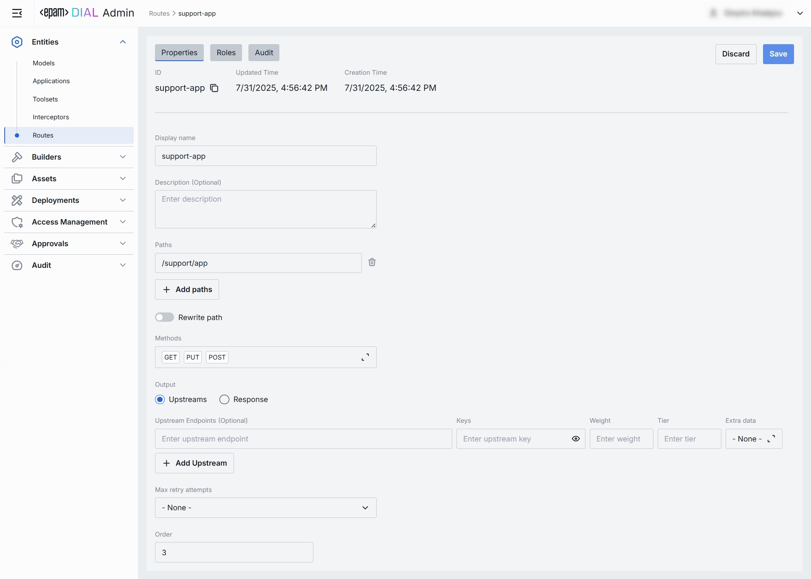
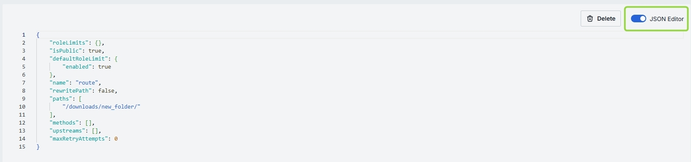

# Routes

## About Routes

Routes in DIAL are used for communication through registered endpoints in the [DIAL Core](/docs/platform/3.core/0.about-core.md). They act as a bridging mechanism between the DIAL Core and external applications, facilitating seamless interactions. Once a route with a designated endpoint is set up in DIAL Core, it allows client applications, such as DIAL Chat, to interact with this endpoint. Essentially, DIAL Core functions as an intermediary, handling authentication and authorization between the client and the external application linked to the route.

## Main Screen

In Routes, you can view, filter, and create new routes.

##### Routes grid

| Field            | Definition                                                   |
|------------------|--------------------------------------------------------------|
| **ID**           | This is a unique key under the Routes section of DIAL Admin. |
| **Display Name** | A user-friendly name of the Route.                           |
| **Description**  | A brief free-text description of the Route's purpose.        |

## Create

Follow these steps to add a new route:

1. Click **+ Create** to invoke the **Create Route** modal, where you can define rout's parameters:

    | Field            | Required | Definition                                                               |
    |------------------|----------|--------------------------------------------------------------------------|
    | **ID**           | Yes      | This is a unique key under the Routes section of DIAL Admin.             |
    | **Display Name** | Yes      | A user-friendly name of the Route.                                       |
    | **Description**  | No       | A brief free-text description of the Route’s purpose.                    |
    | **Paths**        | Yes      | URL path(s) pattern this route should match (e.g. `/chat`, `/support/`). |

2. Once all required fields are filled, click **Create**. The dialog closes and the new [route configuration](#route-configuration) screen is opened. This entry will appear immediately in the listing once created. It may take some time for the changes to take effect after saving.

    

## Route Configuration

Click any route on the main screen to open the configuration section.

### Properties

In the Properties tab, you can define the identity and routing behavior. 

##### Basic Identification

| Field             | Required | Definition     |
|-------------------|----------|----------------|
| **ID**            | -        | This is a unique key under the Routes section of DIAL Admin and [dynamic settings of DIAL Core](https://github.com/epam/ai-dial-core?tab=readme-ov-file#dynamic-settings). |
| **Updated Time**  | -        | Date and time when the route's configuration was last updated.   |
| **Creation Time** | -        | Date and time when the route's configuration was created. |
| **Sync with core** | -        | Indicates the state of the entity's configuration synchronization between Admin and DIAL Core. Synchronization occurs automatically every 2 mins (configurable via `CONFIG_AUTO_RELOAD_SCHEDULE_DELAY_MILLISECONDS`). **Important**: Sync state is not available for sensitive information (API keys/tokens/auth settings). **Synced**: Entity's states are identical in Admin and in Core for valid entities or entity is missing in Core for invalid entities. **In progress...**:  If Synced conditions are not met and changes were applied within last 2 mins (this period is configurable via `CONFIG_EXPORT_SYNC_DURATION_THRESHOLD_MS`). **Out of sync**: If Synced conditions are not met and changes were applied more than 2 mins ago (this period is configurable via `CONFIG_EXPORT_SYNC_DURATION_THRESHOLD_MS`). **Unavailable**: Displayed when it is not possible to determine the entity’s state in Core. This occurs if: - The config was not received from Core for any reason. - The configuration of entities in Core is not entirely compatible with the one in the Admin service. |
| **Display Name**  | Yes      | A user-friendly name of the Route. |
| **Description**   | No       | Free‐text note about the route’s purpose (e.g. “Primary GPT-4 chat with fallback”). |
 
##### Request Matching: Paths & Methods

| Field            | Required | Definition  |
|------------------|-----------|------------|
| **Paths**        | Yes   | One or more URL path patterns this route should match (e.g. `/chat`, `/support/**`). Click **+ Add paths** to register additional patterns. Click the trash icon to remove a path.      |
| **Rewrite path** | No        | Toggle on to strip or transform the incoming path before forwarding upstream. Use when your upstream service expects a different URL structure (e.g. remove `/api/v1/routes/chat` prefix). |
| **Methods**      | No        | Select one or more HTTP methods (GET, POST, PUT, DELETE, etc.) the route can accept.            |
 
##### Output Mode

Use the output mode to define the response of a Route.

| Option        | Definition |
|---------------|-------------|
| **Upstreams** | Add and configure upstreams to forward matching requests to one or more upstream endpoints (Models or Applications). Refer to [Upstream Configuration](#upstream-configuration).|
| **Response**  | Use to return a static, pre-defined payload. Useful for health checks or mock responses. Refer to [Response Configuration](#response-configuration). |

##### Upstream Configuration

Define where and how to forward requests when the **Upstreams** [output mode](#output-mode) is selected.

| Field                  | Required | Definition  |
|------------------------|-----------|-------------------------|
| **Upstream Endpoints** | Yes   | Full URL(s) of the back-end service(s) to receive the routed request (e.g. `https://dial-core.example.com/v1/chat`).  |
| **Keys**               | No        | API key or token to attach (via header or query) when calling the upstream. Click the eye icon to reveal a masked value. |
| **Weight**             | No        | Relative traffic weight for [load balancing](/docs/platform/3.core/5.load-balancer.md) among multiple endpoints (higher = more traffic).                        |
| **Tier**               | No        | Specifies an endpoint group. In a regular scenario, all requests are routed to endpoints with the lowest tier, but in case of an outage or hitting the limits, the next one in the line helps to handle the load. Refer to [load balancing](/docs/platform/3.core/5.load-balancer.md) to learn more. |
| **Extra Data**         | No        | Select a JSON BLOB from [Assets → Files](/docs/tutorials/3.admin/assets-files.md) to attach as metadata for the upstream adapter.|
| **+ Add Upstream**     | —         | Append additional endpoints for failover or capacity scaling.|

##### Response Configuration

Define where and how to forward requests when **Response** mode is selected:

| Field                  | Required | Definition                                                                                          |
|------------------------|-----------|-------------------------------------------------------------------------------------------------------|
| **Status**             | No        | The HTTP status code your route will return (e.g. `200`, `404`, `503`).                               |
| **Body**               | No        | The exact payload to send in the response body. You can enter plain text or raw JSON.                 |
| **Max retry attempts** | No        | *(Optional)* Determines how many times DIAL will retry the static‐response logic on internal errors.  |

##### Additional Parameters

| Field     | Required | Definition  |
|-----------|----------|------------------------------------|
| **Order** | No       | The value of this parameter determines the order within the global routes. The lower value means the higher priority. The value can't be negative integer. The default one is 2\^31-1. |

### Roles

In the **Roles** tab, you can define user groups that can invoke this route and define rate limits for them.

#### Roles grid columns:

| Column                | Description & Guidance        |
|-----------------------|------------------------------------------------------------------------------------------------------------------------|
| **Name**              | A unique role identifier.       |
| **Description**       | A user-friendly description of the role (e.g., "Admin, Prompt Engineer, Developer"). |
| **Tokens per minute** | Per Minute tokens limit for a specific role. Blank = no limits.  Inherits the [default value](#default-rate-limits).  Can be overridden.       |
| **Tokens per day**    | Daily tokens limit for a specific role. Blank = no limits.  Inherits the [default value](#default-rate-limits).  Can be overridden.        |
| **Tokens per week**   | Weekly tokens limit for a specific role. Blank = no limits.  Inherits the [default value](#default-rate-limits).  Can be overridden.       |
| **Tokens per month**  | Monthly tokens limit for a specific role. Blank = no limits.  Inherits the [default value](#default-rate-limits).  Can be overridden.      |
| **Actions**     | Additional role-specific actions.   Open [Roles](/docs/tutorials/3.admin/access-management-roles.md) section in a new tab.   Make all restrictions unlimited for the given role |

#### Set Rate Limits

The grid on the Roles screen lists the roles that can access a specific route. Here, you can also set individual limits for selected roles. For example, you can give "Admin" role unlimited monthly tokens but throttle "Developer" to 100,000 tokens/day or allow the "External Partner" role a small trial quota (e.g., 10,000 tokens/month) before upgrade.

**To set or change rate limits for a role:**

1. **Click** in the desired cell (e.g., **Tokens per day** for the “ADMIN”).
2. **Enter** a numeric limit or leave blank to set no limits. Click **Reset to default limits** to restore default settings for all roles.
3. Click **Save** to apply changes.

#### Default Rate Limits

Default limits are set for all the roles in the **Roles** grid by default; however you can override them for any role.

| Field                         | Description                                                                           |
|-------------------------------|---------------------------------------------------------------------------------------|
| **Default tokens per minute** | The maximum tokens any user may consume per minute if no role-specific limit applies. |
| **Default tokens per day**    | The maximum tokens any user may consume per day if no role-specific limit applies.    |
| **Default tokens per week**   | The maximum tokens any user may consume per week if no role-specific limit applies.   |
| **Default tokens per month**  | The maximum tokens any user may consume per month if no role-specific limit applies.  |

#### Role-Specific Access

Use **Make available to specific roles** toggle to define access to the route:

* **Off**: Route is accessible by any authenticated user. All existing roles are in the grid.
* **On**: Route is restricted - only the roles you explicitly add to the grid below can use it.

#### Add

You can add a role only if **Make available to specific roles** toggle is **On**.

1. Click **+ Add** (top-right of the Roles Grid).
2. **Select** one or more roles in the modal.
3. **Confirm** to insert them into the table.

#### Remove

You can remove a role only if **Make available to specific roles** toggle is **On**.

1. Click the **actions** menu in the role's line.
2. Choose **Remove** in the menu.

### Audit

#### Activities

The Activities section provides a detailed insight into all changes made to the selected route.

This section mimics the functionality available in the global [Audit → Activities](/docs/tutorials/3.admin/telemetry-activity-audit.md) menu, but is scoped specifically to the selected route.

##### Activities List Table

| **Field**         | **Definition**              |
| ----------------- |------------------------------------------------------------------------------|
| **Activity type** | The type of action performed  (e.g., Create, Update, Delete).                |
| **Time**          | Timestamp indicating when the activity occurred.                             |
| **Initiated**     | Email address of the user who performed the activity.                        |
| **Activity ID**   | A unique identifier for the logged activity, used for tracking and auditing. |
|**Actions**|Available actions: - **View details**: Click to open a new screen with activity details. Refer to [Activity Details](#activity-details) to learn more. - **Resource rollback**: click to restore a previous version. Refer to [Resource Rollback](#resource-rollback) for details.  |

##### Activity Details

The Activity Details view provides a detailed snapshot of a specific change made to a route.

To open Activity Details, click on the three-dot menu (⋮) at the end of a row in the Activities grid and select “View Details”.

| **Element/Section** | **Description**                                           |
|---------------------|-------------------------------------------------------------------------------------------------------------------------------------------------------------|
| **Activity type**   | Type of the change performed (e.g., Update, Create, Delete).                                               |
| **Time**            | Timestamp of the change.                                  |
| **Initiated**       | Identifier of the user who made the change.               |
| **Activity ID**     | Unique identifier for the specific activity tracking.     |
| **Comparison**      | Dropdown to switch between showing all parameter or changed only.|
| **View**            | Dropdown to switch for selection between Before/After and Before/Current state.|
| **Parameters Diff** | Side-by-side comparison of toolset fields values before and after the change. Color-coding is used to indicate the operation type (Update, Create, Delete). |

##### Resource Rollback

Use Resource Rollback to restore the previous version of the selected activity. A rollback leads to generation of a new entry on the audit activity screen.

### JSON Editor

Use the **JSON Editor** toggle to switch between the form-based UI and raw JSON view of the route’s configuration. It is useful for advanced scenarios of bulk updates, copy/paste between environments, or tweaking settings not exposed in the form UI—you can switch to the **JSON Editor** on any route configuration page.

##### Switching to the JSON Editor

1. Navigate to **Entities → Routes**, then select the Route you want to edit.
2. Click the **JSON Editor** toggle (top-right). The UI reveals the raw JSON.

> **TIP**: You can switch between UI and JSON only if there are no unsaved changes.

### Delete

Use the **Delete** button in the Configuration screen toolbar to permanently remove the selected route.

