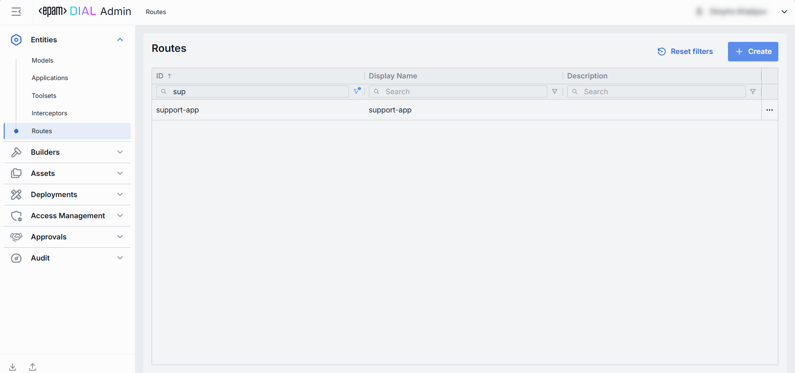
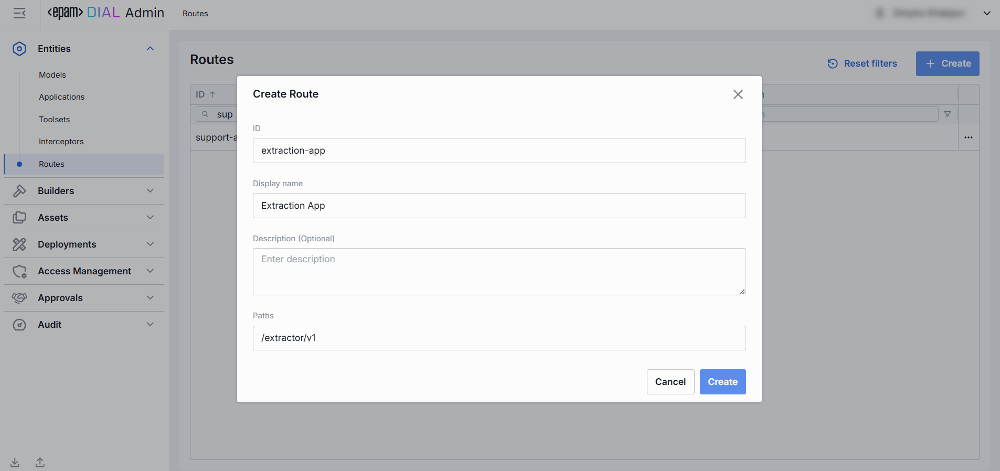
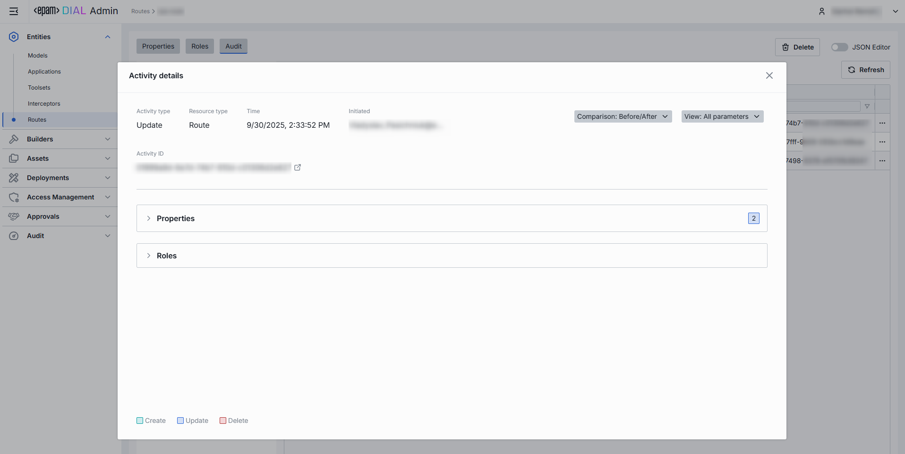

# Routes

## Introduction

Routes in DIAL are used for communication through registered endpoints in the [DIAL Core](/docs/platform/3.core/0.about-core.md). They act as a bridging mechanism between the DIAL Core and external applications, facilitating seamless interactions. Once a route with a designated endpoint is set up in DIAL Core, it allows client applications, such as DIAL Chat, to interact with this endpoint. Essentially, DIAL Core functions as an intermediary, handling authentication and authorization between the client and the external application linked to the route.

## Main Screen

In Routes, you can view, filter, and create new routes.

##### Routes grid

| Field | Description |
|-------|-------------|
| **ID** | Unique key under the Routes section of DIAL Admin. |
| **Display Name** | Name of the route. |
| **Description** | Brief free-text description of the Route's purpose. |
| **Paths** | List of paths to be matched request's path. If any path is matched, the request will be processed by this route. Note. A path can be a plain string or a regular expression. |
| **Updated Time** | Date and time when the route's configuration was last updated. |
| **Topics** | Tag that associates a route with one or more topics or categories (e.g. "finance", "support"). |
| **Order** | The value of this parameter determines the order within the global routes. The lower value means the higher priority. The value can't be negative integer. The default one is 2\^31-1. |

## Create

Follow these steps to add a new route:

1. Click **+ Create** to invoke the **Create Route** modal, where you can define rout's parameters:

| Field | Required | Description |
|-------|----------|-------------|
| **ID** | Yes | Unique key under the Routes section of DIAL Admin. |
| **Display Name** | Yes | Name of the route. |
| **Description** | No | Brief free-text description of the Route's purpose. |
| **Paths** | Yes | URL path(s) pattern this route should match (e.g. `/chat`, `/support/`). |

2. Once all required fields are filled, click **Create**. The dialog closes and the new [route configuration](#configuration) screen is opened. This entry will appear immediately in the listing once created. It may take some time for the changes to take effect after saving.

    

## Configuration

Click any route on the main screen to open the configuration section.

### Properties

In the Properties tab, you can define the identity and routing behavior. 

##### Basic Identification

| Field | Required | Editable | Description |
|-------|----------|----------|-------------|
| **ID** | - | No | Unique key under the Routes section of DIAL Admin and [dynamic settings of DIAL Core](https://github.com/epam/ai-dial-core?tab=readme-ov-file#dynamic-settings). |
| **Updated Time** | - | No | Date and time when the route's configuration was last updated. |
| **Creation Time** | - | No | Date and time when the route's configuration was created. |
| **Sync with core** | - | No | State of the entity's configuration synchronization between Admin and DIAL Core. Synchronization occurs automatically every 2 mins (configurable via `CONFIG_AUTO_RELOAD_SCHEDULE_DELAY_MILLISECONDS`). **Important**: Sync state is not available for sensitive information (API keys/tokens/auth settings). - **Synced**: Entity's states are identical in Admin and in Core for valid entities or entity is missing in Core for invalid entities. - **In progress...**:  If Synced conditions are not met and changes were applied within last 2 mins (this period is configurable via `CONFIG_EXPORT_SYNC_DURATION_THRESHOLD_MS`). - **Out of sync**: If Synced conditions are not met and changes were applied more than 2 mins ago (this period is configurable via `CONFIG_EXPORT_SYNC_DURATION_THRESHOLD_MS`). - **Unavailable**: Displayed when it is not possible to determine the entity's state in Core. This occurs if: - The config was not received from Core for any reason. - The configuration of entities in Core is not entirely compatible with the one in the Admin service. |
| **Display Name** | Yes | Yes | Name of the route. |
| **Description** | No | Yes | Free‐text note about the route's purpose (e.g. "Primary GPT-4 chat with fallback"). |
| **Topics** | No | Yes | Tag that associates a route with one or more topics or categories (e.g. "finance", "support"). |
 
##### Request Matching: Paths & Methods

| Field | Required | Editable | Description |
|-------|----------|----------|-------------|
| **Paths** | Yes | Yes | One or more URL path patterns this route should match (e.g. `/chat`, `/support/**`). Click **+ Add paths** to register additional patterns. Click the trash icon to remove a path. |
| **Rewrite path** | No | Yes | Use to replace the path to the upstream server with the path of the original request. Use when your upstream service expects a different URL structure (e.g. remove `/api/v1/routes/chat` prefix). |
| **Methods** | No | Yes | Select one or more HTTP methods (GET, POST, PUT, DELETE, etc.) the route can accept. |
 
##### Output Mode

Use the output mode to define the response of a route.

| Option | Description |
|--------|-------------|
| **Upstreams** | One or more backend URLs (e.g., http://, https://, ws://, wss://) to which requests are sent. Supports HTTP and WebSocket protocols. When multiple endpoints are provided, round-robin load balancing and automatic fallback can be enabled among the hosts. Refer to [Upstream Configuration](#upstream-configuration).|
| **Response**  | Use to return a static, pre-defined payload. If the response is set then DIAL Core returns the response immediately. Useful for health checks or mock responses. Refer to [Response Configuration](#response-configuration). |

##### Upstream Configuration

A list of upstream servers with their parameters. 

| Field | Required | Editable | Description |
|-------|----------|----------|-------------|
| **Upstream Endpoints** | Yes | Yes | Full URL(s) of the back-end service(s) to receive the routed request (e.g. `https://dial-core.example.com/v1/chat`). Supports HTTP and WebSocket protocols. When multiple endpoints are provided, round-robin load balancing and automatic fallback can be enabled among the hosts. |
| **Keys** | No | Yes | API key, token or credential to attach (via header or query) when calling the upstream. Click the eye icon to reveal a masked value. |
| **Weight** | No | Yes | Relative traffic weight for [load balancing](/docs/platform/3.core/5.load-balancer.md) among multiple endpoints.  Positive number represents an endpoint capacity, zero or negative disables this endpoint from routing. Higher = more traffic share.  Default value: 1. |
| **Tier** | No | Yes | Specifies an endpoint group. In a regular scenario, all requests are routed to endpoints with the lowest tier, but in case of an outage or hitting the limits, the next one in the line helps to handle the load.  Only positive numbers allowed.  Refer to [load balancing](/docs/platform/3.core/5.load-balancer.md) to learn more. |
| **Extra Data** | No | Yes | Additional metadata containing any information that is passed to the upstream's endpoint. It can be a JSON or String. |
| **+ Add Upstream** | - | - | Append additional endpoints for failover or capacity scaling.|

##### Response Configuration

Define parameters for a pre-configured route's response.

| Field | Required | Editable | Description |
|-------|----------|----------|-------------|
| **Status** | No | Yes | HTTP status code your route will return (e.g. `200`, `404`, `503`). |
| **Body** | No | Yes | Exact payload to send in the response body. You can enter plain text or raw JSON. |

##### Additional Parameters

| Field | Required | Editable | Description |
|-------|----------|----------|-------------|
| **Order** | No | Yes | The value of this parameter determines the order within the global routes. The lower value means the higher priority. The value can't be negative integer. The default one is 2\^31-1. |
| **Max retry attempts** | No | Yes | Determines how many times DIAL will retry if upstream server returns unsuccessful response code. In this case load balancer will try to find another upstream from the list of available upstreams. |

### Roles

In the **Roles** tab, you can define user groups that can invoke this route.

> You can create and manage roles in the [Access Management](/docs/tutorials/3.admin/access-management-roles.md) section.

##### Roles grid columns

| Column | Description |
|--------|-------------|
| **Display Name** | Name or the role displayed on UI. |
| **Description** | Description of the role (e.g., "Admin, Prompt Engineer, Developer"). |
| **ID** | Unique role identifier. |
| **Actions** | Additional role-specific actions. - Open [Roles](/docs/tutorials/3.admin/access-management-roles.md) section in a new tab. - Remove the given role |

### Audit

#### Activities

The Activities section provides a detailed insight into all changes made to the selected route.

This section mimics the functionality available in the global [Audit → Activities](/docs/tutorials/3.admin/telemetry-activity-audit.md) menu, but is scoped specifically to the selected route.

##### Activities List Table

| Field | Description |
|-------|-------------|
| **Activity type** | Type of action performed (e.g., Create, Update, Delete). |
| **Time** | Timestamp indicating when the activity occurred. |
| **Initiated** | Email address of the user who performed the activity. |
| **Activity ID** | Unique identifier for the logged activity, used for tracking and auditing. |
| **Actions** | Available actions: - **View details**: Click to open a new screen with activity details. Refer to [Activity Details](#activity-details) to learn more. - **Resource rollback**: click to restore a previous version. Refer to [Resource Rollback](#resource-rollback) for details. |

##### Activity Details

The Activity Details view provides a detailed snapshot of a specific change made to a route.

To open Activity Details, click on the three-dot menu (⋮) at the end of a row in the Activities grid and select “View Details”.

| Element/Section | Description |
|-----------------|-------------|
| **Activity type** | Type of the change performed (e.g., Update, Create, Delete). |
| **Time** | Timestamp of the change. |
| **Initiated** | Identifier of the user who made the change. |
| **Activity ID** | Unique identifier for the specific activity tracking. |
| **Comparison** | Dropdown to switch between showing all parameter or changed only. |
| **View** | Dropdown to switch for selection between Before/After and Before/Current state. |
| **Parameters Diff** | Side-by-side comparison of toolset fields values before and after the change. Color-coding is used to indicate the operation type (Update, Create, Delete). |

##### Resource Rollback

Use Resource Rollback to restore the previous version of the selected activity. A rollback leads to generation of a new entry on the audit activity screen.

### JSON Editor

**Advanced users with technical expertise** can work with the route properties in a JSON editor view mode. It is useful for advanced scenarios of bulk updates, copy/paste between environments, or tweaking settings not exposed in the form UI.

> **TIP**: You can switch between UI and JSON only if there are no unsaved changes.

In JSON editor, you can use the view dropdown to select between Admin format and Core format. Note, that these formatting options are for your convenience only and do not render properties as they are defined in DIAL Core. After making changes, the **Sync with core** indicator on the main configuration screen will inform you about the synchronization state with DIAL Core.

##### Working with JSON Editor

1. Navigate to **Entities → Routes**, then select the route you want to edit.
2. Click the **JSON Editor** toggle (top-right). The UI reveals the raw JSON.
3. Chose between the Admin and Core format to see and work with properties in the necessary format. **Note**: Core format view mode does not render the actual configuration stored in DIAL Core but the configuration in Admin service displayed in the DIAL Core format.
4. Make changes and click **Save** to apply them.
5. After making changes, the **Sync with core** indicator on the main configuration screen will inform you about the synchronization state with DIAL Core.

### Delete

Use the **Delete** button in the Configuration screen toolbar to permanently remove the selected route.

