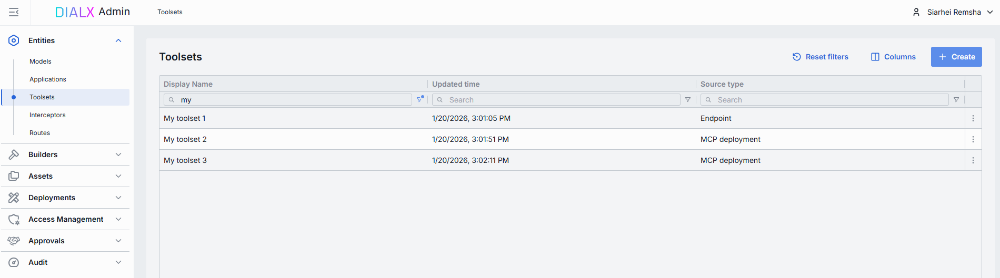
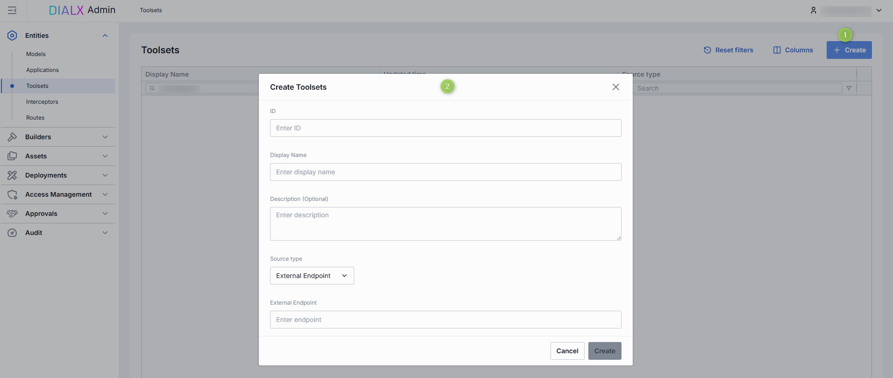
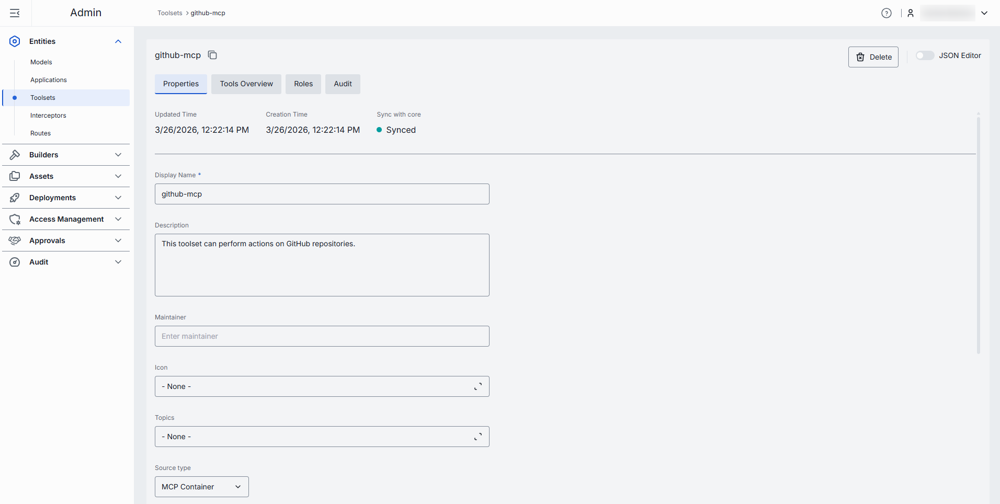
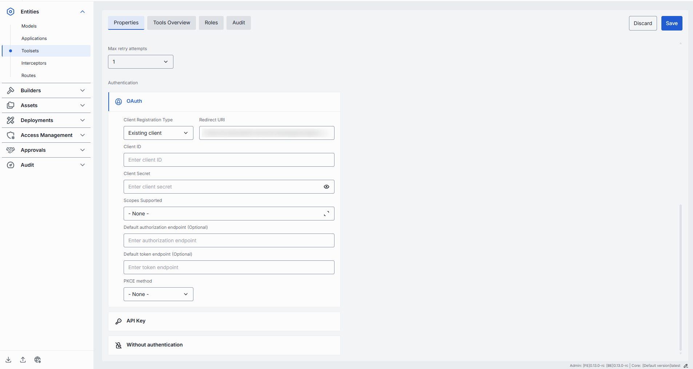
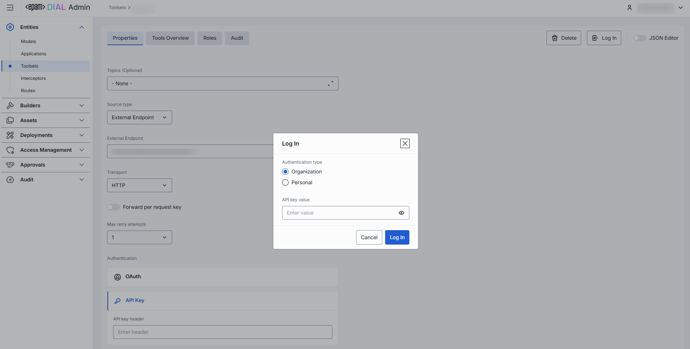
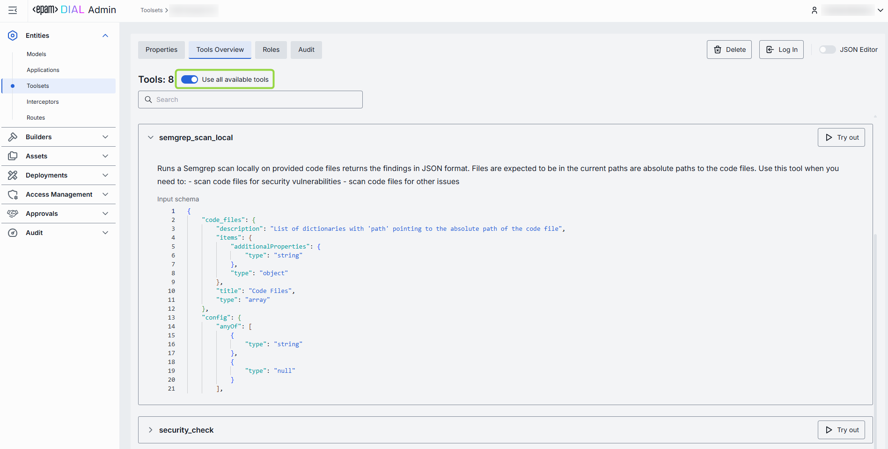
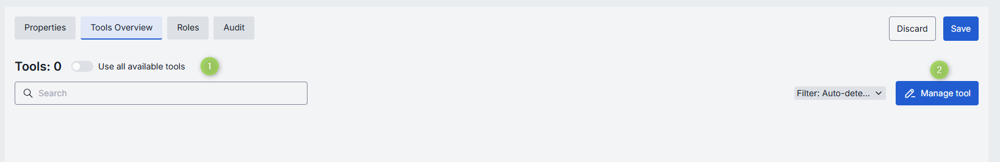
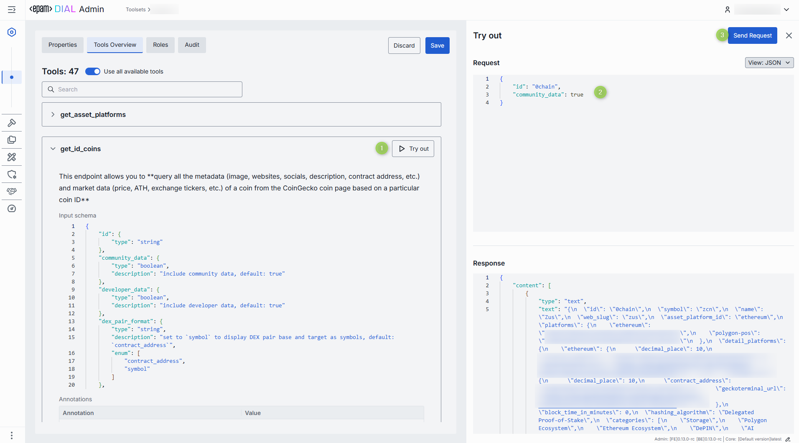
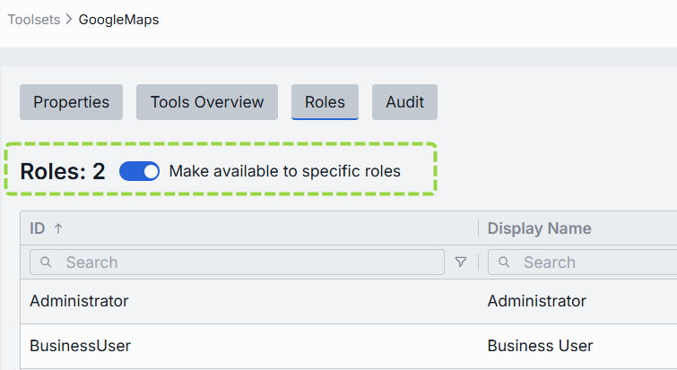

# Toolsets

## Introduction

Toolsets in DIAL are connections with MCP servers that can be used as tools in [Quick Apps 2.0](/docs/video%20demos/2.Applications/5.quick-apps.md).

In DIAL, you can use self-hosted toolsets based on the deployed MCP containers and external toolsets deployed outside of DIAL using their endpoints.

## Main Screen

On this screen, you can find all toolset deployments existing in your DIAL instance. Here you can view, filter, and add new toolset definitions.

> You can use DIAL Core API to [access](https://dialx.ai/dial_api#tag/Deployment-listing/operation/getToolSets) available toolset deployments and to [add and manage](https://dialx.ai/dial_api#tag/Toolsets) toolsets.

##### Toolsets grid

| Field | Description |
|-------|-------------|
| **Display Name** | Name of a toolset displayed on UI (e.g. GitHub, Google Maps). |
| **Description** | Description of a toolset. |
| **ID** | Unique key under the toolsets section of DIAL Admin. |
| **Updated Time** | Date and time when the toolset's configuration was last updated. |
| **Source Type** | Source type of the toolset: - [MCP Container](/docs/tutorials/3.admin/deployments-mcp.md): Toolset is based on a running MCP container. - **External Endpoint**: External API endpoint for externally-deployed custom toolsets. |
| **Source** | Identifier of a toolset source. - For the [MCP Container](/docs/tutorials/3.admin/deployments-mcp.md) source type, it is a container ID.  - For External Endpoint - a URL of the external endpoint. |
| **Author** | Name of the toolset creator. |
| **Topics** | Tags or categories assigned for toolsets for discovery, filtering, or grouping on UI (e.g. "finance," "support"). |

## Create Toolset

Follow these steps to add a new toolset definition:

1. Click **+ Create** on the main screen to invoke a **Create Toolset** modal.
2. Define parameters:

    | Field | Required | Description |
    |------ |----------|-------------|
    | **ID** | Yes | Define a unique identifier of a toolset.|
    | **Display Name** | Yes | Define a name of a toolset shown across the UI (e.g. GitHub, Google Maps).|
    | **Description** | No | Enter a free-text note about the this toolset’s purpose, capabilities, or any other relevant details. |
    | **Source Type** | Yes |Choose between the available source types of toolset:  - [MCP Container](/docs/tutorials/3.admin/deployments-mcp.md): Toolset is based on a running MCP container. - **External Endpoint**: External API endpoint for externally-deployed custom toolsets.|
    | **External Endpoint** | Conditional | Define a Toolset API endpoint for MCP calls. Applies for External Endpoint source type. |
    | **Container** | Conditional | Select one of the available [MCP containers](/docs/tutorials/3.admin/deployments-mcp.md) from the list. Applies for MCP Container source type. |

3. Click **Create** to close the dialog and open the [configuration screen](#configuration). When done with toolset configuration, click **Save**. It may take some time for changes to take effect after saving.

    

## Configuration

You can access the toolset configuration screen by clicking any toolset on the main screen and also when adding a new toolset. In this section, you can view and configure the selected toolset.

* [Properties](#properties): Main definitions.
* [Tools Overview](#tools-overview): Optional capabilities and custom endpoints.
* [Roles](#roles): User groups that can access the toolset.
* [Audit](#audit): Detailed logs of individual configuration changes.

### Properties

In the **Properties** tab, you can view and edit main definitions and settings of the selected toolset. 

| Field | Required | Editable | Description |
|-------|----------|----------|-------------|
| **ID** | - | No | Unique key under the toolsets section of DIAL Admin. |
| **Updated Time** | - | No | Date and time when the toolset's configuration was last updated. |
| **Creation Time** | - | No | Date and time when the toolset's configuration was created. |
| **Authentication** | - | No | Current authentication status of the selected toolset:  - **Logged out**: The toolset in not authenticated with the related MCP server.  - **Logged in (Personal)**: The toolset is authenticated for your user only.  - **Logged in (Organization)**: The toolset is authenticated for all users in your organization. |
| **Sync with core** | - | No | Indicates the state of the entity's configuration synchronization between Admin and DIAL Core. Synchronization occurs automatically every 2 mins (configurable via `CONFIG_AUTO_RELOAD_SCHEDULE_DELAY_MILLISECONDS`). **Important**: Sync state is not available for sensitive information (API keys/tokens/auth settings). **Synced**: Entity's states are identical in Admin and in Core for valid entities or entity is missing in Core for invalid entities. **In progress...**:  If Synced conditions are not met and changes were applied within last 2 mins (this period is configurable via `CONFIG_EXPORT_SYNC_DURATION_THRESHOLD_MS`). **Out of sync**: If Synced conditions are not met and changes were applied more than 2 mins ago (this period is configurable via `CONFIG_EXPORT_SYNC_DURATION_THRESHOLD_MS`). **Unavailable**: Displayed when it is not possible to determine the entity's state in Core. This occurs if: - The config was not received from Core for any reason. - The configuration of entities in Core is not entirely compatible with the one in the Admin service. |
| **Display Name** | Yes | Yes | Name of a toolset shown across the UI (e.g. GitHub, Google Maps). |
| **Description** | No | Yes | Description of a toolset. |
| **Maintainer** | No | Yes | Name of the user overseeing the toolset's configuration. |
| **Icon** | No | Yes | Logo to visually distinguish toolsets in the UI. |
| **Topics** | No | Yes | Tag that associates a toolsets with one or more topics or categories (e.g. "finance", "support"). |
| **Source Type** | Yes | Yes | The source type of the selected toolset: - [MCP Container](/docs/tutorials/3.admin/deployments-mcp.md): Toolset is based on a running MCP container. - **External Endpoint**: External API endpoint for externally-deployed custom toolsets. |
| **External Endpoint** | Conditional | Yes | Toolset endpoint for MCP calls. Applies for External Endpoint source type. |
| **Container** | Conditional | Yes | MCP server [container ID](/docs/tutorials/3.admin/deployments-mcp.md). Applies for MCP Container deployment source type. |
| **Transport** | Yes | Yes | Transport supported by a related endpoint. Available options: HTTP (default) or SSE. Choose SSE for server-sent events when supported. |
| **Forward per request key** | No | Yes | Set this flag to `true` if you want a [per-request key](/docs/platform/3.core/3.per-request-keys.md) to be forwarded to the toolset endpoint allowing a toolset to access files in the DIAL storage.  **Note**: it is not allowed to create toolsets with `authType.API_KEY` and `forwardPerRequestKey=true`. |
| **Max retry attempts** | Yes | Yes | Number of times DIAL Core will [retry](/docs/platform/3.core/5.load-balancer.md#fallbacks) routing a failed call to a toolset endpoint (due to timeouts or 5xx errors). |
| **Authentication** | Yes | Yes | [Toolset authentication configuration](#authentication). |

#### Authentication

If the toolset you have chosen requires authentication at the related MCP server, you will have to sign in before you can use it. For example, if you are using an application that relies on the MCP toolset and authentication is required, you will not be able to access it unless you are logged in. Therefore, make sure you are authenticated with MCP server you are about to use.

> Refer to [DIAL Core](https://github.com/epam/ai-dial-core/blob/development/docs/dynamic-settings/toolset_credentials_api.md) to learn more about toolset authentication.

##### Step 1: Select and configure the authentication method 

DIAL supports several authentication methods for toolsets:

* **OAuth**: Authenticate via OAuth 2.0 with an external identity provider. If this option is selected, you have to populate the authentication form with correct values provided by the identity provider:
    - **Redirect URI**: Redirect URI used during sign in flows. After authentication, the MCP Server redirects the User to the provided URI.
    - **Client ID**: The unique identifier of the client/application requesting access to the resource. 
    - **Client Secret**: A confidential key used by the client to authenticate itself with the authentication server. 
    - **Scopes Supported**: List of supported scopes that define access levels. May be discovered via .well-known endpoints. 
    - **Default authorization endpoint**: URL for performing authorization. Can be discovered via .well-known metadata if provided by the Authorization Server.
    - **Default token endpoint**: The URL where the client exchanges the authorization code for an access token. Can be discovered via .well-known metadata if provided by the Authorization Server.
    - **PKCE method**: The method used for Proof Key for Code Exchange (PKCE), usually `plain` or `S256`.
* **API Key**: Authenticate using API key. If this option is selected, you have to provide the API key and header name in the configuration.
* **Without authentication**: No authentication enforced, endpoint is publicly accessible.

##### Step 2: Choose personal or organization authentication

Having selected and configured any authentication method, click **Save** and **Log In** to authenticate a toolset with the related MCP server. At this step, prior to the actual authentication, you will be prompted to select between **Personal** and **Organization** authentication:

* **Personal**: the toolset will be authenticated for your user only with the authentication state labeled **Logged in (Personal)**.
* **Organization**: the toolset will be authenticated for all users in your organization with the authentication state labeled **Logged in (Organization)**. Any user will be able to log out and log back in with personal credentials. 

**Important**: at this step, for authentication with API keys, you will be prompted to provide a valid API key value.

### Tools Overview

[Tools](https://modelcontextprotocol.io/specification/2025-06-18/server/tools) are specific functions supported by a related MCP server that can be used by clients to perform specific actions. On this screen, you can find and manage all tools supported by the related MCP server.

In case your toolset was created based on the MCP container deployed in DIAL, the content of this screen is inherited from the related [MCP container](/docs/tutorials/3.admin/deployments-mcp.md#tools-overview).

#### Use all tools

Enable **Use all available tools** toggle to automatically include all tools supported by the related MCP server. When enabled, you cannot add or remove tools manually.

Click on any tool to preview its details or [try it out](#try-tools).

#### Manage tools

Disable **Use all available tools** toggle to enable a manual tools management mode.

1. Disable **Use all available tools** toggle and click **Manage tool** button to open the **Manage tools** modal.
2. The modal displays all tools available to your user. You can preview and enable/disable each tool individually.
3. MCP sever can support other tools that are not available to your user and therefore are not rendered in the list of available tools. If you know their names, you can manually add them. Manually-added tools are labeled accordingly on the Tools Overview screen.
4. Click **Confirm** to apply changes.
5. On the **Tools overview** screen, use the filter to see all tools, just auto-detected tools or manually added tools.
6. Hover over any tool to see its details or [try it out](#try-tools).

#### Try tools

Click or hover over any **enabled** tool to enter the Try out mode.

In the **Try out mode**, you can test each enabled tool by sending a sample request to the server. When sending a request, you can use the rendered UI form to populate the request input fields or enter JSON view mode to get access to all the fields supported by the input schema.

### Roles

You can create and manage roles in the [Access Management](/docs/tutorials/3.admin/access-management-roles.md) section.

In the **Roles** tab, you can define user groups that are authorized to use a specific toolset. 

> * Refer to [Access & Cost Control](/docs/platform/3.core/2.access-control-intro.md) to learn more about access control in DIAL.
> * Refer to [Roles](/docs/platform/0.architecture-and-concepts/6.access-control.md#roles) to lean more about roles in DIAL.
> * Refer to tutorials to learn how to configure access and limits for [JWT](/docs/tutorials/2.devops/2.auth-and-access-control/1.jwt.md) and [API keys](/docs/tutorials/2.devops/2.auth-and-access-control/0.api-keys.md)

##### Roles grid

| Column | Description |
|--------|-------------|
| **ID** | Unique role's identifier. |
| **Display Name** | Role's name. |
| **Description** | Description of the role's purpose (e.g., "DIAL Prompt Engineering Team"). |
| **Actions** | Additional role-specific actions:   When **Make available to specific roles** toggle is off - opens the [Roles](/docs/tutorials/3.admin/access-management-roles.md) section in a new tab.   When **Make available to specific roles** toggle is on, you can open the [Roles](/docs/tutorials/3.admin/access-management-roles.md) section in a new tab or [remove](#remove-1) the role from the list. |

#### Role-Specific Access

Use **Make available to specific roles** toggle to define access to the toolset:

* **Off**: Toolset is callable by any authenticated user. All existing user roles are in the grid.
* **On**: Toolset is restricted - only the roles you explicitly add to the grid can invoke it.

#### Add

You can add a role only if **Make available to specific roles** toggle is **On**.

1. Click **+ Add** (top-right of the Roles Grid).
2. **Select** one or more roles in the modal. The list or roles is defined in the [Access Management](/docs/tutorials/3.admin/access-management-roles.md) section.
3. **Confirm** to add role(s) to the table.

#### Remove

You can remove a role only if **Make available to specific roles** toggle is **On**.

1. Click the actions menu in the role's line.
2. Choose **Remove** in the menu.

### Audit

#### Activities

The Activities section under the Audit tab of a specific toolset provides detailed visibility into all changes made to that toolset.

This section mimics the functionality available in the global [Audit → Activities](/docs/tutorials/3.admin/telemetry-activity-audit.md) menu, but is scoped specifically to the selected toolset.

| Field | Description |
|-------|-------------|
| **Activity type** | The type of action performed (e.g., Create, Update, Delete). |
| **Time** | Timestamp indicating when the activity occurred. |
| **Initiated** | Email address of the user who performed the activity. |
| **Activity ID** | A unique identifier for the logged activity, used for tracking and auditing. |
| **Actions** | Available actions: - **View details**: Click to open a new screen with activity details. Refer to [Activity Details](#activity-details) to learn more. - **Resource rollback**: click to restore a previous version. Refer to [Resource Rollback](#resource-rollback) for details. |

##### Activity Details

The Activity Details view provides a detailed snapshot of a specific change made to a toolset.

To open Activity Details, click on the three-dot menu (⋮) at the end of a row in the Activities grid and select “View Details”.

| Element/Section | Description |
|-----------------|-------------|
| **Activity type** | Type of the change performed (e.g., Update, Create, Delete). |
| **Time** | Timestamp of the change. |
| **Initiated** | Identifier of the user who made the change. |
| **Activity ID** | Unique identifier for the specific activity tracking. |
| **Comparison** | Dropdown to switch between showing all parameter or changed only. |
| **View** | Dropdown to switch for selection between Before/After and Before/Current state. |
| **Parameters Diff** | Side-by-side comparison of toolset fields values before and after the change. Color-coding is used to indicate the operation type (Update, Create, Delete). |

##### Resource Rollback

Use Resource Rollback to restore the previous version of the selected activity. A rollback leads to generation of a new entry on the audit activity screen.

### JSON Editor

**Advanced users with technical expertise** can work with the toolset properties in a JSON editor view mode. It is useful for advanced scenarios of bulk updates, copy/paste between environments, or tweaking settings not exposed on UI.

> **TIP**: You can switch between UI and JSON only if there are no unsaved changes.

In JSON editor, you can use the view dropdown to select between Admin format and Core format. Note, that these formatting options are for your convenience only and do not render properties as they are defined in DIAL Core. After making changes, the **Sync with core** indicator on the main configuration screen will inform you about the synchronization state with DIAL Core.

##### Working with JSON Editor

1. Navigate to **Entities → Toolsets**, then select the toolset you want to edit.
2. Click the **JSON Editor** toggle (top-right). The UI reveals the raw JSON.
3. Chose between the Admin and Core format to see and work with properties in the necessary format. **Note**: Core format view mode does not render the actual configuration stored in DIAL Core but the configuration in Admin service displayed in the DIAL Core format.
4. Make changes and click **Save** to apply them.
5. After making changes, the **Sync with core** indicator on the main configuration screen will inform you about the synchronization state with DIAL Core.

### Delete

Use the **Delete** button in the Configuration screen toolbar to permanently remove the selected toolset.
