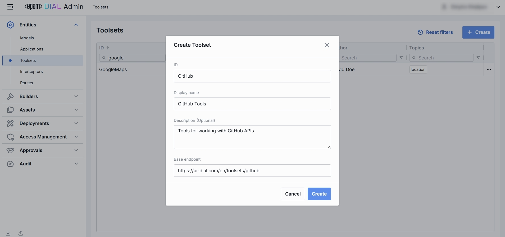
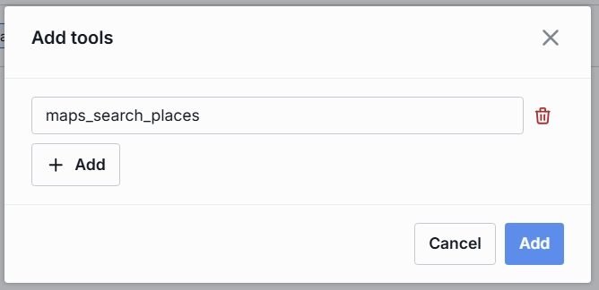

# Toolsets

## About Toolsets

Toolsets allow applications to interact with external services (such as MCP servers and REST APIs) to perform specific actions. 

> Refer to the [QuickApps Configuration](/docs/tutorials/1.developers/4.apps-development/5.quick-app-configuration.md) page for more details on Quick Apps configuration and available toolsets.

## Toolsets Main Screen

On the **Toolsets** main screen, you can find all toolsets existing in your DIAL instance. Here you can view, filter, and add new toolset definitions.

##### Toolsets grid

| Field                     | Definition|
|---------------------------|-------|
| **ID**                    | This is a unique key under the toolsets section of DIAL Admin.                                          |
| **Display Name**          | A user-friendly label for a toolset (e.g. GitHub, Google Maps).                                         |
| **Description**           | Free-text notes about this toolset’s purpose, capabilities, or any other relevant details.              |
|**Source Type**|A source type of the toolset: either MCP deployment or Endpoint.|
|**Source**|For MCP source Type, enter a container ID. For Endpoint - enter a URL of the external endpoint.|
| **Author**                | Contains the tools author's name.                      |
| **Topics**                | Tags or categories (e.g. "finance," "support") you can assign for discovery, filtering, or grouping. Helps end users and admins find the right toolset.  |

## Create Toolset

Follow these steps to add a new toolset:

1. Click **+ Create** to invoke a **Create Toolset** modal.
2. Define parameters:

    | Field | Required | Definition & Guidance  |
    |-------------------|----------|--------------|
    | **ID**            | Yes      | This is a unique key under the toolsets section of DIAL Admin.       |
    | **Display Name**  | No       | A user-friendly label shown across the UI (e.g. GitHub, Google Maps).|
    | **Description**   | No       | Free-text note about the this toolset’s purpose, capabilities, or any other relevant details.                         |
    |**Source Type**|Yes|Choose between MCP and External Endpoint.|
    | **External Endpoint** | Conditional      | External endpoint of the REST API. Applies for External Endpoint source types. |
    | **Container** | Conditional      | MCP server container ID. Applies for MCP deployment source types. |

3. Click **Create** to close the dialog and open the [configuration screen](#toolset-configuration). When done with toolset configuration, click **Save**. It may take some time for the changes to take effect after saving.

    

## Toolset Configuration

You can access the toolset configuration screen by clicking any toolset in the toolsets grid and also when adding a new toolset. In this section, you can view and configure all settings for the toolset.

* [Properties](#properties): Main definitions.
* [Tools Overview](#tools-overview): Optional capabilities and custom endpoints.
* [Roles](#roles): User groups that can use this toolset and their rate limits.
* [Audit](#audit): Provides detailed logs of individual configuration changes.

### Properties

In the **Properties** tab, you can view and edit main definitions and settings for toolset. 

##### Basic Identification and Information

| Field                   | Required | Description                             |
|-------------------------|----------|-------------------------------------------------------------------------------------------------------------------------------------------|
| **ID**                  | -        | This is a unique key under the toolsets section of DIAL Admin.                           |
| **Updated Time**        | -        | Date and time when the toolset's configuration was last updated.                         |
| **Creation Time**       | -        | Date and time when the toolset's configuration was created.                              |
| **Display Name**        | No       | A user-friendly label shown across the UI (e.g. GitHub, Google Maps).                    |
| **Description**         | No       | Free-text note about the this toolset’s purpose, capabilities, or any other relevant details.                                             |
| **Maintainer**          | No       | Field used to specify the responsible person overseeing the toolset’s configuration.     |
| **Icon**                | No       | A logo to visually distinguish toolsets in the UI.                                       |
| **Topics**              | No       | A tag that associates a toolsets with one or more topics or categories (e.g. "finance", "support").                                       |
|**Source Type**|Yes|The source type of the selected toolset: MCP or External Endpoint.|
| **External Endpoint**   | Conditional      | Root endpoint of the toolset. This allows applications and LLMs to interact with its tools by invoking this endpoint.                     |
|**Container**|Conditional|MCP server container ID. Applies for MCP deployment source types.|
| **Transport**           | Yes      | Default HTTP; choose SSE for server-sent events when supported.                          |
| **Max retry attempts**  | Yes      | Number of times DIAL Core will [retry](/docs/platform/3.core/5.load-balancer.md#fallbacks) a failed call (due to timeouts or 5xx errors). |

### Tools Overview

Tools in toolsets are functionalities that can be used to extend the capabilities of your DIAL Quick Apps. 
Tools can include applications or models deployed in DIAL, external services, and web APIs.
E.g., allowing to fetch the weather forecast from external API, or to get the geocode by address in Google Maps. 

The Tools Overview tab is where you define which tools belong to a toolset and can be used.

#### Add

You can add a tool manually only if **Use all available tools** toggle is **Off**.

1. Click **+ Add** on the top-right.
2. Click **+ Add** in the modal and give names to the tools that will be added.
3. **Add** to add tools to the toolset.

#### Remove

You can remove a tool only if **Use all available tools** toggle is **Off**.

1. Hover the tool by the pointer to see Delete button.
2. Click **Delete** to remove a tool.

### Roles

You can create and manage roles in the [Access Management](/docs/tutorials/3.admin/access-management-roles.md) section.

In the **Roles** tab, you can define user groups that are authorized to use a specific toolset, enforce per-role rate limits and configure invitation settings. 

> Refer to [Access & Cost Control](/docs/platform/3.core/2.access-control-intro.md) to learn more about roles and rate limits in DIAL.

##### Roles grid

| Column                | Description & Guidance        |
|-----------------------|---------------------------------------------------------------------------------------------------------------------------------------------------------------------------------------------------------------------------------------------------------------------------------------------------------------------------------------------------------------------------------------------------------------------------------------|
| **ID**                | A unique role's identifier    |
| **Display Name**      | A role's name.                |
| **Description**       | A user-friendly explanation of the role’s purpose (e.g., "DIAL Prompt Engineering Team").                                       |
| **Tokens per minute** | Per Minute tokens limit for a specific role. Blank = no limits. Inherits the [default value](#default-rate-limits). Can be overridden.                                           |
| **Tokens per day**    | Daily tokens limit for a specific role. Blank = no limits. Inherits the [default value](#default-rate-limits). Can be overridden.                                                |
| **Tokens per week**   | Weekly tokens limit for a specific role. Blank = no limits. Inherits the [default value](#default-rate-limits). Can be overridden.                                               |
| **Tokens per month**  | Monthly tokens limit for a specific role. Blank = no limits. Inherits the [default value](#default-rate-limits). Can be overridden.                                              |
| **Expiration time**   | TTL (Time To Live) of the invitation link to a shared resource.                |
| **Max users**         | The maximum number of users who can accept a shared resource.                  |
| **Actions**           | Additional role-specific actions.   When **Make available to specific roles** toggle is off - opens the [Roles](/docs/tutorials/3.admin/access-management-roles.md) section in a new tab.   When **Make available to specific roles** toggle is on, you can open the [Roles](/docs/tutorials/3.admin/access-management-roles.md) section in a new tab, set **no limits** or  [remove](#remove-role) the role from the list. |

#### Set Rate Limits

The grid on the Roles screen lists the roles that can access a specific toolset. Here, you can also set individual limits for selected roles. For example, you can give "Admin" role unlimited monthly tokens but throttle "Developer" to 100,000 tokens/day or allow the "External Partner" role a small trial quota (e.g., 10,000 tokens/month) before upgrade.

##### To set or change rate limits for a role:

1. **Click** in the desired cell (e.g., **Tokens per day** for the "ADMIN").
2. **Enter** a numeric limit or leave blank to enable an unlimited access. Click **Reset to default limits** to restore [default settings](#default-rate-limits) for all roles.
3. Click **Save** to apply changes.

#### Default Rate Limits

Default limits are set for all roles in the **Roles** grid by default; however you can override them as needed.

| Field                         | Description                            |
|-------------------------------|-----------------------------------------------------------------------------------------|
| **Default tokens per minute** | The maximum tokens any user can consume per minute unless a specific limit is in place. |
| **Default tokens per day**    | The maximum tokens any user can consume per day unless a specific limit is in place.    |
| **Default tokens per week**   | The maximum tokens any user can consume per week unless a specific limit is in place.   |
| **Default tokens per month**  | The maximum tokens any user may consume per month unless a specific limit is in place.  |
| **Expiration time**           | The default TTL (Time To Live) of the invitation link to a shared resource.             |
| **Max users**                 | The default maximum number of users who can accept a shared resource.                   |

#### Role-Specific Access

Use **Make available to specific roles** toggle to define access to the toolset:

* **Off**: Toolset is callable by any authenticated user. All existing user roles are in the grid.
* **On**: Toolset is restricted - only the roles you explicitly add to the grid can invoke it.

#### Add

You can add a role only if **Make available to specific roles** toggle is **On**.

1. Click **+ Add** (top-right of the Roles Grid).
2. **Select** one or more roles in the modal. The list or roles is defined in the [Access Management](/docs/tutorials/3.admin/access-management-roles.md) section.
3. **Confirm** to add role(s) to the table.

#### Remove

You can remove a role only if **Make available to specific roles** toggle is **On**.

1. Click the actions menu in the role's line.
2. Choose **Remove** in the menu.

### Audit

#### Activities

The Activities section under the Audit tab of a specific toolset provides detailed visibility into all changes made to that toolset.

This section mimics the functionality available in the global [Audit → Activities](/docs/tutorials/3.admin/telemetry-activity-audit.md) menu, but is scoped specifically to the selected toolset.

##### Activities List Table

| **Field**         | **Definition**              |
| ----------------- |------------------------------------------------------------------------------|
| **Activity type** | The type of action performed  (e.g., Create, Update, Delete).                |
| **Time**          | Timestamp indicating when the activity occurred.                             |
| **Initiated**     | Email address of the user who performed the activity.                        |
| **Activity ID**   | A unique identifier for the logged activity, used for tracking and auditing. |
|**Actions**|Available actions: - **View details**: Click to open a new screen with activity details. Refer to [Activity Details](#activity-details) to learn more. - **Resource rollback**: click to restore a previous version. Refer to [Resource Rollback](#resource-rollback) for details.  |

##### Activity Details

The Activity Details view provides a detailed snapshot of a specific change made to a toolset.

To open Activity Details, click on the three-dot menu (⋮) at the end of a row in the Activities grid and select “View Details”.

| **Element/Section** | **Description**                                           |
|---------------------|-------------------------------------------------------------------------------------------------------------------------------------------------------------|
| **Activity type**   | Type of the change performed (e.g., Update, Create, Delete).                                               |
| **Time**            | Timestamp of the change.                                  |
| **Initiated**       | Identifier of the user who made the change.               |
| **Activity ID**     | Unique identifier for the specific activity tracking.     |
| **Comparison**      | Dropdown to switch between showing all parameter or changed only.|
| **View**            | Dropdown to switch for selection between Before/After and Before/Current state.|
| **Parameters Diff** | Side-by-side comparison of toolset fields values before and after the change. Color-coding is used to indicate the operation type (Update, Create, Delete). |

##### Resource Rollback

Use Resource Rollback to restore the previous version of the selected activity. A rollback leads to generation of a new entry on the audit activity screen.

### JSON Editor

Use the **JSON Editor** toggle to switch between the form-based UI and raw JSON view of the toolset’s configuration. It is useful for advanced scenarios of bulk updates, copy/paste between environments, or tweaking settings not exposed in the form UI—you can switch to the **JSON Editor** on any toolset configuration page.

##### Switching to the JSON Editor

1. Navigate to **Entities → Toolsets**, then select the toolset you want to edit.
2. Click the **JSON Editor** toggle (top-right). The UI reveals the raw JSON.

> **TIP**: You can switch between UI and JSON only if there are no unsaved changes.

### Delete

Use the **Delete** button in the Configuration screen toolbar to permanently remove the selected toolset.
