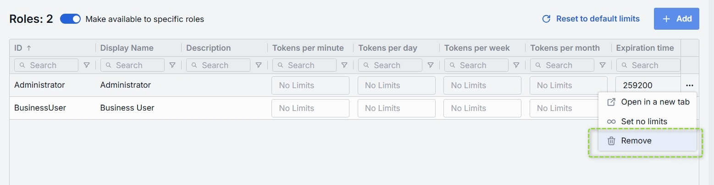

# Toolsets

## Introduction

Toolsets in DIAL are connections with MCP servers that you can use as tools in [Quick Apps 2.0](/docs/video%20demos/2.Applications/5.quick-apps.md).

## Main Screen

On the **Toolsets** main screen, you can find all toolsets existing in your DIAL instance. Here you can view, filter, and add new toolset definitions.

##### Toolsets grid

| Field                     | Definition|
|---------------------------|-----------|
| **Display Name**          | Name of a toolset displayed on UI (e.g. GitHub, Google Maps). |
| **Description**           | Free-text notes about this toolset’s purpose, capabilities, or any other relevant details. |
| **ID**                    | This is a unique key under the toolsets section of DIAL Admin. |
|**Updated Time**           | Date and time when the toolset's configuration was last updated. |
|**Source Type**            | Source type of the toolset: - [MCP Container](/docs/tutorials/3.admin/deployments-mcp.md): Toolset is based on a running MCP container. - **External Endpoint**: External API endpoint for externally-deployed custom toolsets.|
|**Source**                 | Identifier of a toolset source. - For the [MCP Container](/docs/tutorials/3.admin/deployments-mcp.md) source type, it is a container ID.  - For External Endpoint - a URL of the external endpoint.|
| **Author**                | Name of the toolset creator.                      |
| **Topics**                | Tags or categories assigned for toolsets for discovery, filtering, or grouping on UI (e.g. "finance," "support").|

## Create Toolset

Follow these steps to add a new toolset:

1. Click **+ Create** to invoke a **Create Toolset** modal.
2. Define parameters:

    | Field | Required | Description |
    |------ |----------|-------------|
    | **ID** | Yes | Define a unique identifier of a toolset.|
    | **Display Name** | Yes | Define a name of a toolset shown across the UI (e.g. GitHub, Google Maps).|
    | **Description** | No | Enter a free-text note about the this toolset’s purpose, capabilities, or any other relevant details. |
    |**Source Type**| Yes |Choose between the available source types of toolset:  - [MCP Container](/docs/tutorials/3.admin/deployments-mcp.md): Toolset is based on a running MCP container. - **External Endpoint**: External API endpoint for externally-deployed custom toolsets.|
    | **External Endpoint** | Conditional | Define a Toolset API endpoint for MCP calls. Applies for External Endpoint source type. |
    | **Container** | Conditional | Select one of the available [MCP containers](/docs/tutorials/3.admin/deployments-mcp.md) from the list. Applies for MCP Container source type. |

3. Click **Create** to close the dialog and open the [configuration screen](#toolset-configuration). When done with toolset configuration, click **Save**. It may take some time for the changes to take effect after saving.

    

## Toolset Configuration

You can access the toolset configuration screen by clicking any toolset in the toolsets grid and also when adding a new toolset. In this section, you can view and configure all settings for the toolset.

* [Properties](#properties): Main definitions.
* [Tools Overview](#tools-overview): Optional capabilities and custom endpoints.
* [Roles](#roles): User groups that can use this toolset and their rate limits.
* [Audit](#audit): Provides detailed logs of individual configuration changes.

### Properties

In the **Properties** tab, you can view and edit main definitions and settings for toolset. 

##### Toolset properties

| Field                  | Required    | Description    |
|------------------------|-------------|-------------------------------|
| **ID**                 | -           | Unique key under the toolsets section of DIAL Admin.      |
| **Updated Time**       | -           | Date and time when the toolset's configuration was last updated.    |
| **Creation Time**      | -           | Date and time when the toolset's configuration was created.|
| **Authentication** | - | Toolset authentication indicator.|
| **Sync with core** | -        | Indicates the state of the entity's configuration synchronization between Admin and DIAL Core. Synchronization occurs automatically every 2 mins (configurable via `CONFIG_AUTO_RELOAD_SCHEDULE_DELAY_MILLISECONDS`). **Important**: Sync state is not available for sensitive information (API keys/tokens/auth settings). **Synced**: Entity's states are identical in Admin and in Core for valid entities or entity is missing in Core for invalid entities. **In progress...**:  If Synced conditions are not met and changes were applied within last 2 mins (this period is configurable via `CONFIG_EXPORT_SYNC_DURATION_THRESHOLD_MS`). **Out of sync**: If Synced conditions are not met and changes were applied more than 2 mins ago (this period is configurable via `CONFIG_EXPORT_SYNC_DURATION_THRESHOLD_MS`). **Unavailable**: Displayed when it is not possible to determine the entity’s state in Core. This occurs if: - The config was not received from Core for any reason. - The configuration of entities in Core is not entirely compatible with the one in the Admin service. |
| **Display Name**       | Yes          | Name of a toolset shown across the UI (e.g. GitHub, Google Maps).  |
| **Description**        | No          | Note about the this toolset’s purpose, capabilities, or any other relevant details.|
| **Maintainer**         | No          | Field used to specify the responsible person overseeing the toolset’s configuration.|
| **Icon**               | No          | Logo to visually distinguish toolsets in the UI.                  |
| **Topics**             | No          | Tag that associates a toolsets with one or more topics or categories (e.g. "finance", "support").    |
| **Source Type**        | Yes         | The source type of the selected toolset: - [MCP Container](/docs/tutorials/3.admin/deployments-mcp.md): Toolset is based on a running MCP container. - **External Endpoint**: External API endpoint for externally-deployed custom toolsets.  |
| **External Endpoint**  | Conditional | Toolset API endpoint for MCP calls. Applies for External Endpoint source type.|
| **Container**          | Conditional | MCP server [container ID](/docs/tutorials/3.admin/deployments-mcp.md). Applies for MCP Container deployment source type. |
| **Transport**          | Yes         |  Transport supported by a related endpoint. Available options: HTTP (default) or SSE. Choose SSE for server-sent events when supported. |
| **Authentication**     | Yes         | The following toolset authentication options are available:   1. **OAuth** - authenticate via OAuth 2.0 with an external identity provider. Supports **With login** and **With login & configuration** options.   2. **API Key** - authenticate requests using a key.   3. **Without authentication** — no authentication enforced, endpoint is publicly accessible. Refer to [DIAL Core](https://github.com/epam/ai-dial-core/blob/development/docs/dynamic-settings/toolset_credentials_api.md) to learn more about toolset authentication. |
|**Forward per request key**|No|Set this flag to `true` if you want a [per-request key](/docs/platform/3.core/3.per-request-keys.md) to be forwarded to the toolset endpoint allowing a toolset to access files in the DIAL storage. **Note**: it is not allowed to create toolsets with `authType.API_KEY` and `forwardPerRequestKey=true`.|
| **Max retry attempts** | Yes         | Number of times DIAL Core will [retry](/docs/platform/3.core/5.load-balancer.md#fallbacks) a failed call (due to timeouts or 5xx errors).|

### Tools Overview

Tools in toolsets are functionalities supported by a corresponding MCP server that can be used to extend the capabilities of your toolset. On this screen, you can find all tools included in the toolset and add more tools.

#### Add

You can add a tool manually only if **Use all available tools** toggle is **Off**.

1. Click **+ Add** on the top-right.
2. Click **+ Add** in the modal and give names to the tools that will be added.
3. **Add** to add tools to the toolset.

#### Remove

You can remove a tool only if **Use all available tools** toggle is **Off**.

1. Hover the tool by the pointer to see Delete button.
2. Click **Delete** to remove a tool.

### Roles

You can create and manage roles in the [Access Management](/docs/tutorials/3.admin/access-management-roles.md) section.

In the **Roles** tab, you can define user groups that are authorized to use a specific toolset. 

> Refer to [Access Control](/docs/platform/0.architecture-and-concepts/6.access-control.md#roles) to learn more about roles in DIAL.
> * Refer to [Access & Cost Control](/docs/platform/3.core/2.access-control-intro.md) to learn more about access control in DIAL.
> * Refer to [Roles](/docs/platform/0.architecture-and-concepts/6.access-control.md#roles) to lean more about roles in DIAL.
> * Refer to tutorials to learn how to configure access and limits for [JWT](/docs/tutorials/2.devops/2.auth-and-access-control/1.jwt.md) and [API keys](/docs/tutorials/2.devops/2.auth-and-access-control/0.api-keys.md)

##### Roles grid

| Column           | Description & Guidance |
|------------------|------------------------|
| **ID**           | A unique role's identifier.  |
| **Display Name** | A role's name. |
| **Description**  | A user-friendly explanation of the role’s purpose (e.g., "DIAL Prompt Engineering Team"). |
| **Actions**      | Additional role-specific actions:   When **Make available to specific roles** toggle is off - opens the [Roles](/docs/tutorials/3.admin/access-management-roles.md) section in a new tab.   When **Make available to specific roles** toggle is on, you can open the [Roles](/docs/tutorials/3.admin/access-management-roles.md) section in a new tab or [remove](#remove-1) the role from the list. |

#### Role-Specific Access

Use **Make available to specific roles** toggle to define access to the toolset:

* **Off**: Toolset is callable by any authenticated user. All existing user roles are in the grid.
* **On**: Toolset is restricted - only the roles you explicitly add to the grid can invoke it.

#### Add

You can add a role only if **Make available to specific roles** toggle is **On**.

1. Click **+ Add** (top-right of the Roles Grid).
2. **Select** one or more roles in the modal. The list or roles is defined in the [Access Management](/docs/tutorials/3.admin/access-management-roles.md) section.
3. **Confirm** to add role(s) to the table.

#### Remove

You can remove a role only if **Make available to specific roles** toggle is **On**.

1. Click the actions menu in the role's line.
2. Choose **Remove** in the menu.

### Audit

#### Activities

The Activities section under the Audit tab of a specific toolset provides detailed visibility into all changes made to that toolset.

This section mimics the functionality available in the global [Audit → Activities](/docs/tutorials/3.admin/telemetry-activity-audit.md) menu, but is scoped specifically to the selected toolset.

##### Activities List Table

| **Field**         | **Definition**  |
| ----------------- |-----------------|
| **Activity type** | The type of action performed  (e.g., Create, Update, Delete).                |
| **Time**          | Timestamp indicating when the activity occurred.  |
| **Initiated**     | Email address of the user who performed the activity.                        |
| **Activity ID**   | A unique identifier for the logged activity, used for tracking and auditing. |
|**Actions**|Available actions: - **View details**: Click to open a new screen with activity details. Refer to [Activity Details](#activity-details) to learn more. - **Resource rollback**: click to restore a previous version. Refer to [Resource Rollback](#resource-rollback) for details.  |

##### Activity Details

The Activity Details view provides a detailed snapshot of a specific change made to a toolset.

To open Activity Details, click on the three-dot menu (⋮) at the end of a row in the Activities grid and select “View Details”.

| **Element/Section** | **Description** |
|---------------------|-----------------|
| **Activity type**   | Type of the change performed (e.g., Update, Create, Delete).                    |
| **Time**            | Timestamp of the change.       |
| **Initiated**       | Identifier of the user who made the change.               |
| **Activity ID**     | Unique identifier for the specific activity tracking.     |
| **Comparison**      | Dropdown to switch between showing all parameter or changed only.|
| **View**            | Dropdown to switch for selection between Before/After and Before/Current state.|
| **Parameters Diff** | Side-by-side comparison of toolset fields values before and after the change. Color-coding is used to indicate the operation type (Update, Create, Delete). |

##### Resource Rollback

Use Resource Rollback to restore the previous version of the selected activity. A rollback leads to generation of a new entry on the audit activity screen.

### JSON Editor

You can work with toolset properties using the UI and JSON view modes. Use the **JSON Editor** toggle on the configuration screen to switch between them. It is useful for advanced scenarios of bulk updates, copy/paste between environments, or tweaking settings not exposed in the form UI. 

> **TIP**: You can switch between UI and JSON only if there are no unsaved changes.

You can also use the JSON editor to preview and edit deployment properties as they are defined in Admin service and DIAL Core formats. **Sync with core** indicator will inform you about the synchronization state when any changes are made.

##### Switching to the JSON Editor

1. Navigate to **Entities → Toolsets**, then select the toolset you want to edit.
2. Click the **JSON Editor** toggle (top-right). The UI reveals the raw JSON.
3. Chose between the Admin and Core format to see the configuration details as stored in DIAL Admin or DIAL Core. **Note**: click **Sync with core** in the **Properties** tab to compare them side-by-side in a read-only JSON Viewer.
4. Make changes and click **Save** to apply them.

> **TIP**: You can switch between UI and JSON only if there are no unsaved changes.

### Delete

Use the **Delete** button in the Configuration screen toolbar to permanently remove the selected toolset.
