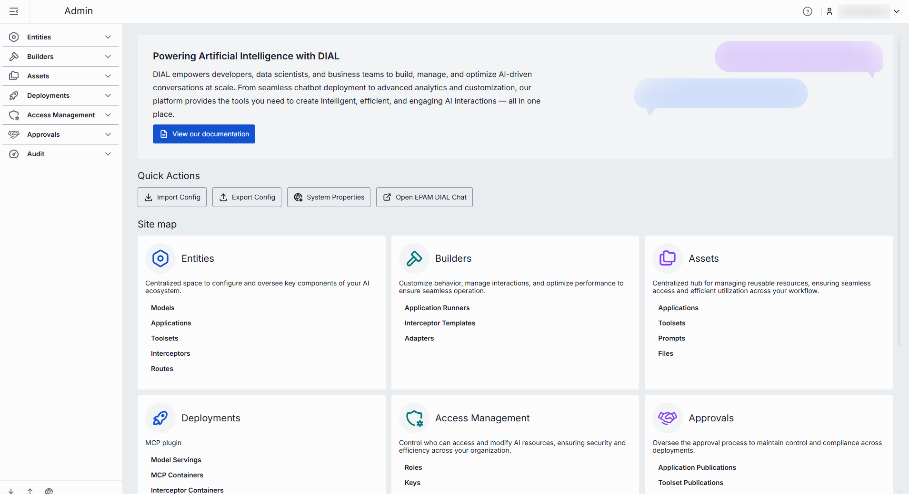
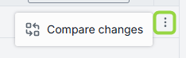
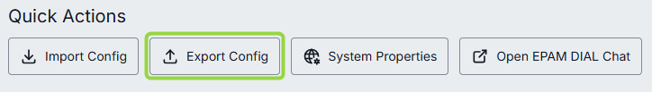
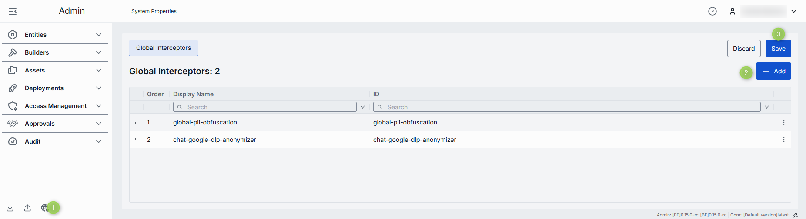
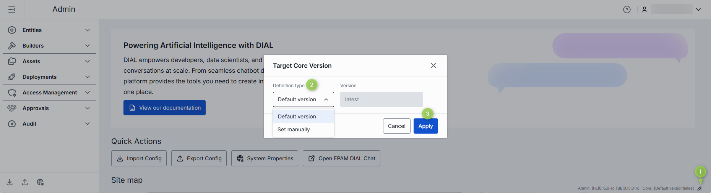
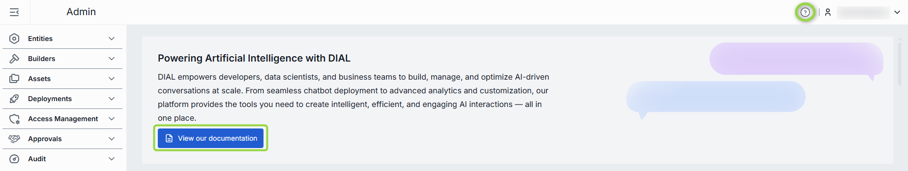

# Home Page

Welcome to the DIAL Admin Panel Home page — your central command center for managing and configuring your DIAL environment. 

The Home page provides administrators with a comprehensive overview of the system and quick access to essential management functions.

- Shortcuts to the main sections and dashboards
- Importing/exporting configurations for backup, migration, or sharing
- Definition of global interceptors in system properties
- Shortcut to the relevant DIAL Chat environment
- Shortcut to system documentation portal
- User settings

## Sections

* [Entities](/docs/tutorials/3.admin/entities-models.md): In this section, you can configure all language models, applications, toolsets, interceptors and routes within the DIAL environment.
* [Builders](/docs/tutorials/3.admin/builders-application-runners.md): In this section, you can add and configure application runners, model adapters and interceptor templates.
* [Assets](/docs/tutorials/3.admin/assets-files.md): In this section, you can view, add, and manage public system resources such as applications, toolsets prompts and files.
* [Deployments](/docs/tutorials/3.admin/deployments-images.md): In this section you can deploy and configure images and containers for Model Servings, MCPs, Interceptors and AI Model Adapters. 
* [Access Management](/docs/tutorials/3.admin/access-management-roles.md): In this section, you can create and manage user groups, roles, API keys, and usage limits to implement access and cost control policy.
* [Approvals](/docs/tutorials/3.admin/approvals-file-publications.md): In this section, you can view and manage publication requests submitted by DIAL users for applications, files and prompts.
* [Audit](/docs/tutorials/3.admin/telemetry-dashboard.md): In this section, you can monitor real-time system usage, including token consumption, system load, and other telemetry data for performance tracking.

## Import Config

Use **Import Config** to upload a configuration file. Can be used for migrating between environments or restoring backups.

1. Click **Import Config** to invoke the import screen.
2. In the **Files** section, you can make the following selections:

   

   - **Components**: Choose to import configuration of Deployments (Model Servings, Images, MCP, Interceptor and Adapter Containers) or Entities (Models, Applications, Toolsets, Interceptors, Routes), Builders (Application Runners, Adapters, Interceptor Templates) and Access Management configurations (API keys and Roles).
   - **Conflict resolution**: To resolve possible conflicts between imported and existing files you can choose a conflict resolution strategy:
         * **Override**: During the import process, any resource in the archive that matches an existing one by the identifier will **override** it.
         * **Skip**: Any resource in the archive that matches the current one by the identifier will be **ignored**, and the current resource will remain unchanged.
   - **File type**: Choose to import DIAL Core `.json` file or a`.zip` archive.
3. Add a file or an archive in the File section and proceed with the **Configuration** step where you can preview all resources being imported.

   

4. For each resource, click **Compare changes** in the actions menu to compare current and a version to be imported:

   

5. Click **Import** to start the import process.

## Export Config

Use **Export Config** to download full or selected configuration of the current instance. Great for backups, audit snapshots, or sharing with teammates.

#### Deployments

You can export configuration of the selected Deployments (Model Servings, Images, MCP, Interceptor and Adapter Containers)

1. Click **Export config** and select **Deployments** in **Components**.
2. Add deployments you want to export. Here, you can choose to ignore or include dependencies required by the selected resources to operate.
3. Click **Export** to invoke the **Export File Preview** window. 
   - Enable **Include secrets** to include secret values (e.g. keys, passwords etc.) in the deployment configuration.
   - Enable **Include global firewall** to include [global domain whitelist](/docs/tutorials/3.admin/deployments-images.md#global-firewall) in the configuration file.
4. Click **Export** to download a `.zip` archive.

#### Entities, Builders, Access Management

You can export configuration of the selected Entities (Models, Applications, Toolsets, Interceptors, Routes), Builders (Application Runners, Adapters, Interceptor Templates) and Access Management configurations (API keys and Roles)

1. Click **Export config** and select **Entities, Builders, Access Management** in **Components**.
2. Choose export format:
   * **DIAL Admin Archive** — `.zip` archive with the configuration stored as a single `.json` file.
   * **DIAL Core JSON File** — a single `.json` file compatible with DIAL Core.
3. Chose export type:
   * **Full**: When this option is selected, use Resources toggles to enable/disable specific categories of resources you want to export.
   * **Custom**: When this option is selected, use tabs with resources where you can manually select what entities in each category you want to include.
      - **Include dependencies**: When exporting a Custom config type, dependencies (e.g. adapters, interceptors, applications, application runners etc. required by the selected resources to operate) can be included or ignored.
4. Use **Topics** to filter out resources associated with the selected topic(s).
5. Click **Export** to open the **Export File Preview** window, where you can:
   - Preview your selections and any included dependencies.
   - Enable **Include secrets** to include secret values (e.g. keys, passwords etc.) in the exported configuration file.
6. Review and click **Export** to download a `.zip` archive.

## System Properties

Click the **Globe** icon in the footer or in Quick Actions on the home page to open the System Properties screen. Here, you can add and configure global interceptors. 

Global interceptors apply to any deployment (applications and models) in DIAL and tend to have the most strict rules, because they receive original input first and examine the response last.

> Refer to [Interceptors](/docs/platform/3.core/6.interceptors.md) to learn more.

##### To add a global interceptor:

1. Click **+ Add** on the System Properties screen.
2. Select from the list of [available interceptors](/docs/tutorials/3.admin/entities-interceptors.md).
3. Click **Apply** to add the interceptor. Repeat steps 1-3 to add more interceptors. If there are more than one interceptors, you can drag-and-drop them to change the execution order. Interceptors run in ascending order (1 → 2 → 3...). A request will flow through each interceptor's in this order. Response interceptors are invoked in the reversed order.
4. Click **Save** on the System Properties screen to apply changes or **Discard** to cancel all unsaved actions.

> When a global interceptor is added, its status in [Entities/Interceptors](/docs/tutorials/3.admin/entities-interceptors.md) changes to **Global** and you can also see it listed under the Global Interceptors tab in configuration of any application or model. 

## DIAL Core Version

Administrators can manually set the version of DIAL Core to resolve any possible compatibility issues that may arise during upgrades.

1. Click the **Edit** icon in the footer next to the Core version.
2. In the pop-up, enter the desired [DIAL Core version](https://github.com/epam/ai-dial-core/releases) manually or choose to auto detect it.
3. Click **Apply**. The updated version is displayed in the footer.

## User Settings

Click your avatar (or name) in the top-right corner of the header to open the profile menu. From here, you can log in or out, and select from the available UI themes.

## System Documentation

On the home page, click **View our documentation** to access the comprehensive DIAL Admin user guide.

Additionally, you can click the tooltip icon located in any page header to jump directly to the relevant section of the user guide that explains the features and functionality of the page you are currently viewing. This ensures you always have quick access to helpful information tailored to your current context.

