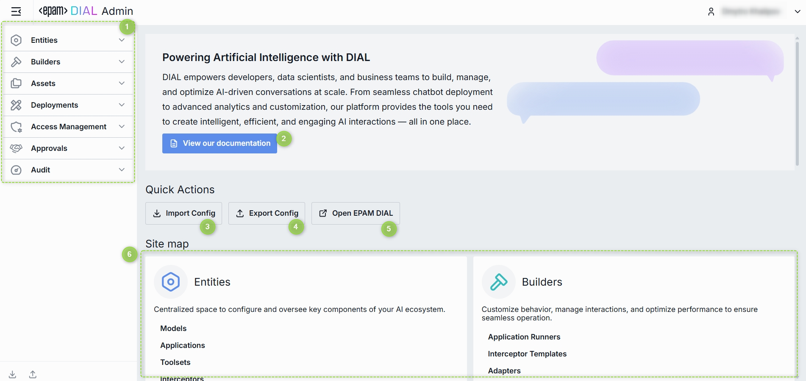
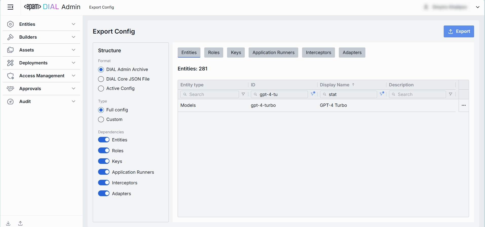
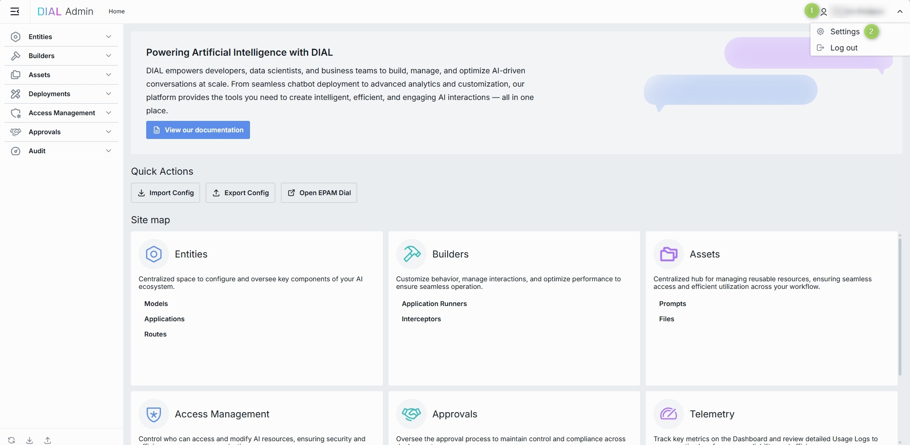

# Introduction to DIAL Admin Panel

## About

The DIAL Admin Panel provides system [administrators](#who-is-admin) tools to configure, manage, and monitor the DIAL ecosystem via a feature-rich, intuitive, and customizable interface. 

> Admin Panel serves as a powerful UI for administrators. System configurations can be done also by a direct modification of a [DIAL Core config](https://github.com/epam/ai-dial-core).

> Watch a [video demo](/docs/video%20demos/4.dial-admin-panel.md).

### GitHub Repositories

Admin Panel is licensed under the Apache License 2.0. 

It is developed in two separate repositories for frontend and backend components:

* [Frontend](https://github.com/epam/ai-dial-admin-frontend)
* [Backend](https://github.com/epam/ai-dial-admin-backend)
  
### Who is Admin

System admin(s) can be defined in [DIAL Core static settings](https://github.com/epam/ai-dial-core?tab=readme-ov-file#static-settings) in the `access.admin.rules`. Admin has the following privileges:

* Has `READ` and `WRITE` access to all system resources (conversations, prompt, files and applications).
* Can view, approve and reject publication requests from DIAL users. 
* Has access to all DIAL Core API endpoints.

## Admin Panel Sections

* **Entities**: In this section, you can configure all language models, applications, and routes within the DIAL environment. Go to [Entities](/docs/tutorials/3.admin/entities-models.md) to learn more.
* **Builders**: In this section, you can add and configure application types and interceptors. Go to [Builders](/docs/tutorials/3.admin/builders-application-runners.md) to learn more.
* **Assets**: In this section, you can view, add, and manage system resources such as prompts and files. Go to [Assets](/docs/tutorials/3.admin/assets-files.md) to learn more.
* **Access Management**: In this section, you can create and manage user groups, roles, API keys, and usage limits to implement access and cost control policy. Go to [Access Management](/docs/tutorials/3.admin/access-management-roles.md) to learn more.
* **Approvals**: In this section, you can view and manage publication requests submitted by DIAL users for files and prompts. Go to [Approvals](/docs/tutorials/3.admin/approvals-file-publications.md) to learn more.
* **Telemetry**: In this section, you can monitor real-time system usage, including token consumption, system load, and other telemetry data for performance tracking. Go to [Telemetry](/docs/tutorials/3.admin/telemetry-dashboard.md) to learn more.

## Home Screen

The Home screen gives you a high-level overview of your environment and fast access to the most important actions and modules.

* **Sidebar** is the main menu available at any page with access to every major DIAL Admin section.
* **View our documentation** button opens the official [DIAL docs](https://docs.dialx.ai/) in a new tab. It's handy when you need an in-depth reference or look for details.
* **Open DIAL** button opens https://chat.dialx.ai/ in a new tab, where you can try your apps , prompts, and models live.
* **Site Map** is a visual grid of cards you can use to navigate to a corresponding DIAL Admin section.

### Import Config

**Import Config** button uploads a DIAL configuration file to provision or restore your instance. It is useful for migrating between environments or restoring backups.

* **File type**: Either DIAL Core (_.json_) or Admin (_.zip_) format can be selected.
* **Conflict resolution**: You can chose between two conflict resolution options:
  * **Override**: During the import process, any artifact in the archive that matches an existing artifact in DIAL by the identifier will **override** the existing artifact.
  * **Skip**: Any artifact in the archive that matches an existing artifact in DIAL by the identifier will be **ignored**, and the existing artifact will remain unchanged.

### Export Config

**Export Config** allows you to download the configuration of the current instance as an archived *.json* file. Great for backups, audit snapshots, or sharing with teammates.

* Either Core (_.json_) or Admin (_.zip_) format can be selected.
* Config can be exported partially (user choice) or in full.
* The dependencies can be included or ignored for Entities, Roles, Keys, Application Runners and Interceptors. 

### User Settings

Click your avatar (or name) to reveal the profile menu in the top-right corner of the header. Here, you can personalize your DIAL Admin experience and manage your session.

##### Profile Menu Options

| Option       | Description                                                              |
| ------------ | ------------------------------------------------------------------------ |
| **Settings** | Opens the User Settings modal where you can adjust personal preferences. Here you can choose a UI theme.|
| **Log out**  | Ends your session and returns you to the login screen.                   |

