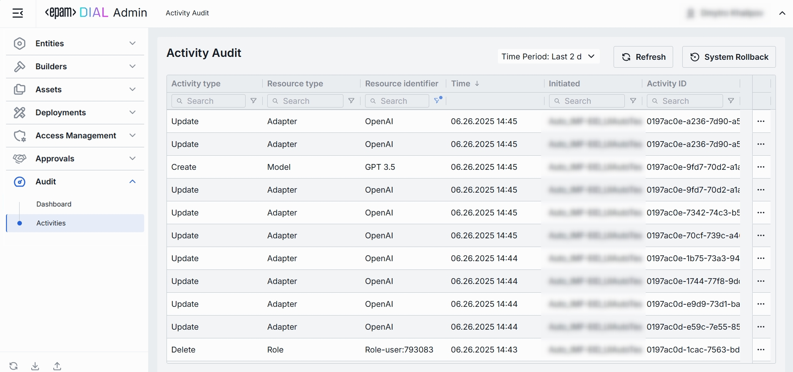
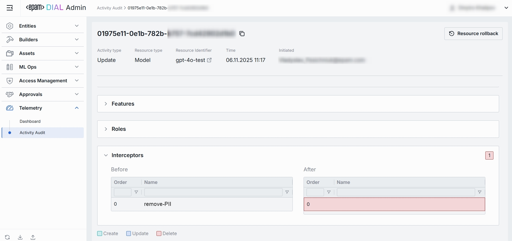
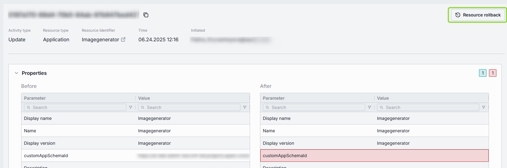
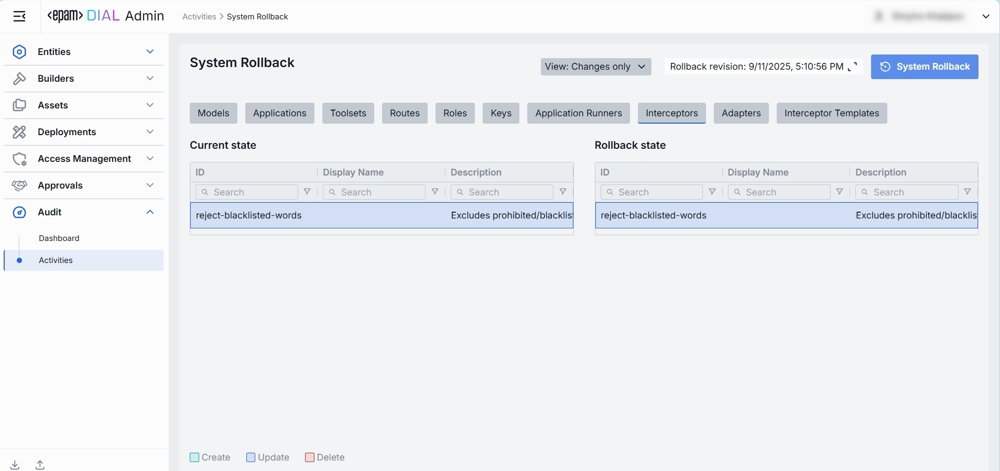
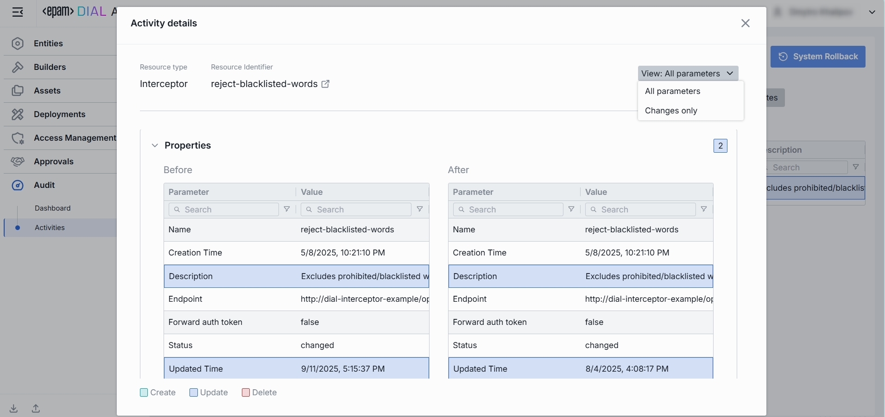

# Activity Audit

## About Activity Audit

The Activity Audit page is your system-wide "black box recorder". It captures every change anyone makes in the Admin Panel (who, what, and when) so you could trace, verify, and, if needed, roll back any action.

## Activity Audit List

On the main Activity Audit screen, you can view all events that has happened in DIAL Admin Panel.

##### Top Bar Controls

- **Time Period** filter: A dropdown control that scopes the Activity-Audit table to a custom period range.
- **Refresh** button: Manually refreshes the entries on the page honoring all active filters and the selected **Time Period** to pull the latest audit events

| Name                | Required | Definition                                                                                               |
| ------------------- | -------- | -------------------------------------------------------------------------------------------------------- |
| Activity type       | Yes      | The action performed on the resource (e.g., **Create**, **Update**, **Delete**).                         |
| Resource type       | Yes      | The category of the object affected (e.g., **Model**, **Interceptor**, **Role**, **Application**, etc.). |
| Resource identifier | Yes      | A user-friendly name or deployment Id of the specific resource that was acted upon.                      |
| Time                | Yes      | Timestamp of the change.                                                                                 |
| Initiated           | Yes      | A user who triggered the action (e-mail); may show system e-mail for automated events.                   |
| Activity ID         | Yes      | Immutable UUID that uniquely identifies the audit event.                                                 |

### Entry Details

The Activity-Audit Entry page is the detailed drill-down for a single audit event.
It lets you inspect exactly what changed in a resource, who did it, and when, with a side-by-side "before/after" diff that can be rolled back with one click.

| Name                | Required | Definition                                                                                               |
| ------------------- | -------- | -------------------------------------------------------------------------------------------------------- |
| Activity type       | Yes      | The action performed on the resource (e.g., **Create**, **Update**, **Delete**).                         |
| Resource type       | Yes      | The category of the object affected (e.g., **Model**, **Interceptor**, **Role**, **Application**, etc.). |
| Resource identifier | Yes      | A user-friendly name or deployment Id of the specific resource that was acted upon.                      |
| Time                | Yes      | Timestamp when the platform successfully committed the change.                                           |
| Initiated           | Yes      | A user who triggered the action (e-mail); may show system e-mail for automated events.                   |
| Activity ID         | Yes      | Immutable UUID that uniquely identifies the audit event.                                                 |

#### Review Changes

- **Comparison** dropdown at the top lets you compare the artefact’s state **before vs. after** the selected audit record, or **before** that record vs. the current **state**.
- **View** drop-down on the top allows to choose whether to show all parameters or only ones having changes between compared artefact states.
- **Categories** (e.g., _Features_, _Roles_, _Interceptors_). Groups all changes that belong to one logical section of the respective resource (Model, Application, etc.). Click to expand/collapse. A numeric badge shows the number of distinct changes.
- **Before/After columns**. Side-by-side diff that shows the previous and resulting values for every field in the section. Each row is color-coded to signal the type of operation performed:
  - **Green** (`Create`). A field was **added** in the _After_ state and did not exist before.
  - **Blue** (`Update`). A field's value was **modified** - both Before and After state rows rows are highlighted in blue.
  - **Red** (`Delete`). A field was **removed** - it is present in the _Before_ state but absent (or struck-through) in the _After_ state.

#### Resource Rollback

Use Resource Rollback to restore the previous version of the related resource. A rollback leads to generation of a new entry on the audit activity screen.

#### System Rollback

Use System Rollback to restore all resources modified during the specified period to the previous state.

For each artefact its possible to see and compare current and previous configuration state:

> **Note:** Use View drop-down on the top to select whether to show all parameters or only ones having changes between compared states.
