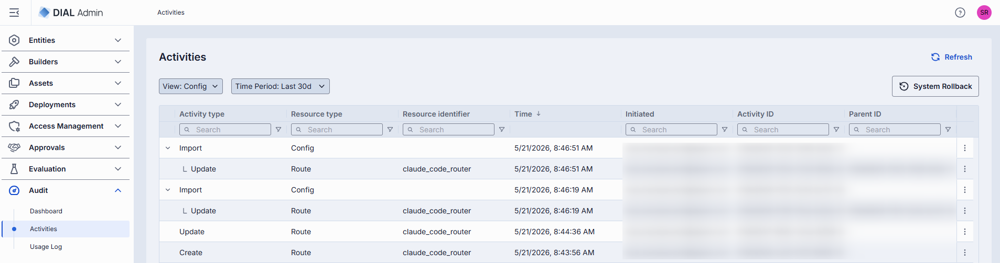
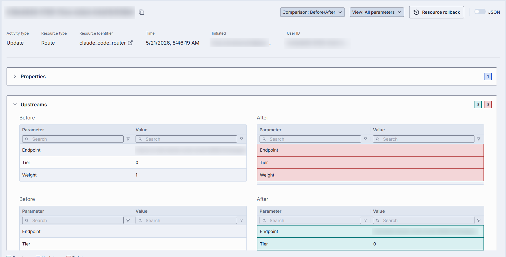
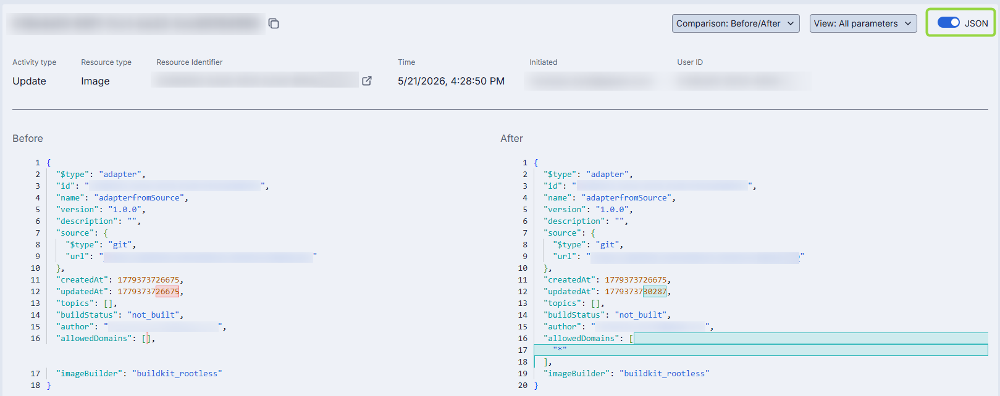
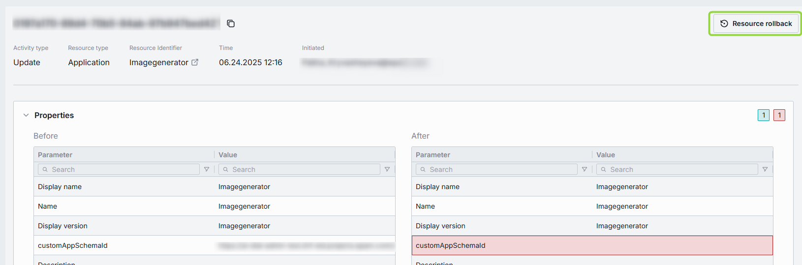
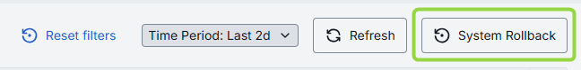

# Activity

## Introduction

The Activity Audit page serves as your system-wide "black box recorder," providing complete visibility into every administrative action performed within DIAL. This comprehensive audit trail captures the full lifecycle of changes—tracking who initiated each action, what resources were modified, and precisely when these changes occurred.

With Activity Audit, you can:

* **Trace modifications** across all resource types (models, applications, roles, interceptors, and more)
* **Verify compliance** by reviewing detailed before-and-after comparisons of configuration changes
* **Investigate issues** by drilling down into individual events with timestamped, user-attributed records
* **Restore stability** through granular resource rollback or system-wide state restoration

Whether you're troubleshooting unexpected behavior, conducting security reviews, or maintaining regulatory compliance, Activity Audit gives you the forensic detail and recovery capabilities needed to manage your DIAL deployment with confidence.

## Main Screen

On the main screen, you can view all events that has happened in DIAL Admin Panel.

##### Top Bar Controls

* **Time Period** filter: A dropdown that scopes the Activity Audit table to a specific time range.
* **View** filter: A dropdown that scopes the activities grid to one category. Options:
    * **Config** — Import, Rollback, and changes to configuration entities.
    * **Assets** — activities on assets (toolsets, prompts, files).
    * **Deployment** — activities on deployment resources (images, containers).
* **Refresh** button: Reloads the table, honoring all active filters and the selected **Time Period**.
* **System Rollback**: Use to restore a specific state of the entire system. Refer to [System Rollback](#system-rollback) to learn more.

| Name | Description |
|----- |-------------|
| **Activity type** | Action performed on the resource (e.g., **Create**, **Update**, **Delete**). |
| **Resource type** | Category of the object affected (e.g., **Model**, **Interceptor**, **Role**, **Application**, etc.). |
| **Resource identifier** | Identifier of the specific resource that was acted upon. |
| **Time** | Timestamp of the change. |
| **Initiated** | E-mail of the user who triggered action. |
| **Activity ID** | Immutable UUID that uniquely identifies the audit event. |

### Activity Details

Click any activity on the main screen to open a comprehensive drill-down view that provides forensic-level insight into resource modifications. This panel enables you to:

* **Inspect precise changes** through a side-by-side before/after comparison showing exactly which fields were added, modified, or removed.
* **Verify user accountability** by reviewing who initiated the change and when it was committed to the system.
* **Understand change context** with categorized groupings (Features, Roles, Interceptors, etc.) that organize modifications by logical section.
* **Restore previous states** using one-click resource rollback to revert unwanted changes. Refer to [Resource Rollback](#resource-rollback) to learn more.

The Activity Details view serves as both an investigative tool for troubleshooting and a recovery mechanism for maintaining system stability.

| Field | Description |
|------ |-------------|
| Activity ID | Immutable UUID that uniquely identifies the audit event. |
| Activity type | Action performed on the resource (e.g., **Create**, **Update**, **Delete**). |
| Resource type | Category of the object affected (e.g., **Models**, **Properties**, **Parameters**, etc.). |
| Resource identifier | Name of the resource or deployment Id that was acted upon. |
| Time | Timestamp when the platform successfully committed the change. |
| Initiated | E-mail of a user who performed action. |
| User ID | Unique identifier of a user who performed action.

#### Review Changes

* **Comparison** dropdown switches between two comparison modes: **Before vs. After** (the state immediately before and after this specific change) or **Before vs. Current** (the state before this change compared to the present system state), useful for tracking how a resource evolved over multiple modifications.
* **View** dropdown at the top filters the comparison display to show either all parameters or only those with differences between the before/after states, reducing noise when reviewing large configurations.
* **Categories** (e.g., *Features*, *Roles*, *Interceptors*). Groups all changes that belong to one logical section of the respective resource (Model, Application, etc.). Click to expand/collapse. A numeric badge shows the number of distinct changes.
* **Before/After columns**. Side-by-side diff that shows the previous and resulting values for every field in the section. Each row is color-coded to signal the type of operation performed:
    * **Green** (`Create`). A field was **added** in the *After* state and did not exist before.
    * **Blue** (`Update`). A field's value was **modified** - both Before and After state rows rows are highlighted in blue.
    * **Red** (`Delete`). A field was **removed** - it is present in the *Before* state but absent (or struck-through) in the *After* state.

Use the JSON toggle to switch between the form-based UI and raw JSON to view a comprehensive set of parameters or those not rendered on UI.

#### Resource Rollback

Use Resource Rollback to restore the previous version of a single resource. The rollback itself is recorded as a new entry on the Activity Audit screen, so the action is fully traceable.

## System Rollback

Use System Rollback to restore all resources modified during a specified time period to their previous state in a single operation. The action is logged as a parent entry on the Activity Audit screen that captures the rollback parameters (target time range), with a child entry bound to it for every affected resource. This lets you trace the bulk operation as a whole and drill down into each individual resource it touched.

On the System Rollback screen, tabs list all affected resources. Open any tab to drill down into the corresponding resource: review the before/after diff, switch between table and JSON view, and apply or skip the rollback for that resource. Use the filters to limit the diff to changed parameters only and to narrow the time range.

Use the JSON toggle to switch between the form-based UI and raw JSON to view a comprehensive set of parameters, including those not rendered on the UI.

System-wide operations other than rollback are tracked the same way. **Import Config**, for example, is logged as a single parent entry capturing the import action, with a child entry bound for every resource it created or modified. Open the parent entry to drill down into each affected resource and review the changes that were applied at the global level.

