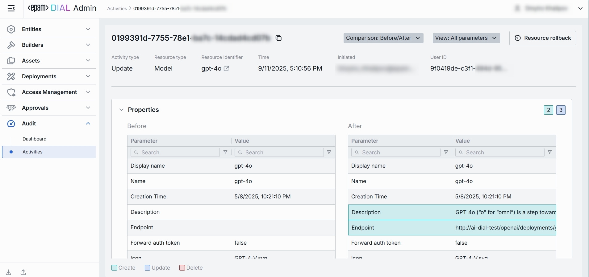

# Activity Audit

## Introduction

The Activity Audit page serves as your system-wide "black box recorder," providing complete visibility into every administrative action performed within DIAL. This comprehensive audit trail captures the full lifecycle of changes—tracking who initiated each action, what resources were modified, and precisely when these changes occurred.

With Activity Audit, you can:

* **Trace modifications** across all resource types (models, applications, roles, interceptors, and more)
* **Verify compliance** by reviewing detailed before-and-after comparisons of configuration changes
* **Investigate issues** by drilling down into individual events with timestamped, user-attributed records
* **Restore stability** through granular resource rollback or system-wide state restoration

Whether you're troubleshooting unexpected behavior, conducting security reviews, or maintaining regulatory compliance, Activity Audit gives you the forensic detail and recovery capabilities needed to manage your DIAL deployment with confidence.

## Main Screen

On the main screen, you can view all events that has happened in DIAL Admin Panel.

##### Top Bar Controls

* **Time Period** filter: A dropdown control that scopes the Activity-Audit table to a custom period range.
* **Refresh** button: Manually refreshes the entries on the page honoring all active filters and the selected **Time Period** to pull the latest audit events
* **System Rollback**: Use to restore a specific state of the entire system.

| Name | Description |
|----- |-------------|
| **Activity type** | Action performed on the resource (e.g., **Create**, **Update**, **Delete**). |
| **Resource type** | Category of the object affected (e.g., **Model**, **Interceptor**, **Role**, **Application**, etc.). |
| **Resource identifier** | Identifier of the specific resource that was acted upon. |
| **Time** | Timestamp of the change. |
| **Initiated** | E-mail of the user who triggered action. |
| **Activity ID** | Immutable UUID that uniquely identifies the audit event. |

### Activity Details

Click any activity on the main screen to open a comprehensive drill-down view that provides forensic-level insight into resource modifications. This panel enables you to:

* **Inspect precise changes** through a side-by-side before/after comparison showing exactly which fields were added, modified, or removed
* **Verify user accountability** by reviewing who initiated the change and when it was committed to the system
* **Understand change context** with categorized groupings (Features, Roles, Interceptors, etc.) that organize modifications by logical section
* **Restore previous states** using one-click resource rollback to revert unwanted changes

The Activity Details view serves as both an investigative tool for troubleshooting and a recovery mechanism for maintaining system stability.

| Name | Required | Description |
|------|----------|-------------|
| Activity type | Yes | The action performed on the resource (e.g., **Create**, **Update**, **Delete**). |
| Resource type | Yes | The category of the object affected (e.g., **Model**, **Interceptor**, **Role**, **Application**, etc.). |
| Resource identifier | Yes | A user-friendly name or deployment Id of the specific resource that was acted upon. |
| Time | Yes | Timestamp when the platform successfully committed the change. |
| Initiated | Yes | A user who triggered the action (e-mail); may show system e-mail for automated events. |
| Activity ID | Yes | Immutable UUID that uniquely identifies the audit event. |

#### Review Changes

* **Comparison** dropdown at the top lets you compare the artefact’s state **before vs. after** the selected audit record, or **before** that record vs. the current **state**.
* **View** drop-down on the top allows to choose whether to show all parameters or only ones having changes between compared artefact states.
* **Categories** (e.g., *Features*, *Roles*, *Interceptors*). Groups all changes that belong to one logical section of the respective resource (Model, Application, etc.). Click to expand/collapse. A numeric badge shows the number of distinct changes.
* **Before/After columns**. Side-by-side diff that shows the previous and resulting values for every field in the section. Each row is color-coded to signal the type of operation performed:
    * **Green** (`Create`). A field was **added** in the *After* state and did not exist before.
    * **Blue** (`Update`). A field's value was **modified** - both Before and After state rows rows are highlighted in blue.
    * **Red** (`Delete`). A field was **removed** - it is present in the *Before* state but absent (or struck-through) in the *After* state.

Use the JSON toggle to switch between the form-based UI and raw JSON view.

#### Resource Rollback

Use Resource Rollback to restore the previous version of the related resource. A rollback leads to generation of a new entry on the audit activity screen.

#### System Rollback

Use System Rollback to restore all resources modified during the specified period to the previous state.

For each artefact its possible to see and compare current and previous configuration state:

> **Note:** Use View drop-down on the top to select whether to show all parameters or only ones having changes between compared states. 
