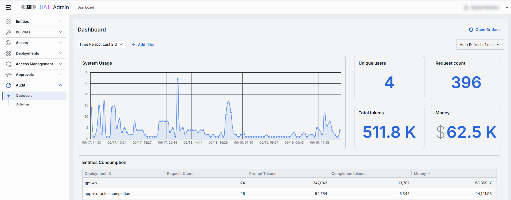
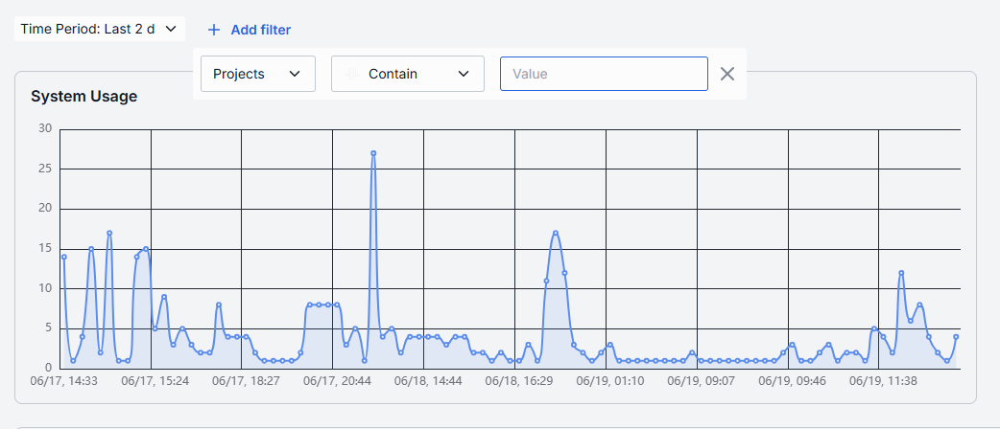
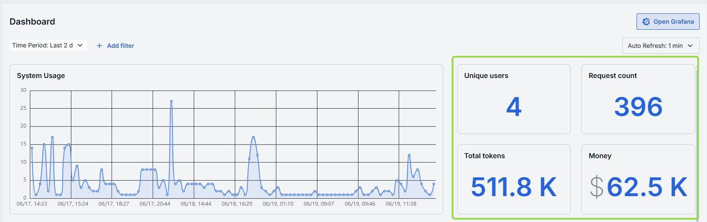
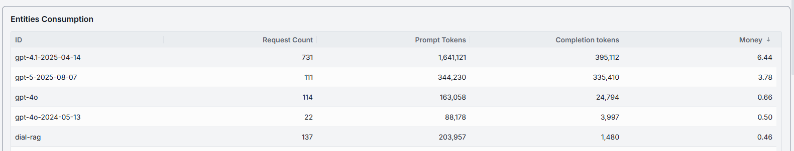
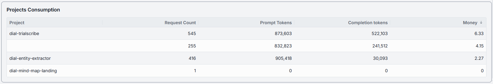
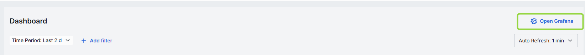
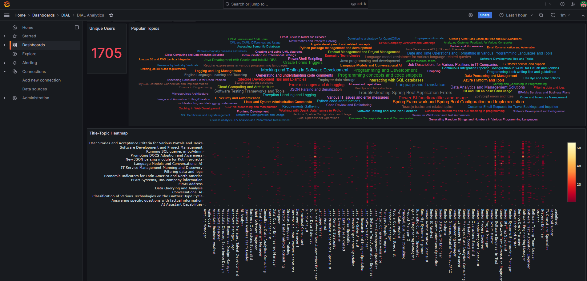

# Dashboard

## Introduction

In **Dashboard**, you can monitor system metrics. Monitoring of system metrics is crucial for the health and performance of the system. It helps you to identify and resolve issues before they become critical.
 
> Refer to [Observability](/docs/platform/8.observability-intro.md) to learn about observability and system monitoring in DIAL.

##### Controls and filters

| Control | Description |
|---------|-------------|
| **Time Period** | Date range filters for all charts and tables. |
| **+ Add filter** | Filter to drill into specific subsets of Projects and Entities. |
| **Auto refresh** | Control allowing to pull new data (e.g. every 1 min) or turn off auto-refresh. |

## System Usage Chart

System Usage is a time-series line chart showing the requests throughput over the selected time period for projects or entities. You can use it to identify traffic peaks and valleys, correlate spikes with deployments or feature releases.

## Metrics

Metrics are displayed alongside the System Usage Chart. Metrics are calculated for the selected time period for the entire system.

| Metric | Description |
|--------|-------------|
| **Unique Users** | Count of distinct user IDs or API keys. |
| **Request Count** | Total number of chat or embedding calls. |
| **Total Tokens** | Total sum of prompt and completion tokens used. |
| **Money** | Estimated spending amount in USD. |

## Entities Consumption

Use Entities Consumption table to monitor consumption metrics for deployments: models, applications, toolsets, interceptors and routes. You can use it to compare the tokens usage of different entities, identify cost-inefficient deployments, and optimize your resources.

| Column | Description |
|--------|-------------|
| **ID** | Unique identifier of an entity. |
| **Request Count** | Number of calls directed to the entity. |
| **Prompt tokens** | Total number of tokens submitted in the prompt portion of requests. |
| **Completion tokens** | Total number of tokens returned by the model/application as responses. |
| **Money** | Estimated overall costs in USD. |

## Projects Consumption

Use Projects Consumption table to monitor consumption metrics for projects. You can use it to compare the tokens usage of different projects, identify cost-inefficient projects, and optimize your resources.

| Column | Description |
|--------|-------------|
| **Project** | Project name. |
| **Request Count** | Number of calls directed to the model/application. |
| **Prompt tokens** | Total tokens submitted in the prompt portion of requests. |
| **Completion tokens** | Total tokens returned by the model/application in the responses. |
| **Money** | Estimated overall costs in USD. |

## Grafana

Click **Open Grafana** to access the Grafana dashboard where you can monitor other system metrics.

