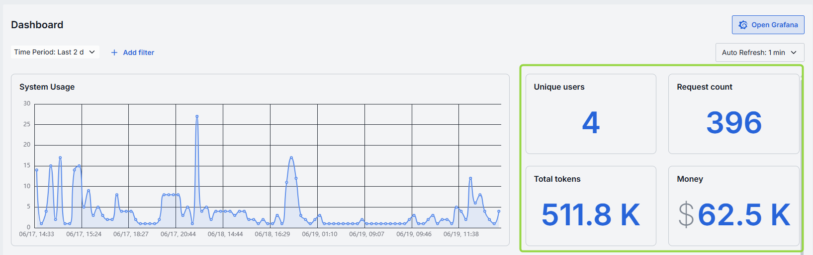
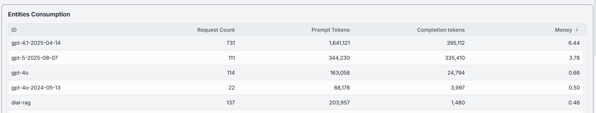
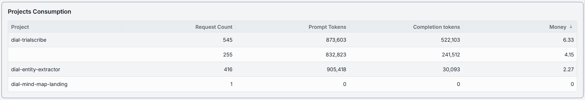
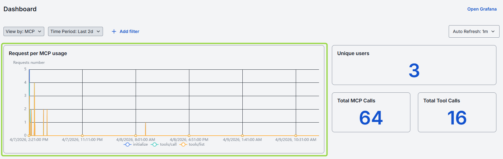
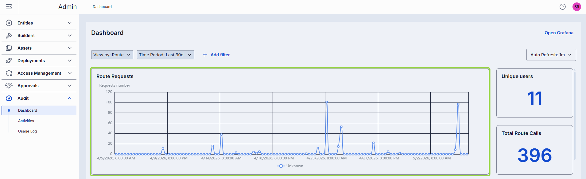

# Dashboard

## Introduction

In **Dashboard**, you can monitor system metrics. Monitoring of system metrics is crucial for the health and performance of the system. It helps you to identify and resolve issues before they become critical.
 
> Refer to [Observability](/docs/platform/8.observability-intro.md) to learn about observability and system monitoring in DIAL.

##### Controls and filters

| Control | Description |
|---------|-------------|
| **View by** | Use this filter to display Chat or MCP usage metrics on the dashboard. |
| **Time Period** | Date range filters for all charts and tables. Users can pick one of the predefined options or set a custom time period. |
| **+ Add filter** | Filter to drill into specific subsets of Projects and Entities. |
| **Auto refresh** | Control allowing to pull new data (e.g. every 1 min) or turn off auto-refresh. |

## Chat Dashboard 

### System Usage Chart

System Usage is a time-series line chart showing the requests throughput over the selected time period for projects or entities. You can use it to identify traffic peaks and valleys, correlate spikes with deployments or feature releases.

### Metrics

Metrics are calculated for the selected time period for the entire system.

| Metric | Description |
|--------|-------------|
| **Unique Users** | Count of distinct user IDs or API keys. |
| **Request Count** | Total number of chat or embedding calls. |
| **Total Tokens** | Total sum of prompt and completion tokens used. |
| **Money** | Estimated spending amount in USD. |

### Entities Consumption

Use Entities Consumption table to monitor consumption metrics for deployments: models, applications, toolsets, interceptors and routes. You can use it to compare the tokens usage of different entities, identify cost-inefficient deployments, and optimize your resources.

| Column | Description |
|--------|-------------|
| **ID** | Unique identifier of an entity. |
| **Request Count** | Number of calls directed to the entity. |
| **Prompt tokens** | Total number of tokens submitted in the prompt portion of requests. |
| **Completion tokens** | Total number of tokens returned by the model/application as responses. |
| **Money** | Estimated overall costs in USD. |

### Projects Consumption

Use Projects Consumption table to monitor consumption metrics for projects. You can use it to compare the tokens usage of different projects, identify cost-inefficient projects, and optimize your resources.

| Column | Description |
|--------|-------------|
| **Project** | Project name. |
| **Request Count** | Number of calls directed to the model/application. |
| **Prompt tokens** | Total tokens submitted in the prompt portion of requests. |
| **Completion tokens** | Total tokens returned by the model/application in the responses. |
| **Money** | Estimated overall costs in USD. |

## MCP Dashboard

The MCP dashboards give administrators a clear picture of how MCPs and tools are being used. They show important information like user activity, the number of calls, and usage by project or deployment. These dashboards make it easy to track usage, spot trends, and manage resources effectively.

### Request per MCP Usage Chart

This dashboard provides administrators with a comprehensive overview of MCP activity within the system. It displays key metrics such as initialization events, tool calls, and loot list interactions, enabling you to monitor usage patterns, identify trends, and optimize resource allocation effectively. This dashboard is designed to help you gain actionable insights into how MCP resources are utilized across your environment.

### Totals Metrics

This section presents key metrics that offer valuable insights into MCP usage and user activity within the selected time period.

| Metric | Description |
|--------|-------------|
| **Unique Users** | Displays the count of distinct user IDs or API keys that have interacted with the MCP, helping you understand the breadth of user engagement. |
| **Total MCP Calls** | Shows the total number of requests to MCP servers, providing insight into overall system activity. |
| **Total Tool Calls** | Represents the overall interaction with MCP tools, allowing you to track resource consumption and usage intensity. |

### Consumption Metrics

| **Dashboard** | **Description**  |
|---------------|------------------|
| **MCP Consumption** | This dashboard displays the number of calls made to each MCP, allowing administrators to monitor and compare usage across different MCPs. |
| **Tools Consumption** | This dashboard provides insights into tool usage by showing the number of calls for each tool, grouped by MCP. It helps identify frequently used tools. |
| **Calls by Deployment** | This dashboard breaks down MCP usage by applications, showing the number of calls each application has made to a particular MCP. |
| **Project Consumption** | This dashboard summarizes MCP and tool usage at the project level, displaying the number of MCP and tool calls for each project. |

## Grafana

Click **Open Grafana** to access the Grafana dashboard where you can monitor other system metrics.

## Route Dashboard 

Route dashboards give administrators a clear picture of how [routes](/docs/tutorials/3.admin/entities-routes.md) are being used. They show important information like user activity, the number of calls, and usage by project or deployment. These dashboards make it easy to track usage, spot trends, and manage resources effectively.

### Route Requests

This dashboard provides administrators with a comprehensive overview of all requests made to registered routes within the system. It is designed to help you gain actionable insights into how routes are utilized across your environment.

### Totals Metrics

This section presents key metrics that offer valuable insights into routes usage and user activity within the selected time period.

| Metric | Description |
|--------|-------------|
| **Unique Users** | Displays the count of distinct user IDs or API keys that have interacted with routes, helping you understand the breadth of user engagement. |
| **Total Route Calls** | Shows the total number of requests to registered routes, providing insight into overall system activity. |

### Calls Metrics

| **Dashboard** | **Description**  |
|---------------|------------------|
| **Calls by Deployment** | This dashboard displays the total number of calls made to routes by application deployments, allowing administrators to monitor and compare usage across different applications. |
| **Calls by Route** | This dashboard provides insights into specific routes usage by application deployments. |
| **Calls from Parent Deployments** | This dashboard breaks down routes usage by parent application deployments. |
| **Calls by Project** | This dashboard summarizes routes usage at the project level, displaying the number of calls for each project. |