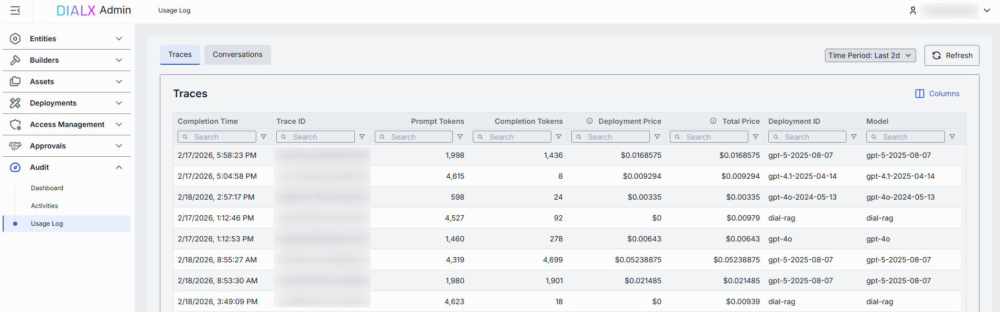
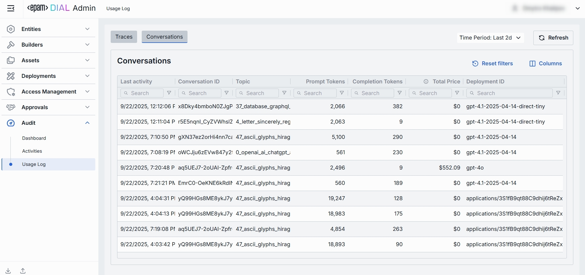

# Usage Log

## Introduction

The **Usage Log** provides comprehensive visibility into all interactions within your DIAL environment by capturing **traces**—individual end-to-end exchanges between users and DIAL entities (applications or models). 

Each trace represents a complete request-response cycle, from the initial user prompt through to the final model output, including all associated metadata such as token counts, costs, and performance metrics.

The Usage Log offers two complementary views:
- **Traces Tab**: Displays individual traces with granular details for in-depth analysis of specific interactions
- **Conversations Tab**: Groups related traces into conversation sessions, enabling you to review aggregated metrics and understand multi-turn dialogue patterns

This dual perspective allows you to analyze usage patterns at both the micro (individual trace) and macro (conversation session) levels, supporting effective monitoring, cost optimization, and performance analysis.

##### Top Bar Controls

* **Time Period**: Dropdown control to scope the table to a specific time range (e.g., last 24 hours, last 7 days, or custom date range).
* **Refresh**: Click to manually reload the table with the latest data, applying all active filters and respecting the selected time period. This ensures you're viewing the most current traces and conversations without needing to reload the entire page.

## Traces

The Traces Tab provides a detailed view of all requests processed by DIAL Core. Each row represents an individual request—whether initiated by an external or internal DIAL client. When a DIAL client sends a request to a DIAL Core deployment (model or application), it may result in a complex sequence of calls between DIAL applications and models. All requests within this call sequence share a single Trace ID, allowing you to track the entire end-to-end interaction. Additionally, each request is assigned a unique Core span ID, so the combination of Trace ID and Core span ID uniquely identifies every request.

This granular view enables you to analyze token consumption, costs, performance metrics, and execution paths for each request. Use the Traces Tab to investigate specific interactions, troubleshoot issues, or analyze usage patterns at both the trace and individual request level.

| Column | Description |
|--------|-------------|
| **Completion Time** | Timestamp when the trace finished processing (end-to-end interaction). |
| **Duration** | Total end-to-end duration of the trace from first request to completion. |
| **Number of request messages** | The number indicates the chat conversation length in chat completion requests and the input count in embedding requests. |
| **Trace ID** | OpenTelemetry trace ID uniquely identifying requests to DIAL Core resulted from a single end-to-end interaction. |
| **Response ID** | Identifier of the response object returned by the AI model for this trace. |
| **Conversation ID** | DIAL Chat conversation identifier the given request belongs to. |
| **Core span ID** | OpenTelemetry span ID generated by DIAL Core. |
| **Core span parent ID** | OpenTelemetry span ID generated by DIAL Core that called the given request. |
| **Deployment ID** | Identifier of the DIAL deployment corresponding to the given request. |
| **Parent Deployment ID** | Identifier of the DIAL parent deployment that called the given request. |
| **Prompt tokens** | Number of tokens in the prompt sent to the model for this trace. |
| **Cached prompt tokens** | Number of prompt tokens served from cache (prompt-caching). |
| **Completion tokens** | Number of tokens generated by the model as output for this trace. |
| **Deployment price** | The cost of the specific request in the call graph, excluding the cost of any requests it directly or indirectly initiated. |
| **Total price** | The total cost of the request, including the cost of this request and all related requests it directly or indirectly triggered. It always holds that `Deployment price >= Total price`. |
| **Model** | Identifier of the underlying AI model used to carry out the trace. |
| **Project** | Project ID corresponding to the DIAL API Key via which the given request was made. |
| **Upstream** | The upstream endpoint (e.g., completions endpoint of the model). |
| **Execution path** | A list of DIAL deployment IDs representing the call stack of the given request. |
| **User** | Hashed identifier of the end user who initiated the trace. |
| **User title** | Title of the user (if available). |
| **Topic** | Auto-generated subject/title summarizing the trace. |
| **Language** | Language detected in the trace (e.g., `en`). |
| **Reactions** | Indication of user reactions presence (like/dislike) for the trace. |

## Conversations

The **Conversations Tab** aggregates related traces into cohesive user sessions, providing a conversation-level view of interactions within DIAL. Each row represents a complete conversation session, displaying aggregated metrics such as total token consumption, cumulative costs, and activity timelines. This view enables you to analyze multi-turn dialogues, track user engagement patterns, and monitor resource utilization across entire conversation flows rather than isolated interactions.

| Column | Description |
|--------|-------------|
| **Last activity** | Timestamp of the most recent trace within the conversation. |
| **Conversation ID** | Unique identifier of the user session that groups related traces. |
| **Topic** | Auto-generated subject summarizing the conversation. |
| **Cached prompt tokens** | Count of prompt tokens served from cache across the conversation. |
| **Prompt tokens** | Total number of request/prompt tokens sent to the AI model across all traces in the conversation. |
| **Completion tokens** | Total number of tokens generated by the AI model across all traces in the conversation. |
| **Total price** | Aggregated cost of the conversation. |
| **Number of request messages** | Total number of discrete request messages included in the conversation. |
| **Deployment ID** | Identifier of the deployment associated with the conversation. |
| **Project** | Related project in DIAL. |
| **User** | Identifier of the end user who initiated the conversation. |
| **User title** | Name of the user (if available). |
| **Language** | Detected language for the conversation (e.g., `en`). |
