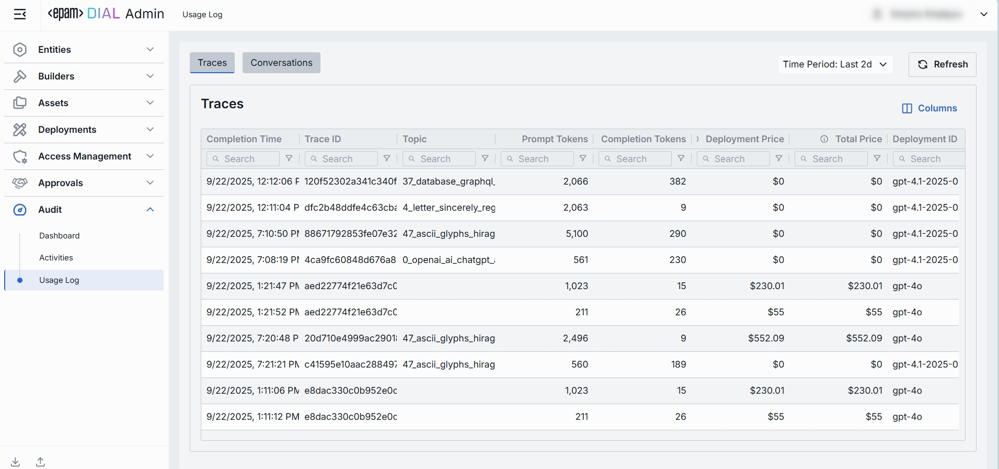

# Usage Log

## Introduction

Each request to DIAL Core deployment (model or application) initiated by external of internal client may result in a complex sequence of calls between DIAL applications and AI models. All requests within this call sequence share a single Trace ID, allowing you to track the entire end-to-end interaction. Additionally, each request is assigned a unique Core span ID, so the combination of Trace ID and Core span ID uniquely identifies every request.

The **Usage Log** provides comprehensive visibility into all requests processed by DIAL Core. It offers two complementary views: **Traces** for granular request-level details (token consumption, costs, performance metrics, execution paths), and **Conversations** for aggregated conversation-level metrics. 

##### Top Bar Controls

* **Time Period**: Dropdown control to scope the table to a specific time range (e.g., last 24 hours, last 7 days, or custom date range).
* **Refresh**: Click to manually reload the table with the latest data, applying all active filters and respecting the selected time period. This ensures you're viewing the most current traces and conversations without needing to reload the entire page.

## Traces

In **Traces** you can access a detailed view into all requests processed by DIAL Core. Each row represents an individual request—whether initiated by an external or internal DIAL client. Use it to investigate specific interactions, troubleshoot issues, or analyze usage patterns at both the trace and individual request level.

| Column | Description |
|--------|-------------|
| **Completion Time** | Timestamp when a trace finished processing (end-to-end interaction). |
| **Duration** | The total elapsed time from the start of the initial request in the trace to the completion of the final request within the same trace. This measures the full span of activity associated with a single Trace ID, capturing the time between the earliest request start and the latest request end within the trace. |
| **Number of request messages** | The number indicates the chat conversation length in chat completion requests and the input count in embedding requests. |
| **Trace ID** | OpenTelemetry trace ID uniquely identifying requests to DIAL Core resulted from a single end-to-end interaction. |
| **Response ID** | Identifier of the response object returned by the AI model for the given trace. |
| **Conversation ID** | DIAL Chat conversation identifier the given request belongs to. |
| **Core span ID** | OpenTelemetry span ID generated by DIAL Core. |
| **Core span parent ID** | OpenTelemetry span ID generated by DIAL Core that called the given request. |
| **Deployment ID** | Identifier of the DIAL deployment corresponding to the given request. |
| **Parent Deployment ID** | Identifier of the DIAL parent deployment that triggered the given request. |
| **Execution path** | A list of DIAL deployment IDs representing the call stack of the given request. E.g. `['app1', 'app2', 'model1']` means `app1` called `app2` and `app2` called `model1`. The last element of the list equals to the Deployment ID field. The penultimate element of the list (when present) equals to the Parent Deployment ID field. |
| **Prompt tokens** | The total number of tokens contained in the prompt(s) sent to AI models during all requests within a given trace. This value is calculated by summing the tokens in each prompt across the trace, as recorded by DIAL Core. |
| **Cached prompt tokens** | Number of prompt tokens served from cache (prompt-caching) in the given trace. |
| **Completion tokens** | Number of tokens generated by the AI model as output in the given trace. |
| **Deployment price** | The cost of the specific request in the call graph, excluding the cost of any requests it directly or indirectly initiated. |
| **Total price** | The total cost of the request, including the cost of this request and all related requests it directly or indirectly triggered. It always holds that `Total price >= Deployment price`. |
| **Model** | Identifier of the underlying AI model used to carry out the trace. |
| **Project** | Project ID corresponding to the DIAL API Key via which the given request was made. |
| **Upstream** | The upstream endpoint (e.g., completions endpoint of the model). |
| **User** | The unique hash identifying the user. |
| **User title** | Title of the user (if available). |
| **Topic** | Auto-generated subject/title summarizing the given trace. |
| **Language** | Language detected in the given trace (e.g., `en`). |
| **Reactions** | Indication of user reactions presence (like/dislike) the given trace. |

## Conversations

In **Conversations** you can access a detailed view into all requests to DIAL Core deployments (model or application) initiated by external of internal client aggregated into conversations. Each row represents a conversation session, displaying aggregated metrics such as total token consumption, cumulative costs, and activity timelines. This view enables you to analyze multi-turn dialogues, track user engagement patterns, and monitor resource utilization across entire conversation flows rather than isolated interactions.

| Column | Description |
|--------|-------------|
| **Last activity** | Timestamp of the most recent trace within the given conversation. |
| **Conversation ID** | DIAL Chat conversation identifier. |
| **Deployment ID** | Identifier of the DIAL deployment corresponding to the given conversation. |
| **Prompt tokens** | Total number of request/prompt tokens sent to the AI model across all traces within the given conversation. |
| **Cached prompt tokens** | Number of prompt tokens served from cache (prompt-caching) within the given conversation. |
| **Completion tokens** | Total number of tokens generated by the AI model across all traces within the given conversation. |
| **Total price** | The total cost of all requests in the given conversation. |
| **Number of request messages** | The number indicates the chat conversation length in chat completion requests and the input count in embedding requests. |
| **Project** | Project ID corresponding to the DIAL API Key via which the given conversation has been realized. |
| **User** | The unique hash identifying the user. |
| **User title** | Title of the user (if available). |
| **Topic** | Auto-generated subject summarizing the conversation. |
| **Language** | Detected language in the given conversation (e.g., `en`). |
