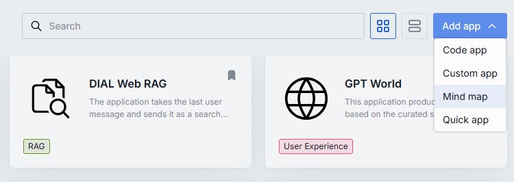
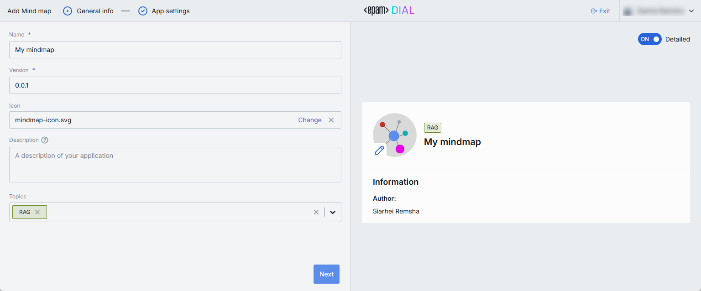
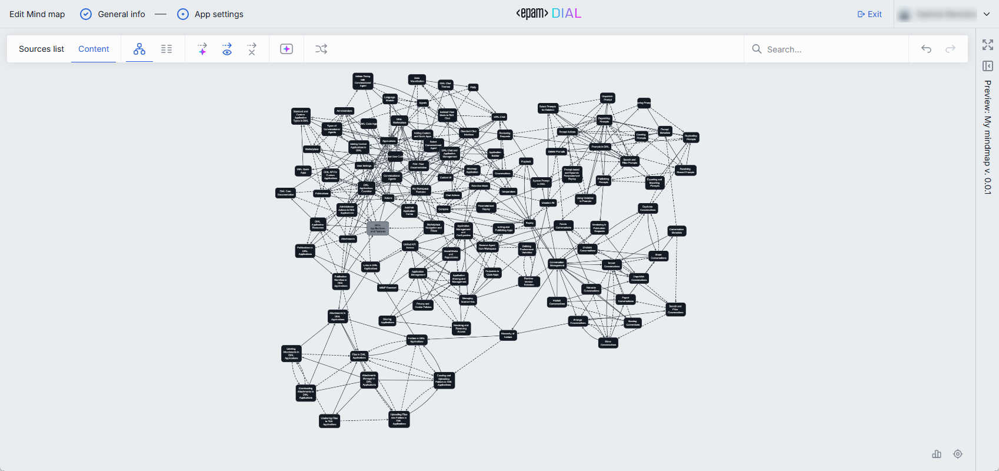

# Mind Map Studio User Guide

DIAL Mind Map Studio enables DIAL Chat users to create interactive and fully custom knowledge graphs from the provided sources. Knowledge graphs are visual representations of information that illustrate relationships between different concepts, ideas, or data points. They consist of nodes (representing entities or concepts) and edges (representing relationships between nodes). It is a great way to organize and present complex information in an intuitive and engaging format, that allows to quickly grasp complex concepts and navigate through interconnected ideas.

> * [DIALX website home page](https://dialx.ai/) is build using DIAL Mind Map Studio. It is a great tool to learn more about DIAL in an interactive and engaging manner.
> * Refer to [video demo](/docs/video%20demos/2.Applications/mindmap-studio.md) to see demos of the DIAL Mind Map Studio. 
> * Refer to [video demo](/docs/video%20demos/2.Applications/mindmap-lotr.md) of the knowledge graph created for the LOTR cinematic universe created using the DIAL Mind Map Studio.

## To Create a Mind Map

1. In [My workspace](/docs/tutorials/0.user-guide.md#my-workspace), click **Add app** and select **Mind Map** to launch the Mind Map Studio.
2. Follow the Mind Map Studio to configure your solution.
3. You can test your solution in the preview screen.
4. When ready, click **Save and exit** to register the application in DIAL.

## General Info

Once you launch the Mind Map Studio, on the first screen you can enter general information such as name and version of your application, as well as a custom icon with a short description to be rendered on UI.

## App Settings

Having populated the General Info, click **Next** to proceed with App settings.

The App Settings screen includes several sections where you can generate graph, work with data sources, edit knowledge graph content and customize its appearance.

### Sources

To generate a knowledge graph, you need to provide sources of information for it. DIAL Mind Map studio can generate knowledge graphs based on Web URLs, PDF files or a combination of them.

Knowledge graphs created with DIAL Mind Map Studio offer a fully deterministic way of information discovery entirely based on the provided sources. The knowledge graph itself and the chat-bot will avoid providing information that is not a part of the provided sources. 

In the **Sources** section, you can add sources to generate a new graph, edit, add or remove existing sources, and regenerate the graph from scratch with updated sources if needed.

### Content

Once the graph is generated, you can preview it and work with its content in the **Content** section. 

In this section, you can preview and test the graph, use toolbar to work with nodes and connections between them in both graph and table view modes.

### Customize

DIAL Mind Map Studio provides a comprehensive set of customization options for creating knowledge graphs that meet custom visualization requirements.

In the **Customize** section, you can access a collection of customization and styling options for the knowledge graph and the chat-bot. You can edit styles using both the UI form and the JSON editor. You can also import and export your custom pre-built themes.

As you experiment with styles, you can preview changes in real time on the Preview screen.

