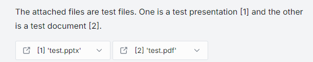

# Custom Content in Chat

## Introduction

DIAL [Completions API](https://epam-rail.com/dial_api#/paths/~1openai~1deployments~1%7BDeployment%20Name%7D~1chat~1completions/post) is based on OpenAI Azure API and was extended to support working with advanced AI DIAL assistants and applications (you can use [DIAL SDK](https://github.com/epam/ai-dial-sdk) to create those). Applications can implement a specific logic and require rendering special elements in the AI DIAL Chat UI. This is achieved by using `custom_content` in the body of request or response.

`custom_content` can include:

- [Attachments](#attachments)
- [Stages](#stages)
- [Markdown](#markdown)
- [Visualizers](#visualizers)
- [Plotly](#plotly)

## Attachments

**Definition**: by an attachment we understand a specific content (according to [MIME standard](https://developer.mozilla.org/en-US/docs/Web/HTTP/Basics_of_HTTP/MIME_types/Common_types)) that can be included by a user in the request to an application or by the application in the response. Such attachments can be rendered in the chat UI, where they can be viewed or downloaded. Attachments can also we shared among a specific audience. AI DIAL supports several types of attachments: files (text and images), links and folders. Attachments can be both URL and base64-encoded strings.

`type`- according to [MIME standard](https://developer.mozilla.org/en-US/docs/Web/HTTP/Basics_of_HTTP/MIME_types/Common_types):

* text/markdown
* image/png

> To learn how chat users can use attachments with their requests to applications and models, refer to [User Guide](/user-guide#attachments).

In this section, we will describe how attachments can be used by applications in their responses and rendered in the AI DIAL Chat UI.

To render an attachment in the response from the application, include `attachments` object the in `custom_content`. Refer to the [Completions API](https://epam-rail.com/dial_api#/paths/~1openai~1deployments~1%7BDeployment%20Name%7D~1chat~1completions/post) to view the complete list of fields and descriptions.

```json
  "messages": [
    {
      "custom_content": {
        "attachments": [
          { ... }
        ]
      }
    }
  ]
```

### Document

Applications can be made to return documents in the response. AI DIAL supports the following document formats: PDF, DOC/DOCX, PPT/PPTX, TXT and other plain text formats such as code files. 

For example, [DIAL RAG](../video%20demos/demos/dial-web-rag) application allows users to attach files to their requests. Such files are placed in a dedicated bucket of a user which can be made accessible for specific applications. Then, the application generates the response considering the attached files and outputs them together with the response. 

To attach a document in the response of your application, follow the example below:

```json
  "messages": [
    {
      "custom_content": {
        "attachments": [
          {
            "index": 0,
            "type": "text/markdown",
            "title": "Document title",
            "data": "Information in the markdown format.",
            "reference_url": "files/user_bucket/attached_document"
          }
        ]
      }
    }
  ]
```


This will render an attachment (similar to the below illustration) with a document in the response in AI DIAL Chat UI:




### Image

AI DIAL Chat natively supports images. Supported [MIME types](https://developer.mozilla.org/en-US/docs/Web/HTTP/Basics_of_HTTP/MIME_types/Common_types):

```java
const imageTypes: Set<ImageMIMEType> = new Set<ImageMIMEType>([
  'image/jpeg',
  'image/png',
  'image/gif',
  'image/apng',
  'image/webp',
  'image/avif',
  'image/svg+xml',
  'image/bmp',
  'image/vnd.microsoft.icon',
  'image/x-icon',
]);
```

For example, [DIAL ChatHub](../video%20demos/demos/dial-chathub) application includes agents that can generate images return them attached to the response. Such images are then stored in the dedicated bucket of the application and is accessible to authorized users.

To attach an image in the response of your application, follow the example below::

```json
  "messages": [
    {
      "custom_content": {
        "attachments": [
          {
            "index": 1,
            "type": "image/png",
            "title": "Image",
            "url": "files/file_bucket/appdata/model_name/images/your_image.png"
          }
        ]
      }
    }
  ]
```

This will render at attachment with an image in the response in AI DIAL Chat UI:


### URL

Applications can be made to return a URL in the response. For example, [DIAL Web RAG](../video%20demos/demos/dial-web-rag) application takes the user's message and sends it as a search query to Bing Search. The search results are then passed to the DIAL RAG application and rendered in AI DIAL Chat UI as attachments.

To attach a URL in the response of your application, follow the example below:

```json
  "messages": [
    {
      "custom_content": {
        "attachments": [
          {
            "index": 0,
            "type": "text/markdown",
            "title": "URL",
            "data": "Information in the markdown format.",
            "reference_url": "Your attached URL"
          }
        ]
      }
    }
  ]
```

This will render an attachment (similar to the below illustration) with a URL in the response in AI DIAL Chat UI:


### Folder

To attach a folder in the response of your application, follow the example below::

```json
  "messages": [
    {
      "custom_content": {
        "attachments": [
          {
            "index": 1,
            "type": "application/vnd.dial.metadata+json",
            "title": "Folder_name",
            "url": "files/file_bucket/appdata/model_name/folder_name/"
          }
        ]
      }
    }
  ]
```

This will render at attachment with an image in the response in AI DIAL Chat UI:

**Image coming soon**

## Stages

Stages are intermediate steps an AI DIAL assistant or application went through to generate the response. An application can include logic to return and render stages in the AI DIAL Chat UI. Stages can include attachments - see the example further in this section.

To attach stages in the response of your application, follow the example below:

```json
  "messages": [
      "custom_content": {
        "stages": [
          {
            "index": 0,
            "name": "Access document 'my_test_folder/test.docx' [0.01s]",
            "status": "completed"
          },
          {
            "index": 1,
            "name": "Load indexes for 'my_test_folder/test.docx' [0.00s]",
            "status": "completed",
            "content": "Number of chunks: 1\n\nTotal text size: 23 bytes\n\n"
          },
          {
            "index": 2,
            "name": "All documents [0.00s]",
            "status": "completed",
            "attachments": [
              {
                "index": 0,
                "type": "text/markdown",
                "title": "[0] 'my_test_folder/test.docx'",
                "data": "This is a test document",
                "reference_url": "files/8kYT43q2Qt8ANLzV17Xq12128AFcKWpUkK7xoFPKXAB2dL1ztpMssPDBEEwLdvG3Rs/my_test_folder/test.docx"
              }
            ]
          }
        ]
    }
]
```

Following the above pattern, you can render three stages on UI:


## Markdown

AI DIAL Chat natively supports markdown. You can create a message using a standard markdown notation:

```json
  "messages": [
    {
      "role": "user",
      "content": "[link](api/files/7MTJHKbiS2d3pcHhKeCe66nepchPcDPuYYzMNQ9NasXbUjt8FMVGNzUV8Kt4iDz1vo/Avengers-11.jpg)\n\n\n\n| Month    | Savings |\n| -------- | ------- |\n| January  | $250    |\n| February | $80     |\n| March    | $420    |\n\n",
      "templateMapping": {},
      "model": { "id": "mirror" },
      "settings": {
        "prompt": "",
        "temperature": 1,
        "selectedAddons": [],
        "assistantModelId": "gpt-4"
      }
    }
  ]
```

To get a chat response like this: 


## Visualizers

Special applications to render a specific type of content.

## Plotly

AI DIAL natively supports Plotly for visualizations of specific types of content.

'application/vnd.plotly.v1+json' - MIME type for plotly response