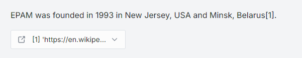
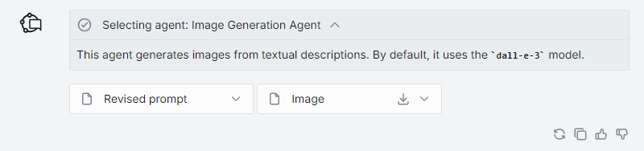
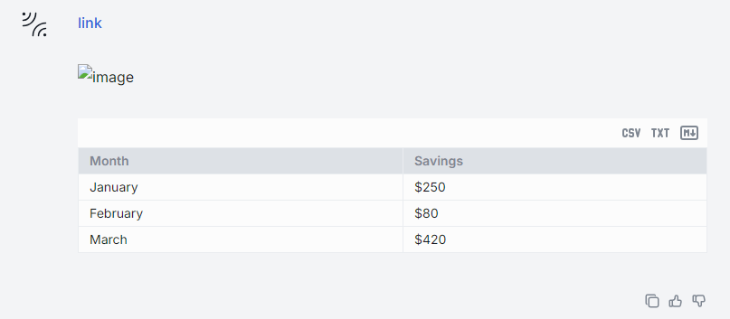

# Rendering Objects in Chat UI

## Introduction

You can use [AI DIAL SDK](https://github.com/epam/ai-dial-sdk) to develop custom applications that implement specific logic. Such applications can use a [Completions API](https://epam-rail.com/dial_api#/paths/~1openai~1deployments~1%7BDeployment%20Name%7D~1chat~1completions/post) which is based on OpenAI Azure API and was extended to include `custom_content` to support working with advanced AI DIAL Assistants and Applications.

`custom_content` can include:

- Attachments(text, image, URL, folder). Attachments can be both , url, base64-encoded strings.
- Images (types)
- Stages - the intermediate steps the assistant or application went through to generate the response.
- Custom visualizers
- Markdown
- Plotly visualizations.

## Attachments

To render an attachment in the response, include `attachments` object the in `custom_content`:

```json
  "messages": [
    {
      "custom_content": {
        "attachments": [
          {
            "index": 0,
            "type": "text/markdown",
            "title": "URL",
            "reference_url": "Your attached URL"
          }
        ]
      }
    }
  ]
```

This will render at attachment with a URL in the response in AI DIAL Chat UI:



## Images

AI DIAL Chat natively supports images. 

Supported image types ( Should be one of the [MIME types](https://developer.mozilla.org/en-US/docs/Web/HTTP/Basics_of_HTTP/MIME_types/Common_types))

```java
const imageTypes: Set<ImageMIMEType> = new Set<ImageMIMEType>([
  'image/jpeg',
  'image/png',
  'image/gif',
  'image/apng',
  'image/webp',
  'image/avif',
  'image/svg+xml',
  'image/bmp',
  'image/vnd.microsoft.icon',
  'image/x-icon',
]);
```

If your AI DIAL application can work with models that can process images, return the following in the response to render an attachment with an image:

```json
  "messages": [
    {
      "custom_content": {
        "attachments": [
          {
            "index": 1,
            "type": "image/png",
            "title": "Image",
            "url": "files/file_bucket/appdata/model_name/images/your_image.png"
          }
        ]
      }
    }
  ]
```

This will render at attachment with an image in the response in AI DIAL Chat UI:



## Markdown

AI DIAL CHat natively supports markdown. You can create a message using a standard markdown notation:

```json
  "messages": [
    {
      "role": "user",
      "content": "[link](api/files/7MTJHKbiS2d3pcHhKeCe66nepchPcDPuYYzMNQ9NasXbUjt8FMVGNzUV8Kt4iDz1vo/Avengers-11.jpg)\n\n\n\n| Month    | Savings |\n| -------- | ------- |\n| January  | $250    |\n| February | $80     |\n| March    | $420    |\n\n",
      "templateMapping": {},
      "model": { "id": "mirror" },
      "settings": {
        "prompt": "",
        "temperature": 1,
        "selectedAddons": [],
        "assistantModelId": "gpt-4"
      }
    }
  ]
```

To get a chat response like this: 

