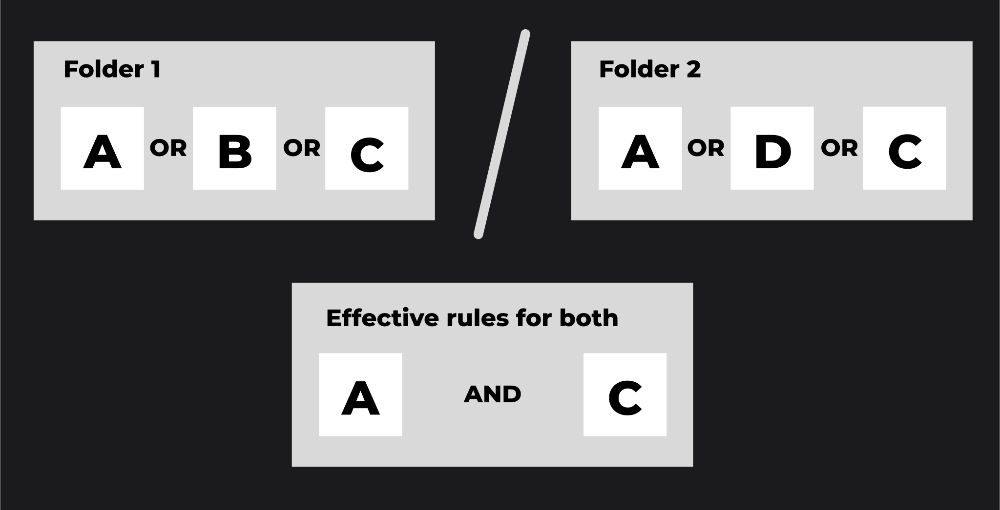

# Publications

You can publish/unpublish conversations, prompts (or even a collection of those) and applications, making them accessible within your organization. Additionally, you can manage access to the published [resources](../../architecture#resources), ensuring that the right information is accessible to the right individuals or teams.

## DIAL API

Refer to [AI DIAL API](https://epam-rail.com/dial_api#tag/Publications) to view publications endpoints.

### User Flow

You can publish resources such as conversations, prompts, files or applications by calling [/v1/ops/publication/create](https://epam-rail.com/dial_api#tag/Publications/paths/~1v1~1ops~1publication~1create/post) to create a publication request. You can also create a mixed publication request, in which you can pass various resources in the request body with different action types. For example, you can pass a collection of new prompts with action type `ADD` and another collection of prompts with action type `DELETE`. This way you can **publish** one set of prompts and **unpublish** the other. Similarly, you can handle other [resource types](../../architecture#resources). 

In the response, you get an object with the `PENDING` status, which is awaiting the action from the admin: approve or reject. While your request is pending, you can delete it by calling [/v1/ops/publication/delete](#) endpoint.

### Admin Flow

As an administrator, you can get a list of publication requests awaiting your decision by calling [/v1/ops/publication/list ](https://epam-rail.com/dial_api#tag/Publications/paths/~1v1~1ops~1publication~1list/post) endpoint. Further, you can call [/v1/ops/publication/get](https://epam-rail.com/dial_api#tag/Publications/paths/~1v1~1ops~1publication~1delete/post) endpoint to get a specific publication request and then execute [/v1/ops/publication/approve](https://epam-rail.com/dial_api#tag/Publications/paths/~1v1~1ops~1publication~1approve/post) or [/v1/ops/publication/reject](https://epam-rail.com/dial_api#tag/Publications/paths/~1v1~1ops~1publication~1reject/post) to change its status.

### Working with Rules

Use rules in publication requests to define or change access rules for specific folder(s). **Note**, that all resources (conversations, prompts, files, applications) placed in the root folder are always accessible to everyone. To apply access rules, it is necessary to create folders and apply rules to them.

You can call [/v1/ops/publication/rules/list](https://epam-rail.com/dial_api#tag/Publications/paths/~1v1~1ops~1publication~1rules~1list/post) endpoint to get a list of all rules for the provided path (folder sequence). Then, call a [/v1/ops/publication/create](https://epam-rail.com/dial_api#tag/Publications/paths/~1v1~1ops~1publication~1create/post) endpoint providing a path to a desired folder (`targetFolder`in the request body) and a list of rules to be changed. For instance, if you create a request with `"targetFolder":"public/folder1/folder2/"`, it will only overwrite the rules for `folder2`, while the rules for `folder1` will stay unchanged.

You can create a [/v1/ops/publication/create](https://epam-rail.com/dial_api#tag/Publications/paths/~1v1~1ops~1publication~1create/post) request without the `rules` object to left the rules intact.

The effective access rules for a folder structure can be described as follows:

1. Within a single folder, the effective access rule is determined by the logical OR operation applied to all the access rules assigned to that folder. For example, in folder A with access rules a, b, and c, the effective rule is "a OR b OR c".
2. Between nested folders, the effective access rule is determined by the logical AND operation applied between the effective rules of the parent folder and its subfolder. For example, if folder B with access rules d, e, and f is nested under folder A, the effective rule for accessing folder B is "(a OR b OR c) AND (d OR e OR f)".



## DIAL Chat

Refer to [user guide](../../user-guide#flow) to learn how chat users can use publications for conversations, prompts and applications.

To enable the publication feature in AI DIAL Chat:

### Step 1: Users

Create user hierarchy (including claims) in your identity service provider (IDP) and configure AI DIAL to work with it. Refer to [Web Auth](../../Auth/Web/overview) to view the supported IDPs and configuration guidelines.

### Step 2: AI DIAL Core

Configure AI DIAL Core to pass claims from your IDP with the corresponding rules for users. Refer to [configuration](https://github.com/epam/ai-dial-core) to view the description of parameters.

You can create your own rules according to access policies in your organization. 

The following is the default configuration. In it, for admins, the value `admin` in the claim `roles` must be present. 

```json
"access": {
  "admin": {
    "rules": [
      {
        "function": "CONTAIN",
        "source": "roles",
        "targets": ["admin"]
      }
    ]
  }
}
```

### Step 3: AI DIAL Chat

Configure AI DIAL Chat by including `ConversationsPublishing` and `PromptsPublishing` in the `ENABLED_FEATURES` variable. Refer to [configuration](https://github.com/epam/ai-dial-chat/blob/development/apps/chat/README.md) to view the description of parameters and [examples](https://github.com/epam/ai-dial-chat/blob/development/libs/shared/src/types/features.ts).
