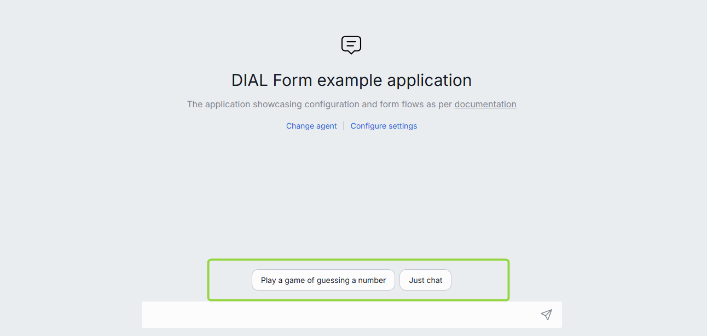

# Custom Buttons in Apps

## Introduction

AI DIAL applications can include logic that requires rendering of additional controls (buttons) on the AI DIAL Chat UI to facilitate a specific interactive experience for chat users during conversations.



## Types of Buttons

AI DIAL supports several standard types of buttons. Applications can use any or all of them at the same time. These types are defined based on the behavior they enable.

* **Starter**: initiates a conversation with the selected agent according to the specific scenario.
* **Populate**: provides users with recommended responses or prompts. When pressed, the predefined text message is populated in the chat box.
* **Action**: fixed-choice buttons to enable a structured conversation flow, crucial in a particular application logic e.g. customer support chat bot. When pressed, the application prompts the user to take a specific action.
* **Checkbox**: this type of button allows users to select between multiple options e.g. choosing datasets or preferences within the chat.

## How to Enable Buttons

AI DIAL applications use [JSON Schema](https://json-schema.org/) to define custom buttons to be rendered by AI DIAL Chat on UI. A JSON schema describing the buttons must follow the [JSON meta-schema](/metaschema.json) that defines DIAL buttons.

To enable AI DIAL Chat to render custom buttons on UI, an application must provide a specific JSON in the response to the chat completion/configuration request from AI DIAL Chat. Refer to [Buttons Workflow](#buttons-workflow) for details. 

Such JSON must include parameters associated with buttons: 

* `chatMessageInputDisabled`: a Boolean flag that determines whether the chat box is enabled or disabled for user’s text input.
* `definitions`: additional definitions:
    - An Object defining the Enumeration options for the checkbox button:
        - `enumNames`: a list of names that will be rendered on UI.
        - `enum`: enumeration values.
* [`properties`](https://json-schema.org/understanding-json-schema/reference/object#properties): an Object with the properties of buttons in the `key:value` format, where the key is the name of a button, and the value is the schema with the parameters:
    - Button name:
        - `type`: must be a [Number](https://json-schema.org/understanding-json-schema/reference/numeric#number) to render a button and an [Array](https://json-schema.org/understanding-json-schema/reference/array) to render checkboxes.
        - `title`: a String with the title of a button to be rendered on UI. Provided for checkboxes.
        - `description`: a String with the description of a button.
        - `items`: the reference to definitions in schema. Provided for the definition of checkboxes.
        - [`uniqueItems`](https://json-schema.org/understanding-json-schema/reference/array#uniqueItems): a Boolean flag indicating whether items in an array are unique. Used with checkboxes.
        - `dial:widget`: a reference to a custom widget that will render the button property. Available options: buttons. Do not include for checkboxes.
        - `oneOf`: an Array of JSON schemas of buttons. Must be defined if `"dial:widget": "buttons"`.
            - [`const`](https://json-schema.org/understanding-json-schema/reference/const#constant-values): a keyword assigning a constant value for a button.
            - `title`: a String with the title of a button to be rendered on UI.
            - `dial:widgetOptions`: additional options of a button:
                - `confirmationMessage`: a String with the text to be rendered in the confirmation window invoke upon pressing the button.
                - `populateText`: a String with the text to be populated in the chat box after pressing the button.
                - `submit`: a Boolean flag that determines whether the form is to be submitted after pressing the button.
* `required`: an Array of required button properties.

Following are examples of JSON schemas for specific types of buttons.

### Populate Button

This is the example of a JSON schema for a **Populate** button: 

```json
{
  "type": "object",
  "properties": {
    "conversation_starter_button": {
      "description": "Conversation starters",
      "type": "number",
      "dial:widget": "buttons",
      "oneOf": [
        {
          "const": 1,
          "title": "Introduce yourself",
          "dial:widgetOptions": { "populateText": "Who are you?" }
        },
        {
          "const": 2,
          "title": "Your capabilities",
          "dial:widgetOptions": { "populateText": "What can you do?" }
        }
      ]
    }
  }
}
```

In this example:

* Two populate buttons will be rendered: "Introduce yourself" and "Your capabilities". 
* Chat box is enabled for editing by the user because `"chatMessageInputDisabled"` property is not defined.
* Chat text box will be populated with "Introduce yourself" or "Your capabilities", after pressing a corresponding button. Note, that to populate the chat box with some text after pressing the button you should explicitly set the `"populateText"` value with the desired text.
* Depending on the button pressed, the DIAL Chat creates the JSON value corresponding to the JSON schema: `{ "conversation_starter_button": 1 }` and sends it attached to a chat completion request.

### Action Button

This is the example of a JSON schema for an **Action** button: 

```json
{
  "type": "object",
  "dial:chatMessageInputDisabled": true,
  "properties": {
    "agreement_button": {
      "description": "Indicate user agreement with the privacy policy",
      "type": "number",
      "dial:widget": "buttons",
      "oneOf": [
        {
          "const": 1,
          "title": "Agree",
          "dial:widgetOptions": {
            "confirmationMessage": "Are you sure you agree with the privacy policy?", 
            "submit": true
          }
        },
        {
          "const": 2,
          "title": "Decline",
          "dial:widgetOptions": {
            "confirmationMessage": "Are you sure you decline the privacy policy?", 
            "submit": true
          }
        }
      ]
    }
  }
}
```

In this example:

* Chat UI will render two action buttons: Agree and Decline. 
* The chat box is disabled for editing by the user because `"chatMessageInputDisabled"` property is set to `false`. 
* When the button is pressed, the confirmation window is displayed with the message from the `confirmationMessage` property value of a corresponding button.
* The form is immediately submitted after pressing the button in the confirmation window.

### Checkbox Button

This is the example of a JSON schema for a **Checkbox** button. In this example, the user is presented with a choice between two buttons defined as `enumNames`: "RAG" or "Web search". No more than one could be pressed.

```json
{
  "type": "object",
  "definitions": {
    "datasourcesEnum": {
      "enumNames": ["RAG", "Web search"],
      "enum": ["rag", "web_search"]
    }
  },
  "properties": {
    "datasources": {
      "description": "Additional datasources for chat completion request",
      "title": "Additional datasources",
      "type": "array",
      "uniqueItems": true,
      "items": {
        "$ref": "#/definitions/datasourcesEnum"
      }
    }
  }
}
```

## Buttons Workflow

Only options explicitly defined in `dial:widgetOptions` are executed. If any of them is not defined (for example `"populateText"` is not defined), then this option is omitted:

* To insert text into the chat box upon pressing the button, set the `"populateText"` option with the desired text. 
* To invoke a confirmation prompt upon pressing the button, set the `"confirmationMessage"` option to the necessary text. 
* To enable submission of the form upon pressing the button, explicitly set the `"submit"` option to `true`. 

If `dial:widgetOptions` are not specified and the user interacts with the buttons, the form property values will be populated, but no additional actions will be taken.

##### This is a typical workflow:

1.	AI DIAL Chat receives a JSON form from the application with the response to a chat completion or configuration request. This JSON schema describing the form is passed in the `choices[*].message.custom_content.form_schema` field value. 
2.	When a user interacts with buttons and the chat, the AI DIAL Chat sends a chat completion request to the application with the filled form schema matching the JSON schema by appending it to the `custom_content.form_value` field of the user message. For example, if the user selects the button with the text "Introduce yourself" in the example with the [Populate button](#populate-button), the `form_value` in the chat completion request will be  populated with `{ "conversation_starter_button": 1 }`. In case of a checkbox, if the user selects "RAG" in the example with the [Checkbox button](#checkbox-button), the `form_value` will be populated with: `"datasources ": ["rag"]`.

If the user chooses not to use buttons and instead just to send a message in the chat box, there are two available options:

* If all fields in the form are optional, the chat completion request will not include `form_value` with the JSON form .
* If any of the fields in the form is indicated as required, the user will be prompted to take action before submitting messages in chat.
