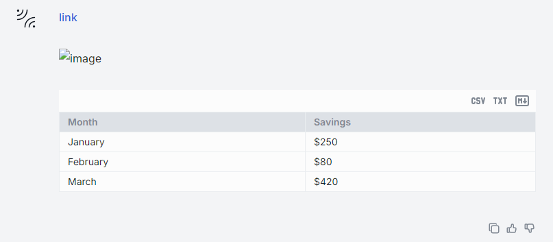

# Data Visualization

## Introduction

AI DIAL Chat has the capability to render different types of content within a conversation. For example, it has built-in support for Markdown. If the response message from the application includes content in Markdown notation, it will automatically render it in the body of the conversation.



AI DIAL Chat has also a built-in support for Plotly data visualization libraries: 

* [Plotly JavaScript Open Source Graphing Library](https://plotly.com/javascript/)
* [React Plotly.js in JavaScript](https://plotly.com/javascript/react/)


You can use the [DIAL SDK](https://github.com/epam/ai-dial-sdk) to create custom applications that may need to render different types of content in the body of their response in the chat UI.

This can include attachments with documents and images, stages, and other types of data compatible with the [MIME standard](https://developer.mozilla.org/en-US/docs/Web/HTTP/Basics_of_HTTP/MIME_types/Common_types). Refer to the Custom Content section to learn more.

Watch a [demo video](../video%20demos/demos/animated-scatterplot) to see how statistical data can be visualized in AI DIAL Chat using a Plotly animated scatterplot, or view a demo video of the [Omics AI Assistant](../video%20demos/demos/dial-omics-assistant) to see how protein structures can be visualized with Plotly.

## Visualizers

We call Visualizers special applications that are used for rendering a specific type of content in AI DIAL Chat UI. You can use [DIAL Chat Visualizer Connector](https://github.com/epam/ai-dial-chat/blob/development/libs/chat-visualizer-connector/README.md) library to create your custom visualizers for specific types of content.

Watch a [demo video](../video%20demos/demos-for-developers/dial-data-viz) to view how a financial data can be visualized in AI DIAL Chat.

## Create Custom Visualizer

> Sources are located in the [DIAL Chat Visualizer Connector](https://github.com/epam/ai-dial-chat/blob/development/libs/chat-visualizer-connector/README.md) repository.

### AI DIAL Chat Configuration

> Refer to [Configuration](https://github.com/epam/ai-dial-chat/blob/development/apps/chat/README.md) to view all parameters and their description.

Configure AI DIAL Chat to enable visualizers:

- `ALLOWED_IFRAME_SOURCES` - a list of allowed iframe sources in `<source> <source>` format. For security reasons, your AI DIAL Chat application should configure the sources where your custom visualizers will be hosted. **Note**: For development purposes, you can set `*`.

    ```
    ALLOWED_IFRAME_SOURCES=http://localhost:8000
    ```

- `CUSTOM_VISUALIZERS` - a list of the objects with custom visualizers properties. This properties are : `{ title, description, icon, contentType, url }`.

    ```typescript
    interface CustomVisualizer {
    title: string;
    description: string;
    icon: string;
    contentType: string;
    url: string;
    }
    ```

    ```json
    //AI DIAL Chat configuration example
    CUSTOM_VISUALIZERS=[
                        {
                        "title":"CUSTOM_VISUALIZER", // Visualizer title
                        "description": "CUSTOM VISUALIZER to render images", // Short description for the Visualizer
                        "icon":"data:image/svg+xml;base64,some-base64-image", // Icon for the Visualizer
                        "contentType":"image/png,image/jpg", // List of MIME types that Visualizer could render separated by ","
                        "url":"http://localhost:8000" // Visualizer host
                        },
                        {
                        //Other Visualizer
                        }

                    ]

    ```
- `ALLOW_VISUALIZER_SEND_MESSAGES` - is a flag that allows or disables the addition of custom buttons or input fields. This enables a custom visualizer to send `SEND_MESSAGE` events on behalf of a user in the form of messages within a conversation.

### Main Concepts

`ChatVisualizerConnector` class provides all the necessary methods for a visualizer (rendered in the iframe) to interact with AI DIAL Chat (receive data to visualize).

A model or application should send data in **Json**-like format which should include a `CustomVisualizerDataLayout` object with `width` and `height` properties. All other properties could be set to anything you need for your visualizer:

```typescript
export interface CustomVisualizerDataLayout {
  width: number;
  height: number;
}

export interface CustomVisualizerData {
  layout: CustomVisualizerDataLayout;
}
```

### Create Visualizer

1. Install the `ai-dial-chat-visualizer-connector` library:

    ```bash
    npm i @epam/ai-dial-chat-visualizer-connector
    ```

2. Add a file to the serving folder in your application, or simply import it in the code:

    ```typescript
    import { AttachmentData, ChatVisualizerConnector, CustomVisualizerDataLayout } from '@epam/ai-dial-chat-visualizer-connector';
    ```
 
    * `ChatVisualizerConnector` - this class provides methods for the visualizer (rendered in the iframe) to interact with AI DIAL Chat (receive data to visualize). It requires the following arguments:

        ```typescript
        /**
         * Params for a ChatVisualizerConnector
        * @param dialHost {string} DIAL CHAT host
        * @param appName {string} name of the Visualizer same as in config
        * @param dataCallback {(visualizerData: AttachmentData) => void} callback to get data that will be used in the Visualizer
        */

        //instance example
        new ChatVisualizerConnector(dialHost, appName, setData);
        ```

    * `AttachmentData` - an interface for the payload you will get from AI DIAL Chat:

        ```typescript
        export interface AttachmentData {
        mimeType: string;
        visualizerData: CustomVisualizerData;
        }
        ```

    * `CustomVisualizerDataLayout` - an interface for the layout you will get from AI DIAL Chat. `width` and `height` properties are required for a proper rendering in the AI DIAL Chat UI:

        ```typescript
        export interface CustomVisualizerDataLayout {
        width: number;
        height: number;
        }
        ```

3. Set `dialHost` to the AI DIAL Chat host you want to connect with:

    ```typescript
    const dialHost = 'https://hosted-dial-chat-domain.com';
    ```

4. Set `appName` to match the value of `title` in the AI DIAL Chat configuration in the `CUSTOM_VISUALIZERS` environmental variable:

    ```typescript
    const appName = 'CUSTOM_VISUALIZER';
    ```

5. Create an instance of `ChatVisualizerConnector` in your code:

    ```typescript
    //Here you store your data which you get from the DIAL CHAT
    const [data, setData] = useState<AttachmentData>();

    const chatVisualizerConnector = useRef<ChatVisualizerConnector | null>(null);

    useEffect(() => {
    if (!chatVisualizerConnector.current && dialHost && appName) {
        chatVisualizerConnector.current = new ChatVisualizerConnector(dialHost, appName, setData);

        return () => {
        chatVisualizerConnector.current?.destroy();
        chatVisualizerConnector.current = null;
        };
    }
    }, [appName, dialHost]);
    ```

6. Send a `READY` event via `sendReady()` to AI DIAL Chat to inform that your visualizer is ready (this action will hide the loader). Then, you could do some preparation (login, etc.) and, after that, send `READY TO INTERACT` event via `sendReadyToInteract()` to inform AI DIAL Chat that the visualizer is ready to receive data:

    ```typescript
    useEffect(() => {
    if (appName && dialHost) {
        chatVisualizerConnector.current?.sendReady();
        //Make some actions if needed
        chatVisualizerConnector.current?.sendReadyToInteract();
    }
    }, [dialHost, appName]);
    ```

7. Make needed type assertion for the data from AI DIAL Chat. **Note**: Data send by model/application from DIAL CHAT should be the same type as you expect.

    ```typescript
    //layout should include width and height properties
    interface YourVisualizerLayout extends CustomVisualizerDataLayout {
    //any other layout properties expected from the model/application output
    }
    data.visualizerData as { dataToRender: string; layout: YourVisualizerLayout };
    ```

8. Render data in your visualizer:

    ```tsx
    <div>{typedVisualizerData.dataToRender}</div>
    ```

### Example

#### Module.tsx

```typescript

import { AttachmentData, ChatVisualizerConnector, CustomVisualizerDataLayout } from '@epam/ai-dial-chat-visualizer-connector';


export const Module: FC = () => {
  const [data, setData] = useState<AttachmentData>();

  const chatVisualizerConnector = useRef<ChatVisualizerConnector | null>(
    null
  );

  //DIAL CHAT host
  const dialHost = 'https://hosted-dial-chat-domain.com';

  //Visualizer title. Should be same as in the DIAL CHAT configuration in CUSTOM_VISUALIZERS
  const appName = 'CUSTOM_VISUALIZER';

  useEffect(() => {
    if (!chatVisualizerConnector.current && dialHost && appName) {
      chatVisualizerConnector.current = new ChatVisualizerConnector(
        dialHost,
        appName,
        setData
      );

      return () => {
        chatVisualizerConnector.current?.destroy();
        chatVisualizerConnector.current = null;
      };
    }
  }, [appName, dialHost]);

  useEffect(() => {
    if (appName && dialHost) {
      chatVisualizerConnector.current?.sendReady();
      chatVisualizerConnector.current?.sendReadyToInteract();
    }
  }, [dialHost, appName]);

  const typedVisualizerData = useMemo(() => {
    return (
      data?.visualizerData && (data.visualizerData as unknown as { dataToRender: string; layout: YourVisualizerLayout })
    );
  }, [data?.visualizerData]);

  return (
    <div>
      {!!typedVisualizerData?.dataToRender && (
          <div>
            {typedVisualizerData.dataToRender}
          </div>
      )}
    </div>
  );
};

```

#### index.ts

```typescript
//...other imports
import { Module } from "./Module.tsx";

const root = createRoot(document.getElementById("root"));
root.render(<Module />);

```

