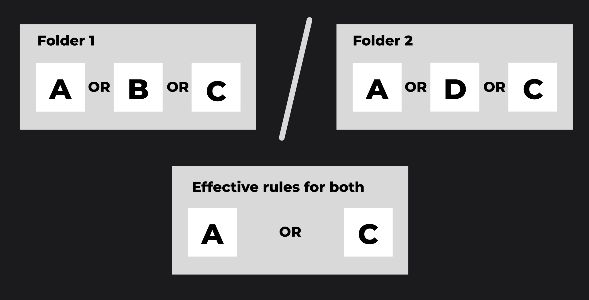

# Publications

## DIAL API

Refer to [AI DIAL API](#) to view publications endpoints.

### User Flow

Users can publish resources such as conversations, prompts, files or applications by calling [/v1/ops/publication/create](#) to create a publication request. It is possible to create a mixed publication request, in which you can pass various resource in the request body with different action types. For example, you can pass a collection of new prompts with action type `ADD` and another collection of prompts with action type `DELETE`. This way you can publish one set of prompts and unpublish the other. Similarly, you can handle other resource types. 

In the response, you get an object with the `PENDING` status, which is awaiting the action from the admin: approve or reject. While your request is pending, you can delete it by calling [/v1/ops/publication/delete](#) endpoint.

### Admin Flow

As administrator, you can get a list of publication request awaiting your decision. Call [/v1/ops/publication/list ](#) endpoint to do this. Further, you can call [/v1/ops/publication/get](#) endpoint to get a specific request and then call [/v1/ops/publication/approve](#) or [/v1/ops/publication/reject](#) to change its status.

### Working with Rules

Use rules in publication requests to define or change access rules for specific folders. Note, that all resources (conversations, prompts, files, applications) placed in the root folder are always accessible to everyone. To apply access rules, it is necessary to create folders and apply rules to them.

The effective access rules for a folder structure can be described as follows:

1. Within a single folder, the effective access rule is determined by the logical OR operation applied to all the access rules assigned to that folder. For example, in folder A with access rules a, b, and c, the effective rule is "a OR b OR c".
2. Between nested folders, the effective access rule is determined by the logical AND operation applied between the effective rules of the parent folder and its subfolder. For example, if folder B with access rules d, e, and f is nested under folder A, the effective rule for accessing folder B is "(a OR b OR c) AND (d OR e OR f)".



User can call [/v1/ops/publication/rules/list](#) endpoint to get a list of all rules there are. Then, call a [/v1/ops/publication/create](#) endpoint providing a path to a desired folder and a list of rules to be changed.

User can create a [/v1/ops/publication/create](#) request without the `rules` object to left the rules intact.


## DIAL Chat

Refer to [user guide](../user-guide#flow) to learn how chat users can use publications for conversations and prompts.

To enable the publication feature in AI DIAL Chat:

### Step 1: Users

Create configurations for your users in your identity service provider (IDP) and configure AI DIAL to work with it. Refer to [Web Auth](../Auth/Web/overview) to view the supported IDPs and examples.

### Step 2: AI DIAL Core

Configure AI DIAL Core to match claims from your IDP with the corresponding rules for users. Refer to [configuration](https://github.com/epam/ai-dial-core) to view the description of parameters.

You can create your own rules according to access policies in your organization. 

The following is the default configuration. In it, for admins, the value `admin` in the claim `roles` must be present. 

```json
"access": {
  "admin": {
    "rules": [
      {
        "function": "CONTAIN",
        "source": "roles",
        "targets": ["admin"]
      }
    ]
  }
}
```

### Step 3: AI DIAL Chat

Configure AI DIAL Chat by including `ConversationsPublishing` and `PromptsPublishing` in the `ENABLED_FEATURES` variable. Refer to [configuration](https://github.com/epam/ai-dial-chat/blob/development/apps/chat/README.md) to view the description of parameters and [examples](https://github.com/epam/ai-dial-chat/blob/development/libs/shared/src/types/features.ts).
