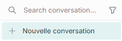

# AI DIAL Chat Localization

The AI DIAL Chat application uses [next-i18next](https://github.com/i18next/next-i18next) plugin to manage the translation of the UI elements. 

## How it works

AI DIAL Chat project has a special directory called [locales](https://github.com/epam/ai-dial-chat/tree/development/apps/chat/public/locales/). In this directory, you can create sub-folders with translations for different languages. In a sub-folder, place JSON files, each corresponding to a particular category of UI elements. 

**Important**: currently, we support only **en** folder, where you can override the text of elements of AI DIAL Chat UI. Multi-language support is on our roadmap in the near future. 

Currently we support the following category of elements: 

* `chat` - the central chat area on UI
* `promptbar` - the panel with prompts
*` sidebar` - the panel with conversations
* `settings` - conversation settings panel
* `common` - general 
* `markdown` - markdown renderer
* `header` - the application header
* `files` - files manager panel

In each file, you can provide the alternative text for particular UI elements in the format: `key:value`. Where `key` is the original text on the chat UI and `value` is the replacement text. **Note**: if the replacement is not provided, the original text applies.

**Example**:

To translate the words **New conversation** to French, in a sub-folder **/locales/en**, in the `sidebar.json` file, add the following content:

```json
{
    "New conversation": "Nouvelle conversation"
}
```

As a result, the text on UI will be replaces like this:

