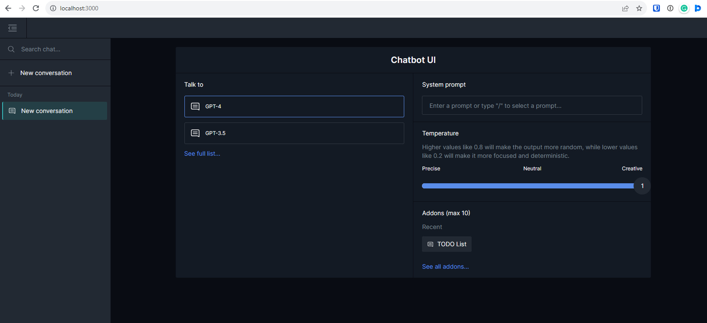

# Launch AI DIAL Chat with a Sample Addon

## Introduction

In this tutorial, you will learn how to launch AI DIAL Chat with a To-Do List Addon and an OpenAI model. As a result, you will be able to access Chat on http://localhost:3000/ and use a To-Do List Addon to create a to-do list.

## About AI DIAL Addons

Within the AI DIAL framework, an **Addon** is a service - or any component adhering to its own or provided OpenAPI specification - that empowers LLMs to access and utilize any desired data source or technology to produce their responses.

For example, one might want LLM to access specific data or technology to use for generating its answers. It can be a corporate database, collection of PDF documents, calculation engines, or any other data source or technology.

> Refer to [AI DIAL website](https://epam-rail.com/extension-framework) to view typical examples of addons.

## About AI DIAL Assistants

An Addon can be used in conjunction with a System Prompt to attain a particular behavior for the LLM, allowing for more flexibility and customization in the LLM's responses. Within the AI DIAL framework, we refer to such combinations of Addons and System Prompts as **Assistants**.
Assistants provide enhanced control over the behavior of LLMs, leading to more tailored and accurate responses that meet specific requirements.

Flexibility offered by this combination allows developers to create custom Assistants within the AI DIAL framework. These Assistants can range from simple implementations, like instructing the LLM to provide answers using a specific tone or style (e.g., like a pirate), to more complex use cases, such as limiting the LLM's data scope to a particular geographical location (e.g., providing weather forecasts for Chicago only). Overall, combining Addons and System Prompts allows for better customization and adaptability to diverse situations, resulting in more versatile AI responses.

> Refer to [AI DIAL Assistant](https://github.com/epam/ai-dial-assistant) repository for more information.

## About To-Do List Addon

In this tutorial, for example purposes, we will show how to quickly launch AI DIAL Chat with the [To-Do List Addon](https://github.com/openai/plugins-quickstart/) by OpenAI. With this addon, one can generate a list of tasks, append new entries, and fetch information about the entries saved in the list.

Following this pattern, you can develop your own addons or use a third-party ones. The only requirement is that it should be compatible with the OpenAPI specification.

## Prerequisites

1. Docker engine installed on your machine (Docker Compose Version 2.20.0 +).
    > Refer to [Docker](https://docs.docker.com/desktop/) documentation.

2. Account in MS Azure OpenAI Studio.
    > Refer to [Create and Deploy OpenAI Model in Azure](/Deployment/OpenAI%20Model%20Deployment.md) to learn how to create and deploy an OpenAI model in MS Azure.

3. Addon. In this example, it is [To-Do List](https://github.com/openai/plugins-quickstart/) by OpenAI.

## Step 1: Get AI DIAL

[Download](https://github.com/epam/ai-dial/tree/main/dial-docker-compose/addon/) AI DIAL.

## Step 2: Configuration

In **docker-compose.yaml**, you can find sections for [OpenAI Adapter](https://github.com/epam/ai-dial/tree/main/dial-docker-compose/addon/docker-compose.yml#L8) to work with an Azure model, [AI DIAL Assistant](https://github.com/epam/ai-dial/tree/main/dial-docker-compose/addon/docker-compose.yml#L13), [Addon](https://github.com/epam/ai-dial/tree/main/dial-docker-compose/addon/docker-compose.yml#L19), and [AI DIAL Core](https://github.com/epam/ai-dial/tree/main/dial-docker-compose/common.yml#L19).

> * Refer to [AI DIAL Adapter for OpenAI](https://github.com/epam/ai-dial-adapter-openai) to learn more.
> * Refer to the [AI DIAL Core](https://github.com/epam/ai-dial-core) to view a complete documentation.

In the **/addon** folder, you can find a [Dockerfile](https://github.com/epam/ai-dial/tree/main/dial-docker-compose/addon/addon/Dockerfile) we need to get and launch the To-Do List Addon.

In the **/core** folder, you can find a [config.json](https://github.com/epam/ai-dial/tree/main/dial-docker-compose/addon/core/config.json) configuration file. In this file, you can configure your model, assistant and addon.

### Configure Model

Add you model credentials in the [config.json](https://github.com/epam/ai-dial/tree/main/dial-docker-compose/addon/core/config.json#L36) file in `upstreams`.

* Supply your **Azure API Keys** for your deployments for the `key` parameter.
* Replace `http://azure_deployment_host` with your GPT **endpoint** for the `endpoint` parameter. **Note**: in the endpoint, replace `gpt-4` with your Azure deployment name, in case it is different.

  ```json
        "upstreams": [
        {
          "endpoint": "http://azure_deployment_host/openai/deployments/gpt-4/chat/completions",
          "key": "AZURE_MODEL_API_KEY"
        }
  ]
  ```

    > Refer to [Create and Deploy OpenAI Model in Azure](/Deployment/OpenAI%20Model%20Deployment.md) to learn how to create and deploy an OpenAI model in MS Azure.

### Configure Addon

> In this example, we get information about the name, description etc. from the [addon repository](https://github.com/openai/plugins-quickstart/blob/main/.well-known/ai-plugin.json).

Provide configuration for your addon in the [config file](https://github.com/epam/ai-dial/tree/main/dial-docker-compose/addon/core/config.json#L4) in the `addons` section:

```json
  "addons": {
    "addon-todo": {
      "endpoint": "http://addon:5003/.well-known/ai-plugin.json",
      "displayName": "TODO List",
      "description": "Addon that allows to manage user's TODO list."
    }
  }
```

### Configure Assistant

Provide the endpoint for AI DIAL Assistant in the [config file](https://github.com/epam/ai-dial/tree/main/dial-docker-compose/addon/core/config.json#L10) in the `assistant` section and configure the `todo-assistant` with the `addon-todo`:

```json
  "assistant": {
    "endpoint": "http://assistant:5000/openai/deployments/assistant/chat/completions",
    "assistants": {
      "todo-assistant": {
        "prompt": "You are assistant that helps to manage TODO list for the user. You can add, remove and view your TODOs.",
        "addons": [
          "addon-todo"
        ],
        "displayName": "TODO Assistant",
        "description": "The assistant that manages your TODO list. It can add, remove and view your TODOs."
      }
    }
  }
```

> * Refer to [AI DIAL Assistant](https://github.com/epam/ai-dial-assistant) repository for more information about AI DIAL Assistant.

Finally, configure roles for the addon and the TODO assistant in the [config file](https://github.com/epam/ai-dial/tree/main/dial-docker-compose/addon/core/config.json#L55) in the `roles` section:

```json
"roles": {
  "default": {
    "limits": {
      "addon-todo": {},
      "todo-assistant": {}
    }
  }
}
```

## Step 3: Launch AI DIAL Chat

1. Run the `docker compose up` command from the folder with the [docker-compose file](https://github.com/epam/ai-dial/blob/main/dial-docker-compose/addon/docker-compose.yml).
2. Open http://localhost:3000/ in your browser to launch the AI DIAL Chat application.

The AI DIAL Chat is launched with the Azure model we have configured, and the Addon is enabled with the display name you configured for the `addons.displayName` parameter in `config.json`.



Select the Addon and start a new conversation. For example, send "Add homework to the to do list" and then "Get the to do list".
