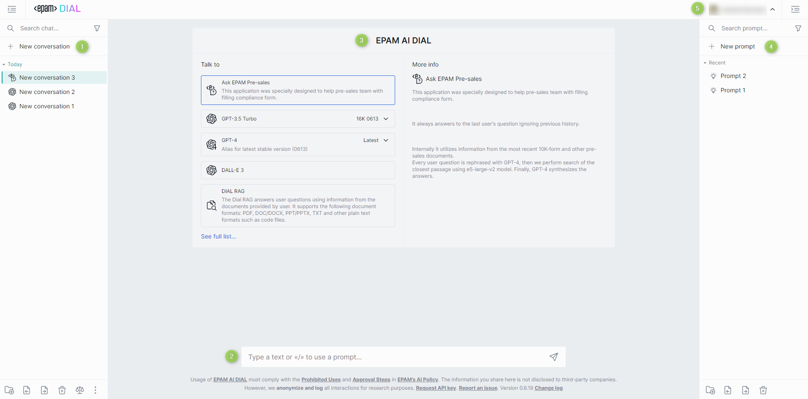
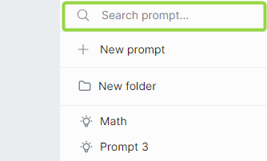
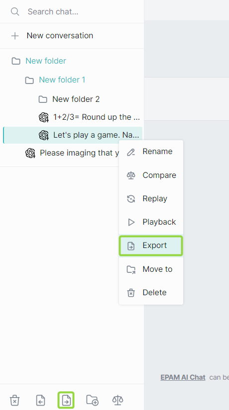

# Chat User Guide

## Interface Components

The AI DIAL Chat application interface has several sections, such as the chat box, settings, and panels for managing conversations and saved prompts.

1. **Conversations**: Here, you can manage your conversations: create new ones, organize them in folders, and delete. You can collapse and expand the panel by clicking the **Hide panel** icon above it.
2. **Chat Panel**: Use this section to enter a prompt, view results, and interact with language models.
3. **Chat Settings**: In this section, you can select the language model, assistant, application, and addons you'd like to use. You can also provide a system prompt and adjust the temperature setting.
4. **Prompt Templates**: In this section, you can work with saved prompts: create new templates, update them, and organize them in folders. You can collapse and expand the panel by clicking the **Hide panel** icon above it.
5. **Account User Settings**: In your account settings, you can customize the color theme (dark or light) as well as log in or log out.

### Chat Settings

In the Chat Settings section, there are the following components:

- Talk To
- System Prompt
- Temperature
- Addons

Take a closer look at each of these elements.

#### Talk To

In this section, you can choose the language model for communication, as well as an Assistant or Application to implement specific behavior for the LLM.

#### Language Models

**Available language models**:

- *GPT-3.5* is an advanced language model developed by OpenAI, known for its powerful natural language processing, understanding, and context awareness. Enabling human-like conversations, it can carry out various tasks, including summarizing, translation, content creation, and answering queries.
- *GPT-4* is the latest iteration of the GTP series by OpenAI, offering more powerful natural language processing capabilities than its previous versions. It harnesses extensive training and massive datasets to deliver lifelike conversations, unsurpassed context awareness, and high-quality content generation across multiple languages and domains.
- *GPT-4-32K* is the extension for GTP-4 that can possess a larger context window size (32,000 tokens). It offers several advantages, including a better understanding of context, improved performance in long-form tasks, enhanced reasoning and knowledge handling, and increased creativity in content generation. Please only use this one if you absolutely need it. It's slower and more expensive.
- *PaLM2 (Bison)* is an LLM developed by Google that leverages an innovative hierarchical architecture to enhance its linguistic competence and computational efficiency. By employing parallel and multitask learning mechanisms, PaLM2 (Bison) provides exceptional performance in diverse language tasks, like question-answering, summarization, and translation, while also being highly scalable and adaptive to new environments.
- *AI21 (Jurassic-2 Grande)* is a large-scale language model with 178 billion parameters developed by AI21 Labs. It is an upgraded version of its predecessor AI21 Jurassic-1 and is capable of processing extensive amounts of text and generating contextually appropriate replies. The model's distinguishing features include its scale, contextual understanding, multilingualism, few-shot learning, and knowledge integration with external sources. It is designed to enhance natural language processing, chatbots, virtual assistants, and other applications requiring advanced language capabilities.
- *AI21 (Jurassic-2 Jumbo)* is an expansion of the AI21 Jurassic-2 Grande model, leveraging improved training techniques, larger datasets, and advanced hardware resources. Jumbo provides a boost in performance and is specifically designed for challenging natural language applications such as sentiment analysis, language translation, and document summarization. AI21 Jurassic-2 Jumbo has 199 billion parameters, making it the largest publicly available language model to date.
- *CodeLlama-34b* is a language model developed by AI21 that has 34 billion parameters. CodeLlama-34b is specifically designed for use in software development and is trained on a diverse set of technical documentation, including programming languages, code samples, and developer forums. The model is optimized for code-related natural language queries, including code completion, code understanding, and code generation.
- *Llama2q-70B* is an LLM developed by AI21, which has 70 billion parameters. Like CodeLlama-34b, it is designed for technical applications but with a broader scope. Llama2q-70B has a wide range of capabilities, including question answering, text classification, and summarization. It is trained on a variety of sources, including technical documents, academic papers, and news articles, and is designed to provide accurate results for a wide range of technical queries and applications.
- *Anthropic (Claude)* is a large-scale LLM with 175 billion parameters that is optimized for general-purpose language tasks, including question answering, dialogue generation, and text completion. The model has been trained on data from a wide range of sources to provide high accuracy in many contexts.
- *Anthropic (Claude Instant)* is an LLM that can generate responses in real-time, making it useful for applications such as chatbots and virtual assistants. It is a smaller model than the Anthropic (Claude) model, with 9 billion parameters, and is optimized for low-latency inference.
- *Anthropic (Claude V2)* is an upgraded version of the Anthropic (Claude) model, with 400 billion parameters, making it one of the largest language models to date. This model is designed for sophisticated NLP applications involving complex reasoning, inference, and understanding of long-form text data.
- *AWS (Titan)*: AWS (Amazon Web Services) developed an LLM called Titan in 2021, which has 850 billion parameters, making it the largest publicly available language model at the time of its introduction. The model was trained on a diverse set of text sources, including web pages, books, and news articles. Titan is designed to handle complex natural language processing tasks, such as summarization, dialogue generation, and translation.

#### Assistants

In the AI DIAL framework, Assistants are a combination of preselected Addons and System Prompts that enable specific behavior in the LLM, allowing for more tailored and adaptive responses to user needs. Unlike the Model+Addon configuration, where users have the flexibility to choose different Addons, Assistants come with predetermined Addons that cannot be removed or unselected. However, the Model can still be reassigned within the Assistant.

Assistants give you more control over LLM behavior, resulting in tailored and accurate responses that match specific needs. The flexibility of this combination lets you create custom Assistants within the AI DIAL framework. These Assistants can range from simple tasks, like asking the LLM to provide answers in a specific tone or style (e.g., like a pirate), to more complex tasks, such as restricting the LLM's data to a specific geographical area (e.g., providing weather forecasts for Chicago only). Combining Addons and System Prompts enables better customization and adaptability to various situations, leading to more versatile responses.

In a chat application, you can include custom Assistant(s) that users can choose when using AI DIAL.

#### Applications   

In the AI DIAL framework, Applications are ready-to-use solutions made up of predefined configurations of Addons and other services or any custom logic. They help you customize LLM behavior by integrating Addons with any desired logic. Applications can be any component that meets API requirements and implements non-LLM-related logic, such as repeating user messages, creating a fully deterministic chatbot, or managing complex multi-LLM interactions. This versatility in Applications allows for tailored handling of unique scenarios and requirements.

#### System Prompt

The system prompt in AI DIAL refers to the initial instructions given to the model. You can use any previously created prompt as a system prompt (for details, refer to the [Create](#create) in Prompts), and it will set the context and tone for the whole conversation.

The system prompt in AI DIAL is like a compass for a traveler, pointing the model in the right direction to navigate the conversational landscape, ensuring it stays on course and aligned with the overall purpose and desired outcome. 

You can change system prompts during a conversation by selecting the **Settings** icon at the top bar of the conversation. 

#### Example of Prompt

Let’s compare a conversation with a system prompt selected and a conversation without a system prompt. For illustration purposes, we’re going to use the compare mode (refer to the [Compare](#compare) section for details) and create two conversations with identical settings except for the system prompt selection.

The prompt used as a system prompt is as follows:

> Let's play a game. Name a city that starts with the last letter of the one that I named in a previous message and then tell me that it is my turn to name a city.

| **User message** | **Language model response without a system prompt** | **Language model response with a system prompt** |
| ------------- | ------------------------------------------------ | --------------------------------------------------------- |
| Grodno | Grodno, also known as Hrodna, is a city in western Belarus, near the borders with Poland and Lithuania. It is the administrative center of Grodno region and has a population of around 365,000 people. Grodno is one of the oldest cities in Belarus, dating back to the 11th century. The city boasts a rich history and diverse architectural styles, including baroque, classicism, and modernism. | Oslo. It's your turn!|
| Osaka | Osaka is a large port city and commercial center on the Japanese island of Honshu. It's known for its modern architecture, nightlife, and hearty street food. One of Osaka's most popular tourist destinations is the bustling urban area of Dotonbori, where the city's entertainment and dining scenes come to life with numerous restaurants, bars, and shops. | Ankara. Now it's your turn to name a city! |
| Antwerp | Antwerp is a city in Belgium, and it's the country’s biggest port. It is located on the River Scheldt, linked to the North Sea by the Westerschelde estuary. Known for its many historical buildings, squares, museums, and cultural attractions, it's a popular tourist destination. | Prague. Your turn to name a city! |

#### Temperature

The temperature parameter controls the creativity and randomness of the model's output. A higher temperature (e.g., 1.0) makes the output more diverse and creative, while a lower temperature (e.g., 0.1) makes the output more focused and deterministic.

Adjusting the temperature allows you to balance creativity and consistency in the generated response.
 
#### Addons

You may want LLM to access particular data or technology to generate responses. This could be your company's database, a collection of PDF documents, calculation engines, API or any other data source or technology.
Within the AI DIAL framework, an Addon is a service or any component that follows the Open API specification. LLMs can access and use any desired data source or technology to create responses.

Some examples of Addon implementation are semantic search, Q&A search, DB query generator, or any other custom logic that meets your business needs. AI DIAL can include custom Addons that you can choose to activate a specific system behavior.

### User Settings

On the top bar, in the user area, you can click a down arrow to access additional settings or logout.

#### Theme

In user settings, you can select the chat theme: dark or light.

## Prompts

A prompt is an instruction, a question, or a message that a user provides to a language model to receive an answer. Prompts can also contain constraints or requirements. They help the model understand the task at hand and the types of responses that are expected. 
You can use prompts as templates for your messages, instructions to the model, or to encourage the model to generate specific types of content. 
In AI DIAL, you can create prompts beforehand and reuse them in one or several conversations.

Prompts can be applied to one message or a whole conversation. Refer to the [System prompt](#system-prompt) section of this guide for details.

The section with your prompts is located in the right-hand area of the screen. In this section, you can work with saved prompts: create new templates, update them, and organize them with folders. 

> **Important**: Prompts are saved in your browser session and might be lost if you clear the cache.

### Create

To create a new prompt:

1.	On the right panel, select **New prompt**.
2.	Fill in the **Name**, **Description**, and **Prompt** boxes.
3.	Click **Save**.

>  **Name** and **Description** aren’t used as instructions for a language model. They only help you to distinguish the prompt from others. The language model will only use instructions from the **Prompt** box.

### Variables

You can use prompts as templates for your messages to a language model. For example, you need to calculate an equation `a + c/d`, round up the answer, and then divide it by 4. Let’s imagine that you need results for four sets of `a`, `c`, and `d`.
 
In that case you can create the following prompt:

 
Here, `a`, `c`, and `d` are variables. In the prompt body, they are denoted by double curly brackets: `{{ }}`.

> You can combine mathematical expressions and natural language in your prompts.

After you’ve created the prompt, you can use it by typing a slash `/` in the chat box and selecting the name of a prompt (it is **Math** in our example). You’ll see the following form where you can enter any numbers:

When you submit the form, your message will look like on the illustration below:
  

Send the message to the model, and it will generate an answer using both mathematical and natural language instructions:
 

Generally, variables can be anything, not only numbers. For example, you can create a prompt with the following body: `Who played {{character}} in {{movie}}? or What is a Latin name of {{plant common name}}?`

### Actions

You can perform various actions with your prompts:

- **Edit a prompt**: select a prompt on the right panel to invoke the Edit window. Make all necessary changes and click **Save**. 
- **Export a prompt**: right-click a prompt on the right panel and select **Export**. The prompt will be exported as JSON.
- **Move to**: use to place a prompt in a folder.
- **Delete a prompt**: right-click a prompt on the right panel and select **Delete**, then confirm the action.
- **Delete all prompts**: click the **Delete all** icon at the bottom of the right panel and confirm your action.
- **Export all prompts**: click the **Export prompts** icon at the bottom of the right panel. All your prompts will be exported as JSON.
- **Import prompts**: click the **Import prompts** icon at the bottom of the right panel and then select a JSON file with prompts.

### Arrange

You can gather your prompts in folders.

 
You can create a hierarchy of folders with three nesting levels. Just create a folder and drag-n-drop it in the other folder to create a nesting level. 
The same way, you can either drag-n-drop a prompt into a folder or use **Move to** in the context menu of a prompt to place it in one of the folders.  

### Search

The **Search** box can be utilized to find prompts, including their names, folders, and content.

## Conversations

In the AI DIAL framework, a conversation is a dialogue between an agent, such as a language model, assistant, or application, and a human user. The agent uses natural language to interact with a human and receive/give a feedback. Within one conversation, you can refer to previous questions and answers. But different conversations don’t share context.

> Conversations are saved in your browser session and might be lost if you clear the cache.

### Create

To create a conversation:

1.	On the left panel, click **New conversation**.
2.	In the main section, under **Talk To**, select a language model, an assistant, or an application. Five most recently used items are shown in the section. To see all available items, click **See full list**.
3.	Optionally, under **System prompts**, select a prompt by typing "/" in the text box. For details, refer to the [Prompts](#prompts) section of this guide.
4.	Under **Temperature**, set a value of the temperature parameter. For details, refer to the [Temperature](#temperature) section of this guide.
5.	Optionally, under **Addons**, select an Addon. For details, refer to the [Addons](#addons) section of this guide.
6.	Under conversation settings, type your text (prompt) in the chat box and click the **Send** icon. The conversation will be created, and your first question will be used as its name. 
 
### Actions

**During a conversation**, you can perform various actions:

- **Enter prompt**: you can use a text box at the bottom to enter your prompts. 
- **Generate answer**: click enter to generate the response to your prompt. 
- **Stop generating**: in the process of generating the response, you can stop it.
- **Regenerate response**: when stopped, you can regenerate the response. **Important**: If you encounter a server error or click the **Stop Generating** button and receive an empty response, the **Send** button will be disabled. To continue the conversation, you'll need to generate the answer again. If you receive a partial response (a combination of text and an error), the model can still proceed, while for Assistants/Applications, you'll need to generate the response again.
- **Delete/Edit**: during the conversation, you can edit or delete your prompts. After a prompt has been edited, the response is regenerated, and all your prompts after the edited one will be deleted. When you delete your prompt, the response will be deleted, too.
- **Copy**: you can copy answers.
- **Like/dislike**: you can like and dislike responses in a conversation. Use likes to highlight important responses and dislikes to mark the responses you don't need. 
- **Clear conversation messages**: you can clear all messages in your conversation. Click the eraser icon on the top bar to do that. 
- **Change conversation settings**: during the conversation, you can access and edit its setting by clicking the gear icon on the top bar. Refer to [Chat Settings](#chat-settings) to learn more.
- **View current settings**: on the top bar, point to the language model logo icon near the conversation name to see current settings.

    

### Arrange

You can gather your conversations in folders.

You can create a hierarchy of folders with three nesting levels. Just create a folder and drag-n-drop it in the other folder to create a nesting level. The same way, you can either drag-n-drop a conversation into a folder or use **Move to** in the context menu of a conversation to move it to a folder.

> When you use the contextual menu to move a conversation, you can create a new folder, in which the conversation should be moved.

### Search

The **Search** box can be utilized to find conversations, including their names, folders, and content.
 
### Export

You can export selected conversations or all conversations in a JSON format.

To export a single conversation, on the left panel, in the conversation contextual menu, select **Export**.

To export all conversations, at the bottom of the left panel, click the **Export conversations** icon.

### Import

Exported conversations can be imported. 

To import JSON with conversations, click the **Import conversations** icon at the bottom of the left panel and then select a JSON file with conversations.
 
### Delete

You can delete a single conversation or all conversations.

To delete a single conversation, on the left panel, in the conversation contextual menu, select **Delete** and confirm your action.

To delete all conversations, at the bottom of the left panel, click the **Delete conversations** icon.
 
### Replay

You can use **Replay** to reproduce conversations but with different settings (e.g. a different model). A replayed conversation can be used to compare responses to the same questions from different models and with different settings of the conversation. 

 
Use **Replay as is** to reproduce the conversation with the original settings. 

 

To replay a conversation: 

1.	Click **Replay** in the conversation menu. 
2.	Select **Replay as is** in **More info** in the Replay settings to reproduce the conversation with the original settings or change the conversation settings. 
3.	Click **Start replay**.
4.	In the process of replaying, you can stop and resume the replay process.

The replayed conversation is displayed as a new conversation with the `[Replay]` tag in the list of your conversations. 

### Playback

The Playback mode can be used to simulate the current conversation without any engagement with models. This mode accurately reproduces the conversation like a recording. It should be noted that this differs from the Replay mode, where the prompts are resubmitted to the chosen model and the outcomes may differ from the initial conversation.

During the playback, you can manually stop and resume the playback process. 

### Compare

Use the Compare mode to create two new or existing conversations at the same time with different setting (e.g. different models or temperature).

To compare two **new** conversations:

1.	Click the **Compare** icon at the bottom of the left panel.
2.	Choose settings of the first conversations.
3.	Choose settings of the second conversation.
4.	Type your question (prompt) in the chat box.

As you can see on the picture above, the system creates two conversations with the same name. If you have chosen different language models, the conversations icons on the left panel will differ.
 
You can also compare two **existing** conversations:

> The Compare mode works only with conversations with identical prompts from a user. The application will not allow comparing two conversations with different prompts.

1.	On the left panel, in the conversation menu of a conversation, select **Compare**.
2.	In the main section, under **Select conversation to compare with**, select the second conversation.
3.	Type your question (prompt) in the chat box.

    
