# Chat User Guide

## Introduction

AI DIAL Chat is a powerful enterprise-grade application that serves as a default web interface for AI DIAL users, providing access to the full set of AI DIAL features.

> * Watch a [demo video](/docs/video%20demos/demos/2.dial-ui-basics.md) with introduction to AI DIAL Chat UI.
> * Refer to [Quick Start](quick-start) to learn how to launch AI DIAL Chat in a few clicks.

### Additional Documentation

Refer to [AI DIAL Chat repository](https://github.com/epam/ai-dial-chat) to view the project source code and documentation for additional components:

* DIAL Chat [documentation](https://github.com/epam/ai-dial-chat/blob/development/apps/chat/README.md).
* DIAL Chat Theming [documentation](https://github.com/epam/ai-dial-chat/blob/development/docs/THEME-CUSTOMIZATION.md).
* Chat Overlay [documentation](https://github.com/epam/ai-dial-chat/blob/development/libs/overlay/README.md).
* DIAL Chat Visualizer Connector [documentation](https://github.com/epam/ai-dial-chat/blob/development/libs/chat-visualizer-connector/README.md).

You can also refer to other topics in this documentation:

* Chat localization [instruction](/docs/tutorials/localization.md).
* List of [supported LLMs](/docs/supported-models.md).
* Chat UI design [guidelines](/docs/chat-design.md).
* Authentication [guidelines](/docs/Auth/2.%20Web/1.overview.md).

## Standard Chat Interface Components

> **NOTE**: this user guide covers the functionality of a standard AI DIAL Chat UI.

The AI DIAL Chat application user interface has several main sections:

1. [Conversations](#conversations): Here, you can access and manage your conversations. You can collapse and expand the panel by clicking the **Hide panel** icon above it.
2. [Prompts](#prompts): In this section, you can work with prompts: create new templates, update them, and organize them in folders. You can collapse and expand the panel by clicking the **Hide panel** icon above it.
3. [Chat](#chat): Use this section to enter a prompt, view results, and interact with conversational agents.
4. [User Settings](#user-settings): In your user settings, you can customize the color theme (dark or light), replace the standard logo and access other UI customization options.
5. [Agents](#agents): you can view and change conversational agent before or during a conversation.
6. [Conversation settings](#conversation-settings): By default, this section displays the last conversational agent used by the user. In this section, you can modify settings of the selected agent or change the agent.
7. [DIAL Marketplace](#marketplace): Marketplace displays all conversational agents (applications, language models and assistants) available on your DIAL environment. In My workspace, you can gather conversational agents that you want to be at hand and add custom applications.

## Custom UI

> **NOTE**: this user guide covers the functionality of a standard AI DIAL Chat UI.

The standard AI DIAL Chat UI is designed to meet the needs of typical conversational applications.
However, to accommodate the requirements of applications that exceed the standard chat UI functionality, new application types can be introduced to implement a fully custom UI (even not chat-like UI), which can completely replace the standard chat interface during interactions with a specific application.

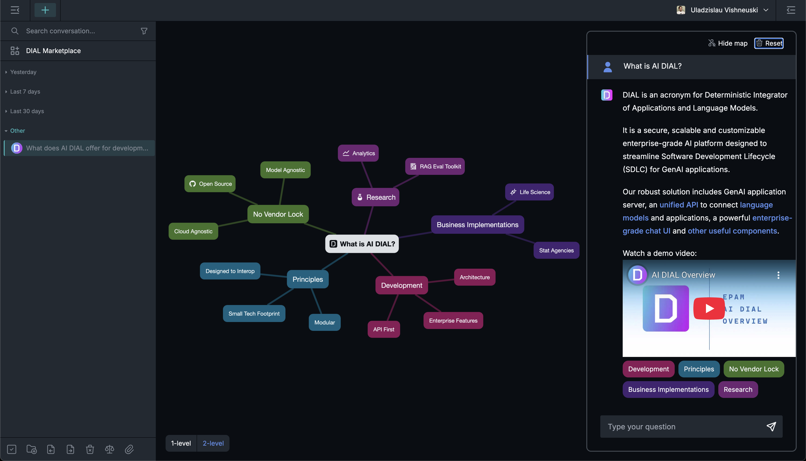

## Conversations

In the AI DIAL, a conversation is a dialogue between a conversational agent, such as a language model, assistant, or application, and a human user. The agent uses natural language to interact with a human and receive/give a feedback. Within one conversation, you can refer to previous questions and answers. But different conversations don't share context.

> All your conversations are stored on the server, and you can access them from any device you use.

### Agents

In AI DIAL Chat you can have a conversation with several types of agents: language models, applications and assistants. You can access all the available agents in [DIAL Marketplace](#dial-marketplace) and add them to [My workspace](#my-workspace). Refer to [Conversational Agents](#conversational-agents) to learn more about them.

##### To change agent

By default, the main window displays the last agent used by the user. You can proceed and have a dialog with this agent or change it before starting a conversation or switch to a different one during the conversation:

Before you begin a conversation, click **Change agent** to invoke the **Select an agent for conversation** window. Here, you can choose among the added agents or navigate to My workspace section.

In the middle of a conversation, you can view information about the current agent and change it by clicking the agent icon. 

### Conversation Settings

> **Note**: The conversation settings can vary based on the agent selected. It's possible that some agents might not have any configurable settings.

In the Conversation Settings, you can access and modify the following components depending on the selected agent:

- [System prompt](#system-prompt)
- [Temperature](#temperature)
- [Addons](#addons)

You can modify the conversation settings before or during the conversation:

**Before** you begin a new conversation, click **Configure settings** in the main chat area to invoke the **Conversation settings** window.

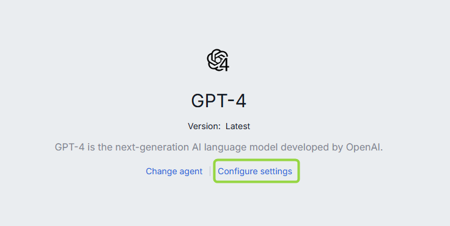

**During** the conversation, in the conversation header you can view and modify conversation settings by clicking the **gear** icon.

In the conversation header menu you also can: 

* View and change the current agent: you can view information about the current agent and change it by clicking the agent icon. Refer to [Agents](#agents) to learn more.
* Access conversation action menu: click the three-dot menu icon to access the standard conversation [actions menu](#actions).
* Clear conversation history: click the eraser icon to clear the conversation history and start from scratch. 

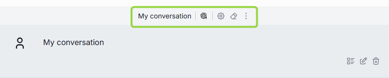

#### System Prompt

> **Note**, there are language models that do not support this feature. In such cases system prompt is disabled. 

The system prompt in AI DIAL acts as the initial set of instructions provided to the model. It serves as a compass for the model, guiding it through the conversational landscape to ensure it remains on track and stays aligned with the intended purpose and desired outcome of the conversation.

Type `/` in the text box to select any previously created prompt as a system prompt (for details, refer to the [Create](#create-1) in Prompts), and it will set the context and tone for the whole conversation.

<!-- ##### Example

Let's compare a conversation with a system prompt selected and a conversation without a system prompt. For illustration purposes, we are going to use the compare mode (refer to the [Compare](#compare) section for details) and create two conversations with identical settings except for the system prompt selection.

The prompt used as a system prompt is as follows:

> Let's play a game. Name a city that starts with the last letter of the one that I named in a previous message and then tell me that it is my turn to name a city.

| **User message** | **Language model response without a system prompt** | **Language model response with a system prompt** |
| ------------- | ------------------------------------------------ | --------------------------------------------------------- |
| Grodno | Grodno, also known as Hrodna, is a city in western Belarus, near the borders with Poland and Lithuania. It is the administrative center of Grodno region and has a population of around 365,000 people. Grodno is one of the oldest cities in Belarus, dating back to the 11th century. The city boasts a rich history and diverse architectural styles, including baroque, classicism, and modernism. | Oslo. It's your turn!|
| Osaka | Osaka is a large port city and commercial center on the Japanese island of Honshu. It's known for its modern architecture, nightlife, and hearty street food. One of Osaka's most popular tourist destinations is the bustling urban area of Dotonbori, where the city's entertainment and dining scenes come to life with numerous restaurants, bars, and shops. | Ankara. Now it's your turn to name a city! |
| Antwerp | Antwerp is a city in Belgium, and it's the country’s biggest port. It is located on the River Scheldt, linked to the North Sea by the Westerschelde estuary. Known for its many historical buildings, squares, museums, and cultural attractions, it's a popular tourist destination. | Prague. Your turn to name a city! | -->

#### Temperature

The temperature parameter controls the creativity and randomness of the model's output. A higher temperature (e.g., 1.0) makes the output more diverse and creative, while a lower temperature (e.g., 0.1) makes the output more focused and deterministic.

Adjusting the temperature allows you to balance creativity and consistency in the generated response.
 
#### Addons

You may want LLM to access particular data or technology to generate responses. This could be your company's database, a collection of PDF documents, calculation engines, API or any other data source or technology. You can accomplish this by using addons that allow AI models to tap into and use various data sources or technologies to produce responses.

In the AI DIAL framework, an **Addon** refers to a service or component that conforms to the Open API specification. Examples of Addon implementations include semantic search, Q&A search, database query generators, or any custom logic tailored to meet specific business requirements. You can add and use custom Addons to achieve a desired system behavior.

##### To select addons

In the **Conversation settings** window for the selected model, click **See all addons...** to view all available addons. You can select one or more addons and then click **Apply addons** to start using them.

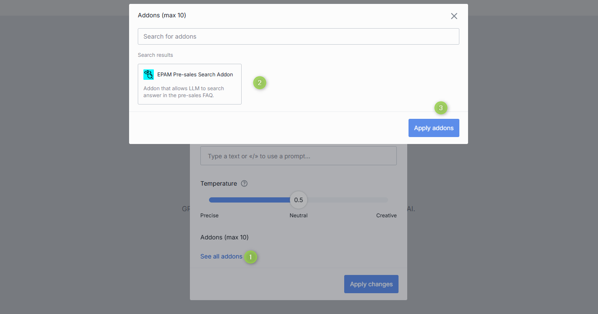

### Actions

Click a **...** icon to open a conversation menu. There, you can view a list of all possible actions for the chosen conversation.

> **Note**, that the available actions can vary depending on the selected conversation. For example, the Unpublish action will not be available if the conversation hasn't been published yet.

This is the list of all the supported actions:

- [Select](#select-to-delete): use to select conversations you want to delete.
- [Rename](#rename) - use to rename a conversation.
- [Compare](#compare): use to compare conversations with different settings.
- [Duplicate](#duplicate): use to duplicate a shared conversation.
- [Replay](#replay): use to reproduce conversations but with different settings.
- [Playback](#playback): use to simulate the current conversation without any engagement with models.
- [Export](#export): use to export a conversation.
- [Move to](#arrange): use to relocate conversations.
- [Share](#share): use to share a conversation by providing a link.
- [Unshare](#unshare): use to revoke a shred conversation.
- [Publish](#publish): use to publish conversations.
- [Unpublish](#unpublish): use to revoke public access from published conversations.
- [Info](#info): use to view metadata of a selected conversation.
- [Delete](#delete): use to delete a single conversation.

### Arrange

You can organize your conversations into folders. To create a new folder, simply click on the folder icon located in the bottom menu:

You can also create a new folder or move a conversation to the existing folder from the **Move to** context menu of the selected conversation. New folders will automatically be arranged in the **Pinned conversations** tab in the Conversations panel.

##### Hierarchy

You can create a hierarchy of folders with three nesting levels. Just create a folder and drag-n-drop it in the other folder to create a nesting level. The same way, you can either drag-n-drop a conversation into a folder or use **Move to** in the context menu of a conversation to move it to a **parent** folder.

> **Note**: empty folders are deleted after refreshing the page.

##### Naming conventions

The following symbols in the folders names are prohibited: tab, `"`, `:`, `;`, `/`, `\`, `,`, `=`, `{`, `}`, `%`, `&` and will be excluded. Note that you can use the `.` symbol at the start or inside a name, but the dot at the end will be automatically removed.

The MAX length of the folder name is limited to 160 symbols. Everything beyond is cut off. 

### Search and Filter

Use the **Search** box to search conversations by their names. If you have any shared conversations, you can apply **Shared by me** filter to sort them out.

### Create

There are several ways to initiate a dialog with a [conversational agent](#conversational-agents): 

* To communicate with the current conversational agent (by default, the last one used by the user), simply begin typing in the text box located in the chat area.
* In My Workspace or Marketplace, select an agent and click **Use ...** button to initiate a conversation. Refer to [Converse](#converse) to learn more.
* On the main chat screen, click the **Plus** icon to select agent and start a conversation.

### Rename

When you create a new conversation, it is automatically named after the first line in your first prompt. For instance, if your prompt consists of several sentences divided by a tab, the first sentence will be used as the conversation's name. Moreover, the MAX length of the conversation name is limited to 160 symbols. Everything beyond is cut off. After a conversation is created, you can rename it.

##### To rename a conversation

1. Click **Rename** in the context menu of the selected conversation.
2. Enter a new name and submit.

##### Naming conventions

The following symbols in the conversation names are prohibited: tab, `"`, `:`, `;`, `/`, `\`, `,`, `=`, `{`, `}`, `%`, `&` and will be excluded. Note that you can use the `.` symbol at the start or inside a name, but the dot at the end will be automatically removed.

### Share

You can share a conversation or a folder with several conversations with other users. Yo can also receive a shared conversation.

> Watch [Collaboration](/docs/video%20demos/demos/5.dial-collaboration.md) demo video to learn more about sharing and other collaboration features in AI DIAL.

##### To receive a shared conversation

If a conversation has been shared with you, it can be located in the **Shared with me** section in the left panel.

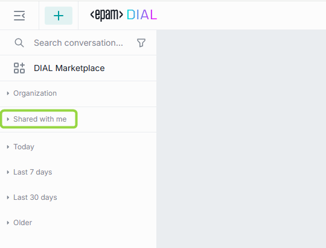

> **Important**: you cannot change a conversation that has been shared with you. To be able to work with it, [duplicate it](#duplicate).

##### To share a conversation

> **Note**: You can share entire folders with conversations. When you share a folder, all folders and conversations in it will be shared as well.

If you want to share a conversation or a folder, click on **Share** in the contextual menu and send the link to the intended recipient.

After the recipient has opened your link, the arrow icon appears near its name. **Note**, it may be required to reload the page to update the status of the shared conversation.

To filter and view only the conversations that you have shared, click on the **Shared by me** checkbox in the filter:

### Unshare

To revoke access from all users you have shared with, click **Unshare** in the contextual menu and then confirm action in the dialog window.

### Duplicate

Duplicate a shared with you conversation to be able to change it. To duplicate a conversation, click **Duplicate** in the contextual menu.

> This feature is available only for conversations shared with you. 

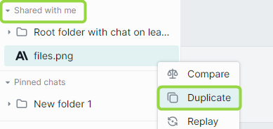

### Export

You can export conversations. If a conversation includes attachments, you can export it with or without attachments. 

You can also export all your conversations at once without attachments in a JSON format.

> Exported conversations are named by the following pattern: prefix "epam_ai_dial_chat", then "with_attachments" if the conversation was exported with attachments, then "month_day". However, the naming convention is configurable in the chat config.

##### Export a single conversation with attachments

1. On the left panel, in the conversation contextual menu, point to **Export**.
2. Click **With attachments**. 

The conversation will be exported as a **ZIP** archive. Please note that the name of the ZIP archive follows the format `file_name.dial`. You can manage it just like a normal ZIP archive.

##### Export a single conversation without attachments

1. On the left panel, in the conversation contextual menu, point to **Export**.
2. Click **Without attachments**. 

The conversation will be exported as a **JSON** file.

##### Export all conversations

To export all conversations, at the bottom of the left panel, click the **Export conversations** icon.

> Conversations will be exported without attachments.

### Import

Exported conversations can be imported. 

To import a JSON file with a conversation or a ZIP archive with several conversations (may include attachments as well), click the **Import conversations** icon at the bottom of the left panel and then select a file with conversations.

When you import a conversation with attachments, the attachments will be available in the parent of the root folder in the [Attachments Manager](#attachments-manager).

When importing a **duplicate** of an existing conversation, you will be prompted to select one of the proceeding options for both the conversation and each of the attachments: 

* Replace - replace the original conversation/attachment 
* Ignore - do nothing
* Postfix - add a postfix to the imported conversation/attachment. For example: *my-conversation 1* , where 1 is added postfix to the name of the duplicated imported conversation.

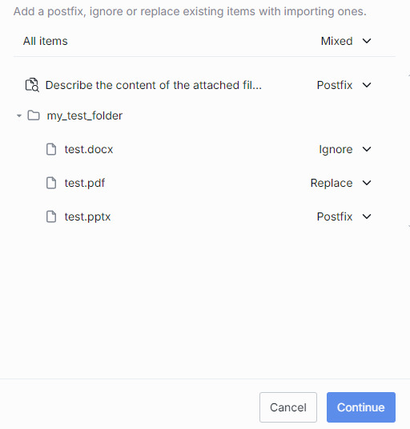

### Info

Click **Info** in the conversation menu to view the conversation metadata: the date it was updated and the creation date.

### Delete

You can delete a single conversation, selected conversations or all conversations.

* To delete a **single** conversation, on the left panel, in the conversation contextual menu, select **Delete** and confirm your action.
* To delete **all** conversations, at the bottom of the left panel, click the **Delete all conversations** icon.

### Select to Delete

Also, you can use a *selection* mode to choose conversation(s) you want to delete:

* Click **Select all** button in the bottom panel. When you do this, all conversations get preselected and you can unselect the ones you want to **keep**. You can also click **Unselect all** in the bottom panel to clear the selection.

* Click **Select** in the conversation menu to enter into a *selection* mode. In this mode, you can hover over any conversation and use checkboxes to select/unselect conversations you want to delete. You can also click **Unselect all** in the bottom panel to clear the selection.

### Replay

You can use **Replay** to reproduce conversations but with different settings (e.g. a different model). A replayed conversation can be used to compare responses to the same questions from different models and with different settings of the conversation. 

 
Use **Replay as is** to reproduce the conversation with the original settings. You can find Replay as is if you click **Change agent** or an agent icon in the conversation header menu.

 

##### To replay a conversation

1.	Click **Replay** in the conversation menu. 
2.	Click **Start replay**.
3.	In the process of replaying, you can stop and resume the replay process using controls in the text box **Stop generating** and **Continue replay** respectively.

 

The replayed conversation is displayed as a new conversation with the `[Replay]` tag in the list of your conversations. 

 

### Parameterized Replay

You can use Parameterized Replay to create your own chats or stories with custom variables and share them with your team. Such parametrized conversations others can follow, but with their own details or answers to create a personalized experience. This makes chat a much more useful tool for sharing information and collaboration.

##### Prompt-based

You can create a parametrized conversation using a special prompt with variables.

Let's create a simple Travel Guide conversation, which will take a user though several steps to clarify information and provide the answer.

1. Start by [creating a special prompt](#create-1) with [variables](#variables). Use templates (this `{{VariableName|DefaultValue}}` or this `{{VariableName}}`) to add variables into your prompt with or without default values. For example: `I'd like to travel to {{country|Japan}}. Could you please suggest {{num-attractions|10}} of the best attractions? I will be there for {{num-days}}. Thank you.`
2. To use your parametrized prompt, type `/` in the conversation text input area and select your prompt. You will be asked to provide your inputs for variables in a pop-up window. Enter your inputs and click `Submit`. The prompt is now populated with your inputs in the conversation text box. Send message to start.
3. The chat will return its response to your prompt.
4. You can now click [Replay](#replay) in your conversation's menu to repeat this dialogue but with different input parameters.
5. You can [Share](#share) this conversation with someone. When a person opens the shared conversation, they will be prompted to fill in their personal input in the parameterized prompt, allowing them to have the same conversation but with their custom inputs, for example, travel to USA instead of Japan.

##### Dynamic

You can create a parametrized conversation from any message in your chat. This scenario does not require having any pre-configured prompts.

> Watch a [demo video](/docs/video%20demos/demos/7.dial-parameterized-replay.md) to see it in action.

1. Within a conversation, you can set any message as a template for subsequent replay. Use **Set message template** to invoke the **Message template** window.

   

2. In the **Message template** window, you can substitute sections of your original message with [variables](#variables) under the **Set template** tab. To achieve this, copy a segment from your original message and paste it into the first input box. Then, in the second input box, introduce a variable using the format: `{{Variable name}}`. For instance, in our example, we have replaced "France" with the `{{Country}}` variable.

   

   In the **Preview** tab, you can preview your original message with variables:

   

3. Once you click save, you can return to your conversation. In the conversation menu, select [Replay](#replay) to initiate the replay of this conversation. The chat will prompt you to input values for your variable(s) to replay the conversation. You have the option to replay it as it originally was (using the same model as in your initial conversation) - select **Replay as is** (you can find it if you click **Change agent**), or you can alter the settings of the conversation to experiment with different models and parameters.
4. You can [Share](#share) this conversation with others. When someone opens the shared conversation, they will be prompted to provide their own inputs in the template. This allows experiencing the same conversation but with personalized inputs, such as traveling to the USA instead of France.

### Playback

The Playback mode can be used to simulate the current conversation without any engagement with models. This mode accurately reproduces the conversation like a recording. **Note**, that this differs from the Replay mode, where the prompts are resubmitted to the chosen model and the outcomes may differ from the initial conversation.

During playback, you have the ability to rewind, fast forward, or halt the process.

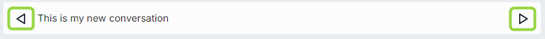

### Compare

Use the Compare mode to compare two new (or two existing) conversations with different setting (e.g. different models or temperature).

##### To compare two NEW conversations

1.	Click the **Compare** icon in the menu at the bottom of the left panel.
2.	Define settings for both conversations. To do that, click **Configure settings** for any conversation to open a dialog window.
3.	Type your question (prompt) in the chat box to begin.

Once you initiate a conversation in this mode, the system creates two new conversations with the same name but adds numbers to them. If you have chosen different language models, the conversations icons will differ accordingly.

##### To compare two EXISTING conversations

> **Important**: this Compare mode works only with conversations with the same amount of prompts from a user. The application will not allow comparing two conversations with different amounts of prompts.

1.	On the left panel, in the conversation menu of a conversation, select **Compare**.
2.	In the main section, under **Select conversation to compare with**, select the second conversation from the drop box. 
3. By default, only conversations with the same name are available in the drop box. Select **Show all conversations** to see the full list of conversations.
4.	Type your question (prompt) in the chat box.

### Publish

You can publish conversations to make them available for the target audience.

> Watch [Publications](/docs/video%20demos/demos/6.dial-publications.md) demo video to learn more about collaboration features in AI DIAL.

> **Note**: to publish a shared conversation, [duplicate](#duplicate) it and then publish. 

##### To publish a conversation

1. Click **Publish** in the conversation menu. 

2. In the pop-up window:
   * Enter **publication request name** in the upper area.
   * In **Publish to**, you can select the target destination. You can also create a dedicated folder to publish your conversation into.
   * In **Allow access..**, specify access rules and the target audience. For example Role-Equals-Admin. **Note**: the available roles are configured for each organization individually. Contact your support to find out the rules are applicable in your organization.
   * In **Conversations**, you can choose what conversations you want to publish (if you have selected a folder with several conversations). If conversations include attachments, you can also select them in the **Files** section.
   * Assign a version to your request. 
   * Click **Send request** to send your publish request to the administrator.
   

3. When your request is approved, the published conversation or a folder with conversation(s) will become available in the Organization tab.

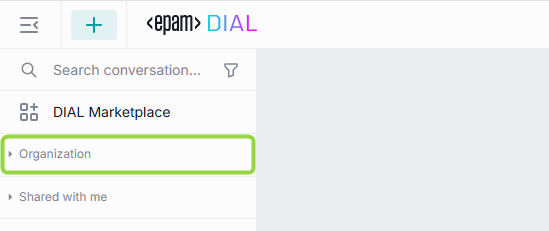

##### Versioning

When you make a publication request, it is required to assign it a unique version number. A version must follow format: `0.0.0`. With each request you must provide a new version - the system will not accept two identical versions. 

Versioning helps you create specific publications for different groups of people, run experiments, and keep track of your conversations easily.

You can add a **version** of your publication request next to the conversation check box:

If you try to publish this conversation again, you will be able to view the last version or a drop-down with versions:

When you open a published conversation, you can view and switch between its versions in the [conversation settings](#conversation-settings): 

### Unpublish

You can unpublish conversations to withdraw them from public use.

##### To unpublish a conversation

1. Click **Unpublish** in the conversation menu. 

   

2. In the pop-up window:
   * Enter **unpublish request name** in the upper area.
   * In **Conversations**, if you have selected a folder, you can choose what conversations you want to unpublish. If conversation(s) include attachment(s), you can also select them in the **Files** section.
   * Click **Send request** to send your unpublish request to the administrator.
  
   

3. When your request is approved by the administrator, the unpublished conversation or a folder with conversation(s) will become unavailable in the Organization tab.
   
## Prompts

A prompt is an instruction, a question, or a message that a user provides to a language model to receive an answer. Prompts can also contain constraints or requirements. They help the model understand the task at hand and the types of responses that are expected. 
You can use prompts as templates for your messages, instructions to the model, or to encourage the model to generate specific types of content. 
In AI DIAL, you can create prompts beforehand and reuse them in one or several conversations.

Prompts can be applied to one message or a whole conversation. Refer to the [System prompt](#system-prompt) section of this guide for details.

The section with your prompts is located in the right-hand area of the screen. In this section, you can work with saved prompts: create new templates, update them, and organize them with folders. 

> All your prompts are stored on the server, and you can access them from any device you use.

### Actions

Click a **...** icon to open a prompt menu. There, you can find a list of all the available actions for the selected prompt.

This is the list of all the supported actions. Please note that the available actions can differ depending on the selected prompt. For instance, the Unpublish action won't be available if the prompt hasn't been published yet.

- [Use](#use): click to use the selected prompt.
- [Select](#select-to-delete-1): use to select prompts you want to delete.
- [Edit](#create-1): use to edit prompts. 
- [Duplicate](#duplicate-1): use to duplicate a shared prompt.
- [Export](#export-import): use to export prompts in JSON format.
- [Import](#export-import): use to import prompts in JSON format.
- [Move to](#arrange-1): use to organize a prompts in folders.
- [Share](#share-1): use to share a prompt or a folder with several prompts with other users.
- [Unshare](#unshare-1): use to revoke access to shared prompts.
- [Publish](#publish-1): use to publish prompts within the organization.
- [Unpublish](#unpublish-1): use to withdraw prompts from public use.
- [Info](#info-1): use to view the prompt metadata. 
- [Delete](#delete-1): you can delete a single prompt, all prompts or selected prompts.

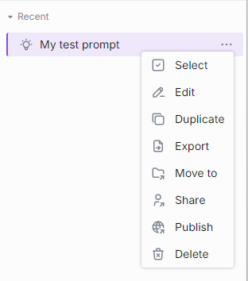

### Arrange

You can organize your prompts in folders. To create a new folder, click on the folder icon in the bottom menu:

You can also create a new folder or move a prompt to the existing folder from the **Move to** context menu of the selected prompt: 

New folders will automatically be arranged in the **Pinned prompts** tab in the Prompts panel.

##### Hierarchy

You can create a hierarchy of folders with three nesting levels. Just create a folder and drag-n-drop it in the other folder to create a nesting level. The same way, you can either drag-n-drop a prompt into a folder or use **Move to** in the context menu of a prompt to move it to a **parent** folder.

> **Note**: empty folders are deleted after refreshing the page.

##### Naming conventions

The following symbols in the folders names are prohibited: tab, `"`, `:`, `;`, `/`, `\`, `,`, `=`, `{`, `}`, `%`, `&` and will be excluded. Note that you can use the `.` symbol at the start or inside a name, but the dot at the end will be automatically removed.

The MAX length of the folder name is limited to 160 symbols. Everything beyond is cut off. 

### Search and Filter

Use the **Search** box to search prompts by their names. If you have any shared prompts, you can apply **Shared by me** filter to sort them out.

### Use

Click **Use** in the prompt menu to populate the selected prompt in the chat box.

> Refer to [Chat](#actions-2) to learn more.

### Create

##### To create a new prompt

1.	On the right panel, select **New prompt**.
2.	Fill in the **Name**, **Description**, and **Prompt** boxes. The following symbols in the prompt names are prohibited: tab, `:`, `;`, `/`, `\`, `,`, `=`, `{`, `}`, `%`, `&`. Note that you can use the `.` symbol at the start or inside a name, but the dot at the end will be automatically removed. The MAX length of the prompt name is limited to 160 symbols. Everything beyond is cut off.
3.	Click **Save**.

> While both the **Name** and **Description** fields are required to create a prompt, they do not serve as instructions for the language model. They simply help you differentiate this prompt from others. The language model will only utilize instructions from the **Prompt** box.

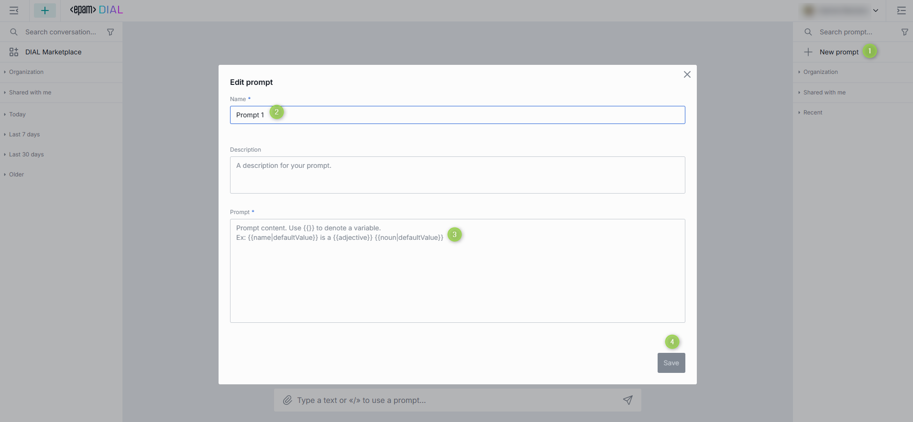

#### Variables

You can use prompts as templates for your instructions to a language model. You can also add variables in your prompts. Use notation such as `{{variableName}}` or `{{variableName|Default Value}}` to add variables.

> Refer to [Parameterized Replay](#parameterized-replay) to view a use case when prompts are used to create parametrized conversations.

For example, you need to calculate an equation `a + b/c`, round up the answer, and then divide it by 4.
 
Create the following prompt: 

`{{a}}+{{b}}/{{c}}=`

Round up the answer to three digits and divide by four

Here, `a`, `b`, and `c` are variables. In the prompt body, they are denoted by double curly brackets: `{{ }}`.

> You can combine mathematical expressions and natural language in your prompts.

After you have created the prompt, you can use it by typing a slash `/` in the chat box and selecting the name of a prompt (it is **Math** in our example). You’ll see the following form where you can enter any numbers:

When you submit the form, your message will look like on the illustration below:
  

Generally, variables can be anything, not only numbers. For example, you can create a prompt with the following body: `Who played {{character}} in {{movie}}? or What is a Latin name of {{plant common name}}?`

### Info

Click **Info** in the prompt menu to view the prompt metadata: the date it was updated and the creation date.

### Delete 

You can delete a single prompt, selected prompts or all prompts.

* To delete a single prompt, in the menu of each prompt, select **Delete** and confirm your action.
* To delete all prompts, at the bottom of the right panel, click the **Delete all prompts** icon.

### Select to Delete

Also, you can use a *selection* mode to choose prompt(s) you want to delete:

Click **Select all** button in the bottom panel. In this case, all prompts are preselected and you can unselect the ones you want to keep. You can also click **Unselect all** in the bottom panel to clear the selection.

Click **Select** in the prompts menu. In this case, you can hover over any prompt and use checkboxes to select/unselect prompts you want to delete. You can also click **Unselect all** in the bottom panel to clear the selection.

### Share

You can share a prompt or a folder with several prompts with other users.

> Watch [Collaboration](/docs/video%20demos/demos/5.dial-collaboration.md) demo video to learn more about sharing and other collaboration features in AI DIAL.

##### To receive a shared prompt

To obtain a prompt from someone else (receive a shared prompt), you must get a link from them. By clicking on this link, you will import the prompt into your chat.

When someone shares a prompt with you, you can find it in the **Shared with me** section on the right panel. **Important**: you cannot change a prompt that has been shared with you. To be able to work with it, [duplicate it](#duplicate-1). When you receive a shared prompt, a pop-up window opens up, where you can preview a prompt and duplicate it if needed.

You can always view prompts that have been shared with you in a dedicated section and perform various actions on them such as 

* View: opens a pop-up window with a prompt preview.
* Duplicate: use to duplicate a shared with you prompt to be able to modify it. 
* Delete: remove from the list.
* Export: download in a JSON format.

##### To share a prompt

If you want to share a prompt or a folder, click on **Share** in the contextual menu and copy the link. All shared prompts can then be located by selecting the **Shared by me** checkbox in the filter.

Once the recipient opens your link, an arrow icon will appear next to its name.

> When you share a folder, all folders and prompts in this folders will be shared.

### Unshare

To revoke access from all users you have shared with, click **Unshare** in the contextual menu and then confirm actions in the dialog window.

### Duplicate

You can duplicate a prompt to be able to change a prompt that was shared with you. To duplicate a prompt, click **Duplicate** in the contextual menu.

> You can duplicate only prompt shared with you.

### Export Import

You can export and import prompts. 

##### To export a single prompt

Select **Export** in the prompt's menu. The prompt will be exported as a JSON file.

##### To export all prompts

Click **Export prompts** at the bottom of the right panel. All your prompts will be exported as a JSON file.

##### To import prompts

Click **Import prompts** at the bottom of the right panel. Only valid JSON files can be imported.

When importing a **duplicate** of an existing prompt, you will be asked to select one of the proceeding options: 

* Replace - replace the original prompt 
* Ignore - do nothing
* Postfix - add a postfix to the imported prompt. For example: *my-prompt 1* , where 1 is added postfix to the name of the duplicated imported prompt.

### Publish

You can publish prompts to make them available for the target audience. 

> Watch [Publications](/docs/video%20demos/demos/6.dial-publications.md) demo video to learn more about collaboration features in AI DIAL.

> **Note**: to publish a shared prompt, [duplicate](#duplicate-1) it and then publish. 

##### To publish a prompt 

1. Click **Publish** in the prompt's menu. 

   

2. In the pop-up window:
   * Enter **publication request name** in the upper area.
   * In **Publish to**, select the target destination or a folder to publish your prompt into.
   * In **Allow access...**, specify access rules and the target audience. For example Role-Equals-Admin. **Note**: the available roles are defined in each organization individually. Contact your support to find out the rules are applicable in your organization.
   * In **Prompts**, if you have selected a folder, you can choose what prompts you want to publish.
   * Assign a **version** to your publication request.
   * Click **Send request** to send your publication request to the administrator.

   

3. When your request is approved by the administrator, the published prompt or a folder with prompt(s) will become available in the Organization tab.

   

##### Versioning

When you make a publication request, it is required to assign it a unique version number. A version must follow format: `0.0.0`. With each request you must provide a new version - the system will not accept two identical versions. 

Versioning helps you create specific publications for different groups of people, run experiments, and keep track of your prompts easily.

You can add a **version** of your publication request next to the prompt check box:

If you try to publish this prompt again, you will be able to view the last version or a drop-down with versions:

### Unpublish

You can unpublish prompts to withdraw them from the public use.

##### To unpublish a prompt 

1. Click **Unpublish** in the prompt's menu. 

   

2. In the pop-up window:
   * Enter **unpublish request name** in the upper area.
   * In **Prompts**, if you have selected a folder, you can choose what prompts you want to unpublish.
   * Click **Send request** to send your unpublish request to the administrator.

   

3. When your request is approved by the administrator, the unpublished prompt or a folder with prompt(s) will become unavailable in the Organization tab.

## Chat 

The chat occupies the central part of the main screen, allowing you to input messages, see replies, and execute various supported tasks based on the application and chat settings.

### Actions

**During a conversation**, you can perform various actions:

**Entering messages**: you can use a text box at the bottom to enter your prompts and trigger the generation of answers by hitting **Enter** on your keyboard or clicking the **Send** button in the text box.

You can enter a prompt manually or select one of [existing prompts](#prompts). 

Enter `/` in the chat text box to select one of the available prompts. You can also click [Use](#use) in the prompt's menu to populate it in the text box.

**Copying responses**: you can copy answers to reuse them some place else.

**Stop and Regenerate**: in the process of generating the response, you can stop it by clicking a **Stop** icon in the text box.

When the response generation has been stopped, you can regenerate it. **Important**: If you encounter a server error or click the **Stop Generating** button and receive an empty response, the **Send** button will be disabled. To continue the conversation, you'll need to generate the answer again. If you receive a partial response (a combination of text and an error), the model can still proceed, while for Assistants/Applications, you'll need to generate the response again.

**Working with prompts**: during the conversation, you can edit or delete your prompts. After a prompt has been edited, the response is regenerated, and all your prompts after the edited one will be deleted. When you delete your prompt, the response will be deleted, too.

**Working with attachments in responses**: if in the response you have received an attachment, you can click the **Download** icon near the file name to download it or an **Expand** to preview:

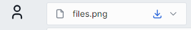

**Attach files to requests**: some models and applications (e.g. _DIAL RAG_) support adding attachments (files, links, folders) to conversations. In this case, you'll see the **Attachments** icon available in the chat box. Click it to upload a file from your device or select an already uploaded file. Refer to the [Manage attachments](#attachments) section for details.

**Like/Dislike**: you can like and dislike responses in a conversation. Use likes to highlight important responses and dislikes to mark the responses you don't need. 

**View and change current settings**: on the top bar you can view and manage agent and conversation settings. Refer to [Conversation Settings](#conversation-settings) to learn more.

### Isolated View Mode

In the Isolated View Mode, you can access the AI DIAL Chat in a simplified view mode with the predefined conversational agent. To access this mode, follow a specific URL `https://server/models/modelID` or `https://server/models/applicationID`. Conversation and prompt panels are not shown in this mode. All conversations that are created in this mode, will also be displayed in the standard chat view mode.

For instance, to open chat with GPT-4 model, go to `https://AI DIAL Chat URL/models/gpt-4` and access a streamlined user interface that only contains a chat input with GPT-4:

Although this mode offers a simplified view, you can access [Conversation settings](#conversation-settings) the usual way.

## User Settings

In the user area on the top bar, you can click the down arrow to access additional settings or to log out. Here you can choose the chat theme (dark or light), change the logo, and switch to full-width chat mode.

## Attachments

AI DIAL applications (e.g. DIAL RAG) can support attaching files, links or folders to a conversation and generate responses considering the attached resources.

### Folders

If the selected application supports this, you can click the attachment icon in the conversation box and select **Attach folders**.

> Note, that you can attach only folders from the file manager and cannot upload folders from an external source.

In the pop-up window, select a checkbox for the folder you want to add to add it. The attached folder will appear in the conversation box and become available for the application to work with. 

### Links

If the selected application supports this, you can click the attachment icon in the conversation box and select **Attach link**. Then, specify a valid URL and click **Attach**. The link will be displayed as attachment in the conversation box and become available for the application to work with.

### Files

If the selected application supports this, you can click the attachment icon in the conversation box and select **Attach uploaded files**. In the attachments manager, select available files that you have previously uploaded and select a checkbox to add to the conversation. The file will be displayed as attachment in the conversation box and become available for the application to work with.

### Attachments Manager 

All attached and uploaded files are available in the attachments manager. To manage all attachments, click the **Attachments** icon at the bottom of the left panel.

There can be a few tabs in the Attachments Manager: 

* Organization - published files
* Shared with me - files shared with you
* All files - the rest of your files

##### To create a folder

You can create folders and then upload files into them. **Note**, the only way to add a file into a folder is to upload it - you cannot move files between folders.

> AI DIAL applications can be configured to allow attaching entire folders to conversations. In this case, only folders created in the attachments manager can be attached to a conversation.

1. Click a folder icon to create a new folder.
2. Give your folder a name.
3. Click submit to apply.

You can as well perform several actions on your folders: 

* Rename
* Upload files
* Add subfolders

##### To upload a file

To add a file into a folder it is necessary to upload it.

1. In the Manage attachments dialog, select **Upload from device**.
2. Select one or several files you want to upload and click **Open**.
3. Under **Upload to**, select **Change** to pick a folder, in which the files will be uploaded.
4. Under **Files**, change their names or delete them, if necessary. The following symbols in the file names are prohibited: tab, `"`, `:`, `;`, `/`, `\`, `,`, `=`, `{`, `}`, `%`, `&`. Note that you can use the `.` symbol at the start or inside a name, but the dot at the end will be automatically removed.
5. Click **Upload and attach files**.

##### To unshare a file

With an application that supports file attachments, you can create a conversation and share it. When a conversation is shared, all files attached to that conversation are also shared. In the attachments manager, these shared files are marked with a blue arrow.

In the file menu, you can choose to unshare it: 

##### To download attachments

Click a folder to expand it.

1. In the Manage attachments dialog, point to a file and select it. You can select several files.
2. Click the **Download** icon below the files tree.

##### To delete attachments

> You won't be able to preview or download a deleted file in a conversation, but you still will see its name.

1. In the Manage attachments dialog, point to a file and select it. You can select several files.
2. Click the **Delete** icon below the files tree.

## Publications

You can publish/unpublish your applications, conversations and prompts, or even a collection of those, making them accessible within your organization. Additionally, you can manage access to the published resources, ensuring that the right information is accessible to the right individuals or teams.

> * Watch [Publications](/docs/video%20demos/demos/6.dial-publications.md) demo video to learn more about publication and collaboration features in AI DIAL.
> * Refer to [Collaboration](/docs/tutorials/collaboration/1.overview.md) to learn more about collaboration features in AI DIAL.

### Configuration

> Refer to [Collaboration](/docs/tutorials/collaboration/2.enable-publications.md#dial-chat) to learn more about working and configuring publications.

To enable the publication feature:

1. Configure your identity service provider by allocation users in a group for administrators.
2. Configure `access.admin.rules` in AI DIAL Core to define which user roles can perform the admin's actions. Refer to [configuration](https://github.com/epam/ai-dial-core) to view the description of parameters.
3. Configure AI DIAL Chat by including `ConversationsPublishing` and `PromptsPublishing` in the `ENABLED_FEATURES` variable. Refer to [configuration](https://github.com/epam/ai-dial-chat/blob/development/apps/chat/README.md) to view the description of parameters and [examples](https://github.com/epam/ai-dial-chat/blob/development/libs/shared/src/types/features.ts).

### Flow

This is the high level overview of the publication workflow: 

1. Chat user sends a publication request for the selected resource(s) ([conversation](#publish), [prompt](#publish-1), [application](#publish-app)).
2. Admin receives the publication request, reviews it and either approves or declines. Refer to [Process Publish Requests](#process-publish-requests) to learn more.
3. In case the publication request has been approved, the published resources (conversations and prompts) become available for the target audience in the Organization section in the chat application. Published applications can be found in [DIAL Marketplace](#dial-marketplace). If the published conversation includes attachments, they will be available in the [Attachments Manager](#attachments-manager).
4. Resource owner can unpublish the published resource.

> Refer to [Conversations](#publish), [Prompts](#publish-1) and [Publish App](#publish-app) to view step-by-step instructions.

## Administrators

Administrators are chat users that can perform additional actions. Chat interface for administrators includes extra components (for example the **Approve required** tab in conversations and prompts sections)

### Process Publish Requests

Users with the admin role have access to the **Approve required** tab in conversations and prompts sections, where they can view all publish and unpublish requests from users. 

> **Note**, publication requests for applications appear in the Prompts section.

The counter shows the number of requests to be reviewed. Each such request has a color dot attached to it. The refresh of a browser updates this information.

**To review**:

1. Click on any conversation or prompt request to open the review window. 
2. In the review window, you can preview the details of the request and download attached files, if present. **Note**, that a request can include both publish and unpublish requests. The latter is highlighted in red color in the list of conversations or prompts. Such mixed requests can be currently realized exclusively using DIAL API. 
3. If **Go to a review...** is displayed, click it to review conversation(s) or prompt(s) in the request. For the unfinished review, this button changes to **Continue review...**. **Note**, you cannot approve the request which has not been reviewed in full. 

4. In the review mode, you can use arrows to navigate between conversations/prompts and click **Back to publication request** when finished reviewing.

5. Once the review is completed, the **Approve** button is enabled. **Note**, you can approve or reject only the entire request.

### Deploy and Undeploy Code Apps

In the [DIAL Marketplace](#dial-marketplace), administrators can deploy and undeploy Code Apps of different users.

1. Go to DIAL Marketplace and apply filter by Applications. Deployed Code Apps have a green status icon. 
2. Click the app you want to undeploy/deploy. Refer to [Launch Code App](#to-launch-code-app) to learn more.

## Data Visualization

AI DIAL Chat enables data visualization for specific data types using data visualizers. It comes with built-in support for the [Plotly data visualizer](#plotly). To link any other custom visualizers, you can use the [DIAL Chat Visualizer Connector](https://github.com/epam/ai-dial-chat/blob/development/libs/chat-visualizer-connector/README.md) library.

> Refer to [Data Visualization](/docs/tutorials/data-visualization.md) to learn more about visualizing data in chat and custom visualization apps.

### Plotly

Plotly is an open-source JavaScript library that enables the creation of diverse data visualizations, including charts, 3D graphs, and more.

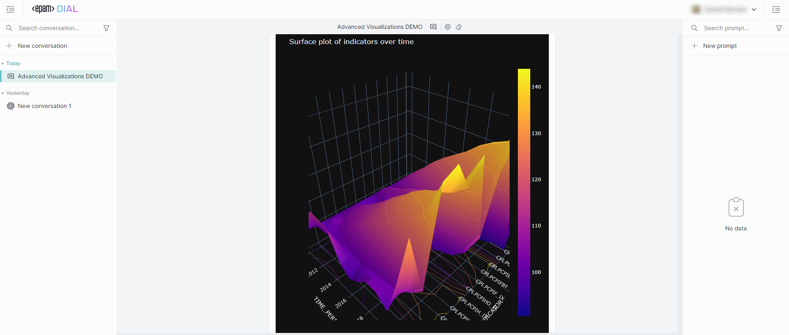

> * Refer to [Plotly](https://plotly.com/) to learn more. 
> * Watch [Animated Scatterplot](/docs/video%20demos/demos/animated-scatterplot.md) demo video to see how statistical data can be visualized in AI DIAL Chat using a Plotly animated scatterplot.
> * Watch [Omics AI Assistant](/docs/video%20demos/demos/dial-omics-assistant.md) demo video to see how protein structures can be visualized with Plotly.

AI DIAL Chat integrates with Plotly, offering robust data visualization capabilities. To utilize Plotly, choose an AI DIAL application that supports this feature. These applications must be capable of querying data (either from a URL or directly from the Chat application) based on user input and returning it in a format compatible with Plotly. Chat automatically detects attachments in this format and uses Plotly to visualize the data.

The visualizations come with standard Plotly controls for easy manipulation.

> Refer to [Plotly GitHub](https://github.com/plotly/react-plotly.js) to learn more. 

## Conversational Agents

In AI DIAL Chat, you can have a dialog with several types of conversational agents: language models, applications and assistants.

### Language Models

##### Available Models

In the [DIAL Marketplace](#dial-marketplace) section, you can view all the models available on your AI DIAL environment. There, you can select models to add them to [My workspace](#my-workspace).

> Refer to [Supported Models](/docs/supported-models.md) to view all the models supported in AI DIAL.

##### To talk to a model

1. In the [DIAL Marketplace](#dial-marketplace) section, you can view all the models available on your DIAL environment. There, you can select models to add them to [My workspace](#my-workspace).
2. To display just models, select just **Models** in **Types**.
3. Click any of the available models in Marketplace or My workspace, click **Use model** to navigate back to the main screen with this model pre-selected for conversation.

> Refer to [Agents](#agents) to learn how to change conversational agents prior or during a conversation. 

### Applications

> Refer to [My workspace](#my-workspace) to learn how to add and manage applications in AI DIAL Chat.

In AI DIAL, an “application” is any programming logic that conforms to the [Unified API](https://epam-rail.com/dial_api#/paths/~1openai~1deployments~1%7BDeployment%20Name%7D~1chat~1completions/post) of AI DIAL or registered custom endpoints and packaged as a ready-to-deploy solution.

AI DIAL Chat users can engage with applications via standard or fully customized interfaces. Applications can interact via the Unified API, or registered custom endpoints, enabling creation of complex scenarios and utilizing all AI DIAL features.

You can expand the platform by introducing custom application types to build the applications you need, using the DIAL SDK to streamline the development process.

> Refer to [Extensibility](https://epam-rail.com/extension-framework) to learn more.

AI DIAL platform serves as an **application server**, offering tools to develop, deploy and operate custom applications. Refer to [Application Types](#standard-application-types) to learn more about DIAL applications.

> Refer to [AI DIAL Application Server](https://epam-rail.com/app-server) to learn more.

Applications can be developed (using [DIAL SDK](https://github.com/epam/ai-dial-sdk)) to execute any custom logic and can even form an [ecosystem](/docs/architecture.md#introduction) and interact with each other through the [Unified API](https://epam-rail.com/dial_api) with access to all DIAL Core features among which is connectivity to models (including multi-modal models), file storage, access control, per-request API keys and other.

> Watch a [DIAL RAG](/docs/video%20demos/demos/8.dial-rag.md) and [DIAL ChatHub](/docs/video%20demos/demos/dial-chathub.md) videos as examples of what DIAL applications may look like.

In the [DIAL Marketplace](#dial-marketplace) section, you can view all the applications available on your DIAL environment. There, you can select applications to add them to [My workspace](#my-workspace).

##### To talk to an application

1. In the [DIAL Marketplace](#dial-marketplace) section, you can view all the applications available on your DIAL environment. There, you can select applications to add them to [My workspace](#my-workspace).
2. To display applications, select just **Applications** in **Types**.
3. Click any of the available applications in Marketplace or My workspace, click **Use application** to navigate back to the main screen with this application pre-selected for conversation.

> Refer to [Agents](#agents) to learn how to change conversational agents prior or during a conversation. 

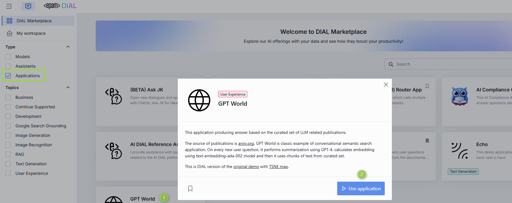

### Standard Application Types

Application types serve as templates for building customized versions of applications. AI DIAL offers various standard application types accessible from [My workspace](#my-workspace), allowing you to create new applications based on these templates.

> Refer to [Extensibility](https://epam-rail.com/extension-framework) to learn more.

AI DIAL has a flexible architecture that supports adding custom application types, enabling implementations that go beyond the standard application types and even implementing a fully custom UI replacing the standard chat interface.

#### Custom Apps

DIAL applications can be integrated into the DIAL Core deployment. By doing so, these applications will be immediately available in your chat from the start. For examples, refer to the [dynamic setting](https://github.com/epam/ai-dial-core?tab=readme-ov-file#dynamic-settings) in DIAL Core. Additionally, you can register your custom and deployed applications through the [DIAL API](https://epam-rail.com/dial_api#tag/Applications/paths/~1v1~1applications~1%7BBucket%7D~1%7BApplication%20Path%7D/put) and [DIAL Marketplace](#add-custom-app). In such cases, the configuration of your custom applications, described in a JSON file, is saved in your blob store and accessed by DIAL Core for usage.

> * Refer to [My workspace](#add-custom-app) to learn how to add a custom app.
> * Refer to [Custom Apps Deployment](/docs/Deployment/custom_apps_deployment.md) to learn how to deploy custom applications using Helm chat and configure DIAL Core.

#### Quick Apps

DIAL Quick Apps are conceptually similar to OpenAI's GPT. Quick Apps do not contain any programming code (they include a toolset, description and instruction to the language model) and enable you to rapidly build an application right within DIAL Chat, use it, and share it with others. Quick Apps can be used to simplify a workflow or carry out a specific task. For example, you can create a Quick App with a configuration allowing it to call an external API to get a real-time weather forecast for a specific location.

> * Watch a [Demo Video](/docs/video%20demos/demos/12.quick-apps.md) with an introduction to Quick Apps.
> * Refer to [My workspace](#add-quick-app) to learn how to add Quick Apps.

#### Code Apps

DIAL Core Apps allow you to develop, deploy and run your Python applications directly in the AI DIAL Chat. It is a useful tool if you need to quickly create an application for the POC, deploy it and share with the selected audience.  

> * Watch a [Demo Video](/docs/video%20demos/demos/11.code-apps.md) with an introduction to Code Apps.
> * Refer to [My workspace](#add-code-app) to learn how to add Code Apps.

#### Mindmaps

Mindmap enables users to access information through an interactive knowledge graph and natural language. The application pulls data from various sources, including documents, URLs, and other data inputs and then presents it on UI as a interactive knowledge graph, facilitating intuitive and engaging user interactions with information.

> Watch [demo video](/docs/video%20demos/demos/mindmap-studio) to see the AI DIAL Mindmap Studio in action.

### Assistants

In the AI DIAL, assistant is a combination of a preselected [addon](#addons) and a [system prompt](#system-prompt) that enable specific behavior of a language model, allowing to achieve responses adjusted to user needs. Unlike the model+addon configuration, where users have the flexibility to choose different addons, assistants come with predetermined addons that cannot be removed or unselected. However, the model can still be reassigned within the assistant.

Assistants give you more control over LLM behavior, resulting in tailored and accurate responses that match specific needs. The flexibility of this combination lets you create custom assistants. These assistants can range from simple tasks, like asking the LLM to provide answers in a specific tone or style (e.g., like a pirate), to more complex tasks, such as restricting the LLM's data to a specific geographical area (e.g., providing weather forecasts for Chicago only). Combining addons and system prompts enables better customization and adaptability to various situations, leading to more versatile responses.

In the [DIAL Marketplace](#dial-marketplace) section, you can view all the assistants available on your DIAL environment. There, you can select assistants to add them to [My workspace](#my-workspace).

##### To talk to an assistant

1. In the [DIAL Marketplace](#dial-marketplace) section, you can view all the assistants available on your DIAL environment. There, you can select assistants to add them to [My workspace](#my-workspace).
2. To display assistants, select just **Assistants** in **Types**.
3. Click any of the available assistants in Marketplace or My workspace, click **Use assistant** to navigate back to the main screen with this assistant pre-selected for conversation.

> Refer to [Agents](#agents) to learn how to change conversational agents prior or during a conversation. 

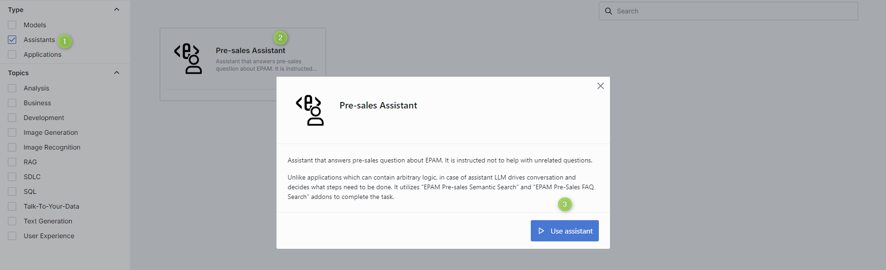

## Marketplace

### Overview

> Watch [Marketplace](/docs/video%20demos/demos/10.marketplace.md) demo video to see it in action.

In DIAL Marketplace where you can find all conversational agents ([applications](#applications), [language models](#available-models) and [assistants](#assistants)) available on your AI DIAL environment. Here, you can also find all applications [published](#publish-app) in your organization.

##### Navigation

You can navigate to this section form the main chat screen: 

In DIAL Marketplace, there are two sections: 

* [DIAL Marketplace](#dial-marketplace): the main screen of DIAL Marketplace which includes all conversational agents available on your DIAL environment.
* [My workspace](#my-workspace): this screen includes all conversational agents that you have selected in DIAL Marketplace. In this section, you can also add and manage your custom applications.

From both marketplace and workspace you can click **Back to Chat** to navigate to the main chat screen.

##### Filters & Views

* Use the **Type** filters to display any or all [conversational agents](#conversational-agents). **Note**, that all agents are displayed by default - use the Type filter to narrow down the scope of the displayed agents. 
* A conversational agent can be associated with a specific topic describing the area of its application. Use the **Topics** filter to refine the output by specific topics. 
* Use the **Source** filter to apply additional filtering criteria related to the source of conversational agents (e.g. you can filter just the apps shared with you).
* The **Search** allows you to swiftly locate any item by its name.
* Use view toggle to switch between the table and the grid view. 

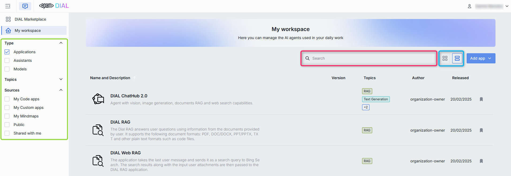

### DIAL Marketplace

Click **DIAL Marketplace** to navigate to the *home page* of DIAL Marketplace where you can find all [applications](#applications), [language models](#available-models) and [assistants](#assistants) available on your DIAL environment. Here, you can also find all applications [published](#publish-app) in your organization.

##### Add to My workspace

In the DIAL Marketplace main screen, you can view details of any conversational agent and add it to [My workspace](#my-workspace).

To simply add/remove an item to/from My workspace, click **Add/Remove to/from My workspace** label:

You can also add a conversational agent to My workspace by initiating a conversation with it. For example, to add a model:

1. In the [DIAL Marketplace](#dial-marketplace) section, you can view all the models available on your DIAL environment. There, you can select models to add them to [My workspace](#my-workspace).
2. To display models, select just **Models** in **Types**.
3. To select a model, click any of the available models in Marketplace or My workspace, click **Use model** to navigate back to the main screen with this model pre-selected for conversation.

> Refer to [Agents](#agents) to learn how to change conversational agents prior or during a conversation. 

> **Please note**, that if you start a conversation and then remove the associated item from My workspace, you will need to reinstate the item to continue the conversation. A button will appear in place of the chat text box. Simply click this button to return the item to My workspace and resume the conversation.

### My workspace

In **My workspace**, you can access and manage all conversational agents that you have added in [DIAL Marketplace](#dial-marketplace). Here, you can view and manage your agents. 

#### Application Builder

In My workspace, you can use Application Builder to create applications of available [Application Types](#standard-application-types). It is a useful feature, allowing users with different technical backgrounds to quickly build prototypes and applications in a no-code fashion.

Application Builder interface enables configuration and deployment of applications, which can vary depending on the type of application. This interface allows you to not only set up and launch applications but also test them before going live.

##### Custom UI

The standard AI DIAL Chat UI is designed to meet the needs of typical conversational applications. However, to accommodate the requirements of applications that exceed the standard chat UI functionality, new application types can be introduced to implement a fully custom UI (even not chat-like UI), which can completely replace the standard chat interface during interactions with a specific application.

> You can define custom UI for application builder and for your application in JSON schema when registering a new application type.

> * Refer to [Extensibility](https://epam-rail.com/extension-framework) to learn more.
> * Watch [demo video](/docs/video%20demos/demos/mindmap-studio) to see the Mindmap Studio in action.

#### Add Custom App

> You can also add custom applications using [DIAL API](https://epam-rail.com/dial_api#tag/Applications/paths/~1v1~1applications~1%7BBucket%7D~1%7BApplication%20Path%7D/put).

If you want to add your custom application, you can do it in AI DIAL Application Builder or via [DIAL API](https://epam-rail.com/dial_api#tag/Applications/paths/~1v1~1applications~1%7BBucket%7D~1%7BApplication%20Path%7D/put). After adding a custom application, a JSON file describing the configuration of your application will be saved in a dedicated folder within a blob store account bucket assigned to your user account. These files can then be accessed by DIAL Core to facilitate the integration and operation of your applications. Configuration of a custom application matches DIAL Core dynamic configuration for applications. Refer to [Examples](https://github.com/epam/ai-dial-core/blob/development/sample/aidial.config.json) to view how it can look like.

> **Important Requirement**: Custom applications must provide a chat completion endpoint for DIAL Core and adhere to the [Unified API](https://epam-rail.com/dial_api#/paths/~1openai~1deployments~1%7BDeployment%20Name%7D~1chat~1completions/post) standards to ensure seamless integration and functionality.

##### To Add Custom App

1. In My workspace, click **Add app** and select **Custom App** to launch Application Builder.
2. Follow the steps to configure application. Refer to [Add application](#addedit-application-form) form to see the description of parameters.
3. When you configure all the required parameters, click **Save and exit**. Your new application will appear in [My workspace](#my-workspace).

##### Add/Edit application form

|Field|Required|Description|
|---|:---:|-------------|
|Name|Yes|Application name.|
|Version|Yes|Application version, following the format `x.y.z` and contain only numbers and dots.|
|Icon|Yes|The icon that will be rendered in the chat UI for this application.|
|Topics|No|You can assign one of pre-defined topics to your custom application. Topics and their styles are defined in [AI DIAL Chat Themes](https://github.com/epam/ai-dial-chat-themes/blob/development/static/config.json). You can also add custom applications using [DIAL API](https://epam-rail.com/dial_api#tag/Applications/paths/~1v1~1applications~1%7BBucket%7D~1%7BApplication%20Path%7D/put). In this case, you can add any custom topic to your application by including this parameter in the application configuration JSON file: `"description_keywords": ["My custom topic"]`|
|Description|No|A short description that will be rendered in the chat UI. Add two line breaks and provide an addition description if needed.|
|Features data|No|Application features are specific configurations of applications specified in JSON format. Currently, only two are supported: rate and configuration endpoints: `rateEndpoint` is the endpoint for rate requests. `configurationEndpoint` is the endpoint to request application configuration parameters as JSON schema. Refer to [DIAL Core documentation](https://github.com/epam/ai-dial-core?tab=readme-ov-file#dynamic-settings) to view the full set of available application features.|
|Attachments type|No|Types of attachments allowed for this application. Provide the types according to [MIME standard](https://developer.mozilla.org/en-US/docs/Web/HTTP/Basics_of_HTTP/MIME_types/Common_types). E.g.: image/png and click enter. Enter `*/*` to allow all types.|
|Max. attachments number|No|The maximal number of attachments the application is allowed to accept. Skip to apply the max integer number. Enter `0` to disable attachments.|
|Completion URL|Yes|A chat completion URL exposed by your application and used by DIAL Core to send chat completion requests.|

#### Add Quick App

DIAL Quick Apps are not composed of programming code. Instead, they can be characterized as no-code instructions and configurations with a toolset for language models.

> Refer to [Quick Apps](#quick-apps) to learn more.

##### To Add Quick App

1. In My workspace, click **Add app** and select **Quick App** to launch Application Builder.
2. Follow the steps to configure application. Refer to [Add application](#addedit-quick-app-form) form to see the description of parameters.
3. When you configure all the required parameters, click **Save and exit**. Your Quick App will appear in [My workspace](#my-workspace).

##### Add/Edit Quick app form

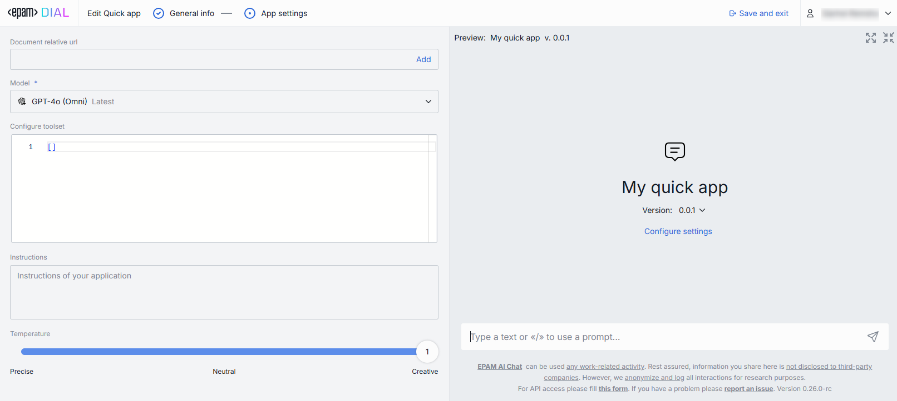

|Field|Required|Description|
|---|:---:|-------------|
|Name|Yes|Quick app name.|
|Version|Yes|Quick app version, following the format `x.y.z` and contain only numbers and dots.|
|Icon|No|The icon that will be rendered in the chat UI for this Quick app.|
|Description|No|A short description that will be rendered in the chat UI. **Tip:** Add two line breaks and provide an addition description if needed.|
|Topics|No|You can assign one of pre-defined topics to your Quick app. Topics and their styles are defined in [AI DIAL Chat Themes](https://github.com/epam/ai-dial-chat-themes/blob/development/static/config.json).|
|Document relative url|No|If your application includes an instruction in the Toolset to query a document in order to generate a response, this URL will serve as a source for this document.|
|Model|Yes|Select one of the available language models from the dropdown list.|
|Configure toolset|Yes|Enter a valid Json with a toolset configuration that will be used when making requests. E.g. this toolset can define how to make calls to external API.|
|Instructions|No|Instructions to the language model.|
|Temperature|Yes|The temperature controls the creativity and randomness of the model's output.|

#### Add Code App

DIAL Code Apps allow you to develop, edit, deploy, and run Python applications directly within DIAL Chat UI. 

You can:

* Create and customize Code Apps using the built-in Python code editor directly in DIAL Chat.
* Deploy Code Apps without worrying about hosting or scalability.
* Implement essential endpoints for DIAL compatibility.
* Manage environment variables.
* Edit and publish Code Apps.

> Refer to [Code Apps](#code-apps) to learn more.

Limitations and security restrictions:

* Code Apps are deployed and maintained exclusively by AI DIAL platform, similarly, to handling lambda function by cloud providers. 
* Code Apps do not have access to internet.
* Code Apps do not have state outside of DIAL APIs.
* You can use only Python libraries, databases, and models that are supported by AI DIAL.
* Code Apps cannot call each other or any external endpoints with the exception of  DIAL Core, if it is allowed.
* All traffic is encrypted, and Code Apps are run in an isolated network.

##### To Add Code App

1. In My workspace, click **Add app** and select **Code App** to launch Application Builder.
2. Follow the steps to configure application. Refer to [Add code app](#addedit-code-app-form) form to see the description of parameters.
3. When you configure all the required parameters, click **Save and exit**. Your Quick App will appear in [My workspace](#my-workspace).

##### To Launch Code App

After adding, your new Code App will appear in [My workspace](#my-workspace). 

1. Click **Deploy** in the Code App menu to run it. When deployed, you will get a notification on your screen and the Code App's status icon will turn from yellow to green - this may take a few minutes.

2. Select the application and click **Use application** to launch it.

##### To Access Code App Logs

You can view and download logs of the deployed Code App from the application menu.

##### To Edit Code App

To modify the application source code or the application form parameters, you need to undeploy it. Both **Edit** and **Undeploy** buttons are located in the application's menu:

##### Add/Edit code app form

|Field|Required|Description|
|---|:---:|-------------|
|Name|Yes|Code app name.|
|Version|Yes|Code app version, following the format `x.y.z` and contain only numbers and dots.|
|Icon|No|The icon that will be rendered in the chat UI for this Code app.|
|Topics|No|You can assign one of pre-defined topics to your Code app. Topics and their styles are defined in [AI DIAL Chat Themes](https://github.com/epam/ai-dial-chat-themes/blob/development/static/config.json).|
|Description|No|A short description that will be rendered in the chat UI. Add two line breaks and provide an addition description if needed.|
|Attachments type|No|Types of attachments allowed for this application. Provide the types according to [MIME standard](https://developer.mozilla.org/en-US/docs/Web/HTTP/Basics_of_HTTP/MIME_types/Common_types). E.g.: image/png and click enter. Enter `*/*` to allow all types.|
|Max. attachments number|No|The maximal number of attachments the application is allowed to accept. Skip to apply the max integer number. Enter `0` to disable attachments.|
|Select folder with source files|Yes|Use this to define the file structure of your application and enter into the built-in fully functional Python code editor. Here, you can write your app from scratch or upload the existing source code files.|
|Runtime version|Yes|Select the environment in which Python code will be executed.|
|Endpoints|Yes|Code App must expose a chat completion endpoint. You can also add rate and configuration endpoints. Refer to [DIAL Core](https://github.com/epam/ai-dial-core) to learn about endpoints. **Note**: Code Apps cannot call each other or any external endpoints with the exception of  DIAL Core, if it is allowed.|
|Environment variables|No|You can define environment variables with values for your application.|

#### Converse

In My workspace, you can select which [conversational agent](#conversational-agents) you want to have a dialog with.

1. In [My workspace](#my-workspace), click any conversational agent.
2. Click **Use..** to start a new conversation with the selected agent.

> Refer to [Agents](#agents) to learn how to change conversational agents prior or during a conversation. 

#### Edit App

Use Edit in the app's menu to modify your apps.

> **Note**: you can edit only **your own** apps. To [Edit a Code App](#to-edit-code-app), undeploy it first.

##### To edit application

1. Click **Edit** to invoke the [Edit app](#addedit-application-form)/[Edit quick app](#addedit-quick-app-form)/[Edit quick app](#addedit-code-app-form)
2. Make changes and click **Save**

#### Share App

Applications (or their versions) can be shared with other users by sending a sharing link. In this section, you can learn about: 

* [Sharing](#to-share-app)
* [Unsharing](#to-unshare-app)
* [Removing access](#to-remove-access)
* [Editing rights](#sharing-with-editing-rights)

##### To share app

Use **Share** to grant other users rights to use your application. You can repeat the procedure described in this section more than once to share with different users.

> **Note**, that you can share only your own applications. You cannot share an application that has been shared with you.

1. In My workspace, in the application menu, click **Share**.

2. If necessary, you can select a specific version of the application you want to share.
2. In the pop-up dialog window, select whether you want to give editing rights with the sharing link. **Important**: if you grant editing rights to your app, make sure you are familiar with the [main principles](#sharing-with-editing-rights) outlined in this documentation.
3. Confirm the action in the dialog window.
4. Provide the sharing link to the target user with whom you want to share your app.

A shared application (or its version if only a specific version has been shared) is labeled with the blue arrow:

##### Sharing with editing rights

The key distinction between sharing and [publishing](#publish-app) is that sharing allows you to grant not only the rights to use but also editing access to your application. 

**Important**: when an application (or its specific version) is shared, any updates made to the app become immediately available to the users with whom the application has been shared, but it's important to note that **conflict resolution** for simultaneous edits by multiple users is not supported, so the changes submitted first will be applied to the shared application for all users immediately.

Applications shared with and without editing rights have different scope of actions available for the target user: 

##### To remove access

> **Note**: a shared application is revoked from the shared usage when the apps's name or version is modified by the application owner.

You can revoke access for all users with whom you have share the application.

1. Select the shared application for which you want to revoke access. You can identify the shared apps by the blue arrow pinned to the icon of the shared application. 
2. Click **Share** in the applications menu.
3. In the open dialog window, click **Remove access for all users** and confirm the unshare action in the pop-up window.

##### To unshare app

Use **Unshare** to remove the shared with you application from your workspace. 

> **TIP**: To quickly find all apps that have been shared with you, use the **Source** filter in My workspace.

1. In the shared application's menu, click **Unshare**.
2. Confirm the action in the dialog window.

#### Publish App

You can publish your custom, quick and code applications to make them accessible to the selected audience in your organization. Refer to [Publications](#publications) to learn more about this functionality and to [Tutorials](/docs/tutorials/collaboration/2.enable-publications.md) for a more extended documentation.

> **Note**: all published applications within your organization will appear in DIAL Marketplace for the corresponding audience.

##### To publish application

1. In the application menu (you can also find a Publish icon in the Edit application form), click **Publish**
2. Enter **publication request name** in the upper area.
3. In **Publish to**, select the target destination or a folder to publish your prompt into.
4. In **Allow access...**, specify access rules and the target audience. For example Role-Equals-Admin. **Note**: the available roles are defined in each organization individually. Contact your support to find out the rules are applicable in your organization.
5. In **Applications** you can choose what applications you want to publish.
6. Click **Send request** to send your publication request to the administrator.

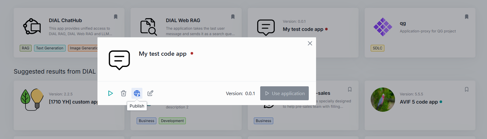

> **Note**, when your request is approved by the administrator, the published application will become available in the [DIAL Marketplace](#dial-marketplace) for the target audience.

#### Remove from Workspace

You can remove any conversational agent from My workspaces: 

1. Navigate to the My workspace section.
2. In the agent's tile, click **Remove**.
3. Confirm your action in the dialog window.

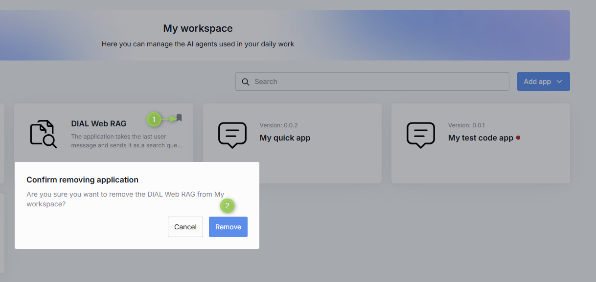

#### Delete App

Use Delete in the app's menu to completely delete the selected application. **Note** that you can delete only your own apps.

##### To delete application

1. Navigate to the My workspace section.
2. In the application menu, click **Delete**.
3. Confirm your action in the dialog window.

#### Application Link

For applications that are available organization-wide, you can copy and share a link that directs users straight to the application's card in the DIAL Marketplace, facilitating quick and easy navigation.

