# Chat User Guide

## Introduction

AI DIAL Chat is a powerful enterprise-grade application that serves as a default web interface for users, providing access to the full set of AI DIAL features.

> * Watch a [demo video](../video%20demos/demos/dial-ui-basics) with introduction to AI DIAL Chat UI.
> * Refer to [Quick Start](quick-start) to learn how to launch AI DIAL Chat in a few clicks.

### Additional Documentation

Refer to [AI DIAL Chat repository](https://github.com/epam/ai-dial-chat) to view the project source code and documentation for additional components:

* DIAL Chat [documentation](https://github.com/epam/ai-dial-chat/blob/development/apps/chat/README.md).
* DIAL Chat Theming [documentation](https://github.com/epam/ai-dial-chat/blob/development/docs/THEME-CUSTOMIZATION.md).
* Chat Overlay [documentation](https://github.com/epam/ai-dial-chat/blob/development/libs/overlay/README.md).
* DIAL Chat Visualizer Connector [documentation](https://github.com/epam/ai-dial-chat/blob/development/libs/chat-visualizer-connector/README.md).

You can also refer to other topics in this documentation:

* Chat localization [instruction](/tutorials/localization).
* List of [supported LLMs](/supported-models).
* Chat UI design [guidelines](/chat-design).
* Authentication [guidelines](/Auth/Web/overview).

## Interface Components

The AI DIAL Chat application interface has several sections, such as the chat box, settings, and panels for managing conversations and saved prompts.

1. [Conversations](#conversations): Here, you can manage your conversations: create new ones, organize them in folders, and delete. You can collapse and expand the panel by clicking the **Hide panel** icon above it.
2. [Chat](#chat): Use this section to enter a prompt, view results, and interact with language models.
3. [Chat Settings](#chat-settings): In this section, you can select the language model, assistant, application, and addons you'd like to use. You can also provide a system prompt and adjust the temperature setting.
4. [Prompts](#prompts): In this section, you can work with saved prompts: create new templates, update them, and organize them in folders. You can collapse and expand the panel by clicking the **Hide panel** icon above it.
5. [User Settings](#user-settings): In your user settings, you can customize the color theme (dark or light), choose a custom logo and other customization options.
6. [DIAL Marketplace](#marketplace): This section includes all applications, language models and assistants available on your DIAL environment.

## Conversations

In the AI DIAL framework, a conversation is a dialogue between an agent, such as a language model, assistant, or application, and a human user. The agent uses natural language to interact with a human and receive/give a feedback. Within one conversation, you can refer to previous questions and answers. But different conversations don't share context.

> All your conversations are stored on the server, and you can access them from any device you use.

### Actions

Click a **...** icon to open a conversation menu. There, you can find the list of all the available actions for the selected conversation.

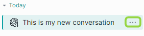

> **Note**, that actions may vary for the selected conversation (e.g. there will not be an Unpublish action if the conversation has not yet been published).

This is the list of all the supported actions:

- [Select](#select-to-delete): use to select conversations you want to delete.
- [Rename](#rename) - use to rename a conversation.
- [Compare](#compare): use to compare conversations with different settings.
- [Duplicate](#duplicate): use to duplicate a shared conversation.
- [Replay](#replay): use to to reproduce conversations but with different settings.
- [Playback](#playback): use to simulate the current conversation without any engagement with models.
- [Export](#export): use to export a conversation.
- [Move to](#arrange): use to relocate conversations.
- [Share](#share): use to share a conversation by providing a link.
- [Unshare](#unshare): use to revoke a shred conversation.
- [Publish](#publish): use to publish conversations within the target audience.
- [Unpublish](#unpublish): use to revoke public access from published conversations.
- [Delete](#delete): use to delete a single conversation.

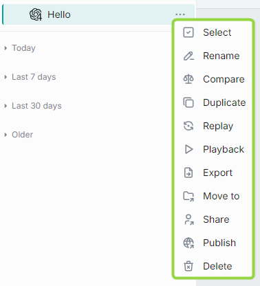

### Arrange

You can arrange your conversations in folders. To create a new folder, click a folder icon in the bottom menu:

You can also create a new folder or move a conversation to the existing folder from the **Move to** context menu of the selected conversation: 

New folders will automatically be arranged in the **Pinned conversations** tab in the Conversations panel.

##### Hierarchy

You can create a hierarchy of folders with three nesting levels. Just create a folder and drag-n-drop it in the other folder to create a nesting level. The same way, you can either drag-n-drop a conversation into a folder or use **Move to** in the context menu of a conversation to move it to a **parent** folder.

> **Note**: empty folders are deleted after refreshing the page.

##### Naming conventions

The following symbols in the folders names are prohibited: tab, `"`, `:`, `;`, `/`, `\`, `,`, `=`, `{`, `}`, `%`, `&` and will be excluded. Note that you can use the `.` symbol at the start or inside a name, but the dot at the end will be automatically removed.

The MAX length of the folder name is limited to 160 symbols. Everything beyond is cut off. 

### Search and Filter

The **Search** box can be utilized to find conversations and folders by their names. If you have any shared conversations, you can apply **Shared by me** filter to sort them out.

### Create

##### To create a conversation

1. On the left panel, click **New conversation**.
2. In the main section, under **Talk To**, select a language model, an assistant, or an application. Five most recently used items are shown in the section. To see all available items, click **See full list**.
3. Optionally, under **System prompts**, select a prompt by typing "/" in the text box. For details, refer to the [Prompts](#prompts) section of this guide.
4. Under **Temperature**, set a value of the temperature parameter. For details, refer to the [Temperature](#temperature) section of this guide.
5. Optionally, under **Addons**, select an Addon. For details, refer to the [Addons](#addons) section of this guide.
6. Under conversation settings, type your text (prompt) in the chat box and click the **Send** icon. The conversation will be created, and your first prompts will be used as its name. 

### Rename

When you create a new conversation, it is automatically named after the first line in your first prompt. For example, if your prompt includes several sentences separated by tab, the first one will be used to name the conversation. Moreover,the MAX length of the conversation name is limited to 160 symbols. Everything beyond is cut off. After that, you can rename your conversation.

##### To rename a conversation

1. Click **Rename** in the context menu of the selected conversation.
2. Enter a new name and submit.

The following symbols in the conversation names are prohibited: tab, `"`, `:`, `;`, `/`, `\`, `,`, `=`, `{`, `}`, `%`, `&` and will be excluded. Note that you can use the `.` symbol at the start or inside a name, but the dot at the end will be automatically removed.

### Conversation Settings

In the conversation header, you can view the current settings, change settings (including model, temperature, prompt and [more](#chat-settings) or clear the conversation history to start from scratch: 

### Share

You can share a conversation or a folder with several conversations with other users. Yo can also receive a shared conversation.

> Watch [Collaboration](../video%20demos/demos/dial-collaboration) demo video to learn more about sharing and other collaboration features in AI DIAL.

##### To receive a shared conversation

When someone shared a conversation with you, you can find it in the **Shared with me** section in the left panel. 

> **Important**: you cannot change a conversation that has been shared with you. To be able to work with it, [duplicate it](#duplicate).

##### To share a conversation

> **Note**: You can share entire folders with conversations. When you share a folder, all folders and conversations in it will be shared as well.

To share a conversation or a folder, click **Share** in the contextual menu and copy the link.

After the recipient has opened your link, the arrow icon appears near its name. **Note**, it may be required to reload the page.

Click **Shared by me** checkbox in the filter to select just the conversations that you have shared:

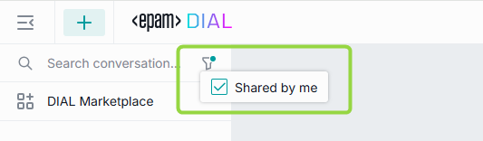

### Unshare

To revoke access from all users you have shared with, click **Unshare** in the contextual menu and then confirm action in the dialog window.

### Duplicate

Duplicate a shared with you conversation to be able to change it. To duplicate a conversation, click **Duplicate** in the contextual menu.

> This feature is available only for conversations shared with you. 

### Export

You can export selected conversations. If a conversation includes attachments, you can export it with or without attachments. 

You can also export all your conversations at once without attachments in a JSON format.

> Exported conversations are named by the following pattern: prefix "epam_ai_dial_chat", then "with_attachments" if the conversation was exported with attachments, then "month_day". However, the naming convention is configurable in the chat config.

##### Export a single conversation with attachments

1. On the left panel, in the conversation contextual menu, point to **Export**.
2. Click **With attachments**. 

The conversation will be exported as a **ZIP** archive.

##### Export a single conversation without attachments

1. On the left panel, in the conversation contextual menu, point to **Export**.
2. Click **Without attachments**. 

The conversation will be exported as a **JSON** file.

##### Export all conversations

To export all conversations, at the bottom of the left panel, click the **Export conversations** icon.

> Conversations will be exported without attachments.

### Import

Exported conversations can be imported. 

To import a JSON file with a conversation or a ZIP archive with several conversations (may include attachments as well), click the **Import conversations** icon at the bottom of the left panel and then select a file with conversations.

When you import a conversation with attachments, the attachments will be available in the parent of the root folder in the [Attachments Manager](#attachments-manager).

When importing a **duplicate** of an existing conversation, you will be prompted to select one of the proceeding options for both the conversation and each of the attachments: 

* Replace - replace the original conversation/attachment 
* Ignore - do nothing
* Postfix - add a postfix to the imported conversation/attachment. For example: *my-conversation 1* , where 1 is added postfix to the name of the duplicated imported conversation.

### Delete

You can delete a single conversation, selected conversations or all conversations.

* To delete a **single** conversation, on the left panel, in the conversation contextual menu, select **Delete** and confirm your action.
* To delete **all** conversations, at the bottom of the left panel, click the **Delete all conversations** icon.

### Select to Delete

Also, you can use a *selection* mode to choose conversation(s) you want to delete:

* Click **Select all** button in the bottom panel. When you do this, all conversations get preselected and you can unselect the ones you want to **keep**. You can also click **Unselect all** in the bottom panel to clear the selection.

* Click **Select** in the conversation menu to enter into a *selection* mode. In this mode, you can hover over any conversation and use checkboxes to select/unselect conversations you want to delete. You can also click **Unselect all** in the bottom panel to clear the selection.

### Replay

You can use **Replay** to reproduce conversations but with different settings (e.g. a different model). A replayed conversation can be used to compare responses to the same questions from different models and with different settings of the conversation. 

 
Use **Replay as is** to reproduce the conversation with the original settings. 

 

##### To replay a conversation

1.	Click **Replay** in the conversation menu. 
2.	Select **Replay as is** in **More info** in the Replay settings to reproduce the conversation with the original settings or change the conversation settings. 
3.	Click **Start replay**.
4.	In the process of replaying, you can stop and resume the replay process.

The replayed conversation is displayed as a new conversation with the `[Replay]` tag in the list of your conversations. 

### Parameterized Replay

You can use Parameterized Replay to create your own chats or stories with custom variables and share them with your team. Such parametrized conversations others can follow, but with their own details or answers to create a personalized experience. This makes chat a much more useful tool for sharing information and collaboration.

##### Prompt-based

You can create a parametrized conversation using a special prompt with variables.

Let's create a simple Travel Guide conversation, which will take a user though several steps to clarify information and provide the answer.

1. Start by [creating a special prompt](#create-1) with [variables](#variables). Use templates (this `{{VariableName|DefaultValue}}` or this `{{VariableName}}`) to add variables into your prompt with or without default values. For example: `I'd like to travel to {{country|Japan}}. Could you please suggest {{num-attractions|10}} of the best attractions? I will be there for {{num-days}}. Thank you.`
2. To use your parametrized prompt, type `/` in the conversation text input area and select your prompt. You will be asked to provide your inputs for variables in a pop-up window. Enter your inputs and click `Submit`. The prompt is now populated with your inputs in the conversation text box. Send message to start.
3. The chat will return its response to your prompt.
4. You can now click [Replay](#replay) in your conversation's menu to repeat this dialogue but with different input parameters.
5. You can [Share](#share) this conversation with someone. When a person opens the shared conversation, they will be prompted to fill in their personal input in the parameterized prompt, allowing them to have the same conversation but with their custom inputs, for example, travel to USA instead of Japan.

##### Dynamic

You can create a parametrized conversation from any message in your chat. This scenario does not require having any pre-configured prompts.

> Watch a [demo video](../video%20demos/demos/dial-parameterized-replay) to see it in action.

1. Within a conversation, you can set any message as a template for subsequent replay. Use **Set message template** to invoke the **Message template** window.

   

2. In the **Message template** window, you can substitute sections of your original message with [variables](#variables) under the **Set template** tab. To achieve this, copy a segment from your original message and paste it into the first input box. Then, in the second input box, introduce a variable using the format: `{{Variable name}}`. For instance, in our example, we have replaced "France" with the `{{Country}}` variable.

   

   In the **Preview** tab, you can preview your original message with variables:

   

3. Once you click save, you can return to your conversation. In the conversation menu, select [Replay](#replay) to initiate the replay of this conversation. The chat will prompt you to input values for your variable(s) to replay the conversation. You have the option to replay it as it originally was (using the same model as in your initial conversation) - select **Replay as is** in [Talk to](#talk-to), or you can alter the settings of the conversation to experiment with different models and parameters.
4. You can [Share](#share) this conversation with others. When someone opens the shared conversation, they will be prompted to provide their own inputs in the template. This allows experiencing the same conversation but with personalized inputs, such as traveling to the USA instead of France.

### Playback

The Playback mode can be used to simulate the current conversation without any engagement with models. This mode accurately reproduces the conversation like a recording. It should be noted that this differs from the Replay mode, where the prompts are resubmitted to the chosen model and the outcomes may differ from the initial conversation.

During the playback, you can move back and forward the playback process or stop it.

### Compare

Use the Compare mode to compare two new (or two existing) conversations with different setting (e.g. different models or temperature).

##### To compare two NEW conversations

1.	Click the **Compare** icon at the bottom of the left panel.
2.	Choose settings of the first conversations.
3.	Choose settings of the second conversation.
4.	Type your question (prompt) in the chat box.

As you can see on the picture above, the system creates two conversations with the same name but adds numbers to them. If you have chosen different language models, the conversations icons on the left panel will differ.
 
##### To compare two EXISTING conversations

> The Compare mode works only with conversations with the same amount of prompts from a user. The application will not allow comparing two conversations with different amounts of prompts.

1.	On the left panel, in the conversation menu of a conversation, select **Compare**.
2.	In the main section, under **Select conversation to compare with**, select the second conversation from the drop box. 
3. By default, only conversations with the same name are available in the drop box. Select **Show all conversations** to see the full list of conversations.
4.	Type your question (prompt) in the chat box.

### Publish

You can publish conversations to make them available for the target audience.

> Watch [Publications](../video%20demos/demos/dial-publications) demo video to learn more about collaboration features in AI DIAL.

> **Note**: to publish a shared conversation, [duplicate](#duplicate) it and then publish. 

##### To publish a conversation

1. Click **Publish** in the conversation menu. 

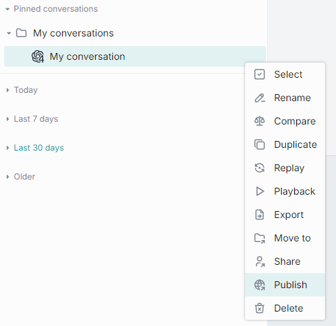

2. In the pop-up window:
   * Enter **publication request name** in the upper area.
   * In **Publish to**, you can select the target destination. You can also create a dedicated folder to publish your conversation into.
   * In **Allow access..**, specify access rules and the target audience. For example Role-Equals-Admin. **Note**: the available roles are configured for each organization individually. Contact your support to find out the rules are applicable in your organization.
   * In **Conversations**, you can choose what conversations you want to publish (if you have selected a folder with several conversations). If conversations include attachments, you can also select them in the **Files** section.
   * Assign a version to your request. 
   * Click **Send request** to send your publish request to the administrator.
   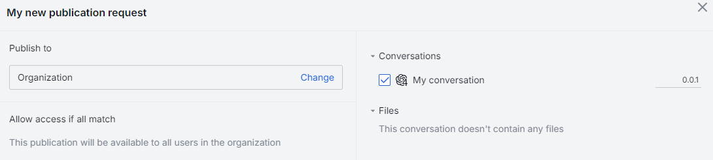

3. When your request is approved, the published conversation or a folder with conversation(s) will become available in the Organization tab.

##### Versioning

When you make a publication request, it is required to assign it a unique version number. A version must follow format: `0.0.0`. With each request you must provide a new version - the system will not accept two identical versions. 

Versioning helps you create specific publications for different groups of people, run experiments, and keep track of your conversations easily.

You can add a **version** of your publication request next to the conversation check box:

If you try to publish this conversation again, you will be able to view the last version or a drop-down with versions:

When you open a published conversation, you can view and switch between its versions in the [conversation settings](#conversation-settings): 

### Unpublish

You can unpublish conversations to withdraw them from public use.

##### To unpublish a conversation

1. Click **Unpublish** in the conversation menu. 

2. In the pop-up window:
   * Enter **unpublish request name** in the upper area.
   * In **Conversations**, if you have selected a folder, you can choose what conversations you want to unpublish. If conversation(s) include attachment(s), you can also select them in the **Files** section.
   * Click **Send request** to send your unpublish request to the administrator.
  

3. When your request is approved, the unpublished conversation or a folder with conversation(s) will become unavailable in the Organization tab.
   
## Prompts

A prompt is an instruction, a question, or a message that a user provides to a language model to receive an answer. Prompts can also contain constraints or requirements. They help the model understand the task at hand and the types of responses that are expected. 
You can use prompts as templates for your messages, instructions to the model, or to encourage the model to generate specific types of content. 
In AI DIAL, you can create prompts beforehand and reuse them in one or several conversations.

Prompts can be applied to one message or a whole conversation. Refer to the [System prompt](#system-prompt) section of this guide for details.

The section with your prompts is located in the right-hand area of the screen. In this section, you can work with saved prompts: create new templates, update them, and organize them with folders. 

> All your prompts are stored on the server, and you can access them from any device you use.

### Actions

Click a **...** icon to open a prompt menu. There, you can find a list of all the available actions for the selected prompt.

This is the list of all the supported actions. Note, that actions may vary for the selected prompt (e.g. there will not be an Unpublish action if the prompt has not yet been published)

- [Select](#select-to-delete-1): use to select prompts you want to delete.
- [Edit](#create-1): select a prompt on the right panel to invoke the Edit window. Make all necessary changes and click **Save**. 
- [Duplicate](#duplicate-1): use to duplicate a shared prompt.
- [Export](#export-import): right-click a prompt on the right panel and select **Export**. The prompt will be exported as JSON.
- [Import](#export-import): click the **Import prompts** icon at the bottom of the right panel and then select a JSON file with prompts.
- [Move to](#arrange-1): use to place a prompt in a folder.
- [Share](#share-1): use to share a prompt or a folder with several prompts with other users.
- [Unshare](#unshare-1): use to revoke access to shared prompts.
- [Publish](#publish-1): use to publish prompts within the organization.
- [Unpublish](#unpublish-1): use to withdraw prompts from public use.
- [Delete](#delete-1): you can delete a single prompt, all prompts or selected prompts.
- **Export all prompts**: click the **Export prompts** icon at the bottom of the right panel. All your prompts will be exported as JSON.

### Arrange

You can arrange your prompts in folders. To create a new folder, click a folder icon in the bottom menu:

You can also create a new folder or move a prompt to the existing folder from the **Move to** context menu of the selected prompt: 

New folders will automatically be arranged in the **Pinned prompts** tab in the Prompts panel.

##### Hierarchy

You can create a hierarchy of folders with three nesting levels. Just create a folder and drag-n-drop it in the other folder to create a nesting level. The same way, you can either drag-n-drop a prompt into a folder or use **Move to** in the context menu of a prompt to move it to a **parent** folder.

> **Note**: empty folders are deleted after refreshing the page.

##### Naming conventions

The following symbols in the folders names are prohibited: tab, `"`, `:`, `;`, `/`, `\`, `,`, `=`, `{`, `}`, `%`, `&` and will be excluded. Note that you can use the `.` symbol at the start or inside a name, but the dot at the end will be automatically removed.

The MAX length of the folder name is limited to 160 symbols. Everything beyond is cut off. 

### Search and Filter

The **Search** box can be utilized to find prompts and folders by their names. If you have any shared prompts, you can apply **Shared by me** filter to sort them out.

### Create

##### To create a new prompt

1.	On the right panel, select **New prompt**.
2.	Fill in the **Name**, **Description**, and **Prompt** boxes. The following symbols in the prompt names are prohibited: tab, ":", ";", "/", "\", ",", "=", "{", "}", "%", "&". Note that you can use the "." symbol at the start or inside a name, but the dot at the end will be automatically removed. The MAX length of the prompt name is limited to 160 symbols. Everything beyond is cut off.

      > Please note that both the **Name** and **Description** fields are mandatory to fill in order to create a prompt!

3.	Click **Save**.

>  **Name** and **Description** aren’t used as instructions for a language model. They only help you to distinguish the prompt from others. The language model will only use instructions from the **Prompt** box.

#### Variables

You can use prompts as templates for your instructions to a language model. You can also add variables in your prompts. Use notation such as `{{variableName}}` or `{{variableName|Default Value}}` to add variables.

> Refer to [Parameterized Replay](#parameterized-replay) to view a use case when prompts are used to create parametrized conversations.

For example, you need to calculate an equation `a + c/d`, round up the answer, and then divide it by 4. Let’s imagine that you need results for four sets of `a`, `c`, and `d`.
 
In that case you can create the following prompt:

Here, `a`, `c`, and `d` are variables. In the prompt body, they are denoted by double curly brackets: `{{ }}`.

> You can combine mathematical expressions and natural language in your prompts.

After you have created the prompt, you can use it by typing a slash `/` in the chat box and selecting the name of a prompt (it is **Math** in our example). You’ll see the following form where you can enter any numbers:

When you submit the form, your message will look like on the illustration below:
  

Send the message to the model, and it will generate an answer using both mathematical and natural language instructions:
 

Generally, variables can be anything, not only numbers. For example, you can create a prompt with the following body: `Who played {{character}} in {{movie}}? or What is a Latin name of {{plant common name}}?`

### Delete 

You can delete a single prompt, selected prompts or all prompts.

* To delete a single prompt, in the menu of each prompt, select **Delete** and confirm your action.
* To delete all prompts, at the bottom of the right panel, click the **Delete all prompts** icon.

### Select to Delete

Also, you can use a *selection* mode to choose prompt(s) you want to delete:

* Click **Select all** button in the bottom panel. In this case, all prompts are preselected and you can unselect the ones you want to keep. You can also click **Unselect all** in the bottom panel to clear the selection.

* Click **Select** in the prompts menu. In this case, you can hover over any prompt and use checkboxes to select/unselect prompts you want to delete. You can also click **Unselect all** in the bottom panel to clear the selection.

### Share

You can share a prompt or a folder with several prompts with other users.

> Watch [Collaboration](../video%20demos/demos/dial-collaboration) demo video to learn more about sharing and other collaboration features in AI DIAL.

##### To receive a shared prompt

To obtain a prompt from someone else (receive a shared prompt), you must get a link from them. By clicking on this link, you will import the prompt into your chat.

When someone shares a prompt with you, you can find it in the **Shared with me** section on the right panel. **Important**: you cannot change a prompt that has been shared with you. To be able to work with it, [duplicate it](#duplicate-1). When you receive a shared prompt, a pop-up window opens up, where you can preview a prompt and duplicate it if needed.

You can always view prompts that have been shared with you in a dedicated section and perform various actions on them such as 

* View: opens a pop-up window with a prompt preview.
* Duplicate: use to duplicate a shared with you prompt to be able to modify it. 
* Delete: remove from the list.
* Export: download in a JSON format.

##### To share a prompt

To share a prompt or a folder, click **Share** in the contextual menu and copy the link. After someone has opened your link, an arrow icon appears near its name and this prompt can be found when **Shared by me** checkbox in the filter is selected.

> When you share a folder, all folders and prompts in this folders will be shared.

### Unshare

To revoke access from all users you have shared with, click **Unshare** in the contextual menu and then confirm actions in the dialog window.

### Duplicate

You can duplicate a prompt to be able to change a prompt that was shared with you. To duplicate a prompt, click **Duplicate** in the contextual menu.

> You can duplicate only prompt shared with you.

### Export Import

You can export 

and import prompts as Json files

When importing a **duplicate** of an existing prompt, you will be asked to select one of the proceeding options: 

* Replace - replace the original prompt 
* Ignore - do nothing
* Postfix - add a postfix to the imported prompt. For example: *my-prompt 1* , where 1 is added postfix to the name of the duplicated imported prompt.

### Publish

You can publish prompts to make them available for the target audience. 

> Watch [Publications](../video%20demos/demos/dial-publications) demo video to learn more about collaboration features in AI DIAL.

> **Note**: to publish a shared prompt, [duplicate](#duplicate-1) it and then publish. 

##### To publish a prompt 

1. Click **Publish** in the prompt's menu. 

2. In the pop-up window:
   * Enter **publication request name** in the upper area.
   * In **Publish to**, select the target destination or a folder to publish your prompt into.
   * In **Allow access...**, specify access rules and the target audience. For example Role-Equals-Admin. **Note**: the available roles are defined in each organization individually. Contact your support to find out the rules are applicable in your organization.
   * In **Prompts**, if you have selected a folder, you can choose what prompts you want to publish.
   * Assign a **version** to your publication request.
   * Click **Send request** to send your publication request to the administrator.

3. When your request is approved, the published prompt or a folder with prompt(s) will become available in the Organization tab.

##### Versioning

When you make a publication request, it is required to assign it a unique version number. A version must follow format: `0.0.0`. With each request you must provide a new version - the system will not accept two identical versions. 

Versioning helps you create specific publications for different groups of people, run experiments, and keep track of your prompts easily.

You can add a **version** of your publication request next to the prompt check box:

If you try to publish this prompt again, you will be able to view the last version or a drop-down with versions:

### Unpublish

You can unpublish prompts to withdraw them from the public use.

##### To unpublish a prompt 

1. Click **Unpublish** in the prompt's menu. 

 

2. In the pop-up window:
   * Enter **unpublish request name** in the upper area.
   * In **Prompts**, if you have selected a folder, you can choose what prompts you want to unpublish.
   * Click **Send request** to send your unpublish request to the administrator.

3. When your request is approved, the unpublished prompt or a folder with prompt(s) will become unavailable in the Organization tab.

## Chat 

Chat has a central section where you can enter messages, view responses and perform other supported actions, depending on the application and chat configurations.

### Actions

**During a conversation**, you can perform various actions:

**Entering messages**: you can use a text box at the bottom to enter your prompts and trigger the generation of answers by hitting **Enter** on your keyboard or clicking the **Send** button in the text box.

**Copying responses**: you can copy answers to reuse them some place else.

**Stop and Regenerate**: in the process of generating the response, you can stop it by clicking a **Stop** icon in the text box.

When the response generation has been stopped, you can regenerate it. **Important**: If you encounter a server error or click the **Stop Generating** button and receive an empty response, the **Send** button will be disabled. To continue the conversation, you'll need to generate the answer again. If you receive a partial response (a combination of text and an error), the model can still proceed, while for Assistants/Applications, you'll need to generate the response again.

**Working with prompts**: during the conversation, you can edit or delete your prompts. After a prompt has been edited, the response is regenerated, and all your prompts after the edited one will be deleted. When you delete your prompt, the response will be deleted, too.

**Working with attachments in responses**: if in the response you have received an attachment, you can click the **Download** icon near the file name to download it or an **Expand** to preview:

**Attach files to requests**: some models and applications (e.g. _DIAL RAG_) support adding attachments (files, links, folders) to conversations. In this case, you'll see the **Attachments** icon available in the chat box. Click it to upload a file from your device or select an already uploaded file. Refer to the [Manage attachments](#attachments) section for details.

**Like/Dislike**: you can like and dislike responses in a conversation. Use likes to highlight important responses and dislikes to mark the responses you don't need. 

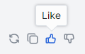

**View current settings**: on the top bar, point to the language model logo icon near the conversation name to see current settings. In the same bar, you can click the Eraser icon to **clear conversation messages** and click the Gear icon to **change conversation settings**. Refer to [Chat Settings](#conversation-settings) to learn more.

## Chat Settings

In the Chat Settings section, you can define setting for a new conversation by selecting an entity you are going to communicate with (model, application or assistant), defining a system prompt, temperature or addon. During an ongoing conversation, you can edit these settings in a [settings box](#conversation-settings).

In the Chat Settings section, there are the following components:

- [Talk to](#talk-to)
- [System prompt](#system-prompt)
- [Temperature](#temperature)
- [Addons](#addons)

Take a closer look at each of these elements.

### Talk To

In this section, you can view all models, applications and assistants that you have added to My workspace section. Here, you can select them to use in conversations.

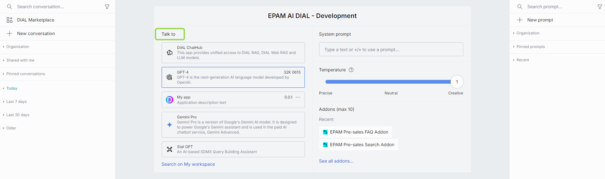

#### Language Models

1. In the **Talk to** area, click **Search on My workspace** to navigate to [My workspace](#my-workspace) where you can display all models, applications and assistants that you have selected. Note, in the [DIAL Marketplace](#dial-marketplace) section, you can view all the models available on your DIAL environment. There, you can select models to add them to [My workspace](#my-workspace).
2. To display just Models, disable all other **Types** and enable just **Models**.
3. To select a model, click any of the available models or select its version in the dropdown list. The selected model will appear in the models list as pre-selected for the new conversation.

#### Available Models

In the [DIAL Marketplace](#dial-marketplace) section, you can view all the models available on your DIAL environment. There, you can select models to add them to [My workspace](#my-workspace).

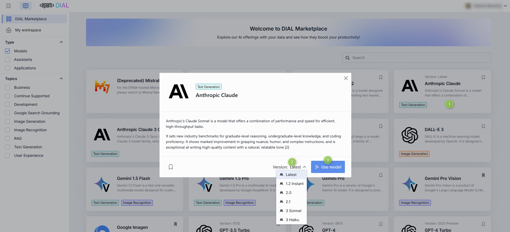

> Refer to [Supported Models](/supported-models) to view all the models supported in AI DIAL.

<!-- - *GPT-3.5* is an advanced language model developed by OpenAI, known for its powerful natural language processing, understanding, and context awareness. Enabling human-like conversations, it can carry out various tasks, including summarizing, translation, content creation, and answering queries.
- *GPT-4* is the latest iteration of the GTP series by OpenAI, offering more powerful natural language processing capabilities than its previous versions. It harnesses extensive training and massive datasets to deliver lifelike conversations, unsurpassed context awareness, and high-quality content generation across multiple languages and domains.
- *GPT-4-32K* is the extension for GTP-4 that can possess a larger context window size (32,000 tokens). It offers several advantages, including a better understanding of context, improved performance in long-form tasks, enhanced reasoning and knowledge handling, and increased creativity in content generation. Please only use this one if you absolutely need it. It's slower and more expensive.
- *PaLM2 (Bison)* is an LLM developed by Google that leverages an innovative hierarchical architecture to enhance its linguistic competence and computational efficiency. By employing parallel and multitask learning mechanisms, PaLM2 (Bison) provides exceptional performance in diverse language tasks, like question-answering, summarization, and translation, while also being highly scalable and adaptive to new environments.
- *AI21 (Jurassic-2 Grande)* is a large-scale language model with 178 billion parameters developed by AI21 Labs. It is an upgraded version of its predecessor AI21 Jurassic-1 and is capable of processing extensive amounts of text and generating contextually appropriate replies. The model's distinguishing features include its scale, contextual understanding, multilingualism, few-shot learning, and knowledge integration with external sources. It is designed to enhance natural language processing, chatbots, virtual assistants, and other applications requiring advanced language capabilities.
- *AI21 (Jurassic-2 Jumbo)* is an expansion of the AI21 Jurassic-2 Grande model, leveraging improved training techniques, larger datasets, and advanced hardware resources. Jumbo provides a boost in performance and is specifically designed for challenging natural language applications such as sentiment analysis, language translation, and document summarization. AI21 Jurassic-2 Jumbo has 199 billion parameters, making it the largest publicly available language model to date.
- *CodeLlama-34b* is a language model developed by Meta that has 34 billion parameters. CodeLlama-34b is specifically designed for use in software development and is trained on a diverse set of technical documentation, including programming languages, code samples, and developer forums. The model is optimized for code-related natural language queries, including code completion, code understanding, and code generation.
- *Llama2q-70B* is an LLM developed by Meta, which has 70 billion parameters. Like CodeLlama-34b, it is designed for technical applications but with a broader scope. Llama2q-70B has a wide range of capabilities, including question answering, text classification, and summarization. It is trained on a variety of sources, including technical documents, academic papers, and news articles, and is designed to provide accurate results for a wide range of technical queries and applications.
- *Anthropic (Claude)* is a large-scale LLM with 175 billion parameters that is optimized for general-purpose language tasks, including question answering, dialogue generation, and text completion. The model has been trained on data from a wide range of sources to provide high accuracy in many contexts.
- *Anthropic (Claude Instant)* is an LLM that can generate responses in real-time, making it useful for applications such as chatbots and virtual assistants. It is a smaller model than the Anthropic (Claude) model, with 9 billion parameters, and is optimized for low-latency inference.
- *Anthropic (Claude V2)* is an upgraded version of the Anthropic (Claude) model, with 400 billion parameters, making it one of the largest language models to date. This model is designed for sophisticated NLP applications involving complex reasoning, inference, and understanding of long-form text data.
- *AWS (Titan)*: AWS (Amazon Web Services) developed an LLM called Titan in 2021, which has 850 billion parameters, making it the largest publicly available language model at the time of its introduction. The model was trained on a diverse set of text sources, including web pages, books, and news articles. Titan is designed to handle complex natural language processing tasks, such as summarization, dialogue generation, and translation. -->

#### Assistants

1. In the **Talk to** area, click **Search on My workspace** to navigate to [My workspace](#my-workspace) where you can display all models, applications and assistants that you have selected. 
2. To display just Assistants, disable all other **Types** and enable just **Assistants**. Note, in the [DIAL Marketplace](#dial-marketplace) section, you can view all the Assistants available on your DIAL environment. There, you can select Assistants to add them to [My workspace](#my-workspace).
3. To select an Assistant, click any of the available Assistants.

In the AI DIAL framework, Assistants are a combination of preselected Addons and System Prompts that enable specific behavior in the LLM, allowing for more tailored and adaptive responses to user needs. Unlike the Model+Addon configuration, where users have the flexibility to choose different Addons, Assistants come with predetermined Addons that cannot be removed or unselected. However, the Model can still be reassigned within the Assistant.

Assistants give you more control over LLM behavior, resulting in tailored and accurate responses that match specific needs. The flexibility of this combination lets you create custom Assistants within the AI DIAL framework. These Assistants can range from simple tasks, like asking the LLM to provide answers in a specific tone or style (e.g., like a pirate), to more complex tasks, such as restricting the LLM's data to a specific geographical area (e.g., providing weather forecasts for Chicago only). Combining Addons and System Prompts enables better customization and adaptability to various situations, leading to more versatile responses.

In a chat application, you can include custom Assistant(s) that users can choose when using AI DIAL.

#### Applications

> * Refer to [Applications](#applications-1) to learn more about them.
> * Refer to [My workspace](#my-workspace) to learn how to register and manage custom apps in AI DIAL Chat.

1. In the **Talk to** area, click **Search on My workspace** to navigate to [My workspace](#my-workspace) where you can display all models, applications and assistants that you have selected. 
2.  display just Applications, disable all other **Types** and enable just **Applications**. Note, in the [DIAL Marketplace](#dial-marketplace) section, you can view all the Applications available on your DIAL environment. There, you can select Applications to add them to [My workspace](#my-workspace).
3. Click any of the available applications to start a conversation. 

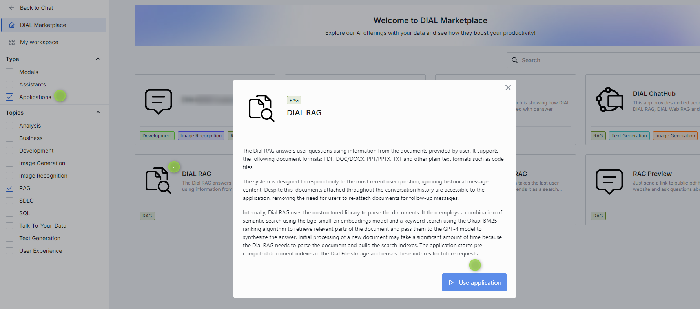

### System Prompt

The system prompt in AI DIAL refers to the initial instructions given to the model. The system prompt in AI DIAL is like a compass for a traveler, pointing the model in the right direction to navigate the conversational landscape, ensuring it stays on course and aligned with the overall purpose and desired outcome.

Type `/` in the text box to select any previously created prompt as a system prompt (for details, refer to the [Create](#create) in Prompts), and it will set the context and tone for the whole conversation.

You can change system prompts during a conversation by selecting the [Settings](#conversation-settings) icon at the top bar of the conversation. 

##### Example

Let's compare a conversation with a system prompt selected and a conversation without a system prompt. For illustration purposes, we are going to use the compare mode (refer to the [Compare](#compare) section for details) and create two conversations with identical settings except for the system prompt selection.

The prompt used as a system prompt is as follows:

> Let's play a game. Name a city that starts with the last letter of the one that I named in a previous message and then tell me that it is my turn to name a city.

| **User message** | **Language model response without a system prompt** | **Language model response with a system prompt** |
| ------------- | ------------------------------------------------ | --------------------------------------------------------- |
| Grodno | Grodno, also known as Hrodna, is a city in western Belarus, near the borders with Poland and Lithuania. It is the administrative center of Grodno region and has a population of around 365,000 people. Grodno is one of the oldest cities in Belarus, dating back to the 11th century. The city boasts a rich history and diverse architectural styles, including baroque, classicism, and modernism. | Oslo. It's your turn!|
| Osaka | Osaka is a large port city and commercial center on the Japanese island of Honshu. It's known for its modern architecture, nightlife, and hearty street food. One of Osaka's most popular tourist destinations is the bustling urban area of Dotonbori, where the city's entertainment and dining scenes come to life with numerous restaurants, bars, and shops. | Ankara. Now it's your turn to name a city! |
| Antwerp | Antwerp is a city in Belgium, and it's the country’s biggest port. It is located on the River Scheldt, linked to the North Sea by the Westerschelde estuary. Known for its many historical buildings, squares, museums, and cultural attractions, it's a popular tourist destination. | Prague. Your turn to name a city! |

### Temperature

The temperature parameter controls the creativity and randomness of the model's output. A higher temperature (e.g., 1.0) makes the output more diverse and creative, while a lower temperature (e.g., 0.1) makes the output more focused and deterministic.

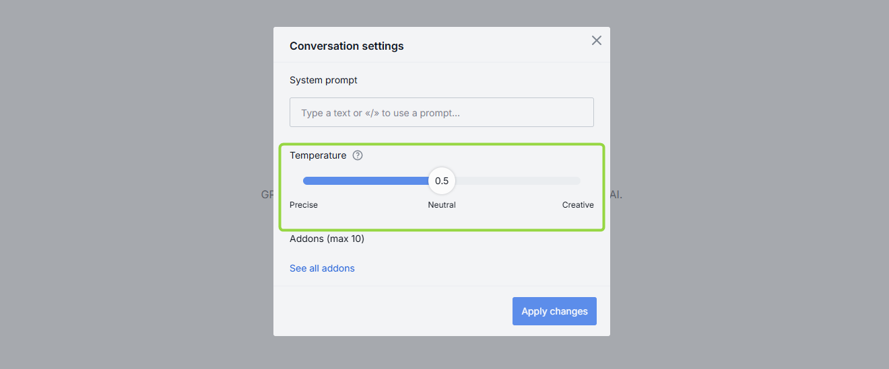

Adjusting the temperature allows you to balance creativity and consistency in the generated response.
 
### Addons

You may want LLM to access particular data or technology to generate responses. This could be your company's database, a collection of PDF documents, calculation engines, API or any other data source or technology.

In the AI DIAL framework, an **Addon** refers to a service or component that conforms to the Open API specification. Examples of Addon implementations include semantic search, Q&A search, database query generators, or any custom logic tailored to meet specific business requirements. AI DIAL allows for the inclusion of custom Addons, which can be activated to achieve desired system behaviors.

1. In the **Talk to** area, select a model to display additional parameters in the section to the right.
2. In the **Addons** section you can view the addons available in your DIAL environment. 
3. Click on **See all addons...** to view all available addons. You can select one or more addons and then click **Apply addons** to start using them.

### Isolated View Mode

In the Isolated View Mode, a user can follow a specific URL `https://server/models/modelID` or `https://server/models/applicationID` to use the AI DIAL Chat in a simplified view with minimal configuration settings for a selected model or application. Conversation settings, conversation and prompt panels are not shown in this case. All created conversations are saved and displayed in the regular chat view mode as well (when just created, names of such conversations are appended in the regular view mode with an `isolated` prefix in the beginning. e.g. `isolated_dial-rag`).

For instance, if a user wants to open GPT-4 without any extra features or configurations, they can simply go to `https://AI DIAL Chat URL/models/gpt-4` and access a streamlined user interface that only contains a chat input with GPT-4:

## User Settings

On the top bar, in the user area, you can click a down arrow to access additional settings or logout.

You can select the chat theme (dark or light), change logo, and switch to the full-width chat mode.

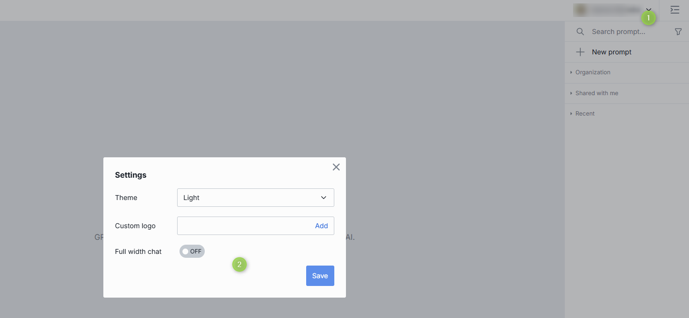

## Attachments

AI DIAL applications (e.g. DIAL RAG) can support attaching files, links or folders to a conversation and generate responses considering the attached resources.

### Folders

If the selected application supports this, you can click the attachment icon in the conversation box and select **Attach folders**.

> Note, that you can attach only folders from the file manager and cannot upload folders from an external source.

In the pop-up window, select a checkbox for the folder you want to add to add it. The attached folder will appear in the conversation box and become available for the application to work with. 

### Links

If the selected application supports this, you can click the attachment icon in the conversation box and select **Attach link**. Then, specify a valid URL and click **Attach**. The link will be displayed as attachment in the conversation box and become available for the application to work with.

### Files

If the selected application supports this, you can click the attachment icon in the conversation box and select **Attach uploaded files**. In the attachments manager, select available files that you have previously uploaded and select a checkbox to add to the conversation. The file will be displayed as attachment in the conversation box and become available for the application to work with.

### Attachments Manager 

All attached and uploaded files are available in the attachments manager. To manage all attachments, click the **Attachments** icon at the bottom of the left panel.

There can be a few tabs in the Attachments Manager: 

* Organization - published files
* Shared with me - files shared with you
* All files - the rest of your files

##### To create a folder

You can create folders and then upload files into them. **Note**, the only way to add a file into a folder is to upload it - you cannot move files between folders.

> AI DIAL applications can be configured to allow attaching entire folders to conversations. In this case, only folders created in the attachments manager can be attached to a conversation.

1. Click a folder icon to create a new folder.
2. Give your folder a name.
3. Click submit to apply.

You can as well perform several actions on your folders: 

* Rename
* Upload files
* Add subfolders

##### To upload a file

To add a file into a folder it is necessary to upload it.

1. In the Manage attachments dialog, select **Upload from device**.
2. Select one or several files you want to upload and click **Open**.
3. Under **Upload to**, select **Change** to pick a folder, in which the files will be uploaded.
4. Under **Files**, change their names or delete them, if necessary. The following symbols in the file names are prohibited: tab, `"`, `:`, `;`, `/`, `\`, `,`, `=`, `{`, `}`, `%`, `&`. Note that you can use the `.` symbol at the start or inside a name, but the dot at the end will be automatically removed.
5. Click **Upload and attach files**.

##### To unshare a file

Using the application that supports the attachments of files, you can create a conversation and share it with someone. When a conversation is shared, all the attached to the conversation files are shared as well. In the attachments manager, such shared files are tagged with a blue arrow.

In the file menu, you can choose to unshare it: 

##### To download attachments

Click a folder to expand it.

1. In the Manage attachments dialog, point to a file and select it. You can select several files.
2. Click the **Download** icon below the files tree.

##### To delete attachments

> You won't be able to preview or download a deleted file in a conversation, but you still will see its name.

1. In the Manage attachments dialog, point to a file and select it. You can select several files.
2. Click the **Delete** icon below the files tree.

## Publications

You can publish/unpublish your applications, conversations and prompts, or even a collection of those, making them accessible within your organization. Additionally, you can manage access to the published resources, ensuring that the right information is accessible to the right individuals or teams.

> Watch [Publications](../video%20demos/demos/dial-publications) demo video to learn more about publication and collaboration features in AI DIAL.

### Configuration

> Refer to [tutorials](/tutorials/Collaboration/enable-publications#dial-chat) to learn more about working and configuring publications.

To enable the publication feature:

1. Configure your identity service provider by allocation users in a group for administrators.
2. Configure `access.admin.rules` in AI DIAL Core to define which user roles can perform the admin's actions. Refer to [configuration](https://github.com/epam/ai-dial-core) to view the description of parameters.
3. Configure AI DIAL Chat by including `ConversationsPublishing` and `PromptsPublishing` in the `ENABLED_FEATURES` variable. Refer to [configuration](https://github.com/epam/ai-dial-chat/blob/development/apps/chat/README.md) to view the description of parameters and [examples](https://github.com/epam/ai-dial-chat/blob/development/libs/shared/src/types/features.ts).

### Flow

This is the high level overview of the publication workflow: 

1. Chat user sends a publication request for the selected resource(s) ([conversation](#publish), [prompt](#publish-1), [application](#publish-app)).
2. Admin receives the publication request, reviews it and either approves or declines. Refer to [Process Publish Requests](#process-publish-requests) to learn more.
3. In case the publication request has been approved, the published resources (conversations and prompts) become available for the target audience in the Organization section in the chat application. Published applications can be found in [DIAL Marketplace](#dial-marketplace). If the published conversation includes attachments, they will be available in the [Attachments Manager](#attachments-manager).
4. Resource owner can unpublish the published resource.

> Refer to [Conversations](#publish), [Prompts](#publish-1) and [Publish App](#publish-app) to view step-by-step instructions.

## Administrators

Administrators are chat users that can perform additional actions. Chat interface for administrators includes extra components (for example the **Approve required** tab in conversations and prompts sections)

### Process Publish Requests

Users with the admin role have access to the **Approve required** tab in conversations and prompts sections, where they can view all publish and unpublish requests from users. 

The count shows the number of requests to be reviewed. Each such request has a color dot attached to it. The refresh of a browser updates this information.

**To review**:

1. Click on any conversation or prompt request to open the review window. 
2. In the review window, you can preview the details of the request and download attached files, if present. **Note**, that a request can include both publish and unpublish requests. The latter is highlighted in red color in the list of conversations or prompts. Such mixed requests can be currently realized exclusively using DIAL API. 
3. If **Go to a review...** is displayed, click it to review conversation(s) or prompt(s) in the request. For the unfinished review, this button changes to **Continue review...**. **Note**, you cannot approve the request which has not been reviewed in full. 

4. In the review mode, you can use arrows to navigate between conversations/prompts and click **Back to publication request** when finished reviewing.

5. Once the review is completed, the **Approve** button is enabled. **Note**, you can approve or reject only the entire request.

## Data Visualization

AI DIAL Chat enables data visualization for specific data types using data visualizers. It comes with built-in support for the [Plotly data visualizer](#plotly). To link any other custom visualizers, you can use the [DIAL Chat Visualizer Connector](https://github.com/epam/ai-dial-chat/blob/development/libs/chat-visualizer-connector/README.md) library.

> Refer to [Data Visualization](../tutorials/data-visualization) to learn more about visualizing data in chat and custom visualization apps.

### Plotly

Plotly is an open-source JavaScript library that enables the creation of diverse data visualizations, including charts, 3D graphs, and more.

> * Refer to [Plotly](https://plotly.com/) to learn more. 
> * Watch [Animated Scatterplot](../video%20demos/demos/animated-scatterplot) demo video to see how statistical data can be visualized in AI DIAL Chat using a Plotly animated scatterplot.
> * Watch [Omics AI Assistant](../video%20demos/demos/dial-omics-assistant) demo video to see how protein structures can be visualized with Plotly.

AI DIAL Chat integrates with Plotly, offering robust data visualization capabilities. To utilize Plotly, choose an AI DIAL application that supports this feature. These applications must be capable of querying data (either from a URL or directly from the Chat application) based on user input and returning it in a format compatible with Plotly. Chat automatically detects attachments in this format and uses Plotly to visualize the data.

The visualizations come with standard Plotly controls for easy manipulation.

> Refer to [Plotly GitHub](https://github.com/plotly/react-plotly.js) to learn more. 

## Applications

> Refer to [My workspace](#my-workspace) to learn how to add and manage applications in AI DIAL Chat.

An **Application** in AI DIAL refers to any custom logic with a conversational interface, adhering to a [Unified API](https://epam-rail.com/dial_api#/paths/~1openai~1deployments~1%7BDeployment%20Name%7D~1chat~1completions/post), and packaged as a ready-to-deploy solution. Applications can facilitate the customization of a language model behavior by incorporating tools (such as [Addons](#addons)) with a desired functionality. Additionally, applications can support logic not directly related to LLMs, such as echoing user messages, creating a fully deterministic chatbot, or orchestrating complex interactions involving multiple LLMs. The flexibility offered by applications enables customized solutions for distinct scenarios and needs.

AI DIAL platform serves as an **application server**, offering tools to develop, deploy and operate custom applications. Refer to [Application Types](#application-types) to learn more about DIAL applications.

Applications can be developed (using [DIAL SDK](https://github.com/epam/ai-dial-sdk)) to execute any custom logic and can even form an [ecosystem](./architecture#introduction) and interact with each other through the [Unified API](https://epam-rail.com/dial_api) with access to all DIAL Core features among which is connectivity to models (including multi-modal models), file storage, access control, per-request API keys and other.

> Watch a [DIAL RAG](../video%20demos/demos/dial-rag) and [DIAL ChatHub](../video%20demos/demos/dial-chathub) videos as examples of what DIAL applications may look like.

### Application Types

#### Custom Apps

DIAL applications can be integrated into the DIAL Core deployment. By doing so, these applications will be immediately available in your chat from the start. For examples, refer to the [dynamic setting](https://github.com/epam/ai-dial-core?tab=readme-ov-file#dynamic-settings) in DIAL Core. Additionally, you can register your custom and deployed applications through the [DIAL API](https://epam-rail.com/dial_api#tag/Applications/paths/~1v1~1applications~1%7BBucket%7D~1%7BApplication%20Path%7D/put) and [DIAL Marketplace](#add-custom-app). In such cases, the configuration of your custom applications, described in a JSON file, is saved in your blob store and accessed by DIAL Core for usage.

> Refer to [My workspace](#add-custom-app) to learn how to add a custom app in DIAL Marketplace.

#### Quick Apps

DIAL Quick Apps are conceptually similar to OpenAI's GPT. Quick Apps do not contain any programming code (they include a toolset, description and instruction to the language model) and enable you to rapidly build an application right within DIAL Chat, use it, and share it with others. Quick Apps can be used to simplify a workflow or carry out a specific task. For example, you can create a Quick App with a configuration allowing it to call an external API to get a real-time weather forecast for a specific location.

> * Watch a [Demo Video](../video%20demos/demos/quick-apps) with an introduction to Quick Apps.
> * Refer to [My workspace](#add-quick-app) to learn how to add a Quick App in DIAL Marketplace.

#### Code Apps

DIAL Core Apps allow you to develop, deploy and run your Python applications directly in the AI DIAL Chat. It is a useful tool if you need to quickly create an application for the POC, deploy it and share with the selected audience.  

> * Watch a [Demo Video](../video%20demos/demos/code-apps) with an introduction to Code Apps.
> * Refer to [My workspace](#add-code-app) to learn how to add a Code App in DIAL Marketplace.

Code Apps are deployed and maintained exclusively by AI DIAL platform, similarly, to handling lambda function by cloud providers. 

## Marketplace

### Overview

> Watch [Marketplace](../video%20demos/demos/marketplace) demo video to see it in action.

Click **DIAL Marketplace** to navigate to the *home page* of DIAL Marketplace where you can find all [applications](#applications), [language models](#available-models) and [assistants](#assistants) available on your DIAL environment. Here, you can also find all applications [published](#publish-app) in your organization.

You can navigate to this section form the main chat screen: 

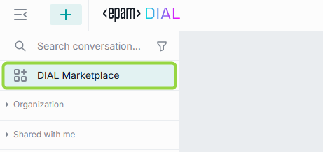

In DIAL Marketplace, there are two sections: 

* [DIAL Marketplace](#dial-marketplace): this section includes all applications, language models and assistants available on your DIAL environment.
* [My workspace](#my-workspace): this section includes all applications, language models and assistants that you have selected in DIAL Marketplace. In this section, you can also register your custom applications.

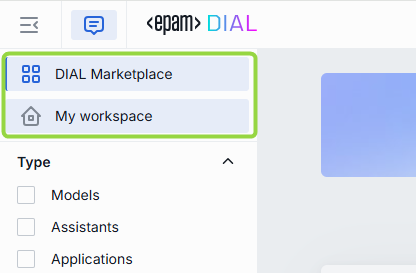

From both these sections you can click **Back to Chat** to navigate to the main chat screen.

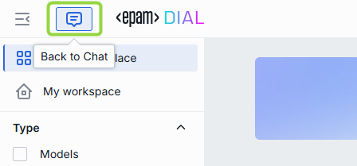

Use the **Type** filters to display any or all applications, language models, and assistants, and categorize them by **Topic**. Additionally, the **Search** allows you to swiftly locate any item.

### DIAL Marketplace

Click **DIAL Marketplace** to navigate to the *home page* of DIAL Marketplace where you can find all [applications](#applications), [language models](#available-models) and [assistants](#assistants) available on your DIAL environment. Here, you can also find all applications [published](#publish-app) in your organization.

##### Add to My workspace

In the DIAL Marketplace section, you can view details of any item and add it to [My workspace](#my-workspace).

To simply add/remove an item to/from My workspace, click **Add/Remove to/from My workspace** label:

You can also add an item to My workspace by initiating a conversation with it. For example, to add a model:

1. Click a model to view its details.
2. Choose its version (if available). Note, that you can add different versions in several iterations. In this case, you will be able to select a model's version in [Talk to](#talk-to) before the conversation.
3. Click **Use** to initiate a conversation.
4. You can find the added model in [My workspace](#my-workspace) and in [Talk to](#talk-to).

> **Please note**, that if you start a conversation and then remove the associated item from My workspace, you will need to reinstate the item to continue the conversation. A button will appear in place of the chat text box. Simply click this button to return the item to My workspace and resume the conversation.

### My workspace

In **My workspace**, you can access all the applications, language models, and assistants that you have added in [DIAL Marketplace](#dial-marketplace). Here, you can view and select items for your conversations, as well as remove them from the list. Additionally, in My workspace, you can add [custom](#add-custom-app), [quick](#add-custom-app), and [code](#add-custom-app) apps.

> Refer to [Application Types](#application-types) to learn more about DIAL applications.

#### Add Custom App

> You can also add custom applications using [DIAL API](https://epam-rail.com/dial_api#tag/Applications/paths/~1v1~1applications~1%7BBucket%7D~1%7BApplication%20Path%7D/put).

If you want to add your custom application, you can do it in AI DIAL Chat or via [DIAL API](https://epam-rail.com/dial_api#tag/Applications/paths/~1v1~1applications~1%7BBucket%7D~1%7BApplication%20Path%7D/put). After adding a custom application, a JSON file describing the configuration of your application will be saved in a dedicated folder within a blob store account bucket assigned to your user account. These files can then be accessed by DIAL Core to facilitate the integration and operation of your applications. Configuration of a custom application matches DIAL Core dynamic configuration for applications. Refer to [Examples](https://github.com/epam/ai-dial-core/blob/development/sample/aidial.config.json) to view how it can look like.

> **Important Requirement**: Custom applications must provide a chat completion endpoint for DIAL Core and adhere to the [Unified API](https://epam-rail.com/dial_api#/paths/~1openai~1deployments~1%7BDeployment%20Name%7D~1chat~1completions/post) standards to ensure seamless integration and functionality.

##### To Add Custom App

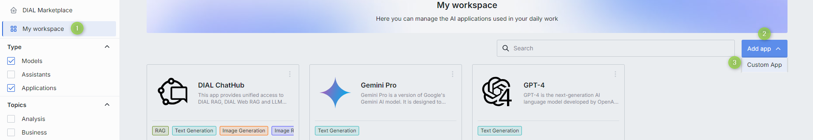

1. In My workspace, click **Add app** and select **Custom App**.
2. Fill in the [Add application](#addedit-application-form) form.
3. Your new application will appear in [My workspace](#my-workspace).

##### Add/Edit application form

|Field|Required|Description|
|---|:---:|-------------|
|Name|Yes|Application name.|
|Version|Yes|Application version, following the format `x.y.z` and contain only numbers and dots.|
|Icon|Yes|The icon that will be rendered in the chat UI for this application.|
|Topics|No|You can assign one of pre-defined topics to your custom application. Topics and their styles are defined in [AI DIAL Chat Themes](https://github.com/epam/ai-dial-chat-themes/blob/development/static/config.json). You can also add custom applications using [DIAL API](https://epam-rail.com/dial_api#tag/Applications/paths/~1v1~1applications~1%7BBucket%7D~1%7BApplication%20Path%7D/put). In this case, you can add any custom topic to your application by including this parameter in the application configuration JSON file: `"description_keywords": ["My custom topic"]`|
|Description|No|A short description that will be rendered in the chat UI. Add two line breaks and provide an addition description if needed.|
|Features data|No|Application features are specific configurations of applications specified in JSON format. Currently, only two are supported: rate and configuration endpoints: `rateEndpoint` is the endpoint for rate requests. `configurationEndpoint` is the endpoint to request application configuration parameters as JSON schema. Refer to [DIAL Core documentation](https://github.com/epam/ai-dial-core?tab=readme-ov-file#dynamic-settings) to view the full set of available application features.|
|Attachments type|No|Types of attachments allowed for this application. Provide the types according to [MIME standard](https://developer.mozilla.org/en-US/docs/Web/HTTP/Basics_of_HTTP/MIME_types/Common_types). E.g.: image/png and click enter. Enter `*/*` to allow all types.|
|Max. attachments number|No|The maximal number of attachments the application is allowed to accept. Skip to apply the max integer number. Enter `0` to disable attachments.|
|Completion URL|Yes|A chat completion URL exposed by your application and used by DIAL Core to send chat completion requests.|

#### Add Quick App

DIAL Quick Apps are not composed of programming code. Instead, they can be characterized as no-code instructions and configurations with a toolset for language models.

> Refer to [Quick Apps](#quick-apps) to learn more.

##### To Add Quick App

1. In My workspace, click **Add app** and select **Quick App**.
2. Fill in the [Add quick app](#addedit-quick-app-form) form.
3. Your Quick App will appear in [My workspace](#my-workspace).

##### Add/Edit Quick app form

|Field|Required|Description|
|---|:---:|-------------|
|Name|Yes|Quick app name.|
|Version|Yes|Quick app version, following the format `x.y.z` and contain only numbers and dots.|
|Icon|No|The icon that will be rendered in the chat UI for this Quick app.|
|Topics|No|You can assign one of pre-defined topics to your Quick app. Topics and their styles are defined in [AI DIAL Chat Themes](https://github.com/epam/ai-dial-chat-themes/blob/development/static/config.json).|
|Description|No|A short description that will be rendered in the chat UI. **Tip:** Add two line breaks and provide an addition description if needed.|
|Configure toolset|Yes|Enter a valid Json with a toolset configuration that will be used when making requests. E.g. this toolset can define how to make calls to external API.|
|Instructions|No|Instructions to the language model.|
|Temperature|Yes|The temperature controls the creativity and randomness of the model's output.|

#### Add Code App

DIAL Code Apps allow you to develop, edit, deploy, and run Python applications directly within DIAL Chat UI. 

You can:

* Create and customize Code Apps using the built-in Python code editor directly in DIAL Chat.
* Deploy Code Apps without worrying about hosting or scalability.
* Implement essential endpoints for DIAL compatibility.
* Manage environment variables.
* Edit and publish Code Apps.

> Refer to [Code Apps](#code-apps) to learn more.

Limitations and security restrictions:

* Code Apps do not have access to internet.
* Code Apps do not have state outside of DIAL APIs.
* You can use only Python libraries, databases, and models that are supported by AI DIAL.
* Code Apps cannot call each other or any external endpoints with the exception of  DIAL Core, if it is allowed.
* All traffic is encrypted, and Code Apps are run in an isolated network.

##### To Add Code App

1. In My workspace, click **Add app** and select **Code App**.
2. Fill in the [Add code app](#addedit-code-app-form) form.

##### To Launch Code App

After adding, your new Code App will appear in [My workspace](#my-workspace). 

1. Click **Deploy** in the Code App menu to run it. When deployed, you will get a notification on your screen and the Code App's status icon will turn from yellow to green - this may take a few minutes.

2. Select the application and click **Use application** to launch it.

##### To Access Code App Logs

You can view and download logs of the deployed Code App from the application menu.

##### To Edit Code App

To modify the application source code or the application form parameters, you need to undeploy it. Both **Edit** and **Undeploy** buttons are located in the application's menu:

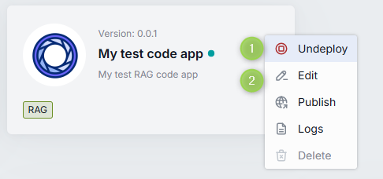

##### Add/Edit code app form

|Field|Required|Description|
|---|:---:|-------------|
|Name|Yes|Code app name.|
|Version|Yes|Code app version, following the format `x.y.z` and contain only numbers and dots.|
|Icon|No|The icon that will be rendered in the chat UI for this Code app.|
|Topics|No|You can assign one of pre-defined topics to your Code app. Topics and their styles are defined in [AI DIAL Chat Themes](https://github.com/epam/ai-dial-chat-themes/blob/development/static/config.json).|
|Description|No|A short description that will be rendered in the chat UI. Add two line breaks and provide an addition description if needed.|
|Attachments type|No|Types of attachments allowed for this application. Provide the types according to [MIME standard](https://developer.mozilla.org/en-US/docs/Web/HTTP/Basics_of_HTTP/MIME_types/Common_types). E.g.: image/png and click enter. Enter `*/*` to allow all types.|
|Max. attachments number|No|The maximal number of attachments the application is allowed to accept. Skip to apply the max integer number. Enter `0` to disable attachments.|
|Select folder with source files|Yes|Use this to define the file structure of your application and enter into the built-in fully functional Python code editor. Here, you can write your app from scratch or upload the existing source code files.|
|Runtime version|Yes|Select the environment in which Python code will be executed.|
|Endpoints|Yes|Code App must expose a chat completion endpoint. You can also add rate and configuration endpoints. Refer to [DIAL Core](https://github.com/epam/ai-dial-core) to learn about endpoints. **Note**: Code Apps cannot call each other or any external endpoints with the exception of  DIAL Core, if it is allowed.|
|Environment variables|No|You can define environment variables with values for your application.|

#### Converse

In My workspace, you can select which application, model or assistant you want to have in [Talk To](#talk-to) and then use in your conversations.

1. In [My workspace](#my-workspace), click an app/model/assistant.
2. Click **Use..** to start a new conversation with the selected entity. This entity will also be added in your [Talk To](#talk-to) section.

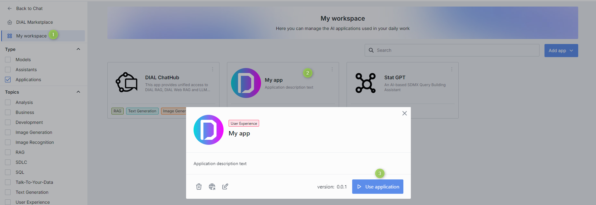

#### Edit App

> You can also edit your custom, quick and code applications in [Talk To](#talk-to).

Use Edit in the app's menu to modify your apps.

> **Note**: you can edit only **your own** apps. To [Edit a Code App](#to-edit-code-app), undeploy it first.

##### To edit application

1. Click **Edit** to invoke the [Edit app](#addedit-application-form)/[Edit quick app](#addedit-quick-app-form)/[Edit quick app](#addedit-code-app-form)
2. Make changes and click **Save**

#### Publish App

You can publish your custom, quick and code applications to make them accessible to the selected audience in your organization. Refer to [Publications](#publications) to learn more about this functionality and to [Tutorials](./tutorials/Collaboration/enable-publications) for a more extended documentation.

> **Note**: all published applications within your organization will appear in DIAL Marketplace for the corresponding audience.

##### To publish application

> You can also publish your custom, quick and code applications in [Talk To](#talk-to).

1. In the application menu (you can also find a Publish icon in the Edit application form), click **Publish**

   

2. Enter **publication request name** in the upper area.
3. In **Publish to**, select the target destination or a folder to publish your prompt into.
4. In **Allow access...**, specify access rules and the target audience. For example Role-Equals-Admin. **Note**: the available roles are defined in each organization individually. Contact your support to find out the rules are applicable in your organization.
5. In **Applications** you can choose what applications you want to publish.
6. Click **Send request** to send your publication request to the administrator.

> **Note**, when your request is approved, the published application will become available in the [DIAL Marketplace](#dial-marketplace) for the target audience.

#### Remove

You can remove any application/model/assistant from My workspace. Use Remove in the item's menu to do this: 

1. Navigate to the My workspace section.
2. In the item's menu, click **Remove**.
3. Confirm your action in the dialog window.

#### Delete App

> You can also delete your custom, quick and code applications in [Talk To](#talk-to).

Use Delete in the app's menu to completely delete the selected application. **Note** that you can delete only your own apps.

##### To delete application

1. Navigate to the My workspace section.
2. In the application menu, click **Delete**.
3. Confirm your action in the dialog window.

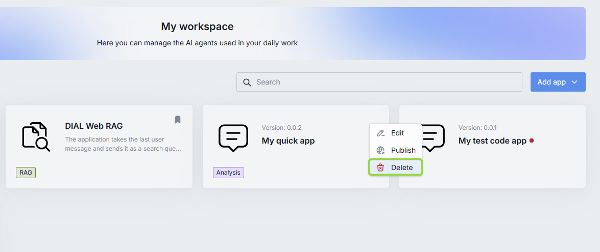

