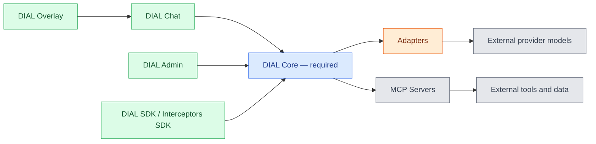
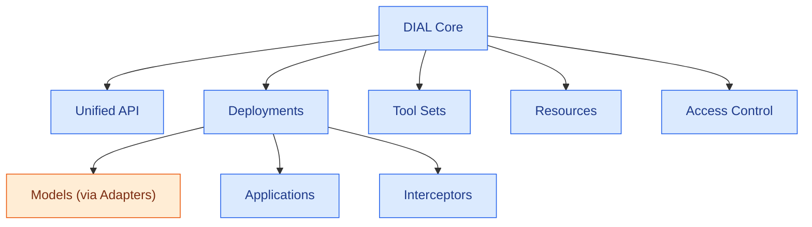
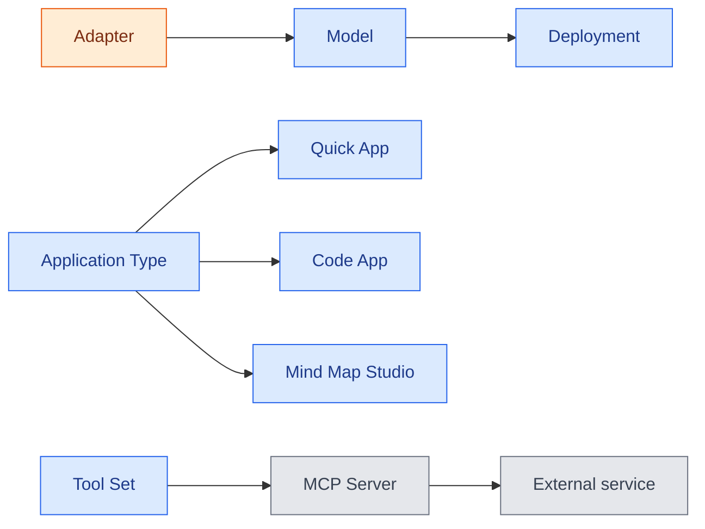

# Concept map

DIAL has many moving parts — Core, adapters, applications, tool sets, interceptors, and the UI layers around them — and the names alone do not reveal how they fit together. This page is a visual and narrative map of those relationships. It is written for architects and developers who have read [What is DIAL](../../1.positioning/1.what-is-dial.md) and want a single picture of the platform before diving into any one part. For one-line definitions of every term used here, see the [glossary](./2.glossary.md).

## One required component, everything else optional

The central idea of DIAL is that [DIAL Core](./2.glossary.md#dial-core) is the only mandatory component. Core exposes the [Unified API](./2.glossary.md#unified-api) and routes every request through it. Everything else — the chat UI, the admin panel, adapters, applications, interceptors — plugs into Core or sits in front of it. This is why the concept map is best read as concentric layers radiating out from Core, rather than as a flat list of features.

The diagram below shows those layers. Color marks the component category, and the same scheme is reused in the diagrams that follow: Core is blue, the optional UI layers (DIAL Chat, DIAL Admin, DIAL Overlay, and the SDKs) are green, provider integration through adapters is orange, and external systems are gray.

## Inside DIAL Core

DIAL Core is itself made of a few major parts. The [Unified API](./2.glossary.md#unified-api) is the entry point. [Deployments](./2.glossary.md#deployment-configuration-sense) expose models, [applications](./2.glossary.md#application), and [interceptors](./2.glossary.md#interceptor). [Tool sets](./2.glossary.md#tool-set), [resources](./2.glossary.md#resource), and [access control](../../4.security-and-governance/1.authentication-and-access-control.md) round out what Core manages.

## How the building blocks compose

The platform's power comes from composition: most concepts are building blocks that snap together through the Unified API. Three chains carry most of that composition — wrapping a provider model, defining an application from a template, and reaching external services through a tool set:

Reading from the smallest unit outward:

- An [adapter](./2.glossary.md#adapter) wraps an external provider model so it speaks the Unified API. Once wrapped, a model is just another [deployment](./2.glossary.md#deployment-configuration-sense) in Core.
- An [application](./2.glossary.md#application) is also a deployment. Because applications and models both speak the Unified API, an application can call a model — or another application — through the same interface. This interchangeability is the basis of the [agentic platform](../../3.capabilities/1.agentic-platform.md).
- Schema-rich applications are defined by an [application type](./2.glossary.md#application-type). The standard types — [Quick App](./2.glossary.md#quick-app), [Code App](./2.glossary.md#code-app), and [Mind Map Studio](./2.glossary.md#mind-map-studio) — let end users create applications without writing code.
- A [tool set](./2.glossary.md#tool-set) connects an application to external services through an [MCP server](./2.glossary.md#mcp-server). Quick Apps use tool sets to reach beyond the model.
- An [interceptor](./2.glossary.md#interceptor) sits in the request path of a deployment, modifying requests or responses — for example, redacting PII before a prompt reaches a model.

The UI layers reuse the same blocks rather than introducing new ones. [Agent builders](./2.glossary.md#agent-builder) in [DIAL Chat](./2.glossary.md#dial-chat) are wizards over application types; the [Marketplace](./2.glossary.md#marketplace) lists deployments the user can access; and [DIAL Overlay](./2.glossary.md#dial-overlay) embeds Chat into another web application without rebuilding any of it.

## One canonical name per concept

Several concepts in DIAL carry more than one name across source code, UI labels, and informal speech. The glossary resolves each to a single canonical term. The most important example is the [agent builder](./2.glossary.md#agent-builder): it appears as "application runner" in source code, "application builder" in the Chat UI, and "builder" in the Admin sidebar. Documentation uses **agent builder** everywhere. When a diagram or page seems to introduce a new concept, check the glossary first — it is often an existing one under a different label.

## Further reading

- [Glossary](./2.glossary.md) — canonical definition of every term in this map
- [Architecture highlights](../../2.architecture/1.architecture-highlights.md) — how these components behave at runtime
- [Agentic platform](../../3.capabilities/1.agentic-platform.md) — why composition through the Unified API is the core design choice

## Next steps

- [DIAL Stack](../../2.architecture/2.dial-stack.md) — the concrete services and dependencies behind these concepts
- [DIAL evolution](../2.dial-evolution.md) — how the platform grew into this shape
