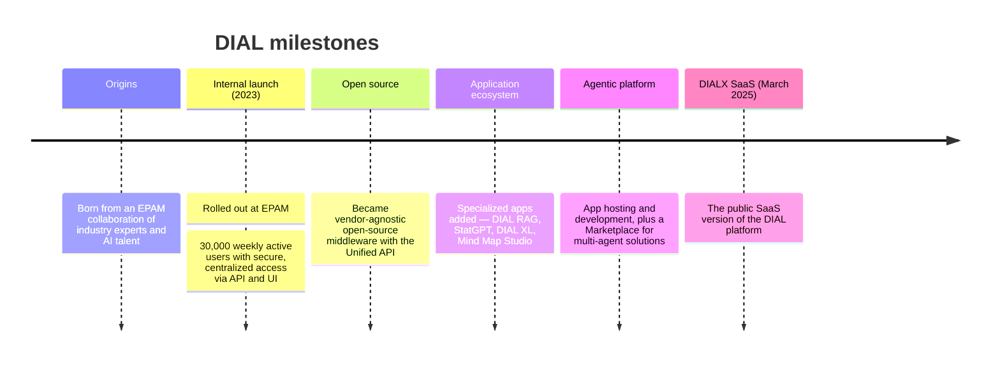

# DIAL evolution

DIAL did not start as an open-source product — it grew into one. This page explains why DIAL exists, how it evolved from an internal EPAM project into a vendor-agnostic platform, and what that history reveals about its design priorities. It is written for evaluators and architects who want the context behind the platform before assessing it. For per-release changes, see the Changelog in Reference; this page is about the trajectory, not the version notes.

## Why DIAL exists

When enterprises first adopted generative AI, each team tended to wire its own application directly to a single model provider. That pattern does not scale: it scatters credentials, makes cost and usage impossible to govern centrally, and locks each application to one vendor. DIAL was conceived to solve that problem once, for everyone, by putting a single governed layer — the [Unified API](../2.architecture/4.unified-api-overview.md) — between applications and the models, with access control, cost management, and observability built in.

This founding goal explains the shape of the platform today. The emphasis on a vendor-agnostic API, on [DIAL Core](./1.core-concepts-and-glossary/2.glossary.md#dial-core) as the only required component, and on composition over rebuilding all trace back to the original need for centralized, reusable AI access.

## How it got here

- **How it all started.** DIAL was born from a collaboration between industry experts and young champions, attracting AI talent from [EPAM](https://www.epam.com/).
- **Taking off.** DIAL was [launched internally](https://www.epam.com/about/newsroom/press-releases/2023/epam-launches-dial-a-unified-generative-ai-orchestration-platform) at EPAM, reaching 30,000 weekly active users by providing secure, centralized access to AI tools through both API and UI.
- **Driving business value.** DIAL evolved into a vendor-agnostic, [open-source](https://dialx.ai/open-source) middleware with a [Unified API](../2.architecture/4.unified-api-overview.md), driving return on investment through targeted AI solutions.
- **Advanced applications.** Specialized apps joined the ecosystem: [RAG in DIAL](../3.capabilities/2.rag-in-dial.md), StatGPT, [DIAL XL](https://xl.dialx.ai/), and [Mind Map Studio](./1.core-concepts-and-glossary/2.glossary.md#mind-map-studio).
- **App Server, agentic framework, and Marketplace.** DIAL added application hosting and development, and a [Marketplace](./1.core-concepts-and-glossary/2.glossary.md#marketplace) for multi-agent solutions.
- **SaaS.** In March 2025, EPAM introduced DIALX, the public SaaS version of the DIAL platform.

## What the trajectory reveals

Each phase added a layer without discarding the one beneath it. The Unified API came first; applications, agent builders, and the Marketplace were built on top of it rather than alongside it. That additive history is why the platform stays coherent as it grows: new capabilities reuse the same [building blocks](./1.core-concepts-and-glossary/1.concept-map.md) instead of introducing parallel mechanisms.

The move to open source and then to a public SaaS offering also signals the intended audience. DIAL is built to be deployed and governed by an enterprise, not only consumed as a hosted service — which is why so much of the platform is about access control, deployment, and operations rather than the model interaction alone.

The DIAL roadmap is not publicly available. To learn more about the platform's history and direction, see [About Us](https://dialx.ai/about-us).

## Further reading

- [What is DIAL](../1.positioning/1.what-is-dial.md) — the platform's value and positioning
- [Concept map](./1.core-concepts-and-glossary/1.concept-map.md) — how the layers added over time fit together
- [Architecture highlights](../2.architecture/1.architecture-highlights.md) — the current architecture this history produced

## Next steps

- [Agentic platform](../3.capabilities/1.agentic-platform.md) — the design philosophy behind composition and reuse
- [Glossary](./1.core-concepts-and-glossary/2.glossary.md) — definitions for the components named above
