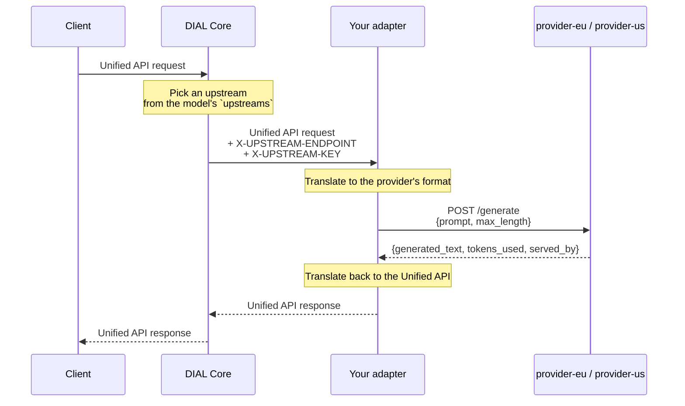

# Tutorial: custom adapter

In this tutorial, you will build a model adapter that translates requests from the DIAL Unified API to an external provider with a non-OpenAI response format. You will run it against two provider upstreams, watch DIAL Core load-balance between them, and see where a provider API key belongs. Basic Python and Docker knowledge is required. Read [What are adapters](0.index.md) first for conceptual background.

## Prerequisites

- Python 3.11 or later installed
- Docker and Docker Compose (V2) installed
- A terminal and a text editor

## What you will build

A custom adapter that sits between DIAL Core and a mock AI provider. The mock provider exposes a proprietary JSON format — not the OpenAI protocol — so the adapter must translate in both directions.

You will run the provider twice, as `provider-eu` and `provider-us`, each with its own API key. DIAL Core picks one per request and tells the adapter which, so the adapter never decides where traffic goes and never holds a key:



## Project structure

When complete, your project directory will look like this:

```
custom-adapter/
├── adapter.py              # ChatCompletion subclass — translates requests and responses
├── app.py                  # DIALApp entry point — registers the adapter
├── requirements.txt        # Python dependencies
├── Dockerfile              # Container image for the adapter
├── docker-compose.yml      # Runs DIAL Core + adapter + two provider upstreams
├── config.json             # DIAL Core configuration — registers the adapter as a model
└── mock-provider/          # Stand-in provider, so no provider account is needed
    ├── server.py
    ├── requirements.txt
    └── Dockerfile
```

## Step 1: Create the project

```bash
mkdir -p custom-adapter/mock-provider && cd custom-adapter
```

## Step 2: Build the mock provider

The mock provider simulates an external AI service with a proprietary API. It accepts `prompt` and `max_length`, and returns `generated_text`.

Two details make it useful for the rest of the tutorial. It requires an `api-key` header matching its own key, so a request only succeeds if the adapter forwarded the right one. And it reports its own name in `served_by`, so you can see which upstream served each request.

Create `mock-provider/server.py`:

```python
import os

from fastapi import FastAPI, Header, HTTPException
from pydantic import BaseModel

UPSTREAM_NAME = os.environ.get("UPSTREAM_NAME", "provider")
EXPECTED_KEY = os.environ.get("EXPECTED_KEY", "")

app = FastAPI()


class GenerateRequest(BaseModel):
    prompt: str
    max_length: int = 512


class GenerateResponse(BaseModel):
    generated_text: str
    tokens_used: int
    served_by: str


@app.post("/generate")
async def generate(
    req: GenerateRequest, api_key: str = Header(default="", alias="api-key")
) -> GenerateResponse:
    if api_key != EXPECTED_KEY:
        raise HTTPException(
            status_code=401,
            detail=f"{UPSTREAM_NAME} rejected the API key",
        )

    response_text = f"Mock response to: {req.prompt[:200]}"
    return GenerateResponse(
        generated_text=response_text,
        tokens_used=len(response_text.split()),
        served_by=UPSTREAM_NAME,
    )
```

Create `mock-provider/requirements.txt`:

```text
fastapi==0.115.0
uvicorn==0.30.0
```

**Verify:** the `/generate` endpoint accepts `{"prompt": "...", "max_length": 512}` and returns `{"generated_text": "...", "tokens_used": 42, "served_by": "..."}`. This format is intentionally different from the OpenAI protocol.

## Step 3: Implement the adapter

The adapter subclasses `ChatCompletion` from DIAL SDK — the same base class Custom Apps use. The difference is that it calls an external API instead of implementing business logic.

It does not know the provider's address or key. DIAL Core chooses an upstream per request and passes it in the `X-UPSTREAM-ENDPOINT` and `X-UPSTREAM-KEY` headers, which the SDK surfaces as `request.upstream_endpoint` and `request.upstream_key`.

Create `adapter.py`:

```python
import httpx
from aidial_sdk.chat_completion import ChatCompletion, Request, Response
from aidial_sdk.exceptions import HTTPException as DialHTTPException
from aidial_sdk.exceptions import InternalServerError

SEPARATOR = "--- served by ---"


class MockProviderAdapter(ChatCompletion):
    async def chat_completion(
        self, request: Request, response: Response
    ) -> None:
        # DIAL Core chooses an upstream from the model's `upstreams` list and
        # passes it in per-request headers. The SDK surfaces them as attributes.
        endpoint = request.upstream_endpoint
        if endpoint is None:
            raise InternalServerError(
                "No upstream endpoint. Declare `upstreams` on the model "
                "deployment in DIAL Core configuration."
            )

        last_message = request.messages[-1]
        user_text = last_message.text() or ""

        # Translate from the Unified API format to the provider's format.
        provider_payload = {"prompt": user_text, "max_length": 512}

        async with httpx.AsyncClient(timeout=30.0) as client:
            provider_response = await client.post(
                endpoint,
                json=provider_payload,
                # The key belongs to the upstream Core picked, so it is read
                # per request and never stored in this service.
                headers={"api-key": request.upstream_key or ""},
            )

        status = provider_response.status_code
        if status != 200:
            # Pass a provider's own 4xx straight through. A rejected key is a
            # configuration error, and retrying it on another upstream would
            # only hide it; 5xx becomes 502, which Core may retry elsewhere.
            raise DialHTTPException(
                status_code=status if 400 <= status < 500 else 502,
                message=(
                    f"upstream rejected the request: "
                    f"{status} {provider_response.text}"
                ),
            )

        result = provider_response.json()

        # Translate the provider's format back into the Unified API format.
        with response.create_single_choice() as choice:
            choice.append_content(
                f"{result['generated_text']}"
                f"\n\n{SEPARATOR}\n{result['served_by']}"
            )
```

**Verify:** `MockProviderAdapter` extends `ChatCompletion` and overrides `chat_completion`. It reads the upstream from the request, translates in both directions, and never references a provider address or key of its own.

## Step 4: Create the application entry point

Create `app.py`:

```python
import uvicorn
from aidial_sdk import DIALApp

from adapter import MockProviderAdapter

app = DIALApp()
app.add_chat_completion("my-adapter", MockProviderAdapter())

if __name__ == "__main__":
    uvicorn.run(app, port=5000, host="0.0.0.0")
```

This registers the adapter at `/openai/deployments/my-adapter/chat/completions`. DIAL Core will route requests to that path.

Create `requirements.txt`:

```text
aidial-sdk==0.42.0
httpx==0.27.0
uvicorn==0.53.0
```

**Verify:** `python -c "from app import app; print(type(app))"` prints `<class 'aidial_sdk.app.DIALApp'>`.

## Step 5: Create the Dockerfiles

Create `Dockerfile` for the adapter:

```dockerfile
FROM python:3.11-slim

WORKDIR /app

COPY requirements.txt .
RUN pip install --no-cache-dir -r requirements.txt

COPY adapter.py app.py ./

EXPOSE 5000

CMD ["uvicorn", "app:app", "--host", "0.0.0.0", "--port", "5000"]
```

Create `mock-provider/Dockerfile`:

```dockerfile
FROM python:3.11-slim

WORKDIR /app
COPY requirements.txt .
RUN pip install --no-cache-dir -r requirements.txt
COPY server.py .

EXPOSE 8080
CMD ["uvicorn", "server:app", "--host", "0.0.0.0", "--port", "8080"]
```

## Step 6: Create the Docker Compose configuration

Create `docker-compose.yml`. The same provider image runs twice, with a different name and key each time:

```yaml
services:
  adapter:
    build: .
    depends_on:
      - provider-eu
      - provider-us

  provider-eu:
    build: mock-provider
    environment:
      UPSTREAM_NAME: "provider-eu"
      EXPECTED_KEY: "eu-provider-key"

  provider-us:
    build: mock-provider
    environment:
      UPSTREAM_NAME: "provider-us"
      EXPECTED_KEY: "us-provider-key"

  core:
    image: epam/ai-dial-core:0.47.1
    environment:
      aidial.config.files: '["/opt/config/config.json"]'
      aidial.storage.overrides: '{ "jclouds.filesystem.basedir": "data" }'
      aidial.redis.singleServerConfig.address: "redis://redis:6379"
      aidial.identityProviders.test.rolePath: 'roles'
      aidial.identityProviders.test.disableJwtVerification: 'true'
      aidial.encryption.secret: 'salt'
      aidial.encryption.key: 'password'
    ports:
      - "8080:8080"
    volumes:
      - ./config.json:/opt/config/config.json
    depends_on:
      - redis

  redis:
    image: redis:7.2.4-alpine3.19
    command: >
      redis-server
      --maxmemory 256mb
      --maxmemory-policy volatile-lfu
      --save ""
      --appendonly no
```

## Step 7: Configure DIAL Core

Create `config.json`. The `endpoint` points at your adapter; the `upstreams` array lists the provider endpoints the adapter should be pointed at, each with its own key:

```json
{
  "keys": {
    "dial_api_key": {
      "project": "TEST-PROJECT",
      "role": "default"
    }
  },
  "roles": {
    "default": {
      "limits": {
        "mock-model": {},
        "mock-model-bad-key": {}
      }
    }
  },
  "models": {
    "mock-model": {
      "type": "chat",
      "displayName": "Mock Provider Model",
      "description": "Custom adapter in front of two mock provider upstreams.",
      "endpoint": "http://adapter:5000/openai/deployments/my-adapter/chat/completions",
      "upstreams": [
        {
          "endpoint": "http://provider-eu:8080/generate",
          "key": "eu-provider-key",
          "weight": 1
        },
        {
          "endpoint": "http://provider-us:8080/generate",
          "key": "us-provider-key",
          "weight": 1
        }
      ]
    },
    "mock-model-bad-key": {
      "type": "chat",
      "displayName": "Mock Provider Model (wrong key)",
      "description": "Same adapter, deliberately misconfigured key. The provider rejects it.",
      "endpoint": "http://adapter:5000/openai/deployments/my-adapter/chat/completions",
      "upstreams": [
        {
          "endpoint": "http://provider-eu:8080/generate",
          "key": "wrong-key"
        }
      ]
    }
  }
}
```

Both deployments share one adapter — the difference is entirely in configuration. `mock-model` has two healthy upstreams of equal `weight`, so DIAL Core spreads traffic evenly; raise one weight to send it proportionally more. `mock-model-bad-key` exists so you can watch a misconfigured key fail in Step 9.

The `roles` block grants the API key access to both deployments.

:::note Upstream headers need upstreams
DIAL Core sends the `X-UPSTREAM-*` headers only for a model with a non-empty `upstreams` list. A deployment without them leaves `request.upstream_endpoint` as `None` — which is why the adapter raises a clear error in that case.
:::

## Step 8: Build and run

```bash
docker compose up --build
```

**Verify:** all five services start without errors. Look for these log lines:

- `provider-eu` and `provider-us` logs: `Uvicorn running on http://0.0.0.0:8080`
- `adapter` logs: `Uvicorn running on http://0.0.0.0:5000`
- `core` logs: `Proxy started on 8080`

## Step 9: Test the adapter

Send a request through DIAL Core:

```bash
curl -s http://localhost:8080/openai/deployments/mock-model/chat/completions \
  -H "Api-Key: dial_api_key" \
  -H "Content-Type: application/json" \
  -d '{"messages":[{"role":"user","content":"Hello from curl"}]}'
```

**Verify:** the reply is in Unified API format, and its content ends with the upstream that served it:

```
Mock response to: Hello from curl

--- served by ---
provider-us
```

Run the same command several times. The `served_by` line alternates between `provider-eu` and `provider-us` — DIAL Core is balancing, and your adapter simply follows the header it is given.

Now try the deliberately misconfigured deployment:

```bash
curl -s http://localhost:8080/openai/deployments/mock-model-bad-key/chat/completions \
  -H "Api-Key: dial_api_key" \
  -H "Content-Type: application/json" \
  -d '{"messages":[{"role":"user","content":"Hello from curl"}]}'
```

**Verify:** it fails with `401` and the provider's own reason:

```json
{"error":{"message":"upstream rejected the request: 401 {\"detail\":\"provider-eu rejected the API key\"}","type":"runtime_error","code":"401"}}
```

That is the whole key story in one request: the adapter is the same, the provider is the same, and only the key in DIAL Core configuration changed.

## What you learned

- Adapters and Custom Apps use the same DIAL SDK — both subclass `ChatCompletion` and register with `DIALApp`
- An adapter translates between the Unified API format and the external provider's format
- DIAL Core picks an upstream per request and passes it in `X-UPSTREAM-ENDPOINT` and `X-UPSTREAM-KEY`, which the SDK exposes as `request.upstream_endpoint` and `request.upstream_key`
- Load balancing is DIAL Core's job, configured with `upstreams` and `weight` — not something the adapter implements
- Provider keys belong to the upstream in DIAL Core configuration, never in the adapter's image

## Next steps

- [What are adapters](0.index.md) — understand how adapters fit into the DIAL architecture
- [config.json models reference](../../4.operating-dial/4.configuration/1.core/2.config-json/1.models.md) — the full `upstreams` schema, including `weight`, `tier`, and retries
- [DIAL SDK reference](../5.developer-tools/1.sdk-reference/0.index.md) — explore `ChatCompletion`, `Request`, and `Response` classes in depth
- [Adapter configuration](../../4.operating-dial/4.configuration/3.adapter-configuration.md) — environment variables for the official OpenAI, Bedrock, and Vertex AI adapters
