# Theming and design

This guide covers how to customize the DIAL Chat appearance—hide panels, apply custom color themes, embed Chat as an overlay, or replace the logo. You should be familiar with deploying and configuring DIAL Chat via environment variables (see [DIAL Chat configuration](../../../4.operating-dial/4.configuration/2.chat-configuration.md) for the full reference).

## How Chat layout is configured

DIAL Chat layout is controlled by the `ENABLED_FEATURES` environment variable. This variable accepts a comma-separated list of feature names. Each feature toggles a specific UI element. To hide a panel or control, remove its feature name from the list. To show it, include it.

The features relevant to layout customization:

| Feature flag | Controls |
|---|---|
| `conversations-section` | Conversation list sidebar |
| `prompts-section` | Prompt list sidebar |
| `top-settings` | Settings in the top bar |
| `top-clear-conversation` | "Clear conversation" button in the top bar |
| `top-chat-info` | Chat info in the top bar |
| `top-chat-model-settings` | Model settings in the top bar |
| `empty-chat-settings` | Settings on the empty chat screen |
| `header` | Application header |
| `footer` | Application footer |
| `custom-logo` | Custom logo support |
| `marketplace` | Marketplace section |

Set `ENABLED_FEATURES` in your Docker Compose file or deployment configuration:

```yaml
chat:
  image: epam/ai-dial-chat:0.41.7
  platform: linux/amd64
  environment:
    ENABLED_FEATURES: "conversations-section,prompts-section,top-settings,header,footer,custom-logo,marketplace"
```

## Layout overview

The default DIAL Chat layout consists of five components:

- **Header** (`header`) — logo, conversation list button, prompt list button, and user settings
- **Conversation list** (`conversations-section`) — all active conversations and a button to start a new one
- **Prompt list** (`prompts-section`) — saved prompts and an action to add a new one
- **Chat area** — user questions and model responses (always visible)
- **Chat box** — text input for messages and commands (always visible)

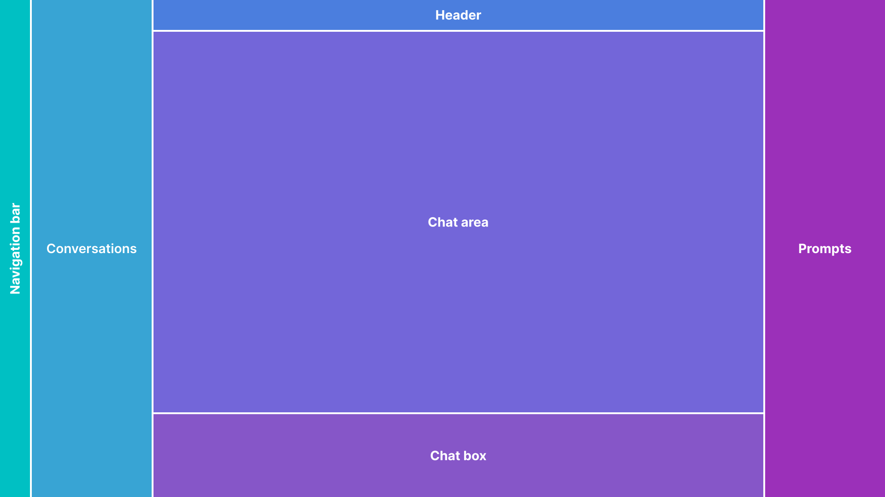

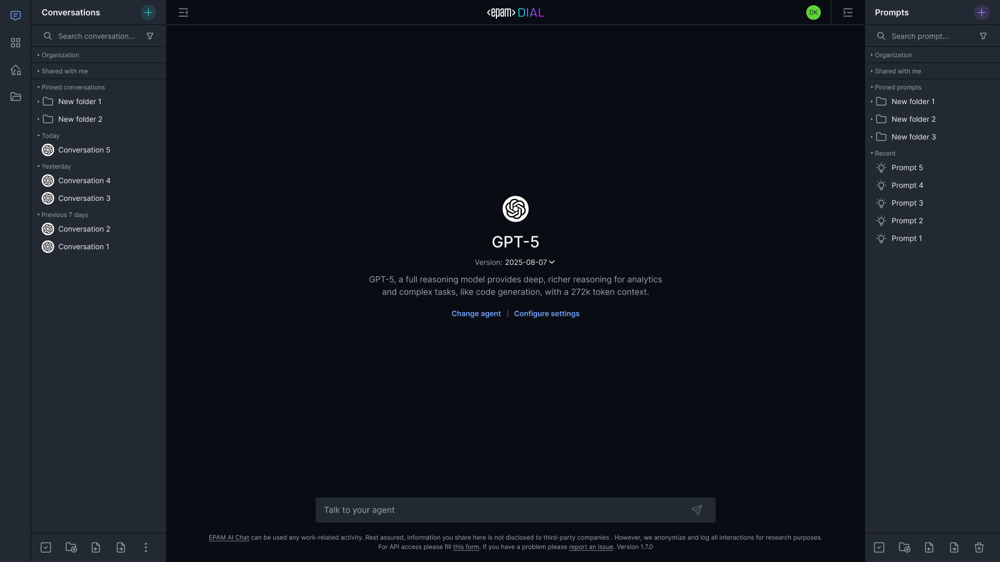

## Desktop layout modifications

Each modification below shows which feature flags to remove from `ENABLED_FEATURES` to achieve the desired layout.

### Hide conversation list

Remove `conversations-section` from `ENABLED_FEATURES`. The user has a single chat session with no conversation history.

```yaml
ENABLED_FEATURES: "prompts-section,top-settings,header,footer,..."
# conversations-section removed
```

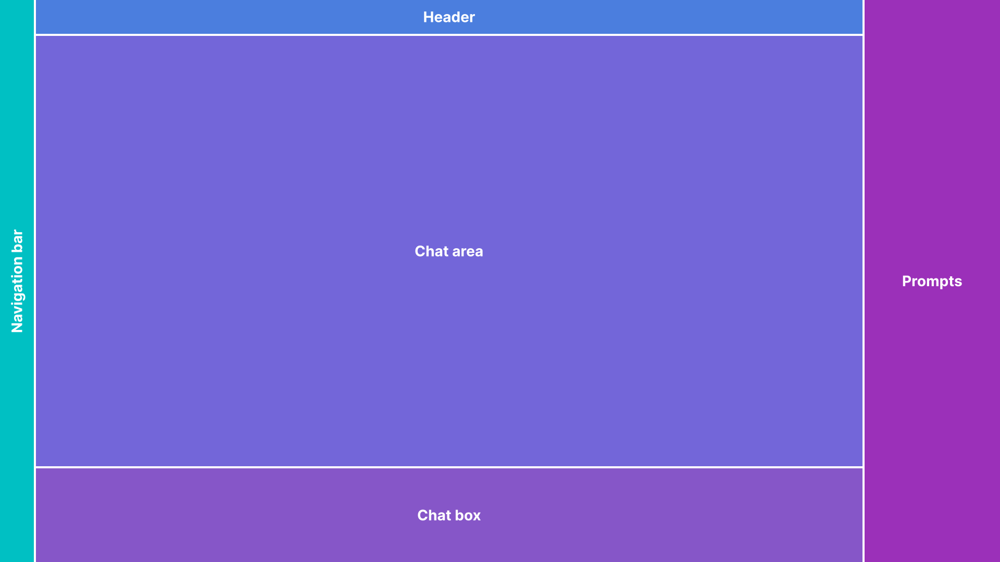

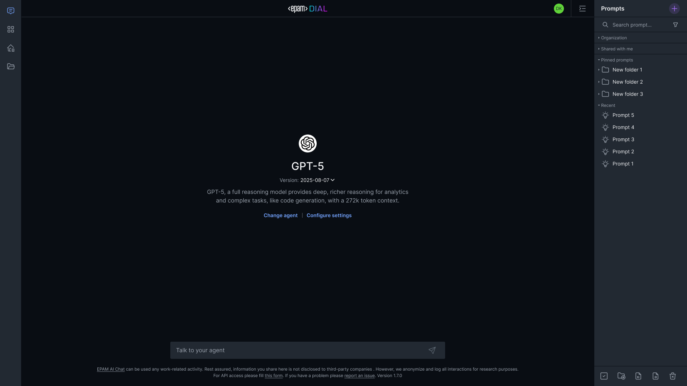

### Hide prompt list

Remove `prompts-section` from `ENABLED_FEATURES`. The saved-prompts panel is removed.

```yaml
ENABLED_FEATURES: "conversations-section,top-settings,header,footer,..."
# prompts-section removed
```

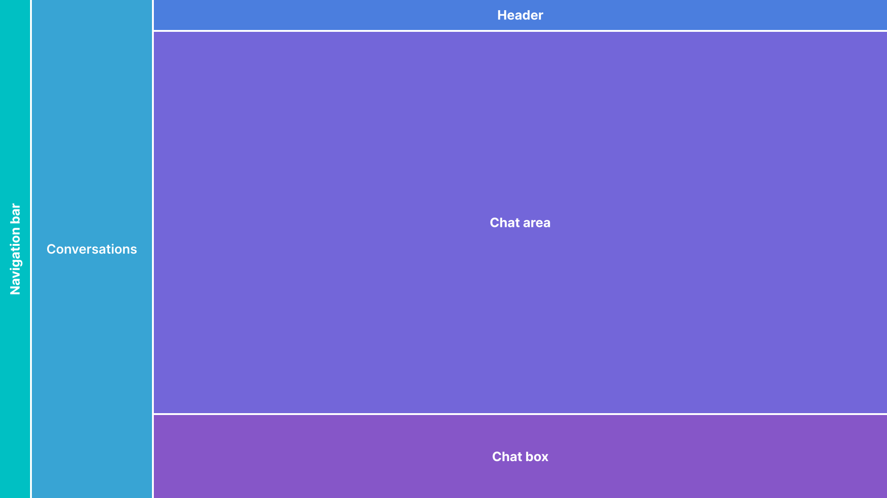

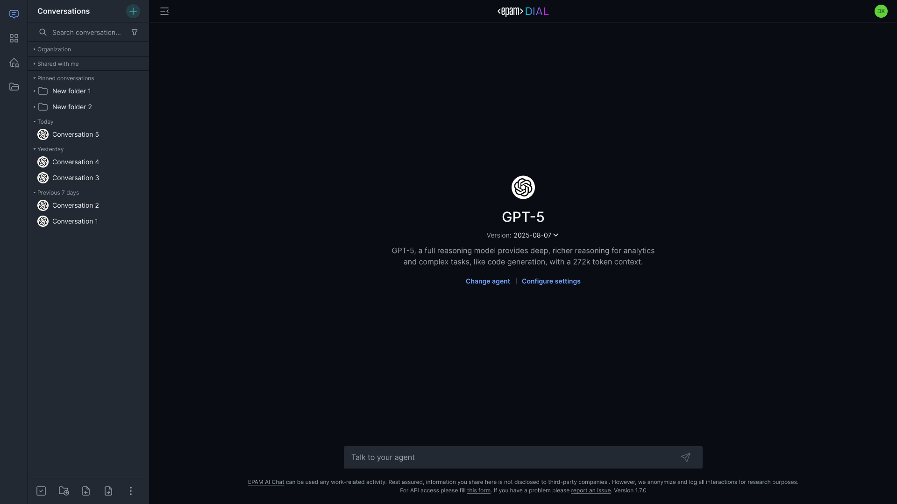

### Hide both conversation and prompt lists

Remove both `conversations-section` and `prompts-section`. Minimal layout with only the chat area and input box.

```yaml
ENABLED_FEATURES: "top-settings,header,footer,..."
# conversations-section and prompts-section removed
```

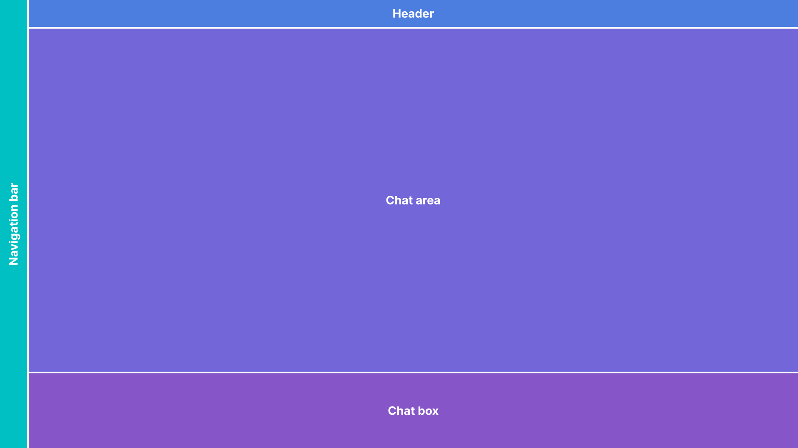

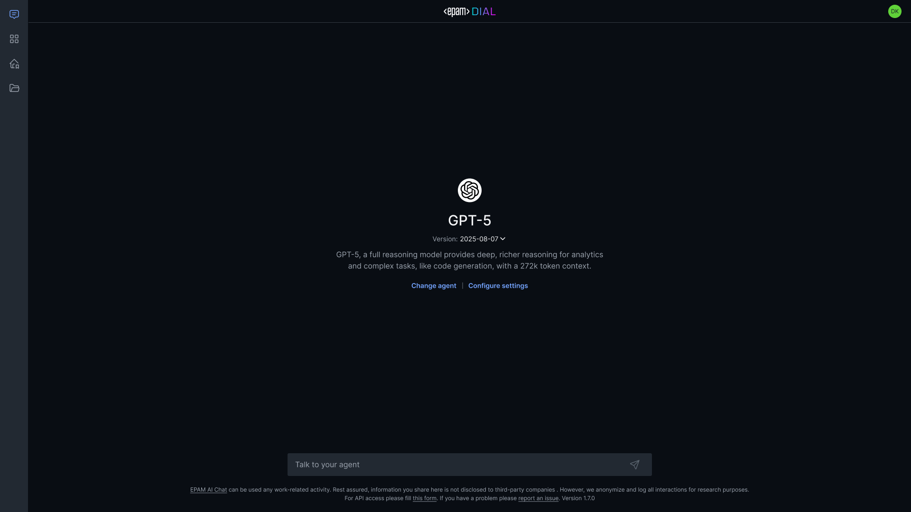

### Hide agent selector and settings

Remove `top-settings`, `top-chat-model-settings`, and `empty-chat-settings`. The new-chat settings panel is hidden across the entire UI.

```yaml
ENABLED_FEATURES: "conversations-section,prompts-section,header,footer,..."
# top-settings, top-chat-model-settings, empty-chat-settings removed
```

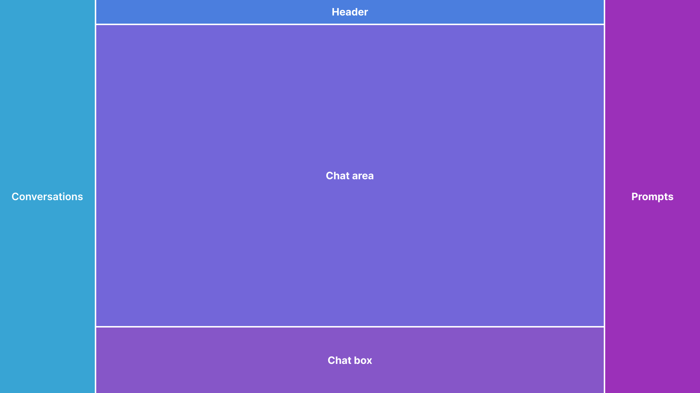

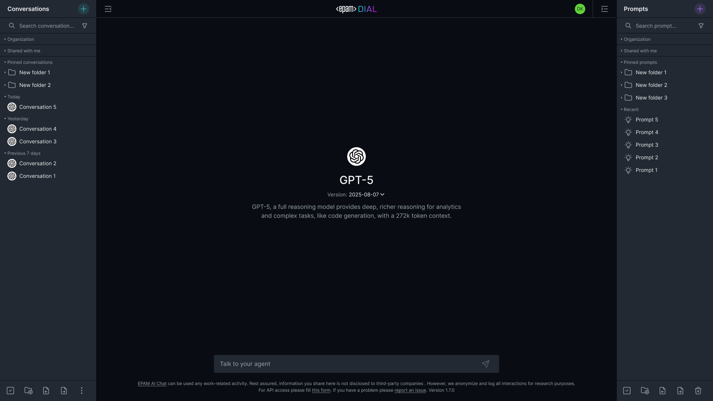

## Mobile layout

DIAL Chat automatically switches to the mobile layout when users open it on mobile devices or resize their browser window below the responsive breakpoint. No additional configuration is required.

### Default mobile


Header controls:
1. Conversation list
2. Start new chat button
3. Prompt list

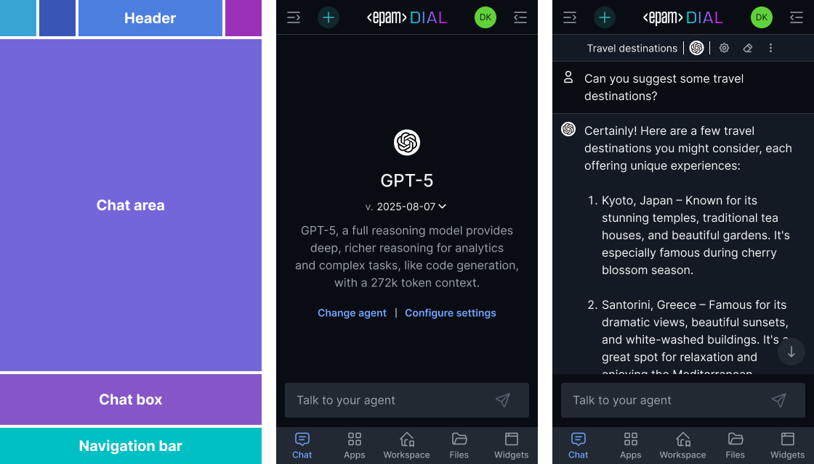

### Simplified mobile

To achieve the simplified mobile layout (single chat, no prompts), remove `conversations-section` and `prompts-section` from `ENABLED_FEATURES`—the same configuration as the desktop "hide both" modification above. The mobile layout adapts automatically.

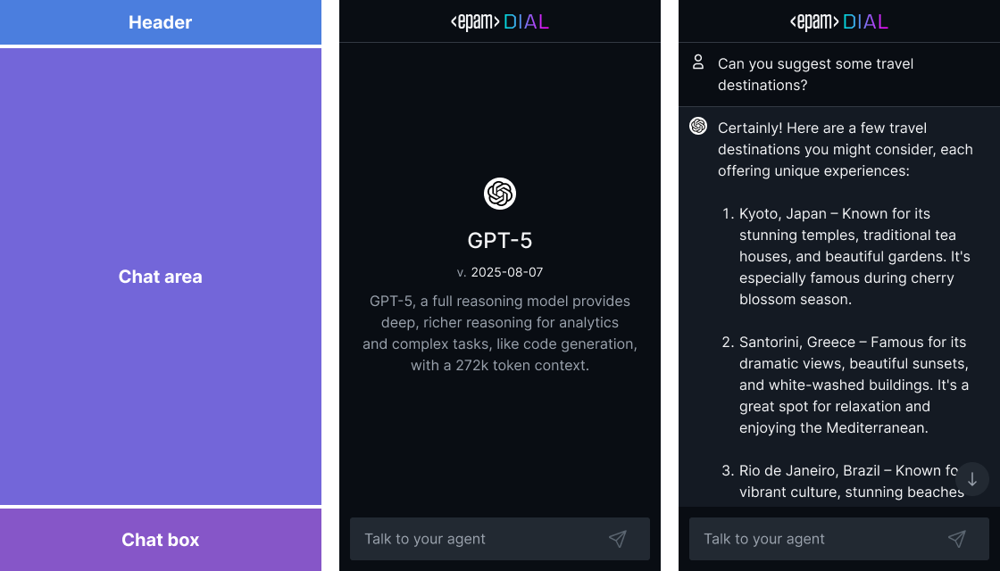

## Overlay layout

To embed DIAL Chat inside another application via an iframe, see [DIAL Overlay](8.dial-overlay.md). The Overlay section covers iframe configuration, layout variants, the programmatic API, and a step-by-step integration tutorial.

## Color schemes

DIAL Chat loads its color theme from a themes server. Point Chat to your themes server using the `THEMES_CONFIG_HOST` environment variable:

```yaml
chat:
  environment:
    THEMES_CONFIG_HOST: "http://themes:8080"
```

The themes server ([`epam/ai-dial-chat-themes`](https://github.com/epam/ai-dial-chat-themes)) serves CSS variable definitions that Chat applies at runtime. The color system uses two token layers:

- **Foundation tokens** — map palette colors to semantic roles (background, text, border)
- **Component tokens** — map foundation tokens to specific UI components

**Warning**
> Variable names must remain the same when you create a new color scheme. Renaming variables breaks the mapping between design tokens and the application CSS.


### Basic palette

The basic palette contains all colors used in the system. Each item has a name and a hex value.

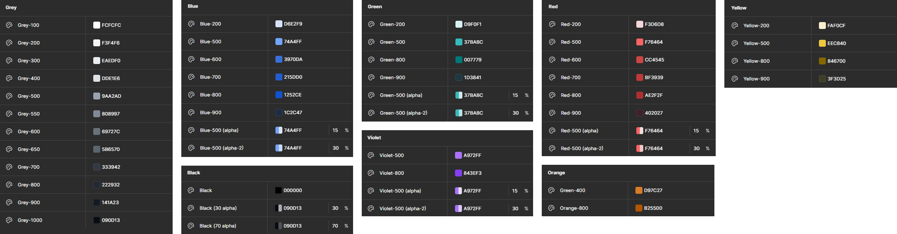

### Mapping schema

The mapping schema defines how interface components reference colors from the basic palette.

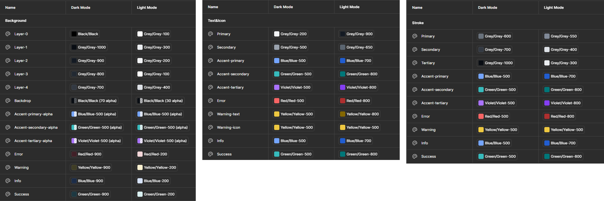

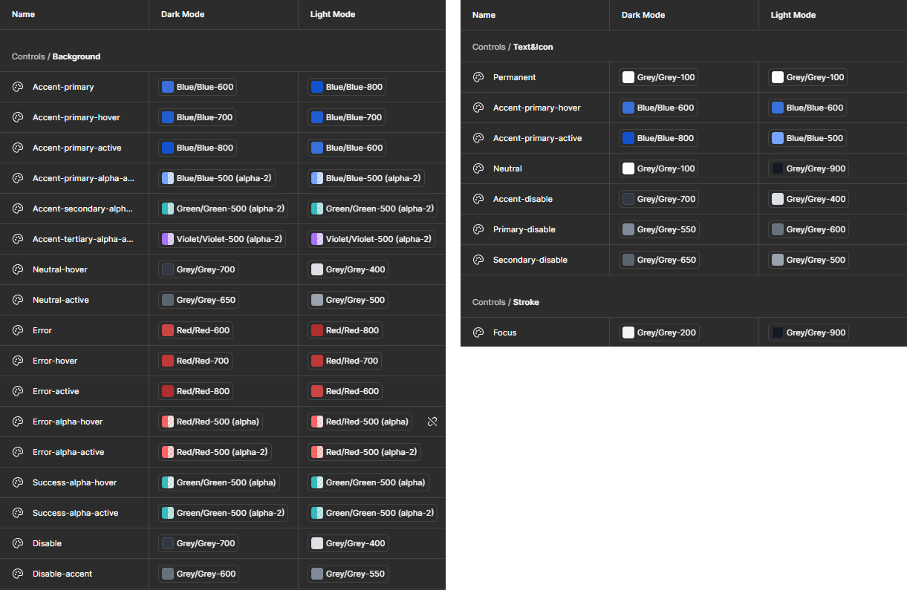

To create a new theme, add a new mode in the mapping schema. The mode defines how interface components are colored using the basic palette. See the [DIAL Chat Themes repository](https://github.com/epam/ai-dial-chat-themes) for the full schema and examples. For a hands-on walkthrough, see the [Create a custom theme](7.create-custom-theme.md) tutorial.

### Example: dark theme

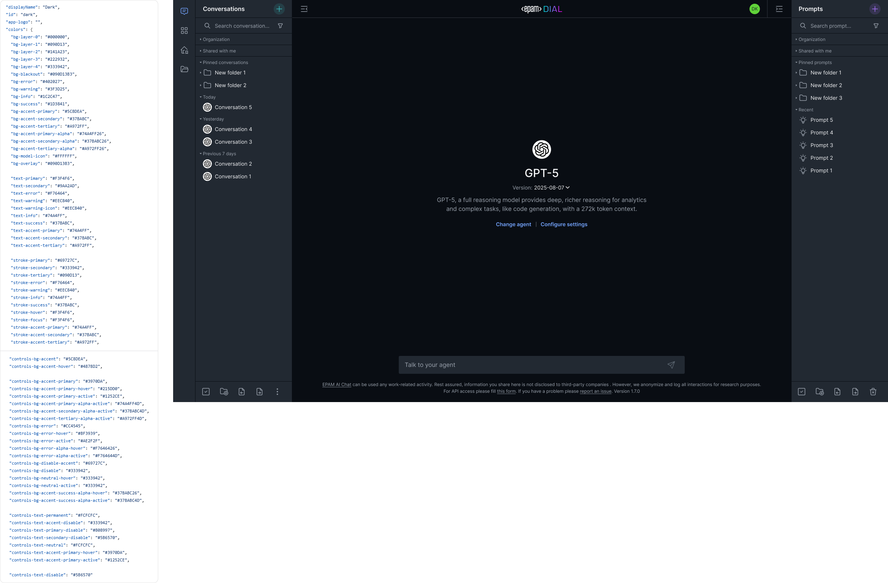

### Example: light theme

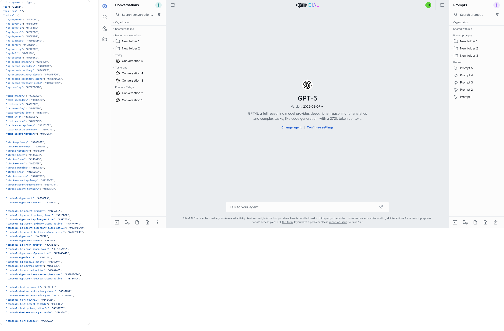

### Example: custom theme

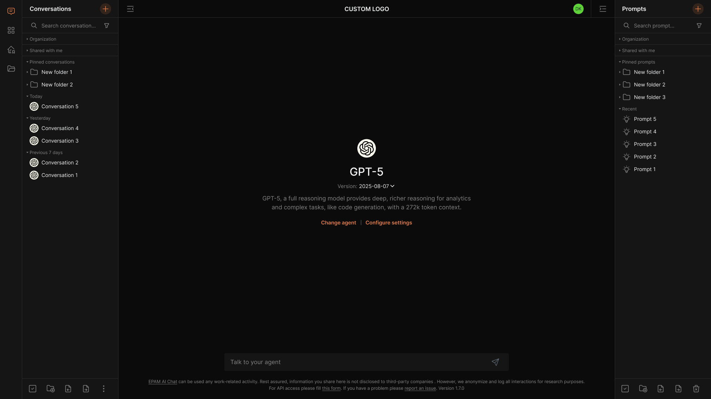

## Logo customization

To use a custom logo, include `custom-logo` in the `ENABLED_FEATURES` list, then upload your logo image through the themes server configuration.

Requirements:
- File type: any image format
- Max file size: 512 MB
- Max width: 100 px


## Next steps

- [Create a custom theme](7.create-custom-theme.md) — tutorial: set up the themes server and build a custom color scheme from scratch
- [Chat localization](4.chat-localization.md) — customize and translate UI text
- [DIAL Chat configuration](../../../4.operating-dial/4.configuration/2.chat-configuration.md) — complete environment variable reference for Chat
- [Chat customization overview](0.index.md) — all Chat customization topics
