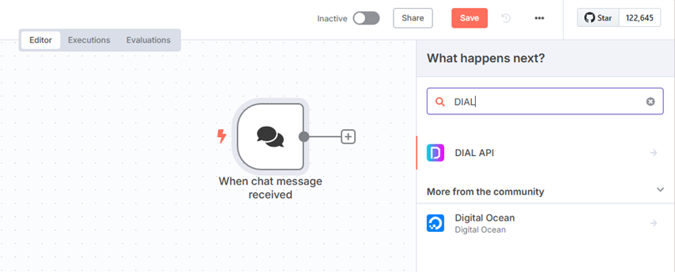
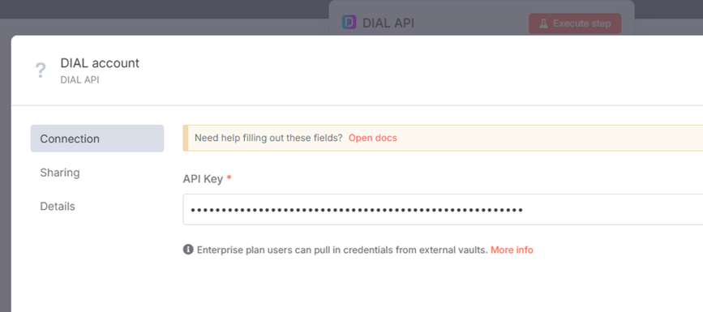
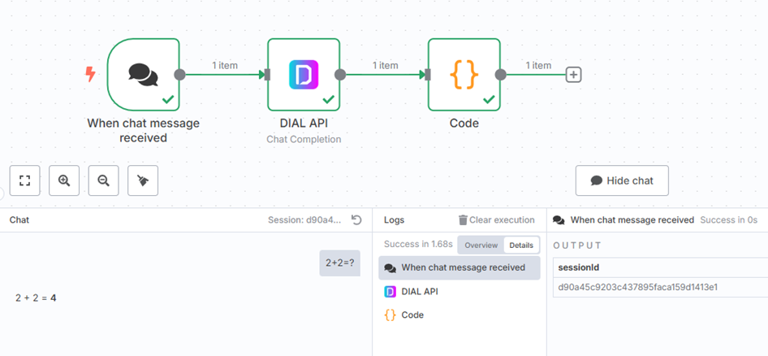
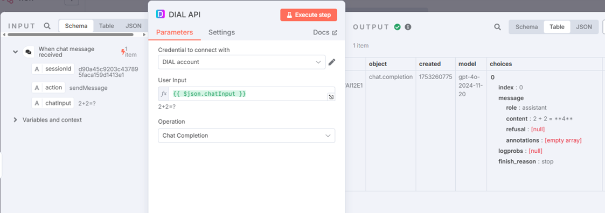
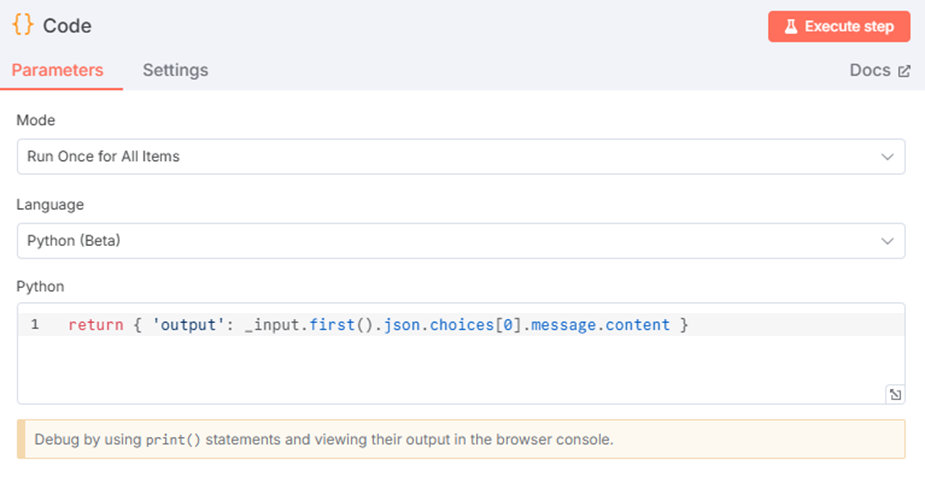

# Integration with n8n

This guide shows you how to build a custom [n8n](https://n8n.io/) node that calls DIAL and how to use that node inside your workflows. [n8n](https://docs.n8n.io/) is an open-source workflow automation tool that connects applications, services, and APIs into automated pipelines. The custom node lets any workflow reach DIAL's chat completion and text embedding endpoints through the [Unified API](https://dialx.ai/dial_api). This guide is for developers who already run DIAL and have a working n8n instance.

**Tip**
> Watch a [demo video](../../../9.demos/6.integrations.md#n8n) to see an AI-powered HR assistant built with a custom DIAL node and n8n automation before you start.

## Prerequisites

- n8n installed and set up, locally or in the cloud. See n8n's [installation guide](https://docs.n8n.io/hosting/installation/npm/).
- A DIAL API key for authentication.
- Node.js installed locally for building and testing the node.
- A running [DIAL Core](https://dialx.ai/) instance reachable from your n8n environment.

## Build the DIAL custom node

n8n organizes workflows using [nodes](https://docs.n8n.io/workflows/components/nodes/) — building blocks that perform a specific action, such as calling an API, transforming data, or running a script. Built-in nodes do not cover DIAL, so you build a [custom node](https://docs.n8n.io/integrations/creating-nodes/overview/) that calls the Unified API.

### Step 1: Plan the node

Design the DIAL custom node as follows:

- Type — [action node](https://docs.n8n.io/integrations/creating-nodes/plan/node-types/#action-nodes).
- Building approach — [declarative style](https://docs.n8n.io/integrations/creating-nodes/plan/choose-node-method/).
- UI components — [credentials, operations, and fields](https://docs.n8n.io/integrations/creating-nodes/plan/node-ui-design/#credentials).
- File structure — follow n8n's [node file structure](https://docs.n8n.io/integrations/creating-nodes/build/reference/node-file-structure/).

### Step 2: Build the node

Set up a [development environment](https://docs.n8n.io/integrations/creating-nodes/build/node-development-environment/) first, then build and test the node.

1. Fetch the [n8n node starter template](https://github.com/n8n-io/n8n-nodes-starter) and remove the examples from the `/nodes` and `/credentials` folders.
2. Create a [credentials file](https://docs.n8n.io/integrations/creating-nodes/build/declarative-style-node/#step-4-set-up-authentication) named `DialApi.credentials.ts` in the `/credentials` directory with the following code:

   ```typescript
   import { ICredentialType, INodeProperties } from 'n8n-workflow';

   export class DialApi implements ICredentialType {
     name = 'dialApi';
     displayName = 'DIAL API';
     documentationUrl = 'https://<URL_TO_API_KEY_DOCS>/';
     properties: INodeProperties[] = [
       {
         displayName: 'API Key',
         name: 'apiKey',
         type: 'string',
         default: '',
         required: true,
         typeOptions: {
           password: true, // Mask the value for security
         },
         description: 'The API key for DIAL.',
       },
     ];
   }
   ```

3. Create a [metadata file](https://docs.n8n.io/integrations/creating-nodes/build/declarative-style-node/#step-5-add-node-metadata) named `Dial.node.json` in the `/nodes` directory with the following code:

   ```json
   {
     "node": "n8n-nodes-base.dial",
     "nodeVersion": "1.0",
     "codexVersion": "1.0",
     "categories": ["Miscellaneous"],
     "resources": {
       "credentialDocumentation": [
         {
           "url": ""
         }
       ],
       "primaryDocumentation": [
         {
           "url": ""
         }
       ]
     }
   }
   ```

4. Create a [node file](https://docs.n8n.io/integrations/creating-nodes/build/declarative-style-node/#step-3-create-the-node) named `Dial.node.ts` in the `/nodes` directory with the following code. Replace each placeholder (`<...>`) with your own values, and adjust the logic to fit your needs.

   ```typescript
   import {
     INodeType,
     INodeTypeDescription,
     INodeExecutionData,
     IExecuteFunctions,
     IDataObject,
   } from 'n8n-workflow';

   export class Dial implements INodeType {
     description: INodeTypeDescription = {
       displayName: 'DIAL API',
       name: 'dialApi',
       group: ['transform'],
       version: 1,
       description: 'Call DIAL for chat completions and text embeddings',
       defaults: {
         name: 'DIAL API',
       },
       icon: 'file:favicon.png',
       inputs: ['main'],
       outputs: ['main'],
       credentials: [
         {
           name: 'dialApi',
           required: true,
         },
       ],
       requestDefaults: {
         baseURL: '<URL_TO_YOUR_DIAL_DEPLOYMENT>',
         headers: {
           Accept: 'application/json',
           'Content-Type': 'application/json',
         },
       },
       properties: [
         {
           displayName: 'User Input',
           name: 'userInput',
           type: 'string',
           default: '',
           required: true,
           description: "The user's request to gather data.",
         },
         {
           displayName: 'Operation',
           name: 'operation',
           type: 'options',
           options: [
             {
               name: 'Chat Completion',
               value: 'chatCompletion',
               description: 'Call the chat completion endpoint',
             },
             {
               name: 'Text Embeddings',
               value: 'textEmbedding',
               description: 'Call the text embedding endpoint',
             },
           ],
           default: 'chatCompletion',
           description: 'Choose the DIAL operation to perform',
         },
       ],
     };

     async execute(this: IExecuteFunctions): Promise<INodeExecutionData[][]> {
       const credentials = await this.getCredentials('dialApi');

       const apiKey = credentials.apiKey as string;
       const userInput = this.getNodeParameter('userInput', 0) as string;
       const operation = this.getNodeParameter('operation', 0) as string;

       const baseUrl = `<URL_TO_YOUR_DIAL_DEPLOYMENT>`;
       const apiVersion = '<MODEL_VERSION e.g. 2023-12-01-preview>';

       let responseData: IDataObject;
       if (operation === 'chatCompletion') {
         // Chat completion endpoint
         const endpointUrl = `${baseUrl}/openai/deployments/gpt-4/chat/completions?api-version=${apiVersion}`;
         const body = {
           messages: [{ role: 'user', content: userInput }],
         };

         responseData = await this.helpers.request({
           method: 'POST',
           url: endpointUrl,
           headers: {
             'Content-Type': 'application/json',
             'Api-Key': apiKey,
           },
           body,
           json: true,
         });
       } else if (operation === 'textEmbedding') {
         // Text embedding endpoint
         const endpointUrl = `${baseUrl}/openai/deployments/text-embedding-ada-002/embeddings?api-version=${apiVersion}`;
         const body = {
           input: userInput,
         };

         responseData = await this.helpers.request({
           method: 'POST',
           url: endpointUrl,
           headers: {
             'Content-Type': 'application/json',
             'Api-Key': apiKey,
           },
           body,
           json: true,
         });
       } else {
         throw new Error(`Invalid operation: ${operation}`);
       }

       return this.prepareOutputData(this.helpers.returnJsonArray([responseData]));
     }
   }
   ```

5. Update `package.json` with the following:

   ```json
   {
     "name": "n8n-nodes-dial",
     "version": "0.1.0",
     "description": "DIAL integration",
     "keywords": ["n8n-community-node-package"],
     "license": "MIT",
     "homepage": "https://dialx.ai/",
     "author": {
       "name": "<John Doe>",
       "email": "<John_Doe@yourcompany.com>"
     },
     "repository": {
       "type": "git",
       "url": "https://github.com/<yourcompany>/n8n-nodes-dial.git"
     },
     "main": "index.js",
     "scripts": {
       "build": "tsc && gulp build:icons",
       "dev": "tsc --watch",
       "format": "prettier nodes credentials --write",
       "lint": "eslint nodes credentials package.json",
       "lintfix": "eslint nodes credentials package.json --fix",
       "prepublishOnly": "npm run build && npm run lint -c .eslintrc.prepublish.js nodes credentials package.json"
     },
     "files": ["dist"],
     "n8n": {
       "n8nNodesApiVersion": 1,
       "credentials": ["dist/credentials/DialApi.credentials.js"],
       "nodes": ["dist/nodes/Dial/Dial.node.js"]
     },
     "devDependencies": {
       "@types/express": "^4.17.6",
       "@types/request-promise-native": "~1.0.15",
       "@typescript-eslint/parser": "~5.45",
       "eslint-plugin-n8n-nodes-base": "^1.11.0",
       "gulp": "^4.0.2",
       "n8n-core": "*",
       "n8n-workflow": "*",
       "prettier": "^2.7.1",
       "typescript": "~4.8.4"
     }
   }
   ```

6. (Optional) Add a favicon in `.png` format. See n8n's [add an icon](https://docs.n8n.io/integrations/creating-nodes/build/declarative-style-node/#step-2-add-an-icon) guide.

### Step 3: Deploy the node

To install the node in your n8n instance, follow n8n's [install private nodes](https://docs.n8n.io/integrations/creating-nodes/deploy/install-private-nodes/) guide.

## Use the DIAL custom node in a workflow

With the node installed, add it to any workflow and chain it with other n8n nodes.

### Step 1: Add the node to the canvas

1. Log in to your n8n instance.
2. Open the **New Workflow** page, or an existing workflow where you want to use the node.
3. Drag the DIAL custom node from the Nodes panel onto the canvas. Search for it by typing `DIAL API` in the search bar.



### Step 2: Authenticate the node

1. Open the **Credentials** tab in the node configuration.
2. Enter your DIAL API key in the credentials field. If you saved the key as a credential when you built the node, select it from the dropdown instead.
3. Run the workflow to confirm authentication succeeds.



### Step 3: Chain the node with others

The DIAL custom node accepts input from and passes output to other n8n nodes, so you can compose it into larger automated processes. The example below shows a complete chat flow.

## Example: a chat completion workflow

This example passes a user's message to DIAL and returns the model's response to the n8n chat.



1. Add an **On chat message** trigger node to capture user input.
2. Connect the trigger to the DIAL custom node and map the chat data to its input:

   ```text
   User Input: {{ $json.chatInput }}
   Operation: Chat Completion
   ```

   

3. The n8n chat expects a specific JSON shape, so transform the DIAL response before returning it:

   ```json
   { "output": "<response text>" }
   ```

   Add a **Code** node (Python) after the DIAL custom node to reshape the output:

   ```python
   return { 'output': _input.first().json.choices[0].message.content }
   ```

   

## Related tasks

- [Integration with MS Excel](../2.productivity-add-ins/1.ms-excel.md) — call DIAL from spreadsheet formulas
- [Integration with MS Teams](../1.chatbot-integrations/1.ms-teams.md) — bring DIAL into your messaging platform

## Next steps

- [Workflow automation](0.index.md) — see other automation integrations
- [Integrations overview](../0.index.md) — browse all integration categories
- [Unified API reference](https://dialx.ai/dial_api) — the endpoints the custom node calls
