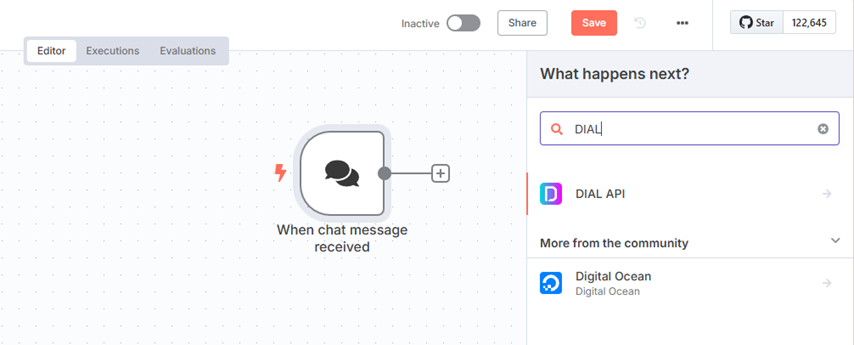
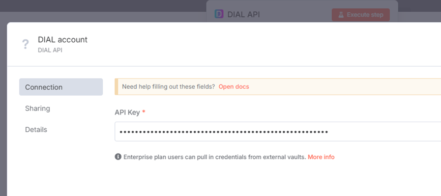
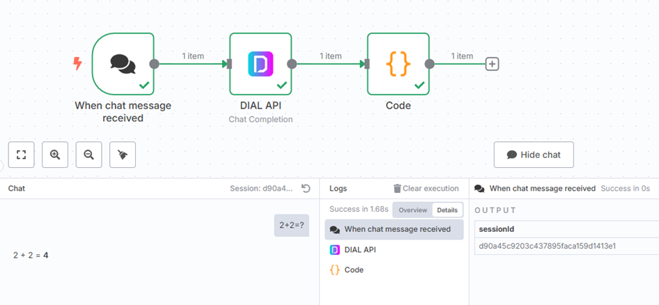
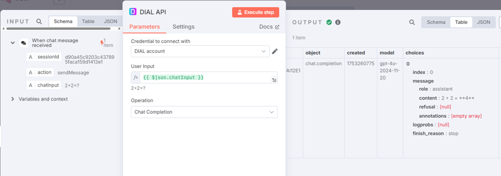
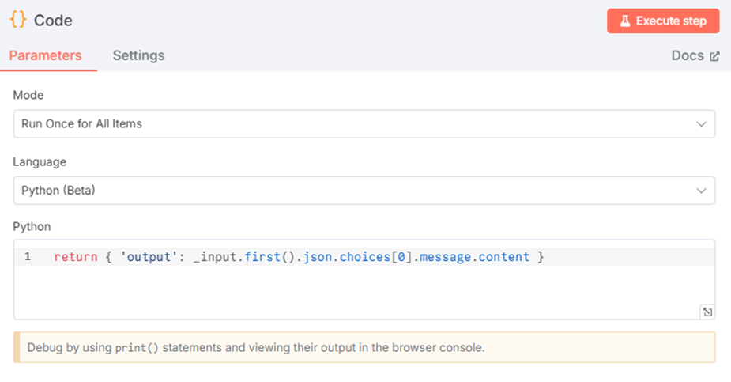

# Integration with n8n

This guide shows you how to build a custom [n8n](https://n8n.io/) node that calls DIAL and how to use that node inside your workflows. [n8n](https://docs.n8n.io/) is an open-source workflow automation tool that connects applications, services, and APIs into automated pipelines. The custom node lets any workflow reach DIAL's chat completion and text embedding endpoints through the [Unified API](https://dialx.ai/dial_api). This guide is for developers who already run DIAL and have a working n8n instance.

**Tip**
> Watch a [demo video](../../../9.demos/6.integrations.md#n8n) to see an AI-powered HR assistant built with a custom DIAL node and n8n automation before you start.

## Prerequisites

- Node.js 22.22.0+ installed locally, and npm, for building and testing the node.
- A DIAL API key for authentication.
- A running [DIAL Core](https://dialx.ai/) instance reachable from your n8n environment.
- n8n installed and set up, locally or in the cloud. See n8n's [install options](https://docs.n8n.io/deploy/host-n8n/install-options).

## Build the DIAL custom node

n8n organizes workflows using [nodes](https://docs.n8n.io/build/understand-workflows/workflow-components/work-with-nodes) — building blocks that perform a specific action, such as calling an API, transforming data, or running a script. Built-in nodes do not cover DIAL, so you build a [custom node](https://docs.n8n.io/connect/create-nodes/overview) that calls the Unified API.

### Step 1: Plan the node

Design the DIAL custom node as follows:

- Type — [action node](https://docs.n8n.io/connect/create-nodes/plan-your-node/choose-a-node-type#action-nodes).
- Building approach — [programmatic style](https://docs.n8n.io/connect/create-nodes/plan-your-node/choose-a-node-building-style).
- UI components — [credentials, operations, and fields](https://docs.n8n.io/connect/create-nodes/plan-your-node/node-ui-design#credentials).
- File structure — follow n8n's [node file structure guidance](https://docs.n8n.io/connect/create-nodes/plan-your-node/choose-node-file-structure).

### Step 2: Build the node

Set up a [development environment](https://docs.n8n.io/connect/create-nodes/build-your-node/set-up-your-development-environment) first, then build and test the node.

n8n's official [`@n8n/node-cli`](https://docs.n8n.io/connect/create-nodes/build-your-node/using-the-n8n-node-tool/) tool scaffolds, lints, builds, and locally test-runs community nodes.

1. Scaffold a new node project:

   ```shell
   npm create @n8n/node@latest
   ```

   When prompted, name the project `n8n-nodes-dial` and choose the **programmatic** template with **basic** type. This generates a working project with the following layout:

   ```text
   n8n-nodes-dial/
   ├── nodes/
   │   └── Example/
   │       ├── Example.node.ts
   │       ├── Example.node.json
   │       ├── example.svg
   │       └── example.dark.svg
   ├── package.json
   └── tsconfig.json
   ```

2. Rename the example node to `Dial`:

   ```shell
   cd n8n-nodes-dial
   mv nodes/Example nodes/Dial
   mv nodes/Dial/Example.node.ts nodes/Dial/Dial.node.ts
   mv nodes/Dial/Example.node.json nodes/Dial/Dial.node.json
   mv nodes/Dial/example.svg nodes/Dial/dial.svg
   mv nodes/Dial/example.dark.svg nodes/Dial/dial.dark.svg
   ```

3. Create the [credentials](https://docs.n8n.io/connect/create-nodes/build-your-node/tutorial-build-a-programmatic-style-node#step-5-set-up-authentication) folder and file. CLI doesn't scaffold credentials for the programmatic template, so add it yourself:

   ```shell
   mkdir credentials
   ```

   Create `credentials/DialApi.credentials.ts` with the following code:

   ```typescript
   import {
     IAuthenticateGeneric,
     ICredentialType,
     INodeProperties,
   } from 'n8n-workflow';

   export class DialApi implements ICredentialType {
     name = 'dialApi';
     displayName = 'DIAL API';
     documentationUrl = 'https://docs.dialx.ai/';
     properties: INodeProperties[] = [
       {
         displayName: 'Base URL',
         name: 'baseUrl',
         type: 'string',
         default: '',
         required: true,
         placeholder: 'https://your-dial-deployment.example.com',
         description: 'The base URL of your DIAL Core deployment.',
       },
       {
         displayName: 'API Key',
         name: 'apiKey',
         type: 'string',
         default: '',
         required: true,
         typeOptions: {
           password: true, // Mask the value for security
         },
         description: 'The API key for DIAL.',
       },
     ];

     authenticate: IAuthenticateGeneric = {
       type: 'generic',
       properties: {
         headers: {
           'Api-Key': '={{$credentials.apiKey}}',
         },
       },
     };
   }
   ```

3. Replace the [metadata file](https://docs.n8n.io/connect/create-nodes/build-your-node/tutorial-build-a-programmatic-style-node#step-6-add-node-metadata) named `Dial.node.json` in the `/nodes` directory with the following code:

   ```json
   {
     "node": "n8n-nodes-dial",
     "nodeVersion": "1.0",
     "codexVersion": "1.0",
     "categories": ["Miscellaneous"],
     "resources": {
       "credentialDocumentation": [
         {
           "url": ""
         }
       ],
       "primaryDocumentation": [
         {
           "url": ""
         }
       ]
     }
   }
   ```

4. Replace the [node file](https://docs.n8n.io/connect/create-nodes/build-your-node/tutorial-build-a-programmatic-style-node#step-3-define-the-node-in-the-base-file) named `Dial.node.ts` in the `/nodes` directory with the following code. Adjust the logic to fit your needs.

   ```typescript
   import type {
     IDataObject,
     IExecuteFunctions,
     IHttpRequestOptions,
     INodeExecutionData,
     INodeType,
     INodeTypeDescription,
   } from 'n8n-workflow';
   import { NodeConnectionTypes, NodeOperationError } from 'n8n-workflow';

   export class Dial implements INodeType {
     description: INodeTypeDescription = {
       displayName: 'DIAL API',
       name: 'dialApi',
       group: ['transform'],
       version: 1,
       description: 'Call DIAL for chat completions and text embeddings',
       defaults: {
         name: 'DIAL API',
       },
       icon: { light: 'file:dial.svg', dark: 'file:dial.dark.svg' },
       inputs: [NodeConnectionTypes.Main],
       outputs: [NodeConnectionTypes.Main],
       usableAsTool: true,
       credentials: [
         {
           name: 'dialApi',
           required: true,
         },
       ],
       properties: [
         {
           displayName: 'Operation',
           name: 'operation',
           type: 'options',
           options: [
             {
               name: 'Chat Completion',
               value: 'chatCompletion',
               description: 'Call the chat completion endpoint',
             },
             {
               name: 'Text Embeddings',
               value: 'textEmbedding',
               description: 'Call the text embedding endpoint',
             },
           ],
           default: 'chatCompletion',
           description: 'Choose the DIAL operation to perform',
         },
         {
           displayName: 'Deployment Name',
           name: 'deploymentName',
           type: 'string',
           default: 'gpt-4',
           required: true,
           description: 'The name of the DIAL model deployment to call, for example gpt-4 or text-embedding-ada-002',
         },
         {
           displayName: 'API Version',
           name: 'apiVersion',
           type: 'string',
           default: '2024-02-01',
           required: true,
           description: 'The DIAL/OpenAI API version to use',
         },
         {
           displayName: 'User Input',
           name: 'userInput',
           type: 'string',
           default: '',
           required: true,
           description: 'The text to send to the selected operation: the chat message for Chat Completion, or the text to embed for Text Embeddings',
         },
       ],
     };

     async execute(this: IExecuteFunctions): Promise<INodeExecutionData[][]> {
       const items = this.getInputData();
       const returnData: INodeExecutionData[] = [];

       for (let i = 0; i < items.length; i++) {
         try {
           const operation = this.getNodeParameter('operation', i) as string;
           const deploymentName = this.getNodeParameter('deploymentName', i) as string;
           const apiVersion = this.getNodeParameter('apiVersion', i) as string;
           const userInput = this.getNodeParameter('userInput', i) as string;

           const credentials = await this.getCredentials('dialApi');
           const baseUrl = credentials.baseUrl as string;

           let options: IHttpRequestOptions;

           if (operation === 'chatCompletion') {
             options = {
               method: 'POST',
               url: `${baseUrl}/openai/deployments/${deploymentName}/chat/completions`,
               qs: { 'api-version': apiVersion },
               body: {
                 messages: [{ role: 'user', content: userInput }],
               },
               json: true,
             };
           } else if (operation === 'textEmbedding') {
             options = {
               method: 'POST',
               url: `${baseUrl}/openai/deployments/${deploymentName}/embeddings`,
               qs: { 'api-version': apiVersion },
               body: {
                 input: userInput,
               },
               json: true,
             };
           } else {
             throw new NodeOperationError(this.getNode(), `Unsupported operation: ${operation}`, {
               itemIndex: i,
             });
           }

           // httpRequestWithAuthentication applies the credential's `authenticate` block above, so the Api-Key header is injected automatically.
           const responseData = (await this.helpers.httpRequestWithAuthentication.call(
             this,
             'dialApi',
             options,
           )) as IDataObject;

           const executionData = this.helpers.constructExecutionMetaData(
             this.helpers.returnJsonArray(responseData),
             { itemData: { item: i } },
           );
           returnData.push(...executionData);
         } catch (error) {
           if (this.continueOnFail()) {
             const executionData = this.helpers.constructExecutionMetaData(
               this.helpers.returnJsonArray({ error: (error as Error).message }),
               { itemData: { item: i } },
             );
             returnData.push(...executionData);
             continue;
           }
           throw error;
         }
       }

       return [returnData];
     }
   }
   ```

5. Update `package.json`. Rename the `nodes` entry to match the renamed folder, add the `credentials` entry (the scaffold leaves this array empty), and fill in `description`, `author`, `repository`, and `homepage`:

   ```json
   {
     "name": "n8n-nodes-dial",
     "version": "0.1.0",
     "description": "DIAL integration",
     "keywords": ["n8n-community-node-package"],
     "license": "MIT",
     "homepage": "https://dialx.ai/",
     "author": {
       "name": "<John Doe>",
       "email": "<John_Doe@yourcompany.com>"
     },
     "repository": {
       "type": "git",
       "url": "https://github.com/<yourcompany>/n8n-nodes-dial.git"
     },
     "n8n": {
       "n8nNodesApiVersion": 1,
       "strict": true,
       "credentials": ["dist/credentials/DialApi.credentials.js"],
       "nodes": ["dist/nodes/Dial/Dial.node.js"]
     }
   }
   ```

   Leave `scripts` and `devDependencies` as generated by the CLI.

6. (Optional) Replace `nodes/Dial/dial.svg` and `dial.dark.svg` with your own icon. See n8n's [icon reference](https://docs.n8n.io/connect/create-nodes/build-your-node/reference/base-files/standard-parameters/#icon). SVG is recommended.

7. Test locally before deploying:

   ```shell
   npm run dev
   ```

   This starts a disposable n8n instance at `http://localhost:5678` with the node already linked, and rebuilds on file changes. Search for it by its `name` property (`DIAL API`), not the package name.

8. Lint before you build or publish:

   ```shell
   npm run lint
   ```

### Step 3: Deploy the node

To install the node in your production n8n instance, follow n8n's [install private nodes](https://docs.n8n.io/connect/create-nodes/deploy-your-node/install-private-nodes/) guide: run `npm run build`, then copy the compiled `nodes` and `credentials` folders from `dist` into that instance's `~/.n8n/custom/` directory (or bake them into your Docker image if you run n8n in a container).

## Use the DIAL custom node in a workflow

With the node installed, add it to any workflow and chain it with other n8n nodes.

### Step 1: Add the node to the canvas

1. Log in to your n8n instance.
2. Open the **New Workflow** page, or an existing workflow where you want to use the node.
3. Drag the DIAL custom node from the Nodes panel onto the canvas. Search for it by typing `DIAL API` in the search bar.



### Step 2: Authenticate the node

1. Open the **Credentials** tab in the node configuration.
2. Enter your DIAL deployment's base URL and API key in the credentials fields. If you saved these as a credential when you built the node, select it from the dropdown instead.
3. Run the workflow to confirm authentication succeeds.



### Step 3: Chain the node with others

The DIAL custom node accepts input from and passes output to other n8n nodes, so you can compose it into larger automated processes. The example below shows a complete chat flow.

## Example: a chat completion workflow

This example passes a user's message to DIAL and returns the model's response to the n8n chat.



1. Add an **On chat message** trigger node to capture user input.
2. Connect the trigger to the DIAL custom node and map the chat data to its input:

   ```text
   Operation: Chat Completion
   Deployment Name: gpt-4
   User Input: {{ $json.chatInput }}
   ```

   

3. The n8n chat expects a specific JSON shape, so transform the DIAL response before returning it:

   ```json
   { "output": "<response text>" }
   ```

   Add a **Code** node (Python) after the DIAL custom node to reshape the output:

   ```python
   return { 'output': _input.first().json['choices'][0]['message']['content'] }
   ```

   

## Related tasks

- [Integration with MS Excel](../2.productivity-add-ins/1.ms-excel.md) — call DIAL from spreadsheet formulas
- [Integration with MS Teams](../1.chatbot-integrations/1.ms-teams.md) — bring DIAL into your messaging platform

## Next steps

- [Workflow automation](0.index.md) — see other automation integrations
- [Integrations overview](../0.index.md) — browse all integration categories
- [Unified API reference](https://dialx.ai/dial_api) — the endpoints the custom node calls