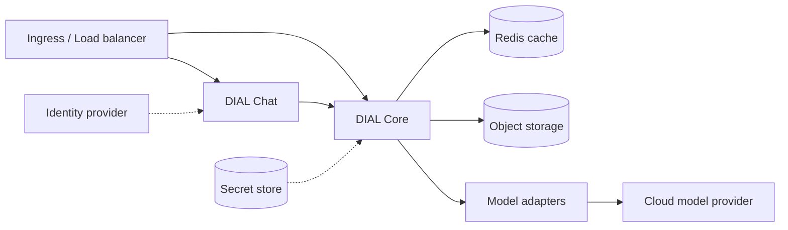

# Helm chart overview

DIAL ships as a set of Helm charts that deploy the platform to any Kubernetes cluster. This page explains what the charts are, how they map to your cloud infrastructure, and how to choose a deployment path. It is for DevOps and platform engineers who already run Kubernetes and want to understand the deployment model before following a provider-specific guide.

For running DIAL on a single machine without Kubernetes, see [Local setup](../local-setup/index) instead.

## The DIAL Helm charts

DIAL publishes its charts to the registry at `https://charts.dialx.ai`. Add the repository once:

```bash
helm repo add dial https://charts.dialx.ai
helm repo update
```

The repository contains four charts, each with a distinct role:

| Chart | Role | When you install it |
|-------|------|---------------------|
| `dial/dial` | Umbrella chart. Deploys the full stack — DIAL Core, DIAL Chat, themes, Redis, and model adapters — in one release. | Standard installs. The provider guides in this section use it. |
| `dial/dial-core` | DIAL Core alone — the Unified API server. | When you manage Chat, Redis, and adapters separately. |
| `dial/dial-admin` | DIAL Admin (panel frontend and backend). | When you run the Admin Panel. |
| `dial/dial-extension` | Generic chart for any container-based extension — adapters, Custom Apps, and the Quick Apps executor. | [Custom Apps deployment](custom-apps-deployment), [Quick Apps installation](quick-apps-installation). |

The umbrella `dial` chart is the entry point for a cluster deployment:

```bash
helm install dial dial/dial -f values.yaml --version <CHART_VERSION> --namespace dial
```

Pin `<CHART_VERSION>` to a released chart version rather than tracking `latest`, so upgrades are deliberate.

## How DIAL maps to cloud infrastructure

DIAL is cloud-agnostic. The same charts run on AWS, Azure, GCP, or a self-managed cluster — only the backing services and credentials change. A production deployment relies on four classes of infrastructure:



| Class | Purpose | AWS | Azure | GCP |
|-------|---------|-----|-------|-----|
| Object storage | Permanent storage for user and system files | S3 | Azure Blob Storage | Cloud Storage |
| Cache | Volatile cache for DIAL Core | ElastiCache | Azure Cache for Redis | Memorystore for Redis |
| Model provider | Language models behind an adapter | Bedrock | Azure OpenAI | Vertex AI |
| Identity provider | Authentication via OpenID Connect / OAuth2 | Cognito | Microsoft Entra ID | Cloud Identity |

DIAL Core treats Redis as a cache, not a system of record — the object store holds the durable state. This is what makes DIAL Core horizontally scalable: its service instances are stateless.

## The example-based deployment model

The Helm repository provides ready-made value files for each cloud under `charts/dial/examples/<cloud>/`, in two variants:

- **`simple`** — a minimal, single-provider install for evaluation and lower environments. The provider guides in this section are built on these examples.
- **`complete`** — a production-leaning configuration with managed Redis, an identity provider, and multiple model providers.

:::warning
The `simple` examples omit production concerns such as authentication, encryption, and high availability. Do not run them in production unmodified. See the **Production architecture** section of each provider guide for hardening guidance.
:::

## Choosing a deployment path

| Your target | Guide |
|-------------|-------|
| Amazon EKS with S3 and Bedrock | [AWS deployment](aws-deployment) |
| Azure AKS with Blob Storage and Azure OpenAI | [Azure deployment](azure-deployment) |
| Google GKE with Cloud Storage and Vertex AI | [GCP deployment](gcp-deployment) |
| A self-managed or on-premises cluster | [Generic Kubernetes](generic-kubernetes) |
| Reading secrets from Azure Key Vault | [Azure Secrets deployment](azure-secrets-deployment) |
| Deploying your own application alongside DIAL | [Custom Apps deployment](custom-apps-deployment) |
| Enabling the Quick Apps feature | [Quick Apps installation](quick-apps-installation) |

## Further reading

- [DIAL Stack](../../2.understand-dial/2.architecture/2.dial-stack.md) — the components the charts deploy and how they fit together
- [Core configuration](../4.configuration/1.core/0.index.md) — the `config.json` and `settings.json` the charts render

## Next steps

- [AWS deployment](aws-deployment) — deploy the full stack to Amazon EKS
- [Azure deployment](azure-deployment) — deploy the full stack to Azure AKS
- [GCP deployment](gcp-deployment) — deploy the full stack to Google GKE
