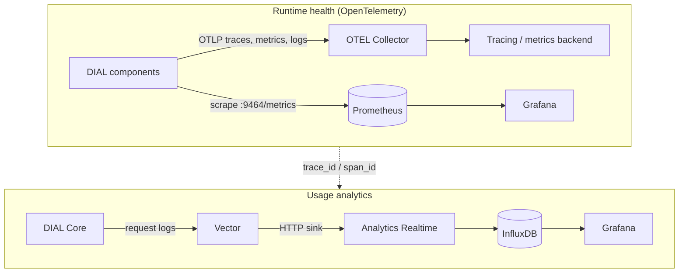

# Observability

This page explains how observability works in DIAL: what the platform emits, how telemetry flows from components to your backends, and the two distinct observability planes you operate. It is for DevOps and platform engineers who want to understand the model before configuring tracing, metrics, logging, or analytics. No setup instructions are here — each how-to in this section covers one task.

## OpenTelemetry as the common layer

DIAL standardizes on [OpenTelemetry](https://opentelemetry.io/) (OTEL), a vendor-agnostic specification for traces, metrics, and logs. Components export telemetry over the OTLP protocol to a collector, which forwards it to whatever backend you run. Because the wire format is standard, you choose the backend — Prometheus, Jaeger, Grafana, and similar tools all consume the same data without DIAL locking you to one vendor.

OTEL gives DIAL three signal types:

- **Traces** — the path of a request as it moves across components, with parent and child spans.
- **Metrics** — numeric time series such as request counts, latency, and JVM or system resource usage.
- **Logs** — structured event records, optionally correlated with traces.

## Two observability planes

DIAL observability splits into two planes that you configure and operate independently. Keeping them separate is the key to reasoning about the platform.

**Runtime health** answers "is the platform healthy?" It is the OTEL plane: components emit traces, metrics, and logs; Prometheus scrapes metrics from a dedicated endpoint; and a collector forwards traces and logs to your chosen backend. Use it for latency, error rates, resource pressure, and request flow.

**Usage analytics** answers "how is the platform being used, and what does it cost?" It is a separate pipeline: DIAL Core writes request logs, [Vector](https://vector.dev/) ships them to the [Analytics Realtime](#what-each-component-emits) service, and that service writes usage metrics — token counts, cost, topics, and ratings — to InfluxDB for visualization in Grafana.

The two planes share only one link: the OpenTelemetry `trace_id` and `span_id` that Analytics Realtime records alongside each usage record, so a usage entry can be traced back to its request spans.

## What each component emits

| Component | Runtime (traces, metrics, logs) | How it is instrumented |
|-----------|----------------------------------|------------------------|
| DIAL Core | JVM and HTTP metrics; spans carrying `trace_id`, `core_span_id`, `core_parent_span_id`, and an `execution_path` call stack | OpenTelemetry Java agent attached at the JVM level |
| DIAL Chat | Traces, metrics, and logs over OTLP | OpenTelemetry Node.js SDK |
| Adapters and Applications | Traces, metrics (including system CPU and memory), and logs over OTLP | [DIAL SDK telemetry](../../3.building-with-dial/5.developer-tools/1.sdk-reference/5.telemetry.md) (Python) |
| Analytics Realtime | Usage records: tokens, cost, topics, ratings | Consumes Core request logs via Vector |

:::note
DIAL Core is a Java service. It does not instrument itself in application code — its traces and metrics come from the OpenTelemetry Java agent attached to the JVM. The OTEL environment variables documented in this section configure that agent; how the agent jar is attached is set at the image or JVM level, not in `config.json`. Confirm the attachment mechanism against your own deployment.
:::

:::note
Telemetry is off by default. A fresh DIAL install exports nothing to a backend, and the Vector log sidecar prints to standard output rather than shipping logs anywhere. Each how-to in this section describes what to enable.
:::

## Further reading

- [DIAL Stack](../../2.understand-dial/2.architecture/2.dial-stack.md) — the components that emit the telemetry described here
- [SDK telemetry reference](../../3.building-with-dial/5.developer-tools/1.sdk-reference/5.telemetry.md) — how applications and adapters built on the DIAL SDK emit OTEL signals

## Next steps

- [Tracing (OpenTelemetry)](tracing) — enable distributed tracing across components
- [Metrics and monitoring](metrics-and-monitoring) — scrape DIAL metrics with Prometheus
- [Analytics Realtime setup](analytics-realtime-setup) — capture token usage and cost
