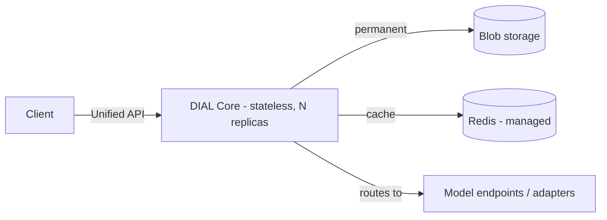

# Production readiness

This page explains what it takes to run DIAL reliably in production and links to the task-by-task guides that get you there. It is for DevOps and platform engineers who have a working deployment and now need it to survive load, failure, upgrades, and audit. Read it top to bottom once, then use the linked how-tos as a checklist. No setup steps are here.

## The model that drives every decision

Almost every production-readiness choice in DIAL follows from one fact about how the platform stores state:

- **DIAL Core and the other services are stateless.** They hold no durable data of their own, so you run several copies and replace any of them at will.
- **Blob storage keeps permanent data** — conversations, files, published resources, and application state. This is the one store you must protect.
- **Redis keeps volatile, in-memory data for fast access.** It is a cache. Losing it costs a warm-up, not your data.

Three consequences shape the rest of this section. Scale and recover the stateless tier by adding or replacing replicas. Back up the blob store, not the cache. Guard the encryption key, because without it the blob data is unreadable.

## Readiness checklist

Each item below is a single how-to. Work through them in order for a new environment, or jump to the one you need.

| Area | Goal | Guide |
|------|------|-------|
| High availability | Survive a node or zone failure with no outage | [Run DIAL with high availability](./1.high-availability.md) |
| Scaling | Absorb load spikes without errors | [Scale DIAL for load](./2.scaling.md) |
| Secrets management | Keep keys and credentials out of values files | [Manage secrets](./3.secrets-management.md) |
| Backup and restore | Recover permanent data after a failure | [Back up and restore DIAL](./4.backup-and-restore.md) |
| Upgrade procedure | Move to a new chart version safely | [Upgrade DIAL](./5.upgrade-procedure.md) |
| Cost control | Cap and monitor model spend | [Control cost](./6.cost-control.md) |
| Security hardening | Reduce the attack surface and control data retention | [Harden DIAL for production](./7.security-hardening.md) |

## How this section relates to the rest of Operating DIAL

Production readiness is platform-neutral. It states the principle and the Helm or DIAL Core setting, then points to the deployment guide for your cloud, which carries the provider-specific detail.

- [Cloud deployment](../2.cloud-deployment/1.aws-deployment.md) — the per-cloud guides hold the concrete service tiers, networking, and disaster-recovery notes for AWS, Azure, GCP, and generic Kubernetes.
- [Observability](../6.observability/2.metrics-and-monitoring.md) — you cannot operate what you cannot see; metrics, alerting, and analytics underpin every page here.
- [Configuration reference](../4.configuration/1.core/1.settings-json/5.encryption.md) — the authoritative description of every setting these guides change.

## Further reading

- [DIAL Stack](../../2.understand-dial/2.architecture/2.dial-stack.md) — the components you are making production-ready
- [Usage limits and cost control](../../2.understand-dial/4.security-and-governance/3.usage-limits-and-cost-control.md) — why DIAL enforces limits, before you configure them

## Next steps

- [Run DIAL with high availability](./1.high-availability.md) — start with redundancy
- [Back up and restore DIAL](./4.backup-and-restore.md) — protect the permanent store
- [Harden DIAL for production](./7.security-hardening.md) — close the gaps before go-live
