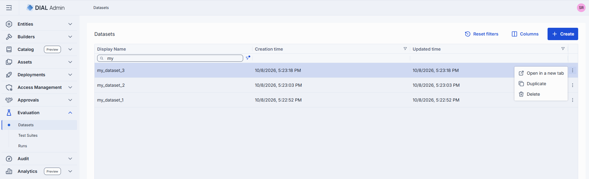
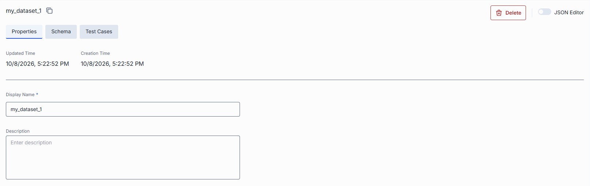
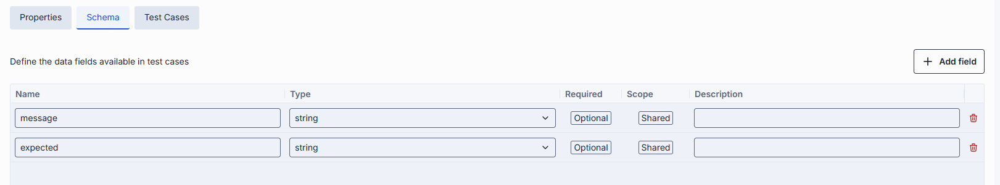
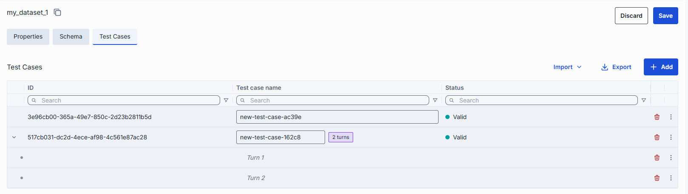

# Datasets

A dataset is a reusable collection of test cases with a defined schema. Datasets are independent
entities — they are not tied to a specific test suite and can be linked to multiple test suites.
This decoupling lets you maintain test data separately from evaluation logic, reuse the same dataset
across different test suites, and update test cases without modifying the test suites that reference
them.

## Datasets grid

Open **Evaluation > Datasets** to see all datasets.

<!-- SCREENSHOT NEEDED: datasets list grid -->

| Column | Description |
|--------|-------------|
| **Name** | Display name of the dataset. |
| **Creation date** | Timestamp when the dataset was created. |
| **Actions** | Per-row actions: **Open in a new tab**, **Duplicate**, **Delete**. |

To create a dataset, click **Create**. A dialog prompts you to enter the dataset name.

## Dataset detail view

Click any dataset row to open its detail view. The detail view has two main areas: properties and
test cases.

### Properties

<!-- SCREENSHOT NEEDED: dataset properties -->

| Field | Required | Editable | Description |
|-------|----------|----------|-------------|
| **Display name** | Yes | Yes | Name of the dataset displayed on the UI. Must be unique across all datasets. |
| **Description** | No | Yes | Free-text summary of the dataset's purpose. |

### Schema

Click the schema toggle button in the test cases header to open the **Test Case Schema Manager**
panel. This panel lets you define custom data fields for test cases.

| Action | Description |
|--------|-------------|
| **Add a field** | Specify a name, type (String, Number, Boolean, Object, Array, File, Multi-turn), whether it is required, and a description. The field name must be unique within the schema. The **Multi-turn** type defines ordered conversation turns for multi-step evaluation. |
| **Edit a field** | Change its type, required flag, or description. The field name is read-only after creation. |
| **Remove a field** | Delete a custom field from the schema. Removing a field invalidates any test cases that depend on it. |

Schema changes are not sent to the server until you click **Save** on the dataset.

**Note**
> Public datasets (those linked to a published test suite) are read-only. Test case data cannot be
> edited when the dataset is attached to a public test suite.

### Test cases

The Test Cases section lists all input–expected-output pairs in the dataset. Each row represents one
test case whose columns are defined by the dataset's test case schema.

<!-- SCREENSHOT NEEDED: dataset test cases -->

| Column | Description |
|--------|-------------|
| **Name** | Test case identifier. |
| **Valid** | Whether the test case passes schema validation. Invalid test cases are excluded when a linked test suite runs. |
| **Custom fields** | Additional data columns defined by the test case schema. |

#### Manage test cases

| Action | Description |
|--------|-------------|
| **Add** | Create a new test case manually. |
| **Import** | Bulk-import test cases from a file. After import, the list refreshes automatically. |
| **Tags** | Assign tags to test cases for filtering in test suite run conditions. |
| **Delete** | Remove a test case. A confirmation dialog appears before deletion. |
| **Save** | Persist changes. Field edits and enabled-flag changes can be saved in a single operation. |

## Duplicate a dataset

You can duplicate an existing dataset to create a copy with the same schema and test cases.

1. Click the actions menu on any dataset row and select **Duplicate**.
2. Enter a new name for the duplicate.
3. Click **Create**. The new dataset appears in the grid.

## Delete a dataset

Open the context menu on any dataset row and select **Delete**. A confirmation dialog appears
showing the list of test suites that reference this dataset and the potential impact of deletion.

**Warning**
> Deleting a dataset unlinks it from all test suites that reference it. Those test suites become
> unbound and cannot run until a new dataset is attached.

## Linked test suites

Each dataset tracks which test suites reference it. When viewing a dataset, the linked test suites
are visible, helping you understand the impact of schema or data changes before saving.

## Next steps

- [Test suites](3.test-suites.md) — link a dataset to a test suite and configure evaluation bindings
- [Metrics](1.metrics.md) — define the scoring functions that test suites apply to dataset test cases
