# Manage toolset deployments

This page explains how administrators use DIAL Admin to add and configure tool sets. It covers creating a tool set, managing its source types, configuring authentication, managing tools, assigning roles, and using the JSON editor. You need access to DIAL Admin with administrator permissions.

Tool sets in DIAL are connections with MCP servers that can be used as tools by any internal or external application to perform specific actions.

In DIAL, you can use self-hosted tool sets based on deployed MCP containers and external tool sets deployed outside of DIAL using their endpoints.

The DIAL Core API allows you to [access](https://dialx.ai/dial_api#tag/Deployment-listing/operation/getToolSets) available toolset deployments and to [add and manage](https://dialx.ai/dial_api#tag/Toolsets) toolsets. You can also add tool sets via direct configuration of [DIAL Core](https://github.com/epam/ai-dial-core/blob/development/docs/dynamic-settings/toolsets.md).

## Main screen

On this screen, you can find all toolset deployments in your DIAL instance that were added via direct modification of the [DIAL Core](https://github.com/epam/ai-dial-core/blob/development/docs/dynamic-settings/toolsets.md) config file or via DIAL Admin. Here you can view, filter, and add new toolset definitions.

**Note**
> Published tool sets (tool sets located in the Public folder in DIAL file system) are available in the [Assets](../4.assets.md) section.

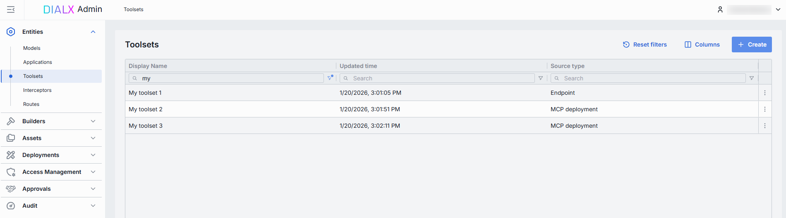

### Toolsets grid

| Field | Description |
|-------|-------------|
| **Display Name** | Name of a tool set displayed on UI (e.g. GitHub, Google Maps). |
| **Description** | Description of a tool set. |
| **ID** | Unique key under the **Toolsets** section of DIAL Admin. |
| **Source Type** | Source type of the tool set: - [MCP Container](../5.deployments/3.mcp-containers.md): Tool set is based on a running MCP container. - **External Endpoint**: External API endpoint for externally-deployed custom tool sets. - [MCP Registry](https://registry.modelcontextprotocol.io/): MCP server from the registry. |
| **Source** | Identifier of a tool set source: - For the [MCP Container](../5.deployments/3.mcp-containers.md) source type, it is a container ID. - For External Endpoint — a URL of the external endpoint. - For MCP Registry — MCP server name based on [MCP Registry](https://registry.modelcontextprotocol.io/). |
| **Author** | Name of the tool set creator. |
| **Topics** | Tags or categories assigned for tool sets for discovery, filtering, or grouping on UI (e.g. "finance," "support"). |
| **Creation Time** | Entity creation timestamp. |
| **Updated Time** | Timestamp of the latest update of the entity. |
| **Actions** | Actions you can perform on the selected tool set: - **Open in a new tab**: Opens the toolset's properties, features, and parameters in a new tab. - **Duplicate**: Creates a copy of the tool set. Refer to [Duplicate](#duplicate) to learn more. - **Delete**: Removes the tool set. Refer to [Delete](#delete) to learn more. |

## Create

Follow these steps to add a new toolset definition:

1. Click **+ Create** on the main screen to invoke a **Create Toolset** modal.
2. Define parameters:

    | Field | Required | Description |
    |------ |----------|-------------|
    | **ID** | Yes | Unique identifier of a tool set. |
    | **Display Name** | Yes | Name of a tool set shown across the UI (e.g. GitHub, Google Maps). |
    | **Description** | No | Free-text note about this tool set's purpose, capabilities, or any other relevant details. |
    | **Source Type** | Yes | Available source types: - [MCP Container](../5.deployments/3.mcp-containers.md): Tool set is based on a running MCP container. - **External Endpoint**: External API endpoint for externally-deployed custom tool sets. - **MCP Registry**: [MCP Registry](https://registry.modelcontextprotocol.io/) for Model Context Protocol (MCP) servers. |
    | **External Endpoint** | Conditional | Toolset API endpoint for MCP calls. Applies for External Endpoint source type. |
    | **Container** | Conditional | Select one of the available and running [MCP containers](../5.deployments/3.mcp-containers.md) from the list. Applies for MCP Container source type. |
    | **MCP server name** | Conditional | Applies for MCP Registry source type. Select one of the available MCP servers in the registry. **Important**: MCP servers must support Remotes `streamable-http` and `sse`. |

3. Click **Create** to close the dialog and open the [configuration screen](#configuration). When done with toolset configuration, click **Save**. It may take some time for changes to take effect after saving.

    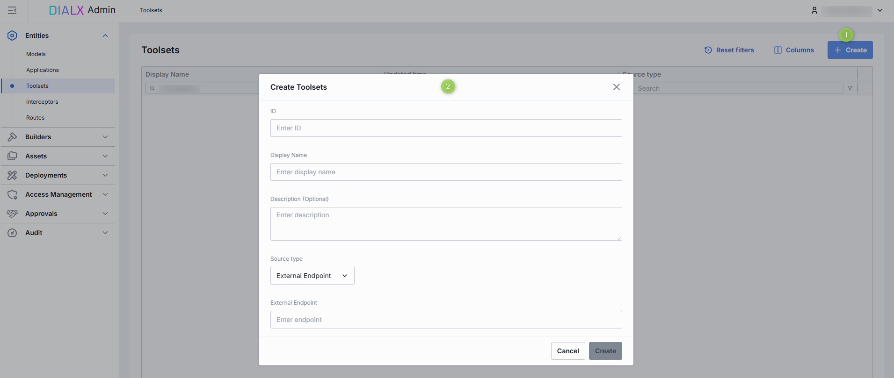

## Duplicate

You can duplicate an existing tool set to create a copy of it.

**Note**
> When duplicating a tool set that requires authentication, you will be prompted to enter authentication credentials that will apply to the duplicate for security purposes.

### To create a duplicate of a tool set

1. Click **Duplicate** in the actions menu of a tool set on the main screen.
2. In the **Duplicate Toolsets** window:
    - Enter **Display Name** and **ID** for the duplicated tool set.
    - Enter **OAuth** credentials that will apply for the duplicate.
3. Click **Duplicate** to complete the procedure.

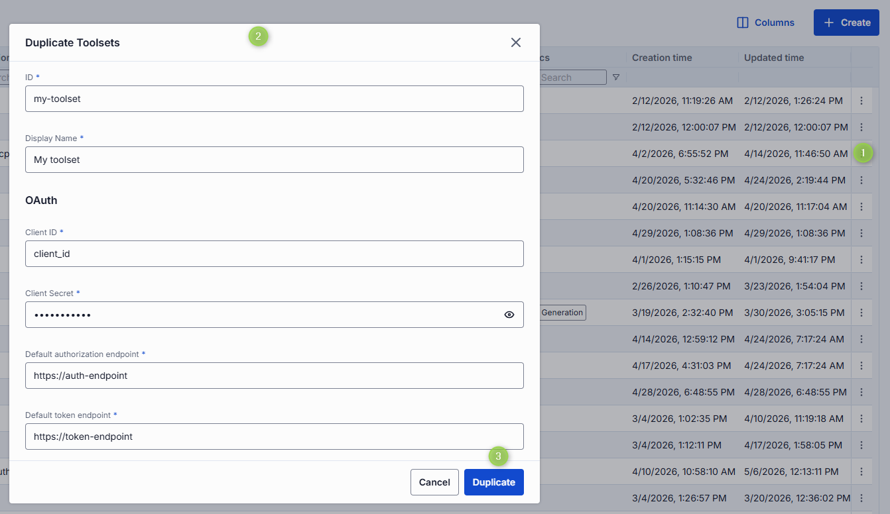

## Delete

There are several ways to delete a tool set:

- Click **Delete** in the toolbar on the Configuration screen to permanently remove the selected tool set from your DIAL instance.
- Use the Delete option in the toolset context menu.

## Configuration

You can access the toolset configuration screen by clicking any tool set on the main screen or when adding a new tool set. In this section, you can view and configure the selected tool set.

- [Properties](#properties): Main definitions.
- [Tools overview](#tools-overview): Available tools supported by the related MCP server.
- [Roles](#roles): User groups that can access the tool set.
- [Audit](#audit): Detailed logs of individual configuration changes.

### Properties

In the **Properties** tab, you can view and edit main definitions and settings of the selected tool set.

| Field | Required | Editable | Description |
|-------|----------|----------|-------------|
| **ID** | - | No | Unique key under the **Toolsets** section of DIAL Admin. |
| **Updated Time** | - | No | Date and time when the toolset's configuration was last updated. |
| **Creation Time** | - | No | Date and time when the toolset's configuration was created. |
| **Authentication** | - | No | Current authentication status of the selected tool set: - **Logged out**: The tool set is not authenticated with the related MCP server. - **Logged in (Personal)**: The tool set is authenticated with your personal credentials only. - **Logged in (Organization)**: The tool set is authenticated with organization credentials only. - **Logged in**: The tool set is authenticated at both personal and organization levels. |
| **Sync with core** | - | No | Indicates the state of the entity's configuration synchronization between Admin and DIAL Core. Synchronization occurs automatically every 2 mins (configurable via `CONFIG_AUTO_RELOAD_SCHEDULE_DELAY_MILLISECONDS`). **Important**: Sync state is not available for sensitive information (API keys/tokens/auth settings). **Synced**: Entity's states are identical in Admin and in Core for valid entities, or entity is missing in Core for invalid entities. **In progress...**: Synced conditions are not met and changes were applied within last 2 mins (this period is configurable via `CONFIG_EXPORT_SYNC_DURATION_THRESHOLD_MS`). **Out of sync**: Synced conditions are not met and changes were applied more than 2 mins ago (this period is configurable via `CONFIG_EXPORT_SYNC_DURATION_THRESHOLD_MS`). **Unavailable**: Displayed when it is not possible to determine the entity's state in Core. This occurs if the config was not received from Core for any reason, or the configuration of entities in Core is not entirely compatible with the one in the Admin service. |
| **Display Name** | Yes | Yes | Name of a tool set shown across the UI (e.g. GitHub, Google Maps). |
| **Description** | No | Yes | Description of a tool set. |
| **Maintainer** | No | Yes | Name of the user overseeing the toolset's configuration. |
| **Icon** | No | Yes | Logo to visually distinguish tool sets in the UI. |
| **Topics** | No | Yes | Semantic labels that you can assign to tool sets (e.g. "finance", "support") for better navigation on UI. Click to display a list of available topics. You can add your own custom topics to the list following these rules: - The topic name must not exceed 255 characters. - The topic name must not contain leading or trailing spaces. |
| **Source Type** | Yes | Yes | The source type of the selected tool set: - [MCP Container](../5.deployments/3.mcp-containers.md): Tool set is based on a running MCP container. - **External Endpoint**: External API endpoint for externally-deployed custom tool sets. - **MCP Registry**: [MCP Registry](https://registry.modelcontextprotocol.io/) for Model Context Protocol (MCP) servers. |
| **External Endpoint** | Conditional | Yes | Toolset endpoint for MCP calls. Applies for External Endpoint source type. |
| **Container** | Conditional | Yes | MCP server [container ID](../5.deployments/3.mcp-containers.md). Applies for MCP Container deployment source type. |
| **MCP server name** | Conditional | Yes | Name of MCP server from the [MCP Registry](https://registry.modelcontextprotocol.io/). Start typing in the text box to search for available MCP servers or click **Select from registry** to display a window with a list of available MCP servers and their details. Applies for MCP Registry source type. |
| **Transport** | Yes | Yes | Transport supported by a related endpoint. Available options: HTTP (default) or SSE (deprecated). |
| **Forward per request key** | No | Yes | Set this flag to `true` if you want a [per-request key](../../3.building-with-dial/7.working-with-dial-resources/5.per-request-keys.md) to be forwarded to the toolset endpoint allowing a tool set to access files in the DIAL storage. **Note**: It is not allowed to create tool sets with `authType.API_KEY` and `forwardPerRequestKey=true`. |
| **Forward auth token** | No | Yes | Determines whether to forward an Auth Token to your toolset's endpoint. If enabled, the HTTP header with the authorization token is forwarded to the toolset endpoint. |
| **Max retry attempts** | Yes | Yes | Number of times DIAL Core will [retry](../../4.operating-dial/4.configuration/7.load-balancer.md#fallbacks) routing a failed call to a toolset endpoint (due to timeouts or 5xx errors). |
| **Authentication** | Yes | Yes | [Toolset authentication configuration](#authentication). |

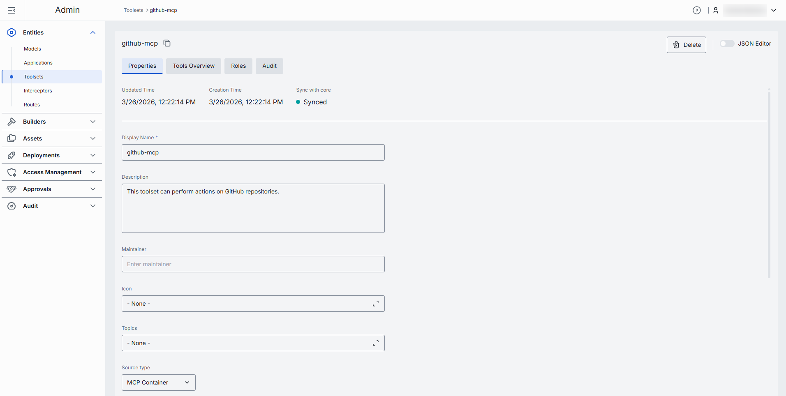

#### Authentication

If the tool set you have chosen requires authentication at the related MCP server, you will have to sign in before you can use it. For example, if you are using an application that relies on the MCP tool set and authentication is required, you will not be able to access it unless you are logged in. Make sure you are authenticated with the MCP server you are about to use.

**Note**
> Refer to [DIAL Core](https://github.com/epam/ai-dial-core/blob/development/docs/dynamic-settings/toolset_credentials_api.md) to learn more about toolset authentication.

##### Step 1: Select and configure the authentication method

DIAL supports several authentication methods for tool sets:

- **OAuth**: Authenticate via OAuth 2.0 with an external identity provider. If this option is selected, you have to populate the authentication form with correct values provided by the identity provider:
    - **Redirect URI**: Redirect URI used during sign-in flows. After authentication, the MCP Server redirects the user to the provided URI.
    - **Client ID**: The unique identifier of the client/application requesting access to the resource.
    - **Client Secret**: A confidential key used by the client to authenticate itself with the authentication server.
    - **Scopes Supported**: List of supported scopes that define access levels. May be discovered via .well-known endpoints.
    - **Default authorization endpoint**: URL for performing authorization. Can be discovered via .well-known metadata if provided by the Authorization Server.
    - **Default token endpoint**: The URL where the client exchanges the authorization code for an access token. Can be discovered via .well-known metadata if provided by the Authorization Server.
    - **PKCE method**: The method used for Proof Key for Code Exchange (PKCE), usually `plain` or `S256`.
- **API Key**: Authenticate using an API key. If this option is selected, you have to provide the API key and header name in the configuration.
- **Without authentication**: No authentication enforced; the endpoint is publicly accessible.

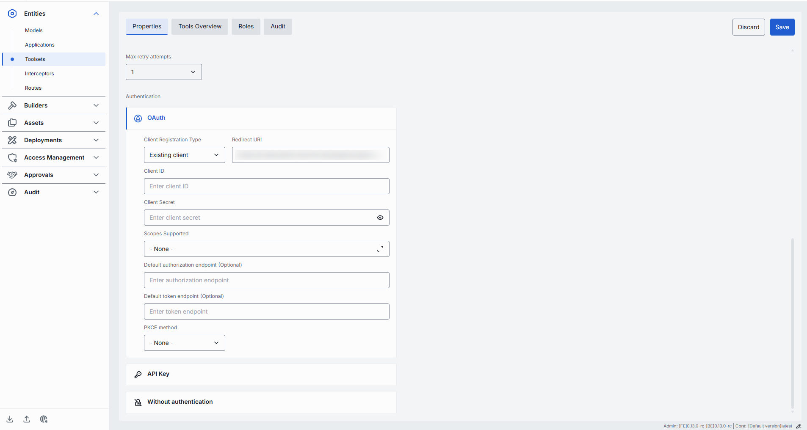

##### Step 2: Choose authentication level(s)

Having selected and configured an authentication method, click **Save** and **Log In** to authenticate a tool set with the related MCP server. At this step, choose the level you want to authenticate:

- **Personal**: The tool set is authenticated for your user only with the state **Logged in (Personal)**.
- **Organization**: The tool set is authenticated for all users in your organization with the state **Logged in (Organization)**.
- **Both**: You can keep both personal and organization authentication active for the same tool set. In this case, authentication status is displayed as **Logged in**. When you use **Log out**, you can also choose the level to sign out from (Personal, Organization, or both).

**Tip**
> At this step, for authentication with API keys, you will be prompted to provide a valid API key value.

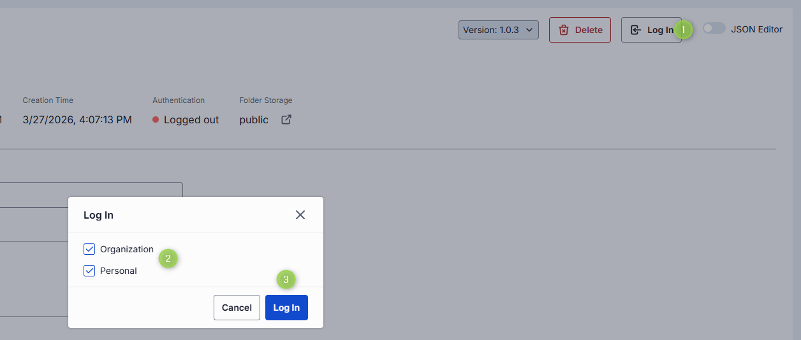

### Tools overview

[Tools](https://modelcontextprotocol.io/specification/2025-06-18/server/tools) are specific functions supported by a related MCP server that can be used by clients to perform specific actions. On this screen, you can find and manage all tools supported by the related MCP server.

If your tool set was created based on an MCP container deployed in DIAL, the content of this screen is inherited from the related [MCP container](../5.deployments/3.mcp-containers.md) and displays all the **enabled** tools. Click [Manage tools](#manage-tools) to access, try, and enable all the available tools.

#### Use all tools

Enable the **Use all available tools** toggle to automatically include all tools supported by the related MCP server. When enabled, you cannot add or remove tools manually.

Click on any tool to preview its details or [try it out](#try-tools).

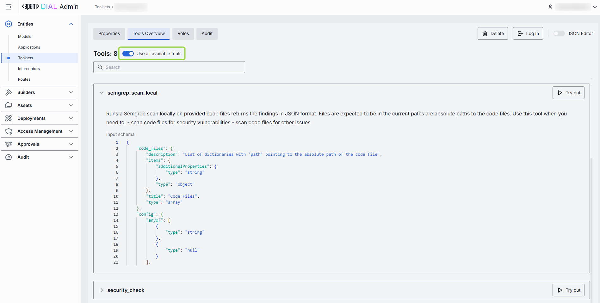

#### Manage tools

Disable the **Use all available tools** toggle to enable manual tools management mode.

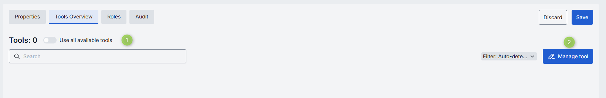

1. Disable **Use all available tools** toggle and click **Manage tools** button to open the **Manage tools** modal.
2. The modal displays all tools available to your user. You can preview and enable/disable each tool individually.
3. The MCP server can support other tools that are not available to your user and therefore are not rendered in the list of available tools. If you know their names, you can manually add them. Manually-added tools are labeled accordingly on the Tools Overview screen.
4. Click **Confirm** to apply changes.
5. On the **Tools overview** screen, use the filter to see all tools, only auto-detected tools, or manually added tools.
6. Hover over any tool to see its details or [try it out](#try-tools).

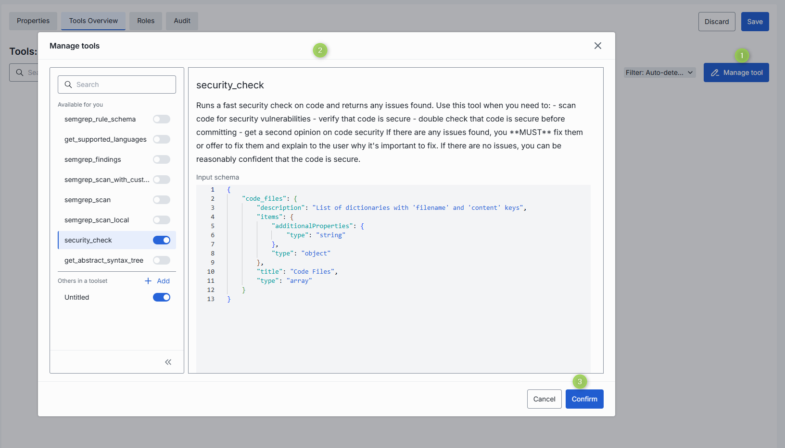

#### Try tools

Click or hover over any **enabled** tool and click **Try out** to enter the Try out mode.

In the **Try out** mode, you can test each enabled tool by sending a request to the server. When sending a request, you can use the rendered UI form or a raw JSON mode to populate the request input fields.

##### To try a tool

1. Click any available tool to access its description and input schema parameters. You can display the input schema in both table and JSON view modes.
2. Click **Try out** to open a sidebar for sending requests.
3. Populate the Request body. You can display the request body in both table and JSON view modes.
4. Click **Send Request** to send the request. The response from the server will be displayed in the Response body area.

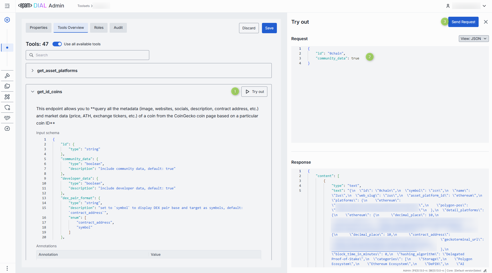

### Roles

You can create and manage roles in the [Access Management](../6.access-management/1.roles.md) section.

In the **Roles** tab, you can define user groups that are authorized to use a specific tool set.

**Note**
> - Refer to [Access & Cost Control](../../2.understand-dial/4.security-and-governance/2.access-control-reference.md) to learn more about access control in DIAL.
> - Refer to [Roles](../../2.understand-dial/4.security-and-governance/2.access-control-reference.md) to learn more about roles in DIAL.
> - Refer to tutorials to learn how to configure access and limits for [JWT](../../4.operating-dial/5.auth-and-access-control/2.jwt.md) and [API keys](../../4.operating-dial/5.auth-and-access-control/1.api-keys.md).

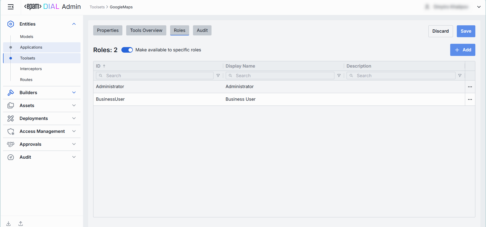

#### Roles grid

| Column | Description |
|--------|-------------|
| **ID** | Unique role identifier. |
| **Display Name** | Role name. |
| **Description** | Description of the role's purpose (e.g., "DIAL Prompt Engineering Team"). |
| **Actions** | Additional role-specific actions: When **Make available to specific roles** toggle is off — opens the [Roles](../6.access-management/1.roles.md) section in a new tab. When **Make available to specific roles** toggle is on, you can open the [Roles](../6.access-management/1.roles.md) section in a new tab or [remove](#remove-a-role) the role from the list. |

#### Role-specific access

Use the **Make available to specific roles** toggle to define access to the tool set:

- **Off**: Tool set is callable by any authenticated user. All existing user roles are in the grid.
- **On**: Tool set is restricted — only the roles you explicitly add to the grid can invoke it.

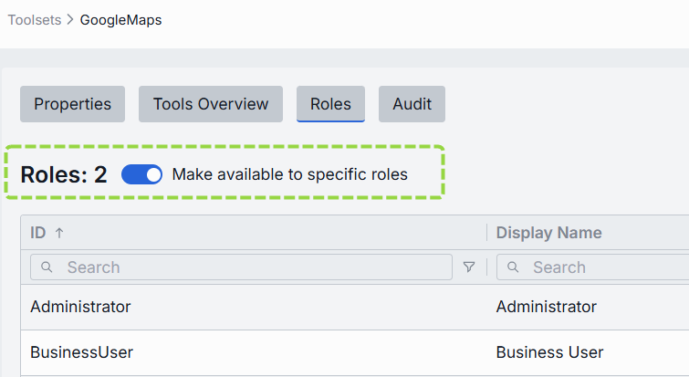

#### Add a role

You can add a role only if the **Make available to specific roles** toggle is **On**.

1. Click **+ Add** (top-right of the Roles grid).
2. Select one or more roles in the modal. The list of roles is defined in the [Access Management](../6.access-management/1.roles.md) section.
3. Confirm to add role(s) to the table.

#### Remove a role

You can remove a role only if the **Make available to specific roles** toggle is **On**.

1. Click the actions menu in the role's row.
2. Choose **Remove** in the menu.

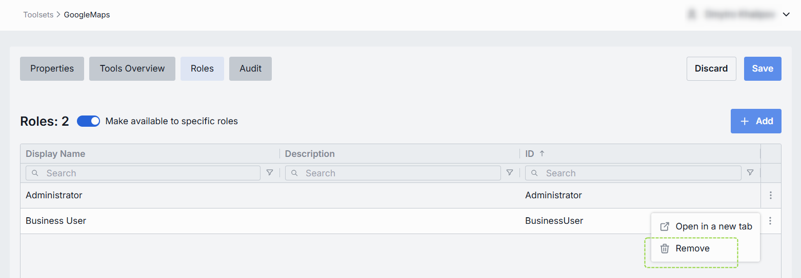

### Audit

In the **Audit** tab, you can monitor key metrics, activities, and usage related to the selected tool set. This tab provides comprehensive insights into performance, user interactions, and operational changes. You can track real-time and historical data, identify usage patterns, and audit and roll back all modifications made to the selected tool set for compliance and troubleshooting purposes.

**Note**
> This section mimics the functionality available in the global [Dashboard and Usage Logs](../8.audit/2.monitoring-dashboards.md) and [Activity](../8.audit/1.activity-and-rollback.md) sections, but is scoped specifically to the selected tool set.

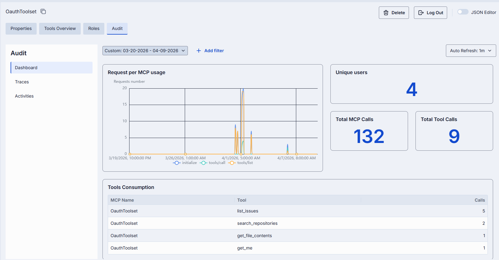

### JSON editor

Advanced users with technical expertise can work with the toolset properties in a JSON editor view mode. It is useful for advanced scenarios of bulk updates, copy/paste between environments, or tweaking settings not exposed on UI.

**Tip**
> You can switch between UI and JSON only if there are no unsaved changes.

In the JSON editor, you can use the view dropdown to select between Admin format and Core format. These formatting options are for your convenience only and do not render properties as they are defined in DIAL Core. After making changes, the **Sync with core** indicator on the main configuration screen will inform you about the synchronization state with DIAL Core.

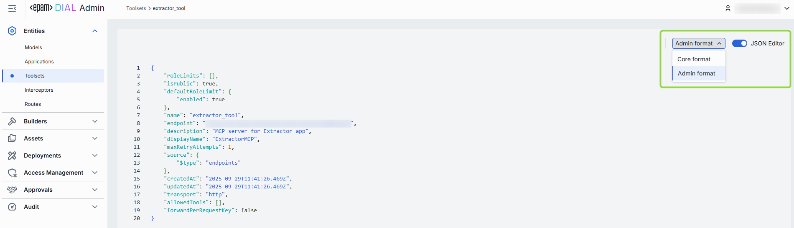

#### Working with the JSON editor

1. Navigate to **Entities → Toolsets**, then select the tool set you want to edit.
2. Click the **JSON Editor** toggle (top-right). The UI reveals the raw JSON.
3. Choose between the Admin and Core format to see and work with properties in the necessary format. **Note**: Core format view mode does not render the actual configuration stored in DIAL Core but the configuration in the Admin service displayed in the DIAL Core format.
4. Make changes and click **Save** to apply them.
5. After making changes, the **Sync with core** indicator on the main configuration screen will inform you about the synchronization state with DIAL Core.

## Next steps

- [Manage MCP containers](../5.deployments/3.mcp-containers.md) — deploy and manage the MCP containers that power your tool sets.
- [Manage roles and access control](../6.access-management/1.roles.md) — define who can access each tool set.
- [Manage applications](./2.applications.md) — configure application deployments that use tool sets via MCP.
