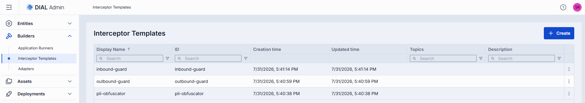
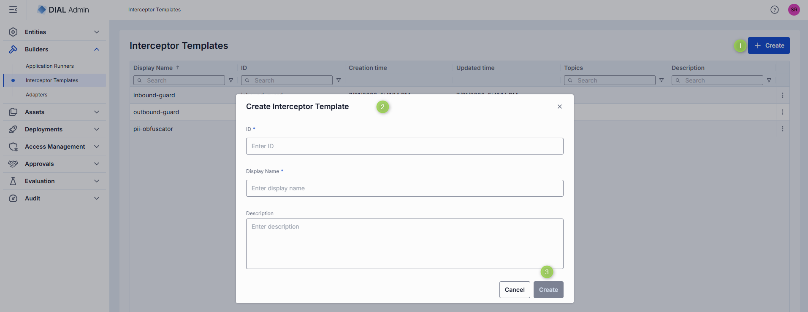
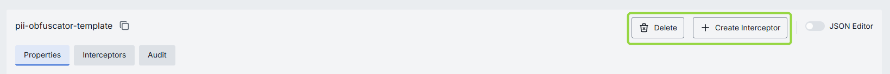
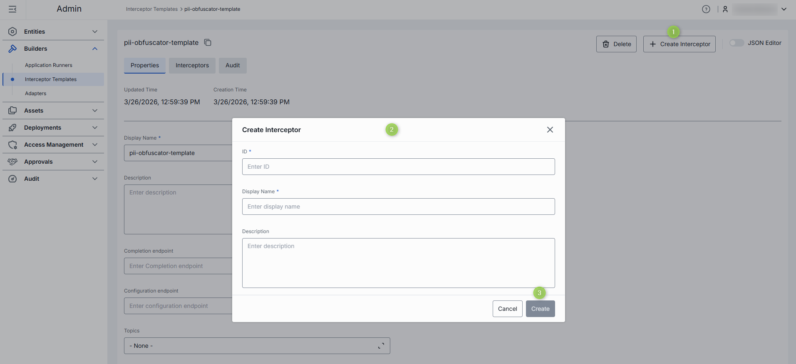
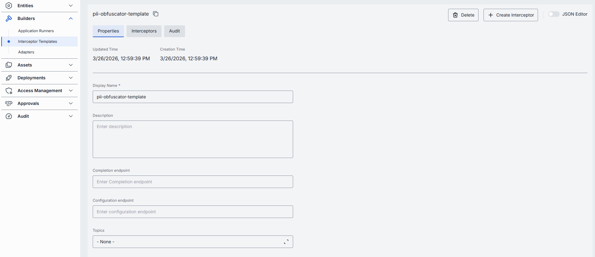
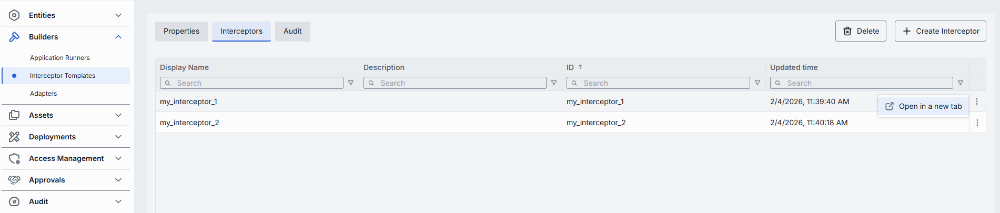
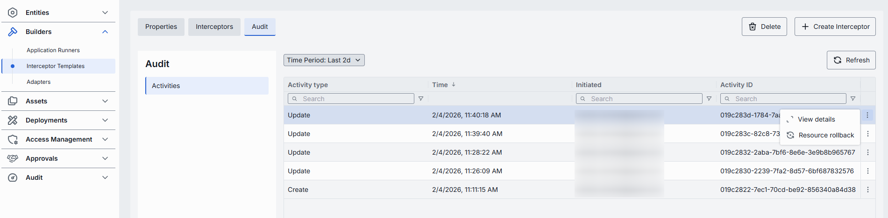

# Interceptor Templates

Interceptor templates are reusable blueprints that streamline the creation of interceptors in DIAL. They save time by eliminating repetitive configuration when setting up similar interceptors.

Once created, interceptor templates can be [selected as a source type](../2.entities/4.interceptors.md#create) when creating new interceptor entities.

**Note**
> To learn more about interceptors, refer to [Interceptors](../../3.building-with-dial/2.interceptors/0.index.md).

## Main screen

On the main screen, you can add and manage all Interceptor Templates in your DIAL instance.

| Column | Description |
|--------|-------------|
| **Display name** | Name displayed on the UI (e.g. "PII Obfuscator", "Words Blacklist"). |
| **ID** | Unique identifier. |
| **Description** | Description of the interceptor template. |
| **Topics** | Semantic tags for identification and filtering on the UI. |
| **Creation Time** | Creation timestamp. |
| **Updated Time** | Timestamp of the latest update. |

## Create an interceptor template

1. Click **+ Create** to open the **Interceptor Template** modal.
2. Define key parameters:

   | Field | Required | Description |
   |-------|----------|-------------|
   | **ID** | Yes | Unique identifier. |
   | **Display name** | Yes | Name displayed on the UI. |
   | **Description** | No | Description of the interceptor template. |

3. Click **Create**. The dialog closes and the new template's [configuration screen](#configure-an-interceptor-template) opens. The new template appears immediately in the listing, though changes may take some time to propagate to DIAL Core.

   

## Configure an interceptor template

Click any interceptor template on the main screen to open its configuration page.

**Top bar controls**

| Control | Description |
|---------|-------------|
| **Create Interceptor** | Creates an interceptor entity from this template. Created interceptors appear in [Entities → Interceptors](../2.entities/4.interceptors.md). |
| **Save** | Saves any changes to the interceptor template. |
| **Discard** | Reverts any unsaved changes. |
| **Delete** | Permanently removes the template. All related interceptors still bound to it are deleted as well. |

### Create interceptor from template

On the configuration screen, click **+ Create Interceptor** to create a new [interceptor entity](../2.entities/4.interceptors.md) based on this template.

1. Click **+ Create Interceptor** and fill in the pop-up form.
2. Click **Create**. The configuration of the new interceptor entity opens. The **Interceptor Template** field in the new interceptor is pre-populated with this template.

### Properties tab

In the **Properties** tab, preview and modify the identity, metadata, and endpoints of the interceptor template.

| Field | Required | Editable | Description |
|-------|----------|----------|-------------|
| **ID** | — | No | Unique ID of the template (copyable). Cannot be changed after creation. |
| **Updated Time** | — | No | Timestamp for change tracking and audit. |
| **Creation Time** | — | No | Creation timestamp. |
| **Display Name** | Yes | Yes | Name displayed on the UI (e.g. "PII Obfuscator", "Words Blacklist"). |
| **Description** | No | Yes | Description of the template and how it can be used. |
| **Completion endpoint** | No | Yes | URL of the interceptor service. DIAL Core uses this to handle requests and responses for the interceptor. |
| **Configuration endpoint** | No | Yes | URL that exposes the interceptor's configuration as a JSON schema. |
| **Topics** | No | Yes | Semantic tags associated with this template. |

### Interceptors tab

A read-only grid showing all interceptor instances created from this template. Use it to assess the potential impact before editing or deleting the template.

From the actions menu of each row, navigate to the interceptor's configuration in [Entities → Interceptors](../2.entities/4.interceptors.md#configuration).

### Audit tab (Interceptor templates) {#audit-tab-interceptor-templates}

View a detailed history of changes to this interceptor template and revert any of them.

**Tip**
> This section mirrors the global [Audit → Activities](../8.audit/1.activity-and-rollback.md) view, scoped to the selected template.

