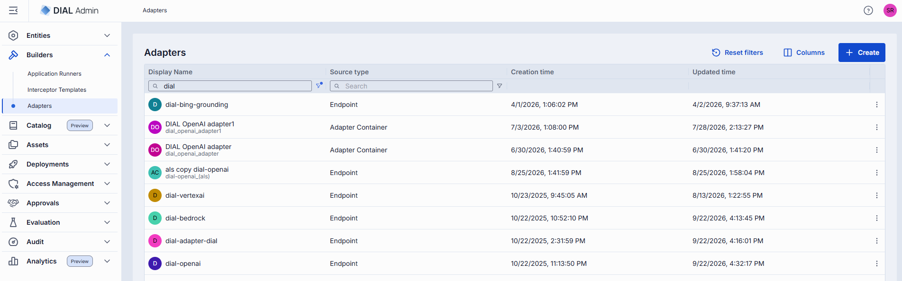
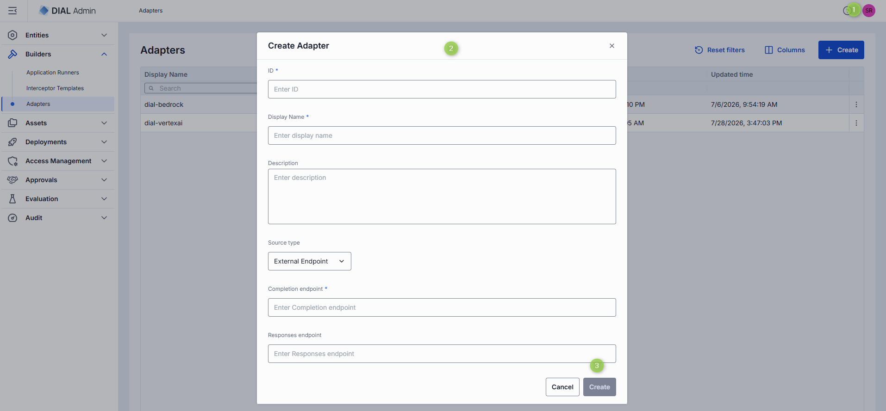
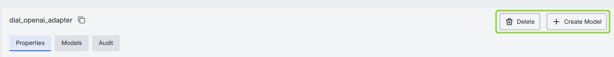
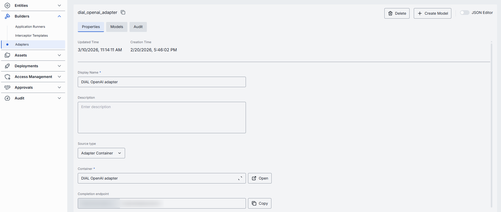
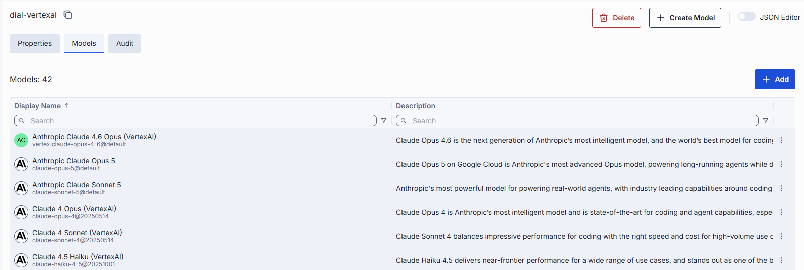
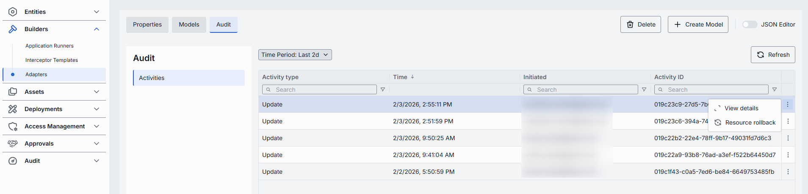

# Adapters

Model Adapters unify provider-specific model APIs with the Unified Protocol of DIAL Core. Each adapter consists of:

- **Coded implementation** that communicates with the AI model and implements the Unified Protocol.
- **Metadata object** managed in **Builders → Adapters**, which establishes the relationship to models.

DIAL includes adapters for [Azure OpenAI](https://github.com/epam/ai-dial-adapter-openai), [GCP Vertex AI](https://github.com/epam/ai-dial-adapter-vertexai/?tab=readme-ov-file#supported-models), and [AWS Bedrock](https://github.com/epam/ai-dial-adapter-bedrock) models. Compatibility with the Azure OpenAI API makes it straightforward to add new adapters for language models or develop them with [DIAL SDK](https://github.com/epam/ai-dial-sdk).

DIAL supports both [self-hosted](../5.deployments/2.container-management.md) adapters (deployed within the DIAL infrastructure) and external adapters.

## Main screen

The main screen displays all registered adapters in your DIAL instance.

| Column | Description |
|--------|-------------|
| **ID** | Unique identifier of the adapter. |
| **Display Name** | Name displayed on the UI. |
| **Description** | Brief description of the adapter (e.g. "Adapter for OpenAI models"). |
| **Updated Time** | Timestamp of the last update. |
| **Creation Time** | Creation timestamp. |
| **Topics** | Semantic tags associated with the adapter. |
| **Source type** | Type of the adapter source: external endpoint or adapter container. |
| **Source** | URL for externally-deployed adapters, or the name of the adapter container for self-hosted adapters. |

## Create an adapter

1. Click **+ Create** to open the **Create Adapter** modal.

   | Field | Required | Description |
   |-------|----------|-------------|
   | **ID** | Yes | Unique identifier. |
   | **Display name** | Yes | Unique name displayed on the UI. |
   | **Description** | No | Description of the adapter. |
   | **Source type** | Yes | **External Endpoint** for externally-deployed adapters; **Adapter Container** for self-hosted adapter images. |
   | **Completion endpoint** | Yes | Endpoint to process chat completion requests. Implements the Unified Protocol (format: `{ADAPTER_ORIGIN}/openai/deployments/`). If Source Type is Adapter Container, the base URL is determined by the selected container and the endpoint path is editable. If Source Type is External Endpoint, the URL is fully editable. |
   | **Responses endpoint** | No | Endpoint supporting the OpenAI Responses API. Currently only OpenAI adapters support this. When set, DIAL Core routes `POST /openai/v1/responses` requests here. Only basic Responses API behavior is supported—background requests, `previous_request_id`, conversations, prompts, and files are not supported. |
   | **Container** | Conditional | Name of the running [adapter container](../5.deployments/2.container-management.md). Click to select from available containers. Applies to Adapter Container source type. |

2. Once all required fields are filled, click **Create**. The dialog closes and the new adapter's configuration screen opens. The new adapter appears immediately on the main screen.

   

## Configure an adapter

Click any adapter on the main screen to open its configuration page.

**Top bar controls**

| Control | Description |
|---------|-------------|
| **Create Model** | Create a model deployment using this adapter as source. Created models appear in [Entities → Models](../2.entities/1.models.md). |
| **Delete** | Remove the adapter and all models using it. After confirmation, the adapter and all related models are deleted. |
| **Save** | Save and apply any changes. |
| **Discard** | Discard any unsaved changes. You can also revert changes via the [Audit tab](#audit-tab-adapters). |
| **JSON Editor** (toggle) | Switch between the form UI and raw [JSON view](#json-editor-adapters). |

### Properties tab

In the **Properties** tab, view and define the identity and metadata of the selected adapter.

| Field | Required | Editable | Description |
|-------|----------|----------|-------------|
| **ID** | — | No | Unique read-only identifier of the adapter. |
| **Updated Time** | — | No | Timestamp of the last configuration update. |
| **Creation Time** | — | No | Adapter creation timestamp. |
| **Display Name** | Yes | Yes | Unique name displayed on the UI. |
| **Description** | No | Yes | Brief description of the adapter. |
| **Source type** | Yes | Yes | **External Endpoint** for externally-deployed adapters; **Adapter Container** for self-hosted adapter images. |
| **Completion endpoint path** | Yes | Yes | Endpoint URL to process chat completion requests. Implements the Unified Protocol (format: `{ADAPTER_ORIGIN}/openai/deployments/`). If Source Type is Adapter Container, the base URL is determined by the selected container and the path can be partially customized. If Source Type is External Endpoint, the URL is fully editable. |
| **Responses endpoint path** | No | Yes | Endpoint supporting the OpenAI Responses API. Currently only OpenAI adapters support this. If Source Type is Adapter Container, the base URL is determined by the container and the path can be partially customized. If Source Type is External Endpoint, the URL is fully editable. |
| **Container** | Conditional | Yes | Name of the running [Adapter Container](../5.deployments/2.container-management.md). Click to select from available containers. Required when Source Type is Adapter Container. |
| **Topics** | No | Yes | Semantic tags. Custom topics must be ≤ 255 characters with no leading or trailing spaces. |

### Models tab

The **Models** tab shows the AI models exposed by the selected adapter.

| Column | Description |
|--------|-------------|
| **ID** | Model identifier. |
| **Display Name** | Name of the model displayed on the UI. |
| **Description** | Description of the model. |

To add models processed by this adapter:

1. Click **+ Add**.
2. Select one or more available models in the modal. You can check all available models in [Entities → Models](../2.entities/1.models.md). Use **+ Create Model** in the [top bar](#configure-an-adapter) to create a new model on the fly.
3. Click **Apply**.

To remove a model:

1. Click the **actions** menu in the model's row.
2. Choose **Remove**.

### Audit tab (Adapters) {#audit-tab-adapters}

View a detailed history of changes to this adapter and revert any of them.

**Tip**
> This section mirrors the global [Audit → Activities](../8.audit/1.activity-and-rollback.md) view, scoped to the selected adapter.

### JSON editor (Adapters) {#json-editor-adapters}

Advanced users can work with adapter properties in a JSON editor view mode. Useful for bulk updates, copying configuration between environments, or editing settings not exposed in the form UI.

**Tip**
> Switching modes is disabled when there are unsaved changes.

To use the JSON editor:

1. Navigate to **Builders → Adapters** and select the adapter you want to edit.
2. Click the **JSON Editor** toggle (top-right). The raw JSON is revealed.
