# Manage Assets

The **Assets** section of DIAL Admin gives administrators control over everything stored in the Public folder of DIAL file storage: Applications, Tool Sets, Prompts, and Files. Assets are either published there by end users or placed there directly by administrators. This guide covers public folder organization and permissions—shared across all asset types—followed by the configuration details specific to each type.

**Prerequisites**: Access to DIAL Admin with administrator privileges.

## Working with public folders

All asset types—Applications, Tool Sets, Prompts, and Files—share a common folder model. Objects land in the Public folder when end users publish them or when administrators add them directly. The Public folder is visible to all authorized DIAL users; private objects of individual users are never shown in this view.

**Note**
> Refer to [Access Control](../2.understand-dial/4.security-and-governance/2.access-control-reference.md) to learn more about Private and Public logical spaces for object storage in DIAL.

### Folder structure

Objects in the Public folder are arranged hierarchically, similar to a file system.

- **Root folder**: The Public root is visible to all authorized users. Objects published without a target sub-folder are placed in the root by default.
- **Sub-folders**: Use sub-folders for logical organization. One object per sub-folder is recommended.

The effective authorization rule for any object in a sub-folder includes restrictions from all parent folders up to the root. Refer to [Work with publications](../3.building-with-dial/7.working-with-dial-resources/2.publications-api.md#effective-rules) to learn about effective rules for folders.

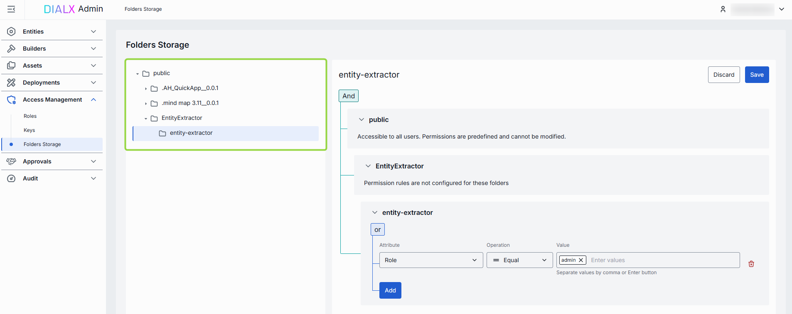

### Folder actions

Hover over any folder in the left or right panel to display the actions menu. The following actions are available on all asset-type pages:

| Action | Description |
|--------|-------------|
| **Add sibling** | Create a new sub-folder sharing the same parent as the selected folder. |
| **Add child** | Create a new sub-folder inside the selected folder. |
| **Move to** | Select a target location in the hierarchy to move the selected folder. |
| **Export** | Download the folder's content (with nested folders) as a ZIP archive or raw JSON file. |
| **Rename** | Rename the selected folder. |
| **Manage permissions** | Navigate to Folders Storage to manage access rules for the folder. |
| **Delete** | Delete the folder along with all objects inside it. |

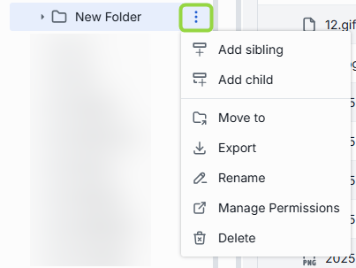

**Note**
> Folder names must not exceed 160 characters.

### Access rules

Click any sub-folder to display its access rules. Access to the root Public folder is predefined and available to all authorized DIAL users. Sub-folders can have custom access rules set by administrators or requested by users in publication requests.

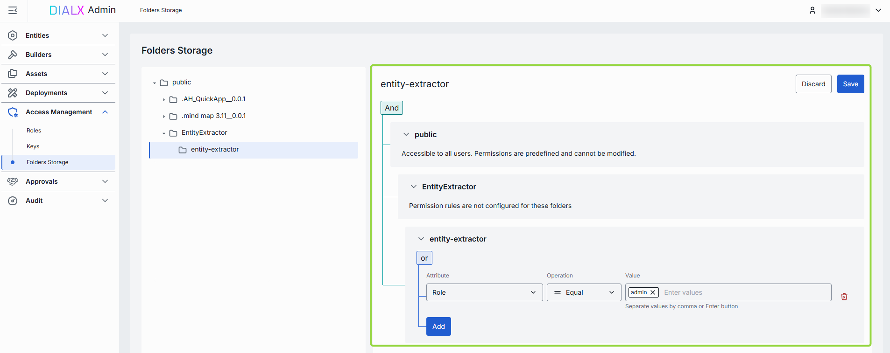

Access rules for objects in sub-folders are evaluated by matching `claims` from identity providers (IDPs) with the defined rules. Each rule is built from three parameters:

| Parameter | Description |
|-----------|-------------|
| **Attribute** | A specific `claim` in the JWT token payload (e.g. `role`). |
| **Value** | An array of claim values to match against (e.g. `admin`). |
| **Operation** | The matching function (e.g. `Equal`). |

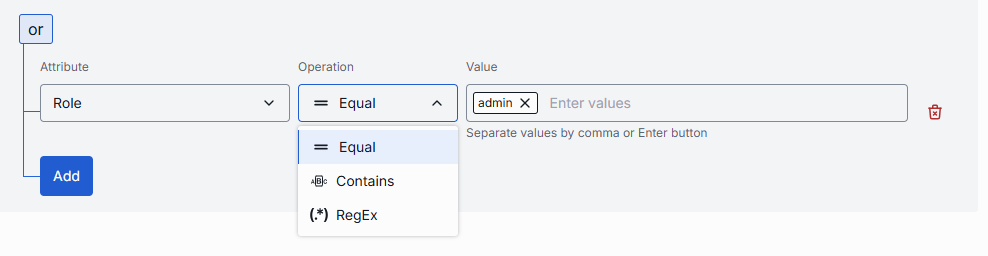

Rules can be nested under **And/Or** blocks to form complex policies:

- **And**: All rules must be satisfied.
- **Or**: At least one rule must be satisfied.

**Note**
> If a folder has a parent folder, all access rules of the parent also apply to the child. Refer to [Work with publications](../3.building-with-dial/7.working-with-dial-resources/2.publications-api.md#effective-rules) to learn about effective rules.

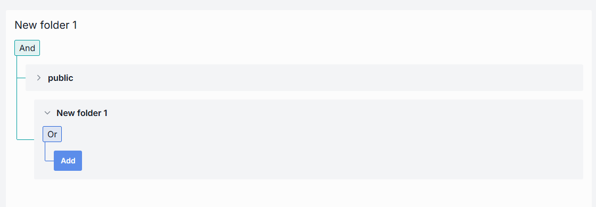

**Note**
> Refer to [JWT](../4.operating-dial/5.auth-and-access-control/2.jwt.md) and [API Keys](../4.operating-dial/5.auth-and-access-control/1.api-keys.md) for how to enable access to DIAL resources. Refer to [Configure IDPs](../4.operating-dial/5.auth-and-access-control/4.sso-idp/0.index.md) for supported identity service provider configurations.

---

## Applications

In DIAL, applications created by users—via the DIAL Core API or UI—are stored in each user's private folder in DIAL file storage and are not accessible to others. To enable broader access, application owners can publish their applications, or administrators can manually place applications in the Public folder.

**Note**
> Refer to [Entities → Applications](2.entities/2.applications.md) to learn about application deployments in DIAL. Refer to [Chat User Guide](../6.chat-user-guide/6.sharing-and-publishing.md) for how end users can publish applications. Refer to [DIAL Core API Publications](https://dialx.ai/dial_api#tag/Publications) for managing publication requests via API.

### Main screen

The main screen displays all applications located in the Public folder.

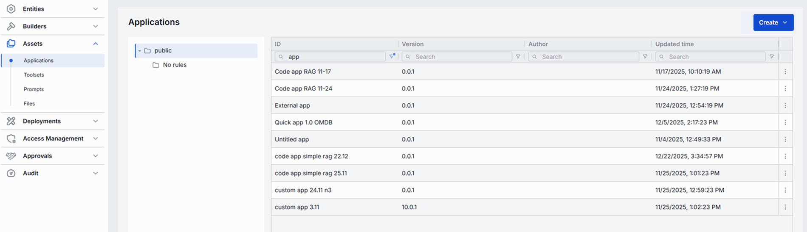

Click any folder to display its contents in the applications grid.

| Column | Description |
|--------|-------------|
| **ID** | Unique identifier of the application. |
| **Version** | Published version of the application. |
| **Author** | Username or system ID of the user who created or last updated this application. |
| **Updated Time** | Timestamp of the last modification. |
| **Actions** | **Open in a new tab**: Open the application's properties in a new tab. **Duplicate**: Create a copy—as a **New version** of the same application, or as a **New application**. **Move to**: Move the application to another folder. **Export**: Download the application. **Delete**: Remove the application. Use **Bulk Actions** in the toolbar to delete multiple applications at once. |

You can also add sub-folders from within the toolbar:

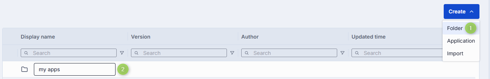

### Create an application

1. Select the target folder, click **Create** in the toolbar, and select **Application**.
2. Define application parameters:

   | Field | Required | Description |
   |-------|----------|-------------|
   | **ID** | Yes | Unique identifier. |
   | **Display Name** | Yes | Application name displayed on the UI (e.g. "Customer Support Bot"). |
   | **Version** | Yes | Semantic version identifier (e.g. `1.2.0`). |
   | **Description** | No | Description of the application. |
   | **Source Type** | Yes | **Endpoints**: Standalone application. DIAL Core communicates via explicitly provided chat completion, responses, and/or MCP endpoints. **Application runner**: An Application Runner acts as a factory, allowing users to create logical instances with different configurations. Select from [Builders → Application Runners](3.builders.md#application-runners). |
   | **Completion endpoint** | Conditional | Endpoint to process chat completion requests. Available when Source Type is **Endpoints**. |
   | **Responses endpoint** | No | Endpoint to process OpenAI Responses API calls. Available when Source Type is **Endpoints**. |
   | **MCP Endpoint** | No | MCP endpoint DIAL Core uses to communicate with the application. Available when Source Type is **Endpoints**. **Transport**: HTTP by default. **Forward per request key**: Forward a [per-request key](../3.building-with-dial/7.working-with-dial-resources/5.per-request-keys.md) to allow MCP server access to DIAL storage. **Configuration delivery**: `Header` or `Meta`. |
   | **Application runner** | Conditional | Select from [available Application Runners](3.builders.md#application-runners). Required when Source Type is **Application runner**. |

3. Click **Create**. The dialog closes and the new [application configuration screen](#configure-an-application) opens. The entry appears immediately in the listing under the selected folder.

   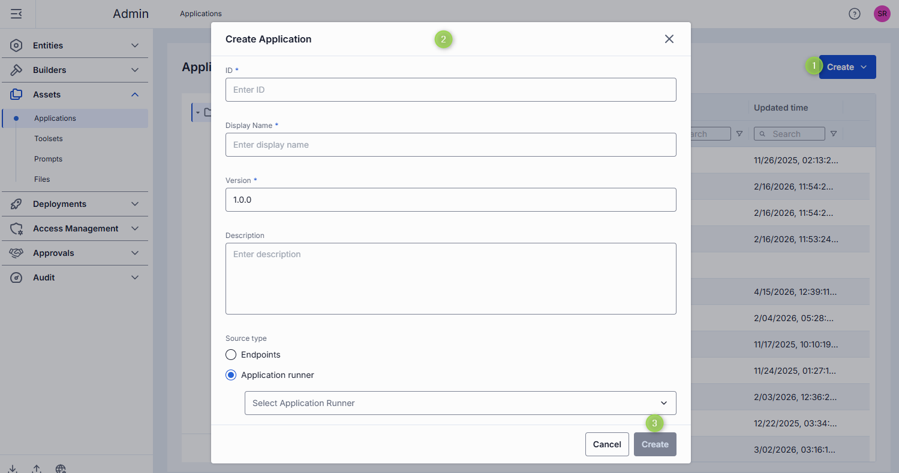

**Tip**
> You can quickly add new applications by duplicating existing ones. Use the **Duplicate** action in the application's context menu.

### Export applications

You can export individual applications or folders with applications (including nested folders). Export as ZIP archive or raw JSON.

- To export a folder, click **Export** in the folder's actions menu.
- To export a specific application, select it and click **Export** in its actions menu.
- To export several applications or specific versions, select them and click **Export** in the top toolbar.

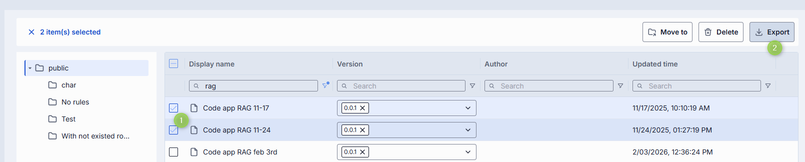

### Import applications

You can upload ZIP archives or raw JSON files of applications. This is essential for migrating, restoring, or sharing application assets between DIAL users.

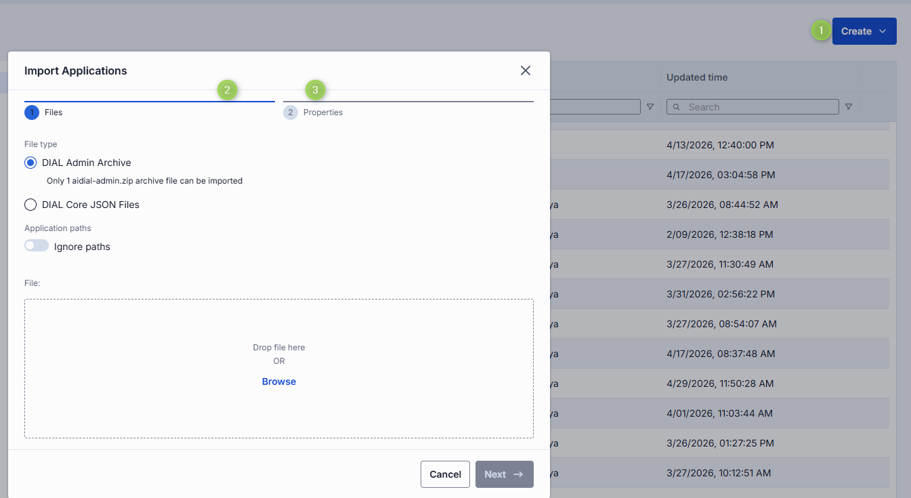

1. Click **Create** in the toolbar and select **Import**.
2. Select the type of files to import. Drag and drop your archive or JSON files into the files area, or click **Browse**.
   - **Archive**: Import a single ZIP or tarball containing multiple JSON files. Only 1 archive at a time.
   - **JSON**: Import JSON files. Up to 30 files at once.
3. Select a **Conflict resolution strategy**:
   - **Skip**: Leave existing apps untouched; only new ones are added.
   - **Override**: Replace apps with the same name and version.
   - **Edit manually**: Resolve conflicts one by one.
4. Enable **Ignore paths** to skip folder structure from imported files. All apps are imported directly into the root folder.
5. Click **Finish**.

### Delete an application

There are several ways to delete an application or a specific version of it:

- Click **Delete** in the toolbar on the Configuration screen.
- Use the **Delete** option in the application's context menu.
- Delete the folder in which the application is located.
- Use **Bulk Actions** on the main screen to delete multiple applications at once.

**Warning**
> Deleting an application is permanent. Applications that depend on it will stop working.

### Configure an application

Click any application to open its configuration screen.

#### Properties tab

View and edit the application's basic properties.

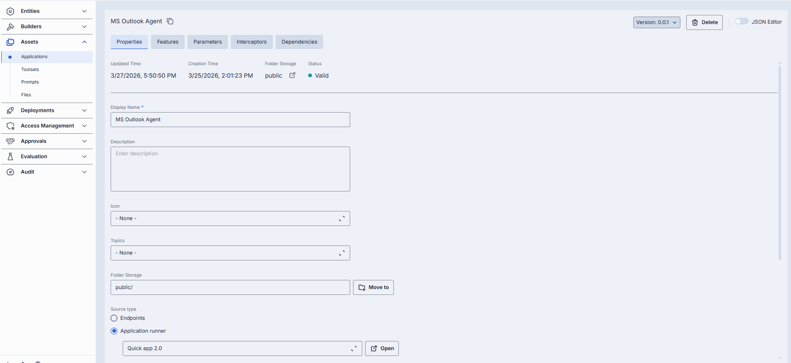

**Available actions**

| Action | Description |
|--------|-------------|
| **Version** | Version of the application. Select from the dropdown to view properties for different versions. Click **Create** in the dropdown to add a new version. |
| **Delete** | Delete the selected application. |

**Properties description**

| Field | Required | Editable | Description |
|-------|----------|----------|-------------|
| **ID** | — | No | Unique identifier (read-only, with copy-to-clipboard button). |
| **Updated Time** | — | No | Timestamp of the last update. |
| **Creation Time** | — | No | Application creation timestamp. |
| **Folder Storage** | — | No | Path to the application in the folder hierarchy. Click to navigate to Folders Storage. |
| **Status** | — | No | **Valid**: configuration is compatible with the JSON schema or related Application Runner. Only valid entities are materialized into DIAL Core configuration. **Invalid**: configuration is incompatible with the JSON schema of the related Application Runner. |
| **Display Name** | Yes | Yes | Name displayed on the UI. |
| **Description** | No | Yes | Free-text summary (e.g. tooling, supported inputs/outputs, SLAs). |
| **Icon** | No | Yes | Logo to visually distinguish the app. Maximum size: 512 MB. Supported types: `.jpeg`, `.jpg`, `.jpe`, `.png`, `.gif`, `.apng`, `.webp`, `.avif`, `.svg`, `.svgz`, `.bmp`, `.ico`. Up to 1 file. |
| **Topics** | No | Yes | Semantic labels (e.g. "finance", "support"). Custom topics must be ≤ 255 characters with no leading or trailing spaces. |
| **Folder Storage** | Yes | Yes | Path to the application's location. Use **Move to** to change the folder. |
| **Source Type** | Yes | Yes | **Endpoints**: Standalone application; DIAL Core communicates via explicitly provided endpoints. **Application runner**: Select from available runners; DIAL Core forwards payloads to endpoints defined in the [Application Runner configuration](3.builders.md#features-tab). |
| **Completion endpoint** | Conditional | Conditional | Endpoint to process chat completion requests. Available and editable when Source Type is **Endpoints**. |
| **Responses endpoint** | Conditional | Conditional | Endpoint to process OpenAI Responses API calls. Available and editable when Source Type is **Endpoints**. |
| **MCP Endpoint** | Conditional | Conditional | MCP endpoint DIAL Core uses to communicate with the application. Available and editable when Source Type is **Endpoints**. Transport HTTP by default. Supports per-request key forwarding and configuration delivery via `Header` or `Meta`. |
| **Editor URL** | No | Conditional | URL of the application's custom builder UI. Available and editable when Source Type is **Endpoints**. |
| **Viewer URL** | No | Conditional | URL of the application's custom UI. If set, overrides standard DIAL Chat UI. Available and editable when Source Type is **Endpoints**. |
| **Attachments types** | No | Yes | Attachment types this app accepts. **No attachments**: disables all. **All attachment types**: allows all, optionally limit count. **Specific attachment types**: define [MIME types](https://developer.mozilla.org/en-US/docs/Web/HTTP/Basics_of_HTTP/MIME_types/Common_types) manually. |
| **Attachments max number** | No | Yes | Maximum number of input attachments. Enabled when attachment types are defined. |
| **Completion Defaults** | No | Yes | Default parameters applied when not provided in an OpenAI `chat/completions` API call. |
| **Responses Defaults** | No | Conditional | Default parameters applied when not provided in an OpenAI `openai/v1/responses` API call. Available when OpenAI Responses API is supported. |
| **Forward auth token** | No | Yes | When enabled, the HTTP authorization token header is forwarded to the chat completion endpoint. Not supported for Assets Applications. |
| **Max retry attempts** | No | Yes | Number of times DIAL Core will [retry](../4.operating-dial/4.configuration/7.load-balancer.md#fallbacks) a failed run (due to timeouts or 5xx errors). |

#### Tools Overview tab

**Important**: This tab is enabled for applications with **Source Type = Endpoints/MCP** or **Source Type = Application Runner** where the Application Runner has an MCP endpoint enabled.

[Tools](https://modelcontextprotocol.io/specification/2025-06-18/server/tools) are functions supported by an MCP server. On this screen, you can discover, manage, and try all available tools.

**Note**
> Refer to the [Tool Sets section below](#tool-sets) for details on the **Use all tools**, **Manage tools**, and **Try tools** workflows—the functionality is identical.

#### Features tab

In the **Features** tab, control optional capabilities of the selected application.

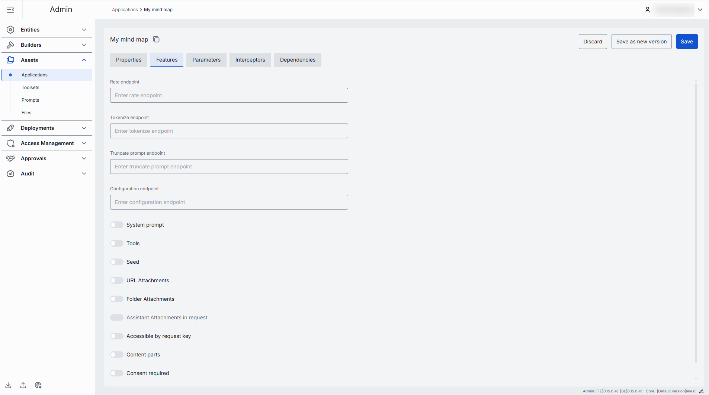

**Endpoints**

Provide optional service endpoints that extend the app's runtime behavior.

**Note**
> When the application is created from an Application Runner, values in this section override endpoints in the [Application Runner configuration](3.builders.md#features-tab).

| Field | Description |
|-------|-------------|
| **Rate endpoint** | URL of a custom rate-estimation API to compute cost or quota usage (e.g. grouping by tenant, complex billing rules). |
| **Tokenize endpoint** | URL of a custom tokenization service for precise, app-wide token counting. |
| **Truncate prompt endpoint** | URL of your own prompt-truncation API for advanced context-window management. |
| **Configuration endpoint** | URL to fetch a JSON Schema describing the application's settings. DIAL Core exposes this as `GET v1/deployments/<deployment name>/configuration`. |

**Feature flags**

Enable or disable per-request options that your application accepts from clients.

| Toggle | Description |
|--------|-------------|
| **System prompt** | Enables system message injection. Useful for multi-step agent orchestration. |
| **Tools** | Enables `tools`/`functions` payloads in API calls. Enable if your application makes external function calls (e.g. calendar lookup, database fetch). |
| **Seed** | Enables the `seed` parameter for reproducible results. |
| **URL Attachments** | Enables URL references (images, docs) as attachments in API requests. |
| **Folder Attachments** | Enables attachments of folders (batching multiple files). |
| **Assistant attachments in request** | When `true`, DIAL Chat preserves `attachments` in `messages` from `role=assistant` in [chat completion requests](https://dialx.ai/dial_api#operation/sendChatCompletionRequest). Useful for apps that generate and consume attachments. |
| **Accessible by request key** | Indicates whether the application is accessible using a [per-request API key](../3.building-with-dial/7.working-with-dial-resources/5.per-request-keys.md). |
| **Content parts** | Indicates whether the deployment supports requests with content parts. |
| **Consent required** | Indicates whether the application requires [user consent](https://dialx.ai/dial_api#tag/User-Consent) before use. |
| **Support comment in rate response** | Indicates whether the application supports the `comment` field in rate response payload. |

#### Parameters tab

If the application is created from an Application Runner, the content of this tab is determined by the [Application Runner's parameters](3.builders.md#parameters-tab). Configure application-specific parameters that influence its behavior.

**Note**
> Refer to [Schema-rich Applications](../3.building-with-dial/1.apps/0.index.md#schema-based-apps) to learn more.

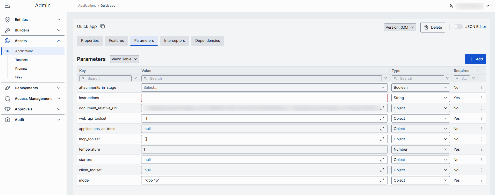

#### Interceptors tab

In the **Interceptors** tab, view global and runner-level interceptors, and define local interceptors specific to this application.

**Note**
> Refer to [Interceptors](../3.building-with-dial/2.interceptors/0.index.md) to learn more. You can define interceptors in [Entities → Interceptors](2.entities/4.interceptors.md) before attaching them here.

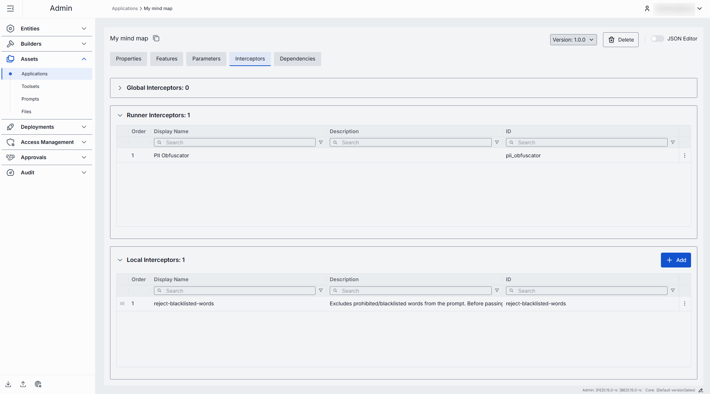

| Column | Description |
|--------|-------------|
| **Order** | Execution sequence. Interceptors run in ascending order (1 → 2 → 3). Response interceptors run in reversed order. |
| **Display Name** | The interceptor's display name from its definition. |
| **Description** | Free-text summary from the interceptor's definition. |
| **ID** | Unique identifier of the interceptor. |
| **Actions** | Open interceptor in a new tab, or remove it from the app's configuration. |

To add interceptors:

1. Click **+ Add** (upper-right of the interceptors grid).
2. In the **Add Interceptors** modal, choose one or more from the list of [defined interceptors](2.entities/4.interceptors.md).
3. Click **Apply** to append them to the bottom of the list (added in the order selected).

To reorder interceptors: drag and drop the handle (⋮⋮⋮⋮) to reassign execution order. Release to reposition; order renumbers automatically. Click **Save**.

To remove an interceptor: click the actions menu in the interceptor's row, choose **Remove**, then click **Save**.

#### Dependencies tab

In interconnected systems, applications often rely on other applications or AI models, forming dependency chains. On this screen, you can view, add, and remove dependencies configured for the selected application.

**Note**
> Refer to [Managing Authorization in Complex Application Ecosystems](../3.building-with-dial/7.working-with-dial-resources/6.auth-matrix-for-apps.md) to learn more.

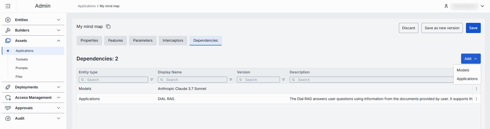

| Column | Description |
|--------|-------------|
| **Entity Type** | Whether the dependent object is an Application or a Model. |
| **ID** | Identifier of the dependent model or application. |
| **Display Name** | Descriptive name of the dependent object. |
| **Version** | Version of the dependent model. |
| **Description** | Additional details about the dependent object. |
| **Actions** | Open the dependent object in a new tab, or remove it from the dependencies list. |

To add a dependency:

1. Click **+ Add** (upper-right of the dependencies grid).
2. Select the type: Application or Model.
3. In the modal, choose the model or application from the grid.
4. Click **Add**.

#### JSON editor (Applications)

Advanced users can work with the application's raw JSON. Useful for bulk updates, copying configuration between environments, or editing settings not exposed in the form UI.

**Tip**
> Switching modes is disabled when there are unsaved changes.

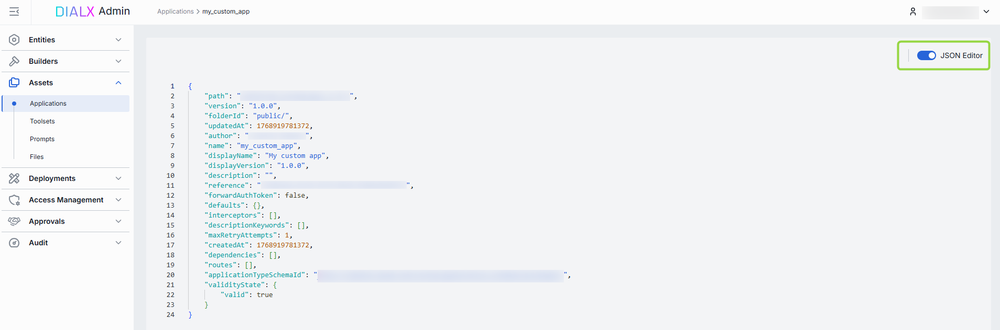

1. Navigate to **Assets → Applications** and select the application you want to edit.
2. Click the **JSON Editor** toggle (top-right). The raw JSON is revealed.

---

## Tool sets

Tool sets in DIAL enable connectivity with MCP servers and can be used as tools by any internal or external application to perform specific actions. Tool sets created by users are stored in each user's private folder and are not accessible to others. To share them with other users, tool set owners can publish them, or administrators can manually add them to the Public folder.

**Note**
> Refer to [Entities → Toolsets](2.entities/3.toolsets.md) to learn more about tool set entities. Refer to [Chat User Guide](../6.chat-user-guide/6.sharing-and-publishing.md) for how end users can publish tool sets. Refer to [DIAL Core API Publications](https://dialx.ai/dial_api#tag/Publications) for managing publication requests via API.

### Main screen

The main screen displays all tool sets located in the Public folder.

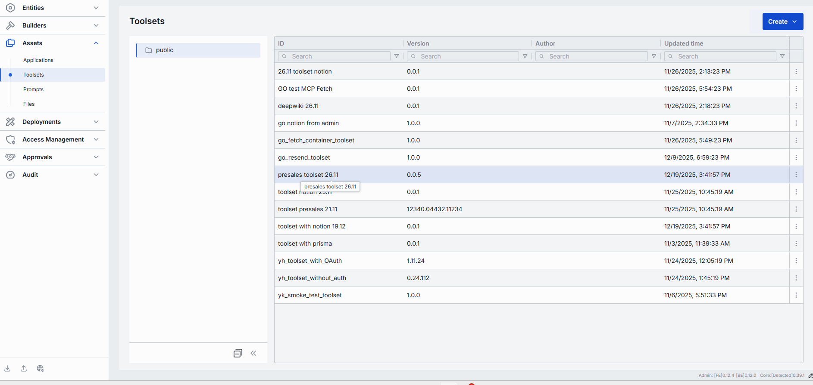

Click any folder to display its contents in the tool sets grid.

| Column | Description |
|--------|-------------|
| **ID** | Tool set's unique identifier. |
| **Version** | Version of the tool set. |
| **Author** | Username or system ID of the user who created or last updated this tool set. |
| **Updated Time** | Timestamp of the last update. |
| **Actions** | **Open in a new tab**: Open the tool set's properties in a new tab. **Duplicate**: Create a copy. **Move to**: Move to another folder. **Export**: Download the tool set. **Delete**: Remove the tool set. |

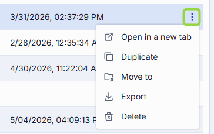

You can also add sub-folders from the toolbar:

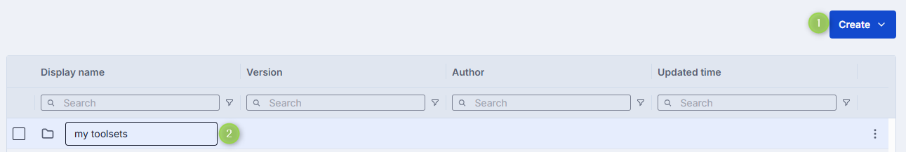

### Create a tool set

1. Select the target folder, click **Create** in the toolbar, and select **Toolset**.
2. Define tool set parameters:

   | Field | Required | Description |
   |-------|----------|-------------|
   | **ID** | Yes | Unique identifier of the tool set. |
   | **Display Name** | Yes | Name displayed on the UI. |
   | **Version** | Yes | Semantic version identifier (e.g. `1.2.0`). |
   | **Description** | No | Description of the tool set. |
   | **External Endpoint** | Yes | Endpoint DIAL Core uses to communicate with the related MCP server. |

3. Click **Create**. The dialog closes and the new [tool set configuration screen](#configure-a-tool-set) opens. The entry appears immediately in the listing.

   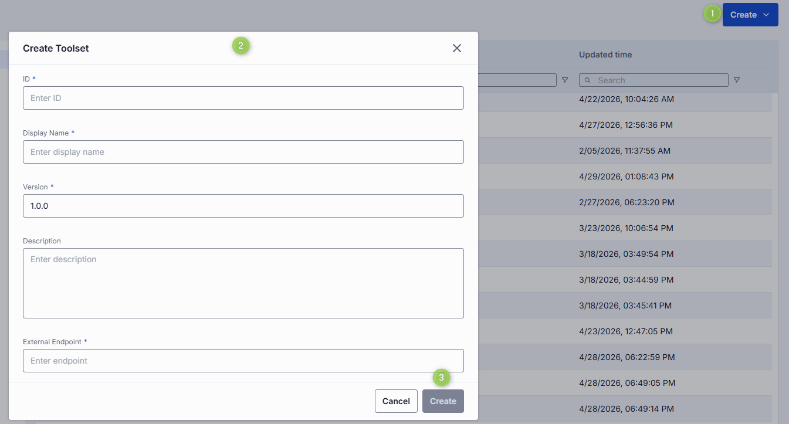

**Tip**
> You can quickly add new tool sets by duplicating existing ones. Use the **Duplicate** action in the tool set's context menu.

### Duplicate a tool set

You can duplicate an existing tool set to create a copy.

**Note**
> When duplicating a tool set that requires authentication, you will be prompted to enter authentication credentials for the duplicate.

1. Click **Duplicate** in the tool set's actions menu.
2. In the **Duplicate Toolsets** window:
   - Select duplicate type: **New version** (another version of the same tool set) or **New toolsets** (a clone as a new entity).
   - Enter **Display Name**, **Version**, and **ID** (disabled for New Version).
   - Enter **OAuth** credentials for the duplicate.
   - Select **Folder Storage** for the new tool set (disabled for New Version).
3. Click **Duplicate**.

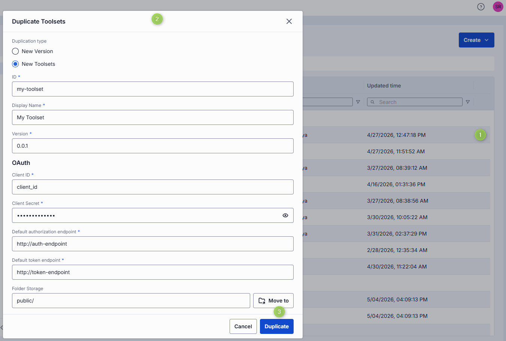

### Export tool sets

You can export individual tool sets or folders with tool sets (including nested folders). Export as ZIP archive or raw JSON.

- To export a folder, click **Export** in the folder's actions menu.
- To export a specific tool set, select it and click **Export** in its actions menu.
- To export several tool sets or specific versions, select them and click **Export** in the top toolbar.

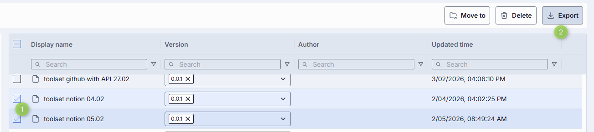

### Import tool sets

You can upload ZIP archives or raw JSON files of tool sets. This is essential for migrating, restoring, or sharing tool set assets between DIAL users.

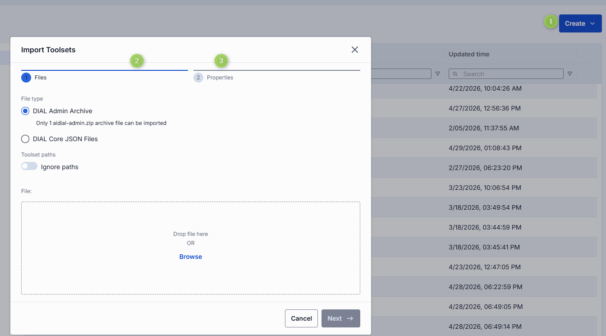

1. Click **Create** in the toolbar and select **Import**.
2. Select the type of files to import. Drag and drop or click **Browse**.
   - **Archive**: Import a single ZIP or tarball. Only 1 archive at a time.
   - **JSON**: Import JSON files. Up to 30 files at once.
3. Select a **Conflict resolution strategy**: **Skip**, **Override**, or **Edit manually**.
4. Enable **Ignore paths** to import all tool sets directly into the root folder.
5. Click **Finish**.

### Delete a tool set

There are several ways to delete a tool set or a specific version:

- Click **Delete** in the toolbar on the Configuration screen.
- Use the **Delete** option in the tool set's context menu.
- Delete the folder in which the tool set is located.
- Use **Bulk Actions** on the main screen to delete multiple tool sets at once.

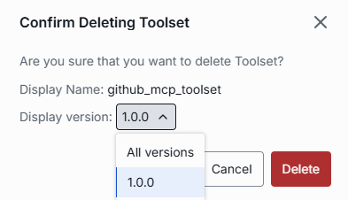

### Configure a tool set

Click any tool set to open its configuration screen.

#### Properties tab

In the **Properties** tab, preview and modify the selected tool set's basic properties.

**Available actions**

| Action | Description |
|--------|-------------|
| **Version** | Version of the tool set. Select from the dropdown to view different versions. Click **Create** in the dropdown to add a new version. |
| **Delete** | Delete the selected tool set. |

**Fields description**

| Field | Required | Editable | Description |
|-------|----------|----------|-------------|
| **ID** | — | No | Unique identifier (read-only, with copy-to-clipboard button). |
| **Author** | — | No | User who created the tool set. |
| **Updated Time** | — | No | Timestamp of the last update. |
| **Creation Time** | — | No | Creation timestamp. |
| **Authentication** | — | No | Current authentication status: **Logged out**, **Logged in (Personal)**, **Logged in (Organization)**, or **Logged in** (both levels active). |
| **Folder Storage** | — | No | Path to the tool set's location in the public folder hierarchy. Click to navigate to Folders Storage. |
| **Display Name** | Yes | Yes | Name displayed on the UI. |
| **Description** | No | Yes | Tool set description. |
| **Icon** | No | Yes | Logo displayed on the UI. Maximum size: 512 MB. Supported types: `.jpeg`, `.jpg`, `.jpe`, `.png`, `.gif`, `.apng`, `.webp`, `.avif`, `.svg`, `.svgz`, `.bmp`, `.ico`. |
| **Topics** | No | Yes | Semantic labels (e.g. "finance", "support"). Custom topics must be ≤ 255 characters with no leading or trailing spaces. |
| **Storage folder** | Yes | Yes | Path in the Public folder hierarchy. Use **Move to** to change the location. |
| **External Endpoint** | Yes | Yes | Endpoint DIAL Core uses to communicate with the related MCP server. |
| **Transport** | Yes | Yes | Transport supported by the MCP server: **HTTP** (default) or **SSE** (deprecated). |
| **Authentication** | Yes | Yes | [Authentication settings](#authentication) for the tool set. |
| **Forward per request key** | Yes | Yes | When `true`, a [per-request key](../3.building-with-dial/7.working-with-dial-resources/5.per-request-keys.md) is forwarded to the tool set endpoint so the tool set can access files in DIAL storage. Not allowed when `authType` is `API_KEY`. |
| **Max retry attempts** | Yes | Yes | Number of times DIAL Core will [retry](../4.operating-dial/4.configuration/7.load-balancer.md#fallbacks) a failed call (due to timeouts or 5xx errors). |

#### Authentication

If the tool set requires authentication at the related MCP server, sign in before using it. A tool set can be published with organization credentials—in this case it may already show **Logged in (Organization)**. You can add personal credentials on top and both levels remain active simultaneously, showing **Logged in**.

**Note**
> Refer to [DIAL Core toolset credentials documentation](https://github.com/epam/ai-dial-core/blob/development/docs/dynamic-settings/toolset_credentials_api.md) to learn more about tool set authentication.

**Step 1: Select and configure the authentication method**

DIAL supports the following authentication methods for tool sets:

- **OAuth**: Authenticate via OAuth 2.0 with an external identity provider. Choose **With login** for dynamic client registration, or **With login & configuration** for static registration—depending on what your MCP server supports. For dynamic registration, providing an **External Endpoint** is sufficient. For static registration, populate the form with values from your identity provider:
  - **Redirect URI**: URI used during sign-in flows; the MCP Server redirects the user here after authentication.
  - **Client ID**: Unique identifier of the client requesting access.
  - **Client Secret**: Confidential key used by the client to authenticate with the authorization server.
  - **Scopes Supported**: Access-level scopes. May be discovered via `.well-known` endpoints.
  - **Default authorization endpoint**: URL for performing authorization. Can be discovered via `.well-known` metadata.
  - **Default token endpoint**: URL where the client exchanges an authorization code for an access token.
  - **PKCE method**: Proof Key for Code Exchange method, usually `plain` or `S256`.
- **API Key**: Authenticate using an API key. Provide the API key and header name.
- **Without authentication**: No authentication is required.

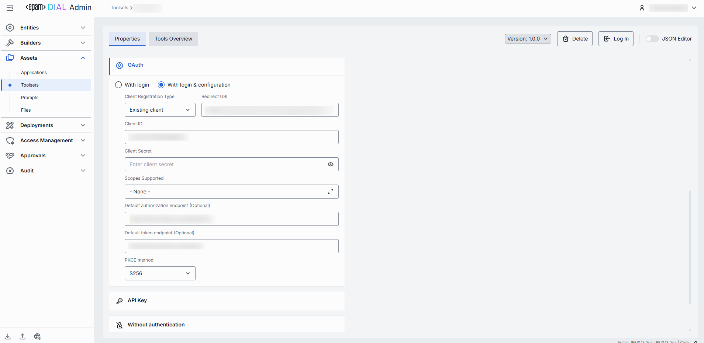

**Step 2: Choose authentication level**

After selecting and configuring an authentication method, click **Save** and **Log In**. Then choose the level:

- **Personal**: Authenticates for your user only. Status becomes **Logged in (Personal)**.
- **Organization**: Authenticates for all users in your organization. Status becomes **Logged in (Organization)**.
- **Both**: Both personal and organization authentication can be active simultaneously. Status shows **Logged in**. When logging out, you can choose to sign out from Personal, Organization, or both.

**Tip**
> For API key authentication, you will be prompted to provide the API key value at this step.

#### Tools Overview tab

[Tools](https://modelcontextprotocol.io/specification/2025-06-18/server/tools) are functions supported by an MCP server. On this screen, discover, manage, and test all tools supported by the related MCP server.

If the tool set was created from an MCP container deployed in DIAL, the content is inherited from the related [MCP container](5.deployments/3.mcp-containers.md#tools-overview) and shows all **enabled** tools. Click **Manage tools** to access, try, and enable all available tools.

**Use all tools**

Enable **Use all available tools** to automatically include all tools supported by the related MCP server. When enabled, tools cannot be added or removed manually. Click on any tool to preview its details or try it out.

**Manage tools**

Disable **Use all available tools** to switch to manual tools management mode.

1. Disable **Use all available tools** and click **Manage tools** to open the **Manage tools** modal.
2. The modal displays all tools available to your user. Preview and enable or disable each tool individually.
3. If you know the names of tools not visible in the list (available to the MCP server but not to your user), add them manually. Manually added tools are labeled accordingly on the Tools Overview screen.
4. Click **Confirm** to apply changes.
5. On the **Tools Overview** screen, use the filter to see all tools, auto-detected tools only, or manually added tools.

**Try tools**

Click or hover over any enabled tool and click **Try out** to enter Try out mode. You can test each enabled tool by sending a request to the server using a rendered UI form or raw JSON mode.

1. Click any available tool to access its description and input schema parameters. Toggle between table and JSON view modes.
2. Click **Try out** to open the sidebar for sending requests.
3. Populate the request body in table or JSON view.
4. Click **Send Request**. The response from the server appears in the Response body area.

#### Audit tab (Tool sets) {#audit-tab-tool-sets}

The Audit section shows usage and consumption metrics for the selected tool set.

**Tip**
> This section mirrors the global [Dashboard](8.audit/2.monitoring-dashboards.md), scoped to the selected tool set.

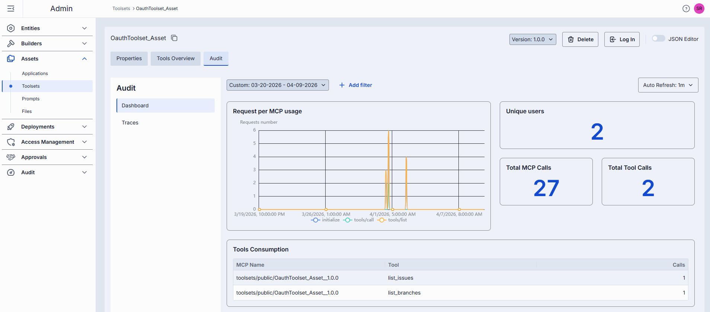

#### JSON editor (Tool sets)

Advanced users can work with the tool set's raw JSON. Useful for bulk updates, copying configuration between environments, or editing settings not exposed in the form UI.

**Tip**
> Switching modes is disabled when there are unsaved changes.

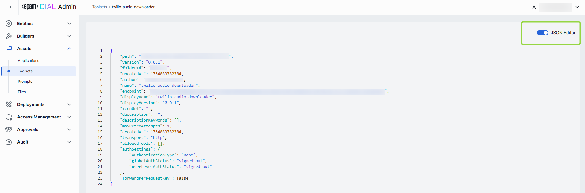

1. Navigate to **Assets → Toolsets** and select the tool set you want to edit.
2. Click the **JSON Editor** toggle (top-right). The raw JSON is revealed.

---

## Prompts

In DIAL, prompts created by users—via the [DIAL Core API](https://dialx.ai/dial_api#tag/Prompts) or [UI](../6.chat-user-guide/2.prompts.md)—are stored in each user's private folder. To share them with other users, prompt owners can publish them, or administrators can manually add them to the Public folder.

**Note**
> Prompts are a protected resource. Refer to [Access Control](../2.understand-dial/4.security-and-governance/2.access-control-reference.md) to learn how protected resources are handled in DIAL. Refer to [Chat User Guide](../6.chat-user-guide/6.sharing-and-publishing.md) for how end users can publish prompts. Refer to [DIAL Core API Publications](https://dialx.ai/dial_api#tag/Publications) for managing publication requests via API.

### Main screen

The main screen displays all prompts located in the Public folder.

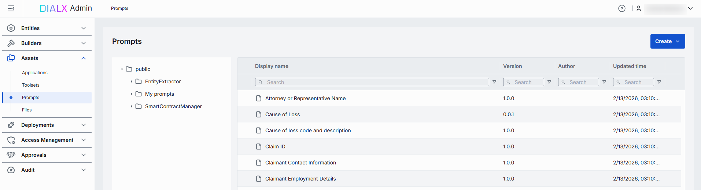

Click any folder to display its contents in the prompts grid.

| Column | Description |
|--------|-------------|
| **Display Name** | Prompt name displayed on the UI. |
| **Version** | Version of the prompt (e.g. `1.0.0`). |
| **Author** | Username or system ID of the user who created or last updated this prompt. |
| **Updated Time** | Timestamp of the last modification. |
| **Actions** | **Duplicate**: Create a copy as a **New version** or as a **New prompt**. **Move to**: Move to another folder (or select multiple prompts and use **Move to** in the toolbar). **Export**: Download the prompt. **Open in a new tab**: Open the prompt's properties in a new tab. **Delete**: Remove the prompt. |

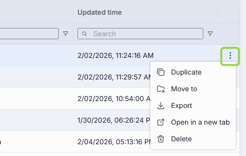

You can also add sub-folders from the toolbar:

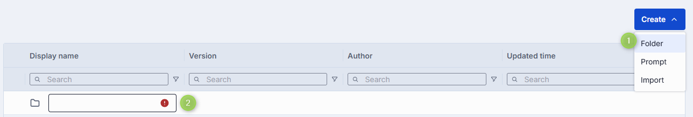

### Create a prompt

1. Select the target folder.
2. Click **Create** in the toolbar and select **Prompt** to open the **Create Prompt** modal.
3. Define prompt parameters:

   | Field | Required | Description |
   |-------|----------|-------------|
   | **Display Name** | Yes | Prompt name displayed on the UI. |
   | **Version** | Yes | Version of the prompt (e.g. `1.0.0`). |
   | **Description** | No | Free-form description of the prompt. |

4. Click **Create**. The dialog closes and the new prompt's [Properties screen](#configure-a-prompt) opens. The entry appears immediately in the listing.

   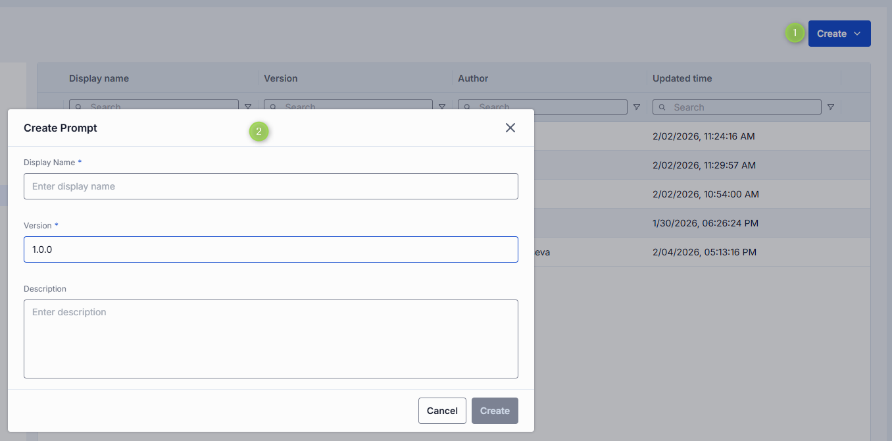

### Export prompts

You can export individual prompts or folders with prompts (including nested folders). Export as ZIP archive or raw JSON.

- To export a folder, click **Export** in the folder's actions menu.
- To export a specific prompt, select it and click **Export** in its actions menu.

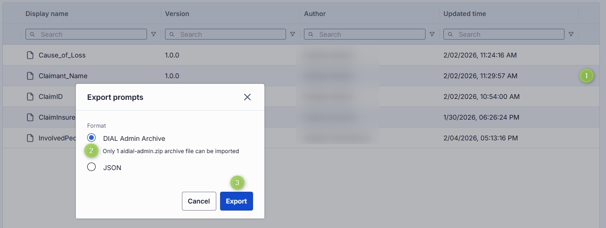

- To export several prompts, select them and click **Export** in the top toolbar.

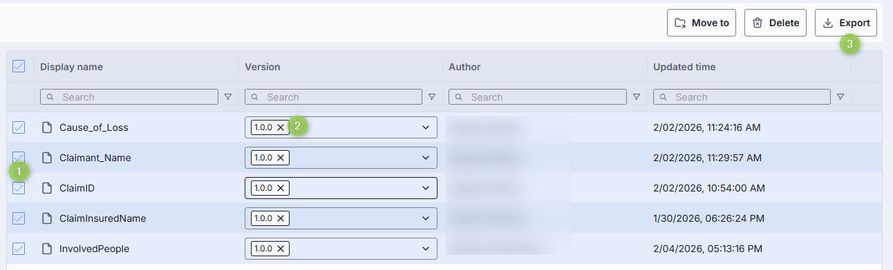

### Import prompts

You can upload ZIP archives or raw JSON files with prompts. This is essential for migrating, restoring, or sharing prompt assets between DIAL users.

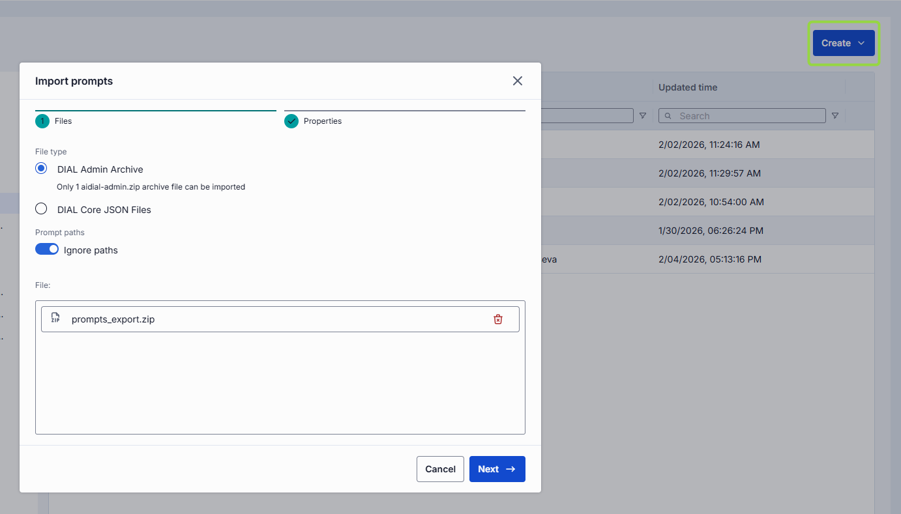

1. Click **Create** in the toolbar and select **Import**.
2. Select the type of files to import. Drag and drop or click **Browse**.
   - **Archive**: Import a single ZIP or tarball. Only 1 archive at a time.
   - **JSON**: Import JSON files. Up to 30 files at once.
3. Select a **Conflict resolution strategy**: **Skip**, **Override**, or **Edit manually**.
4. Enable **Ignore paths** to import all prompts directly into the root folder.
5. Click **Finish**.

### Delete a prompt

There are several ways to delete a prompt or a specific version:

**Warning**
> Any applications that reference a deleted prompt will stop working until a valid prompt is reattached.

- Click **Delete** in the toolbar on the Properties screen.
- Use the **Delete** option in the prompt's context menu.
- Delete the folder in which the prompt is located.
- Use **Bulk Actions** on the main screen to delete multiple prompts at once.

### Configure a prompt

Click any prompt to open the Properties screen.

#### Properties

**Available actions**

| Action | Description |
|--------|-------------|
| **Version** | Version of the prompt. Select from the dropdown to view different versions. Click **Create** in the dropdown to add a new version. |
| **Delete** | Delete the selected prompt. |

**Fields description**

| Field | Description |
|-------|-------------|
| **Display Name** | Read-only key for the prompt (e.g. `customer_base_growth`). Cannot be edited after the prompt is created. |
| **Updated Time** | Read-only timestamp of the last update. |
| **Storage Folder** | Path to the prompt's location in the folder hierarchy. Click to navigate to Folders Storage. Use **Move to** to change the folder. |
| **Description** | Description of the prompt. |
| **Content** | Markdown editor supporting plain text with Markdown formatting, Mustache-style variables `{{variableName}}` for dynamic substitution, and a JSON editor. Refer to [Chat User Guide](../6.chat-user-guide/2.prompts.md) to learn more about variables in prompts. |

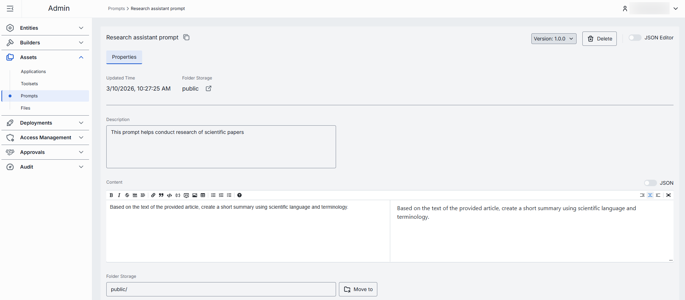

#### Edit prompt

In the Properties tab, edit the selected information. Once edits are made, the top bar allows:

- **Discard**: Revert changes since the last save.
- **Save**: Save changes to the current version.
- **Save as new version**: Save changes as a new version while keeping the current version intact.

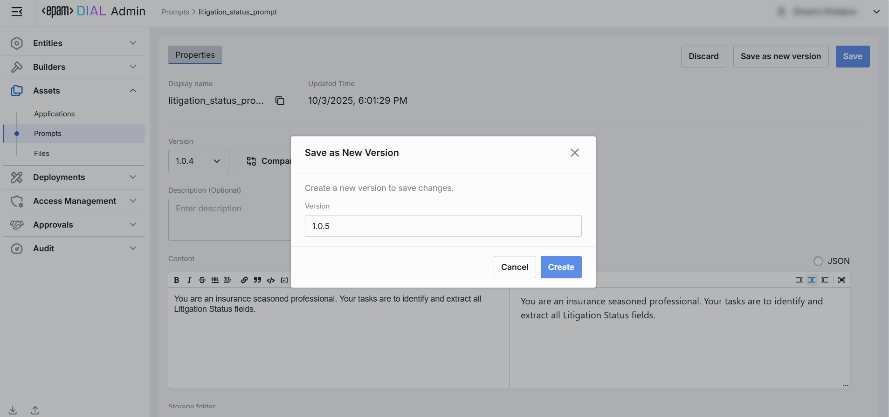

#### Compare versions

When multiple versions of a prompt exist, **Compare versions** becomes available. Use it to compare the prompt text across versions, with changes highlighted.

#### JSON editor (Prompts)

Advanced users can work with the prompt's raw JSON. Useful for bulk updates, copying configuration between environments, or editing settings not exposed in the form UI.

**Tip**
> Switching modes is disabled when there are unsaved changes.

1. Navigate to **Assets → Prompts** and select the prompt you want to edit.
2. Click the **JSON Editor** toggle (top-right). The raw JSON is revealed.

---

## Files

Files in DIAL are arbitrary binary or text assets (JSON, CSV, PDF, images, etc.) that AI models and applications can reference at runtime. Files added by users are stored in each user's private folder. They become available to other users and applications when [published](../6.chat-user-guide/5.files.md) with applications and conversations that reference them, or via the [Publication API](https://dialx.ai/dial_api#tag/Publications).

DIAL can be configured to store files in the BLOB storage of your selected cloud provider, ensuring scalability and security.

**Note**
> Files are a protected resource. Refer to [Access Control](../2.understand-dial/4.security-and-governance/2.access-control-reference.md#acls-for-objects) to learn how protected resources are handled in DIAL.

### Main screen

The main screen displays all files located in the Public folder.

Click any folder to display its contents (files and sub-folders).

| Column | Description |
|--------|-------------|
| **Display Name** | File name displayed on the UI. |
| **Updated Time** | Timestamp of the last file update. |
| **Size** | File size in kilobytes. |

Click any file (or select several files) to see the context menu with available actions:

| Action | Description |
|--------|-------------|
| **Move to** | Move the selected file(s) to another folder. |
| **Export** | Download a ZIP archive with the selected file(s). |
| **Preview** | Preview the content of the file. Enabled for: `.html`, `.htm`, `.css`, `.js`, `.mjs`, `.json`, `.xml`, `.txt`, `.md`, `.csv`, `.jpg`, `.jpeg`, `.png`, `.gif`, `.webp`, `.svg`, `.ico`, `.bmp`, `.avif`, `.mp3`, `.wav`, `.ogg`, `.mp4`, `.webm`, `.pdf`. |
| **Delete** | Delete file(s). Any models or applications that reference a deleted file will stop working until a valid file is reattached. |

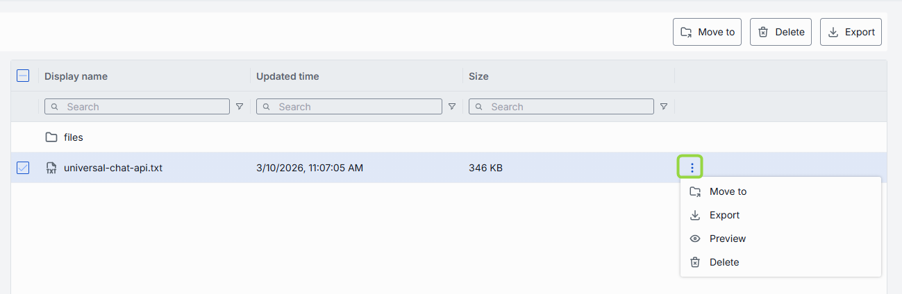

You can also add sub-folders using the **Add** dropdown in the toolbar:

### Export files

You can download selected files or folders as a ZIP archive.

Make a selection and click **Export** in the toolbar. The Export button is also available in the context menu of each file or folder.

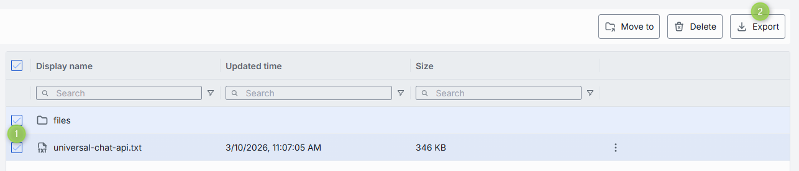

### Import files

Use the **Add** dropdown in the toolbar to add new folders or files.

1. Click **Add** in the toolbar and select **Files** to open the **Import Files** modal.
2. Choose to import a ZIP archive or separate files. Up to 30 files at once. Each file must be ≤ 512 MB. Only 1 archive at a time.
3. Enable **Ignore paths** to import all files directly into the root folder without recreating the original folder hierarchy.
4. Add files by dragging them into the window or using the file browser.
5. Click **Next** to select a conflict resolution strategy:
   - **Skip**: Do not import conflicting files; keep existing files unchanged.
   - **Override**: Replace files with the same name with the imported ones.
   - **Edit manually**: Rename incoming files one by one to avoid conflicts. Conflicting files are flagged in red and become editable.
6. Click **Finish**.

### Delete files

There are several ways to delete a file:

**Warning**
> Any applications that reference a deleted file will stop working until a valid file is reattached.

- Select one or more files or folders and click **Delete** in the toolbar.
- Use the **Delete** option in the file or folder context menu.
- Delete the folder in which the file is located.

---

## Next steps

- [Manage Builders](3.builders.md) — register Application Runners, Adapters, and Interceptor Templates that back your assets
- [Manage publication requests](7.publications-and-review.md) — review and approve user-submitted publication requests
- [Monitor activity and roll back changes](8.audit/1.activity-and-rollback.md) — track changes to assets across the global audit log
