# Applications

In DIAL, applications created by users—via the DIAL Core API or UI—are stored in each user's private folder in DIAL file storage and are not accessible to others. To enable broader access, application owners can publish their applications, or administrators can manually place applications in the Public folder.

**Note**
> Refer to [Entities → Applications](../2.entities/2.applications.md) to learn about application deployments in DIAL. Refer to [Chat User Guide](../../6.chat-user-guide/6.sharing-and-publishing.md) for how end users can publish applications. Refer to [DIAL Core API Publications](https://dialx.ai/dial_api#tag/Publications) for managing publication requests via API.

### Main screen

The main screen displays all applications located in the Public folder.

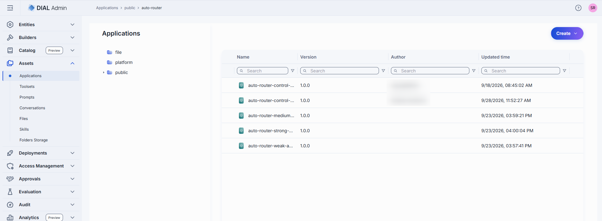

Click any folder to display its contents in the applications grid.

| Column | Description |
|--------|-------------|
| **ID** | Unique identifier of the application. |
| **Version** | Published version of the application. |
| **Source** | Source type of the application (Endpoints, Application runner, or Code App). |
| **Author** | Username or system ID of the user who created or last updated this application. |
| **Updated Time** | Timestamp of the last modification. |
| **Actions** | **Open in a new tab**: Open the application's properties in a new tab. **Duplicate**: Create a copy—as a **New version** of the same application, or as a **New application**. **Move to**: Move the application to another folder. **Export**: Download the application. **Delete**: Remove the application. Use **Bulk Actions** in the toolbar to delete multiple applications at once. |

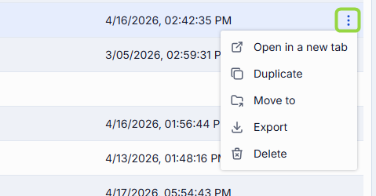

You can also add sub-folders from within the toolbar:

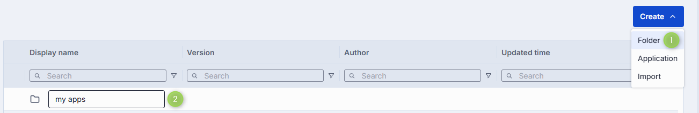

### Create an application

1. Select the target folder, click **Create** in the toolbar, and select **Application**.
2. Define application parameters:

   | Field | Required | Description |
   |-------|----------|-------------|
   | **ID** | Yes | Unique identifier. |
   | **Display Name** | Yes | Application name displayed on the UI (e.g. "Customer Support Bot"). |
   | **Version** | Yes | Semantic version identifier (e.g. `1.2.0`). |
   | **Description** | No | Description of the application. |
   | **Source Type** | Yes | **Endpoints**: Standalone application. DIAL Core communicates via explicitly provided chat completion, responses, and/or MCP endpoints. **Application runner**: An Application Runner acts as a factory, allowing users to create logical instances with different configurations. Select from [Builders → Application Runners](../3.builders/1.application-runners.md). **Code App**: A specialized Endpoints variant where the endpoint and editor URL are pre-filled from the `CODE_APP_EDITOR_URL` environment variable. Available only when this variable is configured. |
   | **Completion endpoint** | Conditional | Endpoint to process chat completion requests. Available when Source Type is **Endpoints**. |
   | **Responses endpoint** | No | Endpoint to process OpenAI Responses API calls. Available when Source Type is **Endpoints**. |
   | **MCP Endpoint** | No | MCP endpoint DIAL Core uses to communicate with the application. Available when Source Type is **Endpoints**. **Transport**: HTTP by default. **Forward per request key**: Forward a [per-request key](../../3.building-with-dial/7.working-with-dial-resources/5.per-request-keys.md) to allow MCP server access to DIAL storage. **Configuration delivery**: `Header` or `Meta`. |
   | **Application runner** | Conditional | Select from [available Application Runners](../3.builders/1.application-runners.md). Required when Source Type is **Application runner**. |

3. Click **Create**. The dialog closes and the new [application configuration screen](#configure-an-application) opens. The entry appears immediately in the listing under the selected folder.

   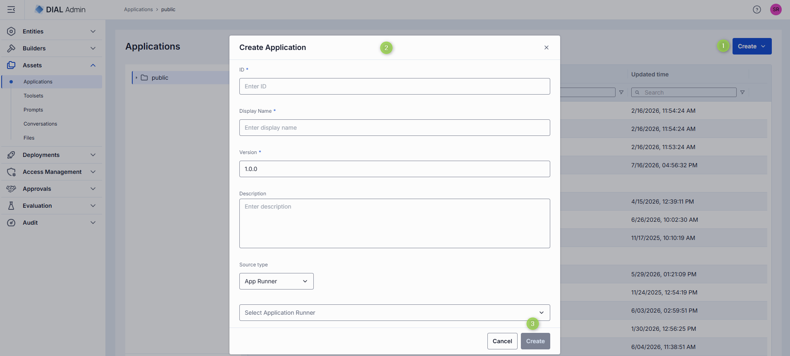

**Tip**
> You can quickly add new applications by duplicating existing ones. Use the **Duplicate** action in the application's context menu.

### Export applications

You can export individual applications or folders with applications (including nested folders). Export as ZIP archive or raw JSON.

- To export a folder, click **Export** in the folder's actions menu.
- To export a specific application, select it and click **Export** in its actions menu.
- To export several applications or specific versions, select them and click **Export** in the top toolbar.

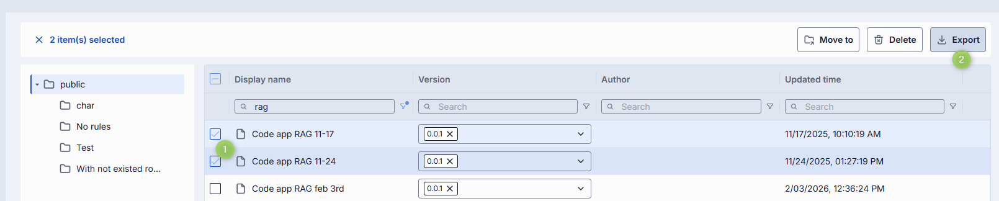

### Import applications

You can upload ZIP archives or raw JSON files of applications. This is essential for migrating, restoring, or sharing application assets between DIAL users.

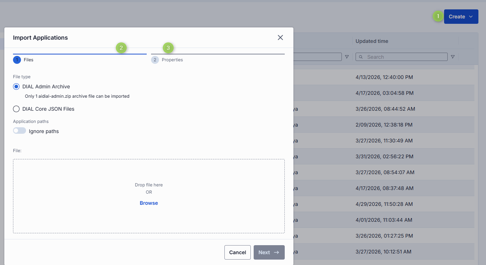

1. Click **Create** in the toolbar and select **Import**.
2. Select the type of files to import. Drag and drop your archive or JSON files into the files area, or click **Browse**.
   - **Archive**: Import a single ZIP or tarball containing multiple JSON files. Only 1 archive at a time.
   - **JSON**: Import JSON files. Up to 30 files at once.
3. Select a **Conflict resolution strategy**:
   - **Skip**: Leave existing apps untouched; only new ones are added.
   - **Override**: Replace apps with the same name and version.
   - **Edit manually**: Resolve conflicts one by one.
4. Enable **Ignore paths** to skip folder structure from imported files. All apps are imported directly into the root folder.
5. Review the import preview. If any items have validation errors (such as uniqueness conflicts with existing applications), they are flagged before import begins.
6. Click **Finish**.

### Delete an application

There are several ways to delete an application or a specific version of it:

- Click **Delete** in the toolbar on the Configuration screen.
- Use the **Delete** option in the application's context menu.
- Delete the folder in which the application is located.
- Use **Bulk Actions** on the main screen to delete multiple applications at once.

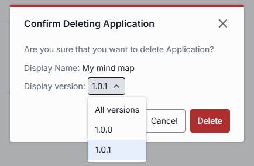

**Warning**
> Deleting an application is permanent. Applications that depend on it will stop working.

### Configure an application

Click any application to open its configuration screen.

#### Properties tab

View and edit the application's basic properties.

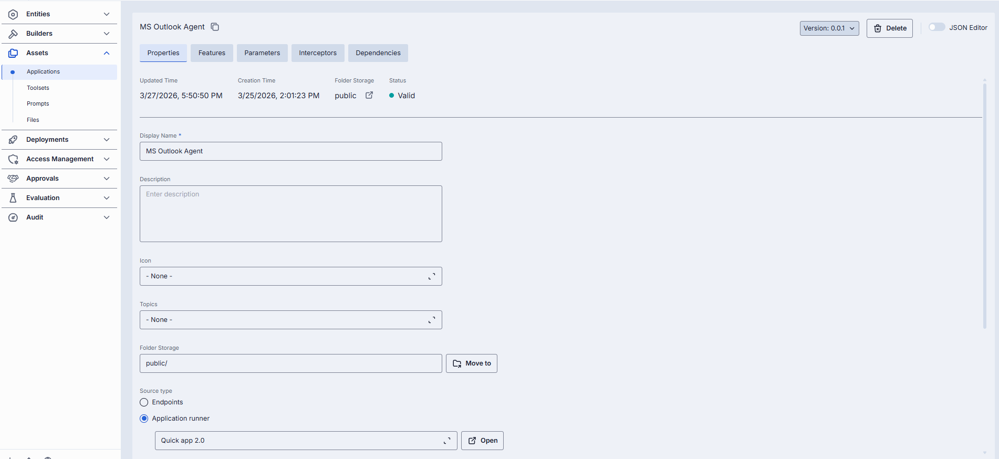

**Available actions**

| Action | Description |
|--------|-------------|
| **Version** | Version of the application. Select from the dropdown to view properties for different versions. Click **Create** in the dropdown to add a new version. |
| **Delete** | Delete the selected application. |

**Properties description**

| Field | Required | Editable | Description |
|-------|----------|----------|-------------|
| **ID** | — | No | Unique identifier (read-only, with copy-to-clipboard button). |
| **Updated Time** | — | No | Timestamp of the last update. |
| **Creation Time** | — | No | Application creation timestamp. |
| **Folder Storage** | — | No | Path to the application in the folder hierarchy. Click to navigate to Folders Storage. |
| **Status** | — | No | **Valid**: configuration is compatible with the JSON schema or related Application Runner. Only valid entities are materialized into DIAL Core configuration. **Invalid**: configuration is incompatible with the JSON schema of the related Application Runner. |
| **Display Name** | Yes | Yes | Name displayed on the UI. |
| **Description** | No | Yes | Free-text summary (e.g. tooling, supported inputs/outputs, SLAs). |
| **Icon** | No | Yes | Logo to visually distinguish the app. Maximum size: 512 MB. Supported types: `.jpeg`, `.jpg`, `.jpe`, `.png`, `.gif`, `.apng`, `.webp`, `.avif`, `.svg`, `.svgz`, `.bmp`, `.ico`. Up to 1 file. |
| **Topics** | No | Yes | Semantic labels (e.g. "finance", "support"). Custom topics must be ≤ 255 characters with no leading or trailing spaces. |
| **Folder Storage** | Yes | Yes | Path to the application's location. Use **Move to** to change the folder. |
| **Source Type** | Yes | Yes | **Endpoints**: Standalone application; DIAL Core communicates via explicitly provided endpoints. **Application runner**: Select from available runners; DIAL Core forwards payloads to endpoints defined in the [Application Runner configuration](../3.builders/1.application-runners.md#features-tab). |
| **Completion endpoint** | Conditional | Conditional | Endpoint to process chat completion requests. Available and editable when Source Type is **Endpoints**. |
| **Responses endpoint** | Conditional | Conditional | Endpoint to process OpenAI Responses API calls. Available and editable when Source Type is **Endpoints**. |
| **MCP Endpoint** | Conditional | Conditional | MCP endpoint DIAL Core uses to communicate with the application. Available and editable when Source Type is **Endpoints**. Transport HTTP by default. Supports per-request key forwarding and configuration delivery via `Header` or `Meta`. |
| **Editor URL** | No | Conditional | URL of the application's custom builder UI. Available and editable when Source Type is **Endpoints**. |
| **Viewer URL** | No | Conditional | URL of the application's custom UI. If set, overrides standard DIAL Chat UI. Available and editable when Source Type is **Endpoints**. |
| **Attachments types** | No | Yes | Attachment types this app accepts. **No attachments**: disables all. **All attachment types**: allows all, optionally limit count. **Specific attachment types**: define [MIME types](https://developer.mozilla.org/en-US/docs/Web/HTTP/Basics_of_HTTP/MIME_types/Common_types) manually. |
| **Attachments max number** | No | Yes | Maximum number of input attachments. Enabled when attachment types are defined. |
| **Completion Defaults** | No | Yes | Default parameters applied when not provided in an OpenAI `chat/completions` API call. |
| **Responses Defaults** | No | Conditional | Default parameters applied when not provided in an OpenAI `openai/v1/responses` API call. Available when OpenAI Responses API is supported. |
| **Forward auth token** | No | Yes | When enabled, the HTTP authorization token header is forwarded to the chat completion endpoint. Not supported for Assets Applications. |
| **Max retry attempts** | No | Yes | Number of times DIAL Core will [retry](../../4.operating-dial/4.configuration/7.load-balancer.md#fallbacks) a failed run (due to timeouts or 5xx errors). |

#### Tools Overview tab

**Important**: This tab is enabled for applications with **Source Type = Endpoints/MCP** or **Source Type = Application Runner** where the Application Runner has an MCP endpoint enabled.

[Tools](https://modelcontextprotocol.io/specification/2025-06-18/server/tools) are functions supported by an MCP server. On this screen, you can discover, manage, and try all available tools.

**Note**
> Refer to the [Toolsets section](2.toolsets.md#tools-overview-tab) for details on the **Use all tools**, **Manage tools**, and **Try tools** workflows—the functionality is identical.

#### Features tab

In the **Features** tab, control optional capabilities of the selected application.

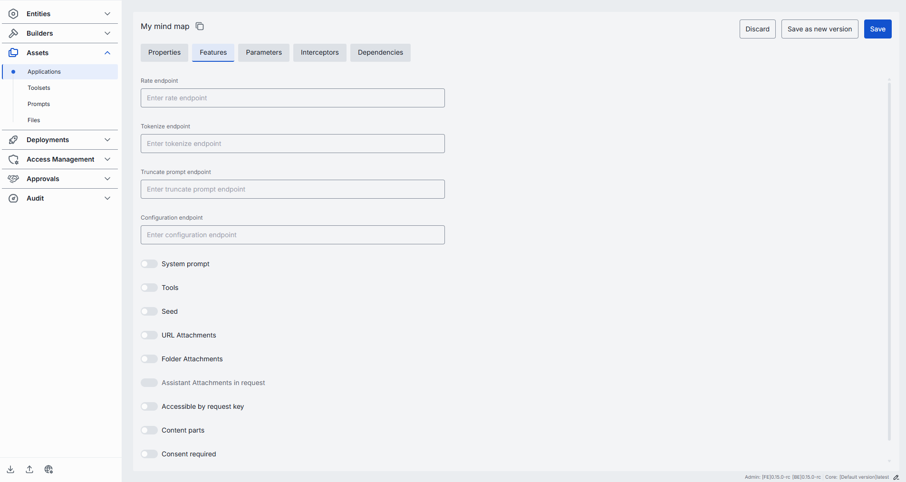

**Endpoints**

Provide optional service endpoints that extend the app's runtime behavior.

**Note**
> When the application is created from an Application Runner, values in this section override endpoints in the [Application Runner configuration](../3.builders/1.application-runners.md#features-tab).

| Field | Description |
|-------|-------------|
| **Rate endpoint** | URL of a custom rate-estimation API to compute cost or quota usage (e.g. grouping by tenant, complex billing rules). |
| **Tokenize endpoint** | URL of a custom tokenization service for precise, app-wide token counting. |
| **Truncate prompt endpoint** | URL of your own prompt-truncation API for advanced context-window management. |
| **Configuration endpoint** | URL to fetch a JSON Schema describing the application's settings. DIAL Core exposes this as `GET v1/deployments/<deployment name>/configuration`. |

**Feature flags**

Enable or disable per-request options that your application accepts from clients.

| Toggle | Description |
|--------|-------------|
| **System prompt** | Enables system message injection. Useful for multi-step agent orchestration. |
| **Tools** | Enables `tools`/`functions` payloads in API calls. Enable if your application makes external function calls (e.g. calendar lookup, database fetch). |
| **Seed** | Enables the `seed` parameter for reproducible results. |
| **URL Attachments** | Enables URL references (images, docs) as attachments in API requests. |
| **Folder Attachments** | Enables attachments of folders (batching multiple files). |
| **Assistant attachments in request** | When `true`, DIAL Chat preserves `attachments` in `messages` from `role=assistant` in [chat completion requests](https://dialx.ai/dial_api#operation/sendChatCompletionRequest). Useful for apps that generate and consume attachments. |
| **Accessible by request key** | Indicates whether the application is accessible using a [per-request API key](../../3.building-with-dial/7.working-with-dial-resources/5.per-request-keys.md). |
| **Content parts** | Indicates whether the deployment supports requests with content parts. |
| **Consent required** | Indicates whether the application requires [user consent](https://dialx.ai/dial_api#tag/User-Consent) before use. |
| **Support comment in rate response** | Indicates whether the application supports the `comment` field in rate response payload. |
| **Roles** | When enabled, the application uses role-based access. Assign user roles to control which users can access this application. |

#### Parameters tab

If the application is created from an Application Runner, the content of this tab is determined by the [Application Runner's parameters](../3.builders/1.application-runners.md#parameters-tab). Configure application-specific parameters that influence its behavior.

**Note**
> Refer to [Schema-rich Applications](../../3.building-with-dial/1.apps/0.index.md#schema-based-apps) to learn more.

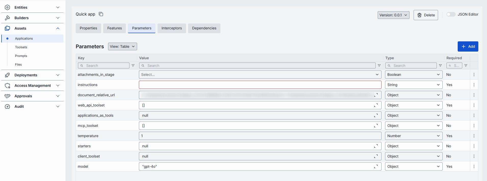

#### Interceptors tab

In the **Interceptors** tab, view global and runner-level interceptors, and define local interceptors specific to this application.

**Note**
> Refer to [Interceptors](../../3.building-with-dial/2.interceptors/0.index.md) to learn more. You can define interceptors in [Entities → Interceptors](../2.entities/4.interceptors.md) before attaching them here.

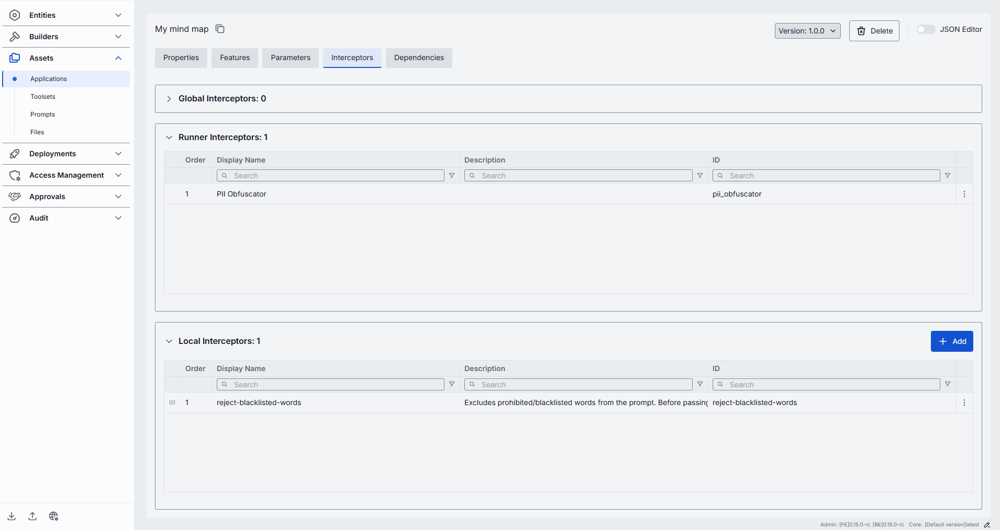

| Column | Description |
|--------|-------------|
| **Order** | Execution sequence. Interceptors run in ascending order (1 → 2 → 3). Response interceptors run in reversed order. |
| **Display Name** | The interceptor's display name from its definition. |
| **Description** | Free-text summary from the interceptor's definition. |
| **ID** | Unique identifier of the interceptor. |
| **Actions** | Open interceptor in a new tab, or remove it from the app's configuration. |

To add interceptors:

1. Click **+ Add** (upper-right of the interceptors grid).
2. In the **Add Interceptors** modal, choose one or more from the list of [defined interceptors](../2.entities/4.interceptors.md).
3. Click **Apply** to append them to the bottom of the list (added in the order selected).

To reorder interceptors: drag and drop the handle (⋮⋮⋮⋮) to reassign execution order. Release to reposition; order renumbers automatically. Click **Save**.

To remove an interceptor: click the actions menu in the interceptor's row, choose **Remove**, then click **Save**.

#### Dependencies tab

In interconnected systems, applications often rely on other applications or AI models, forming dependency chains. On this screen, you can view, add, and remove dependencies configured for the selected application.

**Note**
> Refer to [Managing Authorization in Complex Application Ecosystems](../../3.building-with-dial/7.working-with-dial-resources/6.auth-matrix-for-apps.md) to learn more.

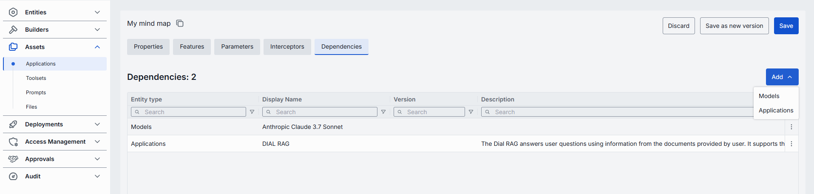

| Column | Description |
|--------|-------------|
| **Entity Type** | Whether the dependent object is an Application or a Model. |
| **ID** | Identifier of the dependent model or application. |
| **Display Name** | Descriptive name of the dependent object. |
| **Version** | Version of the dependent model. |
| **Description** | Additional details about the dependent object. |
| **Actions** | Open the dependent object in a new tab, or remove it from the dependencies list. |

To add a dependency:

1. Click **+ Add** (upper-right of the dependencies grid).
2. Select the type: Application or Model.
3. In the modal, choose the model or application from the grid.
4. Click **Add**.

#### JSON editor (Applications)

Advanced users can work with the application's raw JSON. Useful for bulk updates, copying configuration between environments, or editing settings not exposed in the form UI.

**Tip**
> Switching modes is disabled when there are unsaved changes.

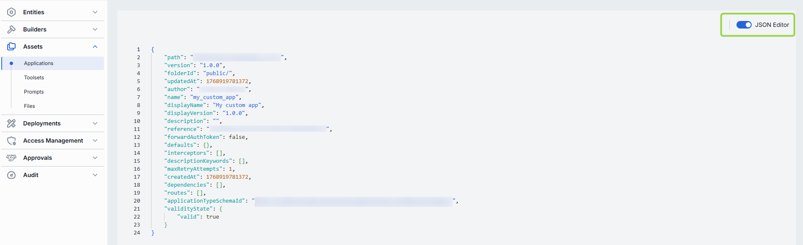

1. Navigate to **Assets → Applications** and select the application you want to edit.
2. Click the **JSON Editor** toggle (top-right). The raw JSON is revealed.

