# Toolsets

Toolsets in DIAL enable connectivity with MCP servers and can be used as tools by any internal or external application to perform specific actions. Toolsets created by users are stored in each user's private folder and are not accessible to others. To share them with other users, toolset owners can publish them, or administrators can manually add them to the Public folder.

**Note**
> Refer to [Entities → Toolsets](../2.entities/3.toolsets.md) to learn more about toolset entities. Refer to [Chat User Guide](../../6.chat-user-guide/6.sharing-and-publishing.md) for how end users can publish toolsets. Refer to [DIAL Core API Publications](https://dialx.ai/dial_api#tag/Publications) for managing publication requests via API.

### Main screen

The main screen displays all toolsets located in the Public folder.

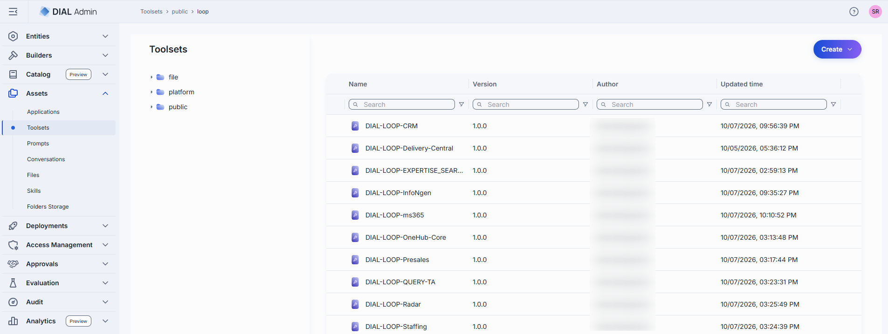

Click any folder to display its contents in the toolsets grid.

| Column | Description |
|--------|-------------|
| **ID** | Toolset's unique identifier. |
| **Version** | Version of the toolset. |
| **Author** | Username or system ID of the user who created or last updated this toolset. |
| **Updated Time** | Timestamp of the last update. |
| **Actions** | **Open in a new tab**: Open the toolset's properties in a new tab. **Duplicate**: Create a copy. **Move to**: Move to another folder. **Export**: Download the toolset. **Delete**: Remove the toolset. |

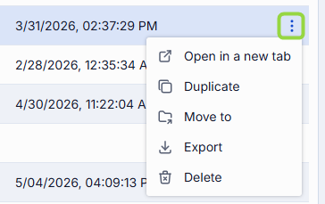

You can also add sub-folders from the toolbar:

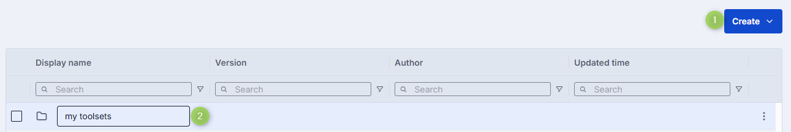

### Create a toolset

1. Select the target folder, click **Create** in the toolbar, and select **Toolset**.
2. Define toolset parameters:

   | Field | Required | Description |
   |-------|----------|-------------|
   | **ID** | Yes | Unique identifier of the toolset. |
   | **Display Name** | Yes | Name displayed on the UI. |
   | **Version** | Yes | Semantic version identifier (e.g. `1.2.0`). |
   | **Description** | No | Description of the toolset. |
   | **External Endpoint** | Yes | Endpoint DIAL Core uses to communicate with the related MCP server. |

3. Click **Create**. The dialog closes and the new [toolset configuration screen](#configure-a-toolset) opens. The entry appears immediately in the listing.

   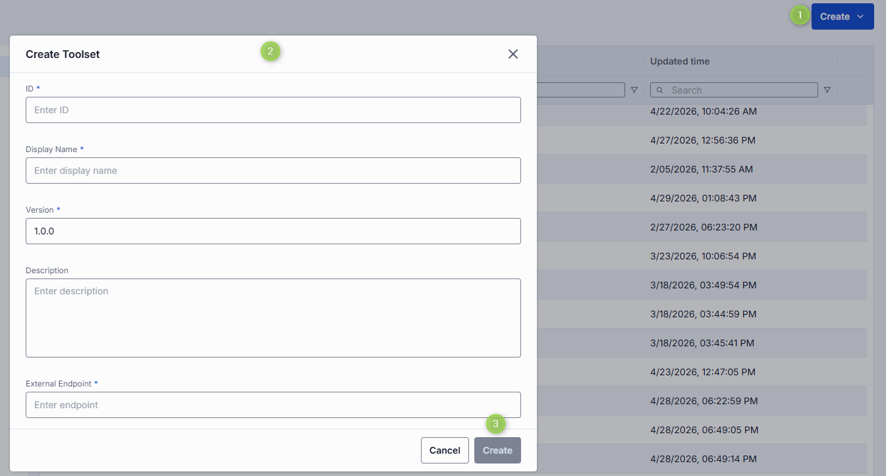

**Tip**
> You can quickly add new toolsets by duplicating existing ones. Use the **Duplicate** action in the toolset's context menu.

### Duplicate a toolset

You can duplicate an existing toolset to create a copy.

**Note**
> When duplicating a toolset that requires authentication, you will be prompted to enter authentication credentials for the duplicate.

1. Click **Duplicate** in the toolset's actions menu.
2. In the **Duplicate Toolsets** window:
   - Select duplicate type: **New version** (another version of the same toolset) or **New toolsets** (a clone as a new entity).
   - Enter **Display Name**, **Version**, and **ID** (disabled for New Version).
   - Enter **OAuth** credentials for the duplicate.
   - Select **Folder Storage** for the new toolset (disabled for New Version).
3. Click **Duplicate**.

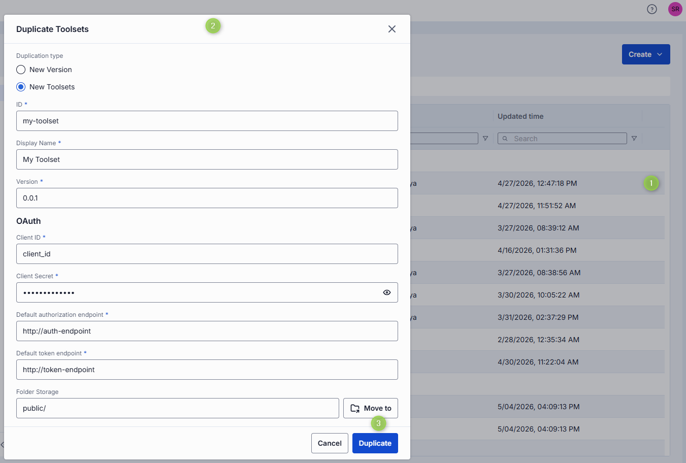

### Export toolsets

You can export individual toolsets or folders with toolsets (including nested folders). Export as ZIP archive or raw JSON.

- To export a folder, click **Export** in the folder's actions menu.
- To export a specific toolset, select it and click **Export** in its actions menu.
- To export several toolsets or specific versions, select them and click **Export** in the top toolbar.

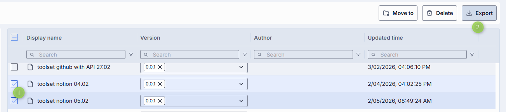

### Import toolsets

You can upload ZIP archives or raw JSON files of toolsets. This is essential for migrating, restoring, or sharing toolset assets between DIAL users.

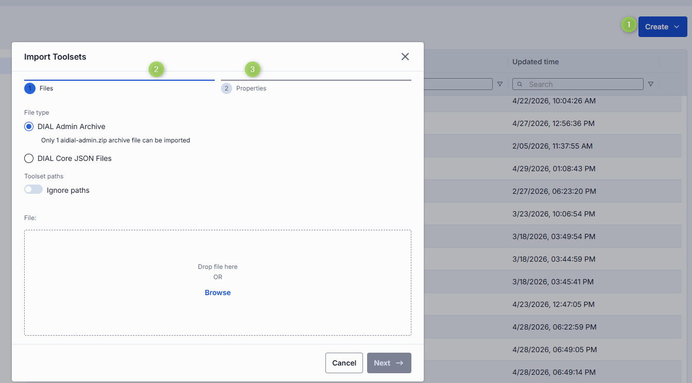

1. Click **Create** in the toolbar and select **Import**.
2. Select the type of files to import. Drag and drop or click **Browse**.
   - **Archive**: Import a single ZIP or tarball. Only 1 archive at a time.
   - **JSON**: Import JSON files. Up to 30 files at once.
3. Select a **Conflict resolution strategy**: **Skip**, **Override**, or **Edit manually**.
4. Enable **Ignore paths** to import all toolsets directly into the root folder.
5. Review the import preview. Items with validation errors (such as uniqueness conflicts) are flagged before import begins.
6. Click **Finish**.

### Delete a toolset

There are several ways to delete a toolset or a specific version:

- Click **Delete** in the toolbar on the Configuration screen.
- Use the **Delete** option in the toolset's context menu.
- Delete the folder in which the toolset is located.
- Use **Bulk Actions** on the main screen to delete multiple toolsets at once.

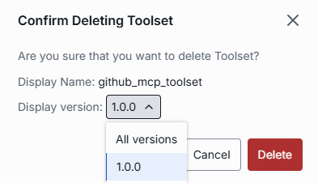

### Configure a toolset

Click any toolset to open its configuration screen.

#### Properties tab

In the **Properties** tab, preview and modify the selected toolset's basic properties.

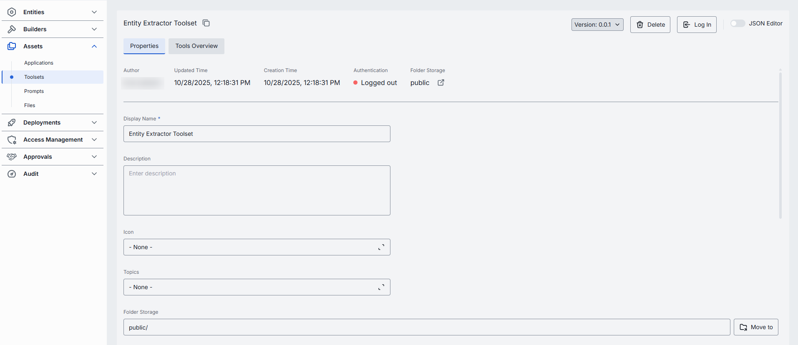

**Available actions**

| Action | Description |
|--------|-------------|
| **Version** | Version of the toolset. Select from the dropdown to view different versions. Click **Create** in the dropdown to add a new version. |
| **Delete** | Delete the selected toolset. |

**Fields description**

| Field | Required | Editable | Description |
|-------|----------|----------|-------------|
| **ID** | — | No | Unique identifier (read-only, with copy-to-clipboard button). |
| **Author** | — | No | User who created the toolset. |
| **Updated Time** | — | No | Timestamp of the last update. |
| **Creation Time** | — | No | Creation timestamp. |
| **Authentication** | — | No | Current authentication status: **Logged out**, **Logged in (Personal)**, **Logged in (Organization)**, or **Logged in** (both levels active). |
| **Folder Storage** | — | No | Path to the toolset's location in the public folder hierarchy. Click to navigate to Folders Storage. |
| **Display Name** | Yes | Yes | Name displayed on the UI. |
| **Description** | No | Yes | Toolset description. |
| **Icon** | No | Yes | Logo displayed on the UI. Maximum size: 512 MB. Supported types: `.jpeg`, `.jpg`, `.jpe`, `.png`, `.gif`, `.apng`, `.webp`, `.avif`, `.svg`, `.svgz`, `.bmp`, `.ico`. |
| **Topics** | No | Yes | Semantic labels (e.g. "finance", "support"). Custom topics must be ≤ 255 characters with no leading or trailing spaces. |
| **Storage folder** | Yes | Yes | Path in the Public folder hierarchy. Use **Move to** to change the location. |
| **External Endpoint** | Yes | Yes | Endpoint DIAL Core uses to communicate with the related MCP server. |
| **Provider** | No | Yes | Name of the toolset provider (for example, the service or vendor that hosts the MCP server). |
| **Transport** | Yes | Yes | Transport supported by the MCP server: **HTTP** (default) or **SSE** (deprecated). |
| **Authentication** | Yes | Yes | [Authentication settings](#authentication) for the toolset. |
| **Forward per request key** | Yes | Yes | When `true`, a [per-request key](../../3.building-with-dial/7.working-with-dial-resources/5.per-request-keys.md) is forwarded to the toolset endpoint so the toolset can access files in DIAL storage. Not allowed when `authType` is `API_KEY`. |
| **Max retry attempts** | Yes | Yes | Number of times DIAL Core will [retry](../../4.operating-dial/4.configuration/7.load-balancer.md#fallbacks) a failed call (due to timeouts or 5xx errors). |
| **Roles** | No | Yes | When enabled, the toolset uses role-based access. Assign user roles to control which users can access this toolset. |

#### Authentication

If the toolset requires authentication at the related MCP server, sign in before using it. A toolset can be published with organization credentials—in this case it may already show **Logged in (Organization)**. You can add personal credentials on top and both levels remain active simultaneously, showing **Logged in**.

**Note**
> Refer to [DIAL Core toolset credentials documentation](https://github.com/epam/ai-dial-core/blob/development/docs/dynamic-settings/toolset_credentials_api.md) to learn more about toolset authentication.

**Step 1: Select and configure the authentication method**

DIAL supports the following authentication methods for toolsets:

- **OAuth**: Authenticate via OAuth 2.0 with an external identity provider. Choose **With login** for dynamic client registration, or **With login & configuration** for static registration—depending on what your MCP server supports. For dynamic registration, providing an **External Endpoint** is sufficient. For static registration, populate the form with values from your identity provider:
  - **Redirect URI**: URI used during sign-in flows; the MCP Server redirects the user here after authentication.
  - **Client ID**: Unique identifier of the client requesting access.
  - **Client Secret**: Confidential key used by the client to authenticate with the authorization server.
  - **Scopes Supported**: Access-level scopes. May be discovered via `.well-known` endpoints.
  - **Default authorization endpoint**: URL for performing authorization. Can be discovered via `.well-known` metadata.
  - **Default token endpoint**: URL where the client exchanges an authorization code for an access token.
  - **PKCE method**: Proof Key for Code Exchange method, usually `plain` or `S256`.
- **API Key**: Authenticate using an API key. Provide the API key and header name.
- **Without authentication**: No authentication is required.

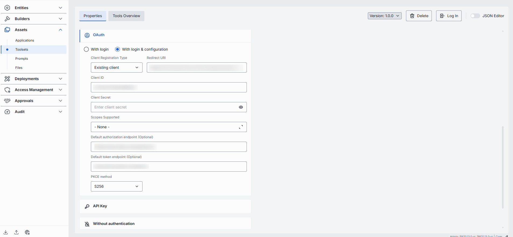

**Step 2: Choose authentication level**

After selecting and configuring an authentication method, click **Save** and **Log In**. Then choose the level:

- **Personal**: Authenticates for your user only. Status becomes **Logged in (Personal)**.
- **Organization**: Authenticates for all users in your organization. Status becomes **Logged in (Organization)**.
- **Both**: Both personal and organization authentication can be active simultaneously. Status shows **Logged in**. When logging out, you can choose to sign out from Personal, Organization, or both.

**Tip**
> For API key authentication, you will be prompted to provide the API key value at this step.

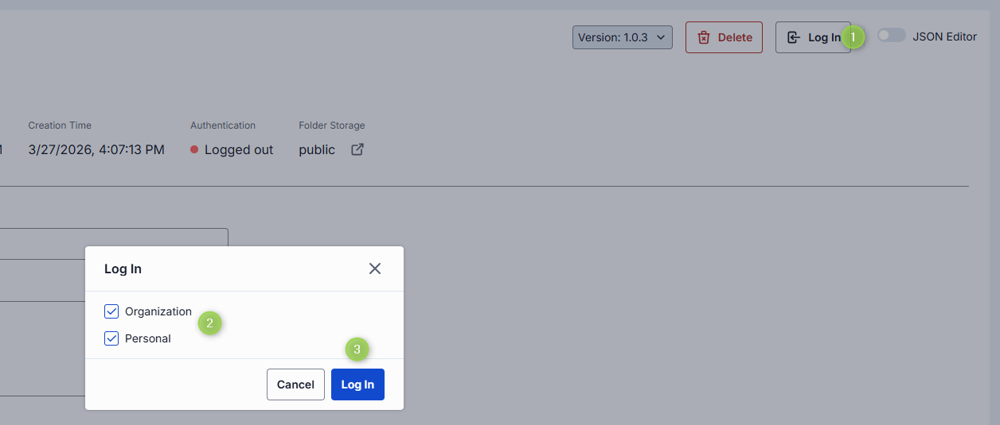

#### Tools Overview tab

[Tools](https://modelcontextprotocol.io/specification/2025-06-18/server/tools) are functions supported by an MCP server. On this screen, discover, manage, and test all tools supported by the related MCP server.

If the toolset was created from an MCP container deployed in DIAL, the content is inherited from the related [MCP container](../5.deployments/3.mcp-containers.md#tools-overview) and shows all **enabled** tools. Click **Manage tools** to access, try, and enable all available tools.

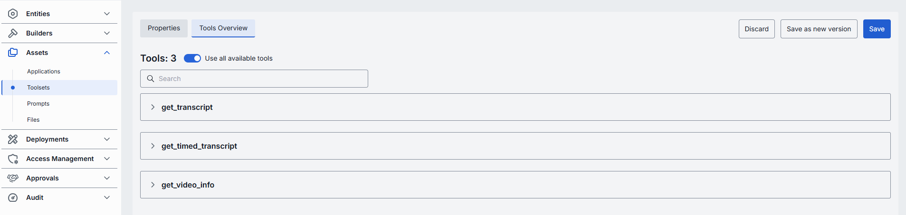

**Use all tools**

Enable **Use all available tools** to automatically include all tools supported by the related MCP server. When enabled, tools cannot be added or removed manually. Click on any tool to preview its details or try it out.

**Manage tools**

Disable **Use all available tools** to switch to manual tools management mode.

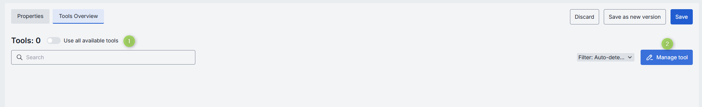

1. Disable **Use all available tools** and click **Manage tools** to open the **Manage tools** modal.
2. The modal displays all tools available to your user. Preview and enable or disable each tool individually.
3. If you know the names of tools not visible in the list (available to the MCP server but not to your user), add them manually. Manually added tools are labeled accordingly on the Tools Overview screen.
4. Click **Confirm** to apply changes.
5. On the **Tools Overview** screen, use the filter to see all tools, auto-detected tools only, or manually added tools.

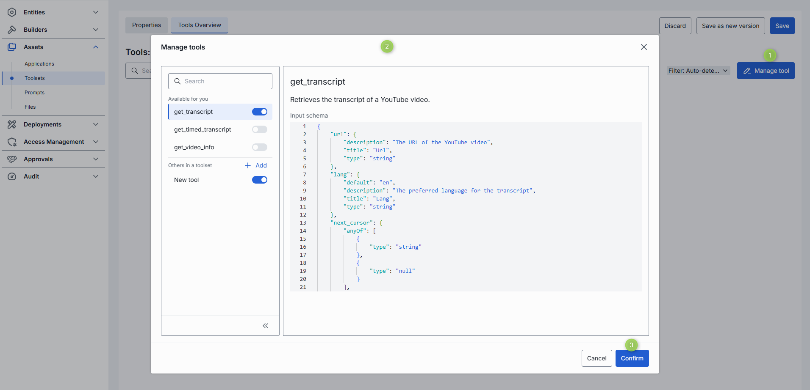

**Try tools**

Click or hover over any enabled tool and click **Try out** to enter Try out mode. You can test each enabled tool by sending a request to the server using a rendered UI form or raw JSON mode.

1. Click any available tool to access its description and input schema parameters. Toggle between table and JSON view modes.
2. Click **Try out** to open the sidebar for sending requests.
3. Populate the request body in table or JSON view.
4. Click **Send Request**. The response from the server appears in the Response body area.

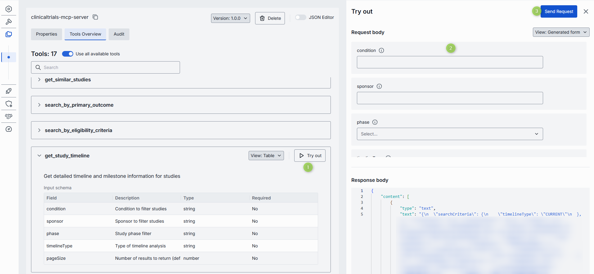

#### Audit tab (Toolsets) {#audit-tab-toolsets}

The Audit section shows usage and consumption metrics for the selected toolset.

**Tip**
> This section mirrors the [Analytics dashboards](../14.analytics/1.dashboards.md), scoped to the selected toolset.

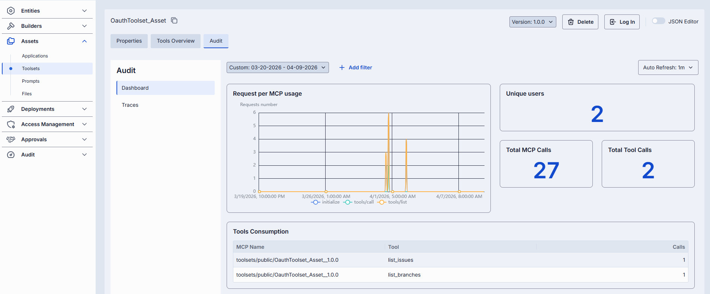

#### JSON editor (Toolsets)

Advanced users can work with the toolset's raw JSON. Useful for bulk updates, copying configuration between environments, or editing settings not exposed in the form UI.

**Tip**
> Switching modes is disabled when there are unsaved changes.

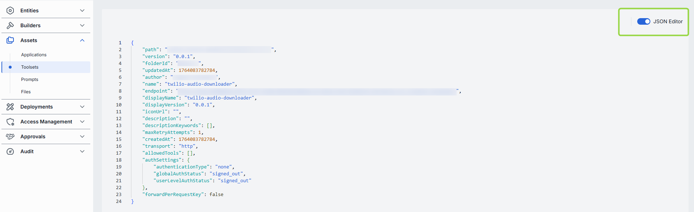

1. Navigate to **Assets → Toolsets** and select the toolset you want to edit.
2. Click the **JSON Editor** toggle (top-right). The raw JSON is revealed.

