# Prompts

In DIAL, prompts created by users—via the [DIAL Core API](https://dialx.ai/dial_api#tag/Prompts) or [UI](../../6.chat-user-guide/2.prompts.md)—are stored in each user's private folder. To share them with other users, prompt owners can publish them, or administrators can manually add them to the Public folder.

**Note**
> Prompts are a protected resource. Refer to [Access Control](../../2.understand-dial/4.security-and-governance/2.access-control-reference.md) to learn how protected resources are handled in DIAL. Refer to [Chat User Guide](../../6.chat-user-guide/6.sharing-and-publishing.md) for how end users can publish prompts. Refer to [DIAL Core API Publications](https://dialx.ai/dial_api#tag/Publications) for managing publication requests via API.

### Main screen

The main screen displays all prompts located in the Public folder.

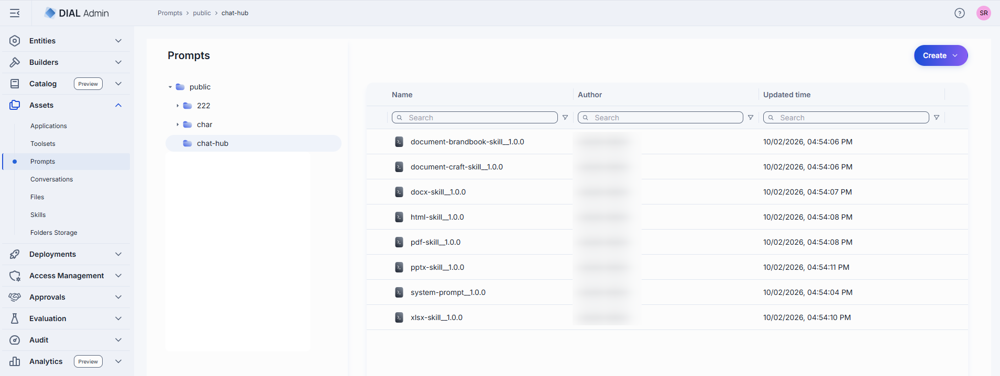

Click any folder to display its contents in the prompts grid.

| Column | Description |
|--------|-------------|
| **Display Name** | Prompt name displayed on the UI. |
| **Version** | Version of the prompt (e.g. `1.0.0`). |
| **Author** | Username or system ID of the user who created or last updated this prompt. |
| **Updated Time** | Timestamp of the last modification. |
| **Actions** | **Duplicate**: Create a copy as a **New version** or as a **New prompt**. **Move to**: Move to another folder (or select multiple prompts and use **Move to** in the toolbar). **Export**: Download the prompt. **Open in a new tab**: Open the prompt's properties in a new tab. **Delete**: Remove the prompt. |

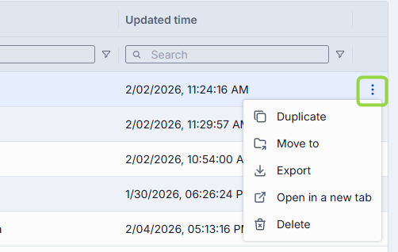

You can also add sub-folders from the toolbar:

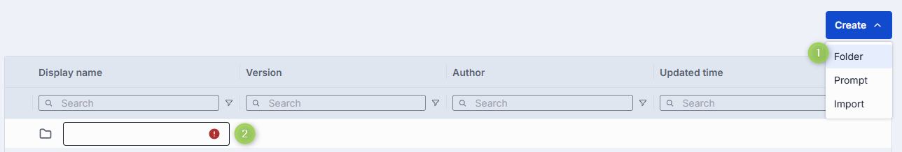

### Create a prompt

1. Select the target folder.
2. Click **Create** in the toolbar and select **Prompt** to open the **Create Prompt** modal.
3. Define prompt parameters:

   | Field | Required | Description |
   |-------|----------|-------------|
   | **Display Name** | Yes | Prompt name displayed on the UI. |
   | **Version** | Yes | Version of the prompt (e.g. `1.0.0`). |
   | **Description** | No | Free-form description of the prompt. |

4. Click **Create**. The dialog closes and the new prompt's [Properties screen](#configure-a-prompt) opens. The entry appears immediately in the listing.

   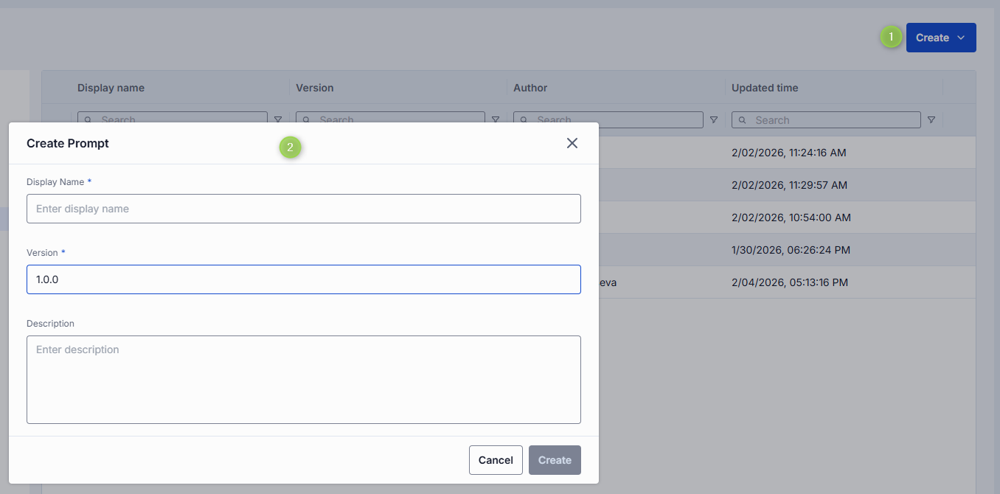

### Export prompts

You can export individual prompts or folders with prompts (including nested folders). Export as ZIP archive or raw JSON.

- To export a folder, click **Export** in the folder's actions menu.
- To export a specific prompt, select it and click **Export** in its actions menu.

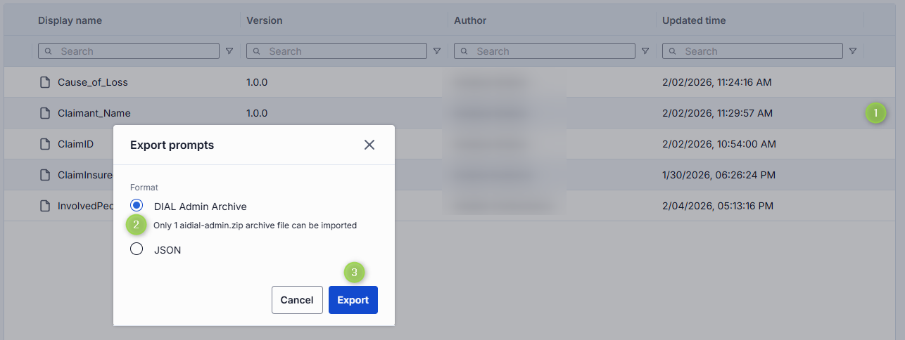

- To export several prompts, select them and click **Export** in the top toolbar.

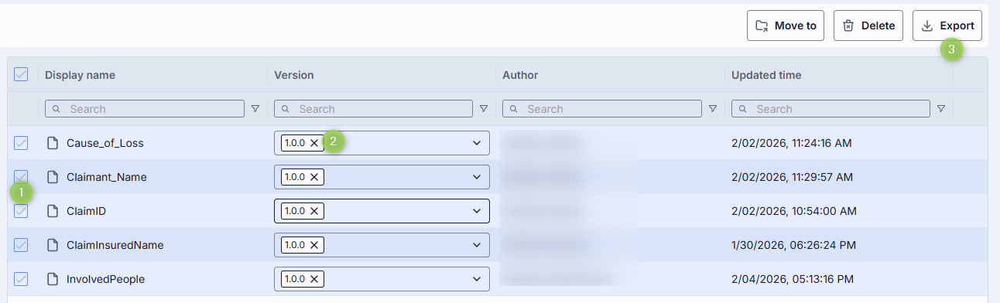

### Import prompts

You can upload ZIP archives or raw JSON files with prompts. This is essential for migrating, restoring, or sharing prompt assets between DIAL users.

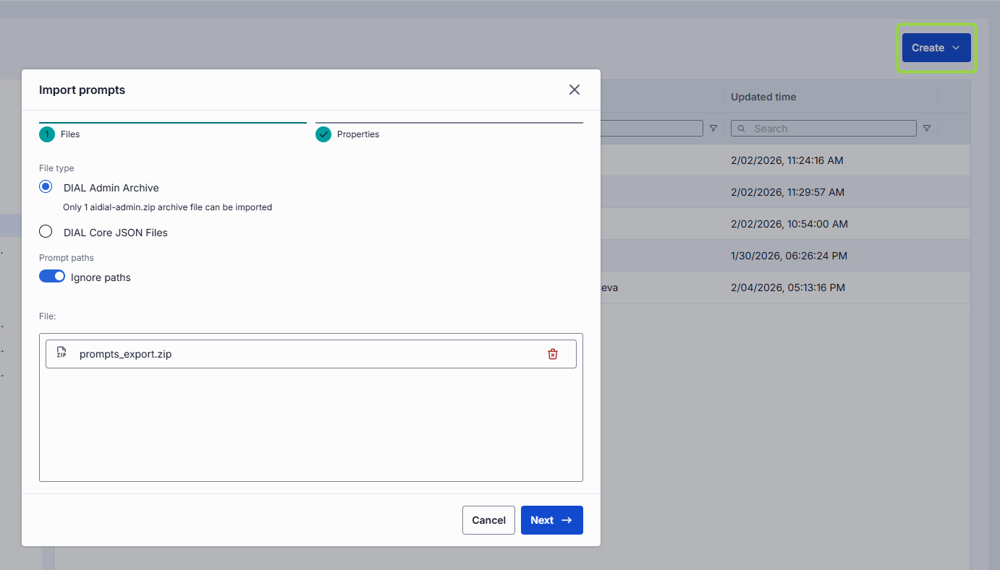

1. Click **Create** in the toolbar and select **Import**.
2. Select the type of files to import. Drag and drop or click **Browse**.
   - **Archive**: Import a single ZIP or tarball. Only 1 archive at a time.
   - **JSON**: Import JSON files. Up to 30 files at once.
3. Select a **Conflict resolution strategy**: **Skip**, **Override**, or **Edit manually**.
4. Enable **Ignore paths** to import all prompts directly into the root folder.
5. Click **Finish**.

### Delete a prompt

There are several ways to delete a prompt or a specific version:

**Warning**
> Any applications that reference a deleted prompt will stop working until a valid prompt is reattached.

- Click **Delete** in the toolbar on the Properties screen.
- Use the **Delete** option in the prompt's context menu.
- Delete the folder in which the prompt is located.
- Use **Bulk Actions** on the main screen to delete multiple prompts at once.

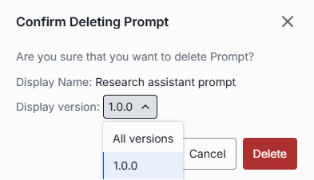

### Configure a prompt

Click any prompt to open the Properties screen.

#### Properties

**Available actions**

| Action | Description |
|--------|-------------|
| **Version** | Version of the prompt. Select from the dropdown to view different versions. Click **Create** in the dropdown to add a new version. |
| **Delete** | Delete the selected prompt. |

**Fields description**

| Field | Description |
|-------|-------------|
| **Display Name** | Read-only key for the prompt (e.g. `customer_base_growth`). Cannot be edited after the prompt is created. |
| **Updated Time** | Read-only timestamp of the last update. |
| **Storage Folder** | Path to the prompt's location in the folder hierarchy. Click to navigate to Folders Storage. Use **Move to** to change the folder. |
| **Description** | Description of the prompt. |
| **Content** | Markdown editor supporting plain text with Markdown formatting, Mustache-style variables `{{variableName}}` for dynamic substitution, and a JSON editor. Refer to [Chat User Guide](../../6.chat-user-guide/2.prompts.md) to learn more about variables in prompts. |

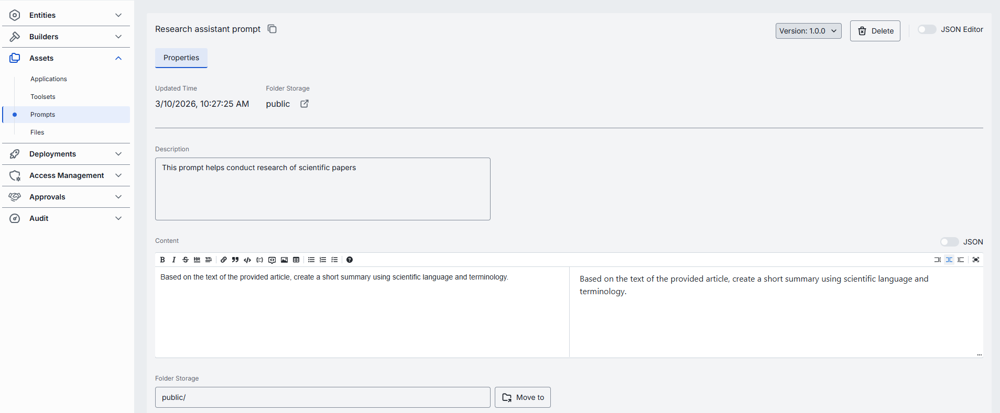

#### Edit prompt

In the Properties tab, edit the selected information. Once edits are made, the top bar allows:

- **Discard**: Revert changes since the last save.
- **Save**: Save changes to the current version.
- **Save as new version**: Save changes as a new version while keeping the current version intact.

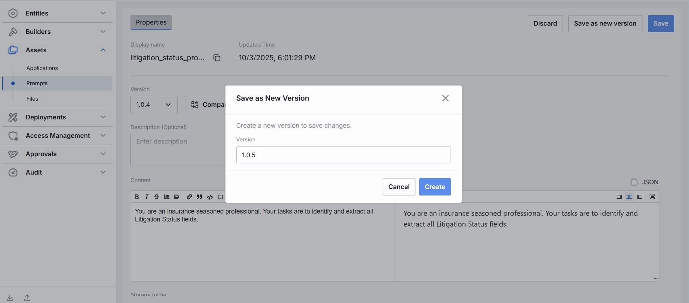

#### Compare versions

When multiple versions of a prompt exist, **Compare versions** becomes available. Use it to compare the prompt text across versions, with changes highlighted.

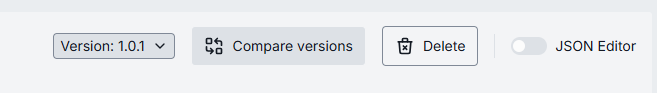

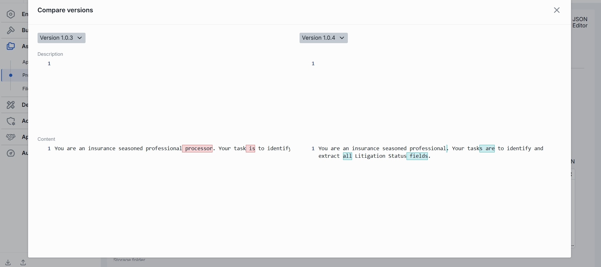

#### JSON editor (Prompts)

Advanced users can work with the prompt's raw JSON. Useful for bulk updates, copying configuration between environments, or editing settings not exposed in the form UI.

**Tip**
> Switching modes is disabled when there are unsaved changes.

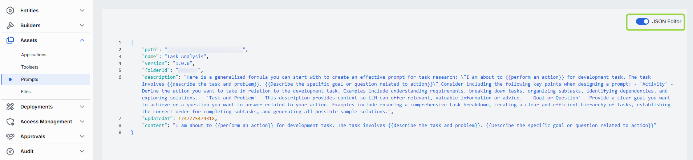

1. Navigate to **Assets → Prompts** and select the prompt you want to edit.
2. Click the **JSON Editor** toggle (top-right). The raw JSON is revealed.
