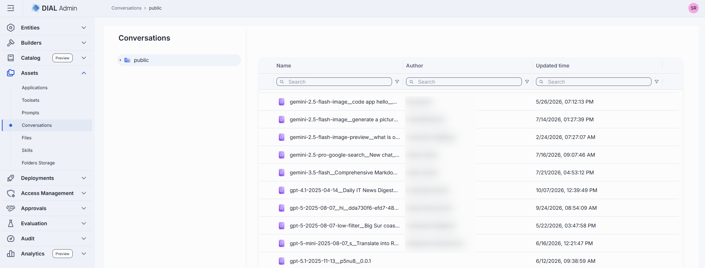
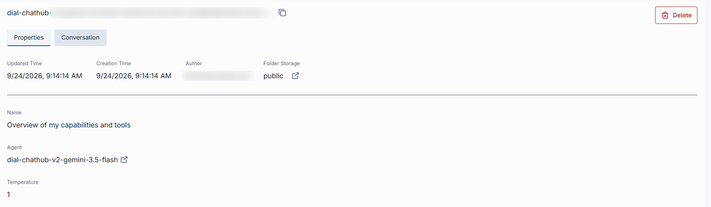
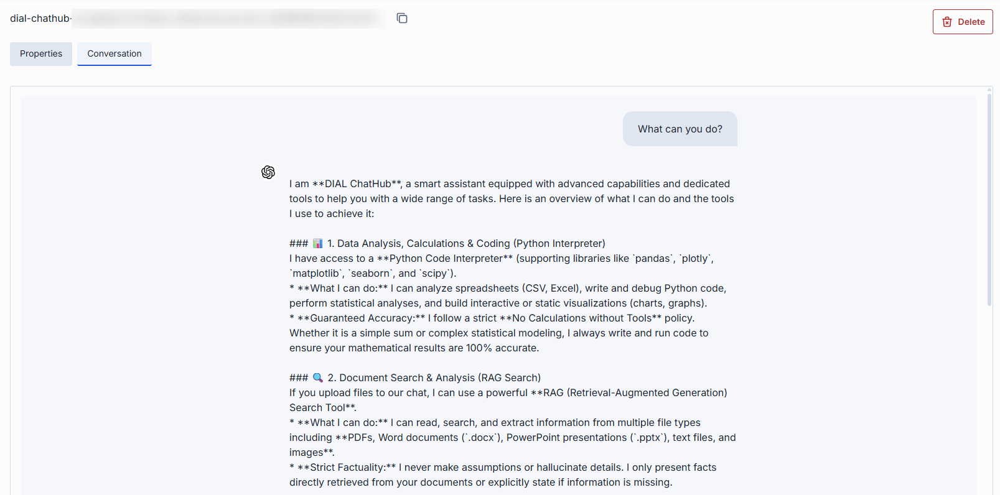

# Conversations

Conversations in DIAL represent chat sessions between users and AI models or applications. Conversations stored in the Public folder can be viewed by administrators. This asset type provides visibility into published conversations, their versions, and associated metadata.

### Main screen

The main screen displays all conversations located in the Public folder.

<!-- SCREENSHOT NEEDED: conversations asset main screen -->

Click any folder to display its contents in the conversations grid.

| Column | Description |
|--------|-------------|
| **Display Name** | Name of the conversation displayed on the UI. |
| **Version** | Version of the conversation. |
| **Author** | Username or system ID of the user who created or last updated this conversation. |
| **Updated Time** | Timestamp of the last modification. |
| **Actions** | **Open in a new tab**: Open the conversation's properties in a new tab. **Move to**: Move the conversation to another folder. **Export**: Download the conversation. **Delete**: Remove the conversation. |

### Conversation detail view

Click any conversation to open its detail view. The header displays the conversation's read-only **ID** and a **Version** dropdown to switch between versions. Use the **Delete** button to remove the selected conversation or version.

<!-- SCREENSHOT NEEDED: conversation detail view -->

The detail view has two tabs:

#### Properties tab

| Field | Description |
|-------|-------------|
| **Name** | Display name of the conversation. Read-only. |
| **Agent** | ID of the model or application used in this conversation. Includes a link to open the deployment's configuration in a new tab. |
| **Author** | Username or system ID of the user who created or last updated this conversation. |
| **Folder Storage** | Path to the conversation's location in the folder hierarchy. Click to navigate to Folders Storage. |
| **Prompt** | System prompt configured for this conversation. Expandable for long prompts. Shown only if a prompt was set. |
| **Temperature** | Sampling temperature used in this conversation. Shown only if set. |

#### Conversation tab

Displays the conversation's messages in a chat-style layout. User messages appear right-aligned; assistant responses appear left-aligned with an icon. This tab provides a read-only view of the conversation's full message history.

### Delete a conversation

There are several ways to delete a conversation or a specific version:

- Use the **Delete** button in the detail view header.
- Use the **Delete** option in the conversation's context menu on the main screen.
- Delete the folder in which the conversation is located.
- Use **Bulk Actions** on the main screen to delete multiple conversations at once.

