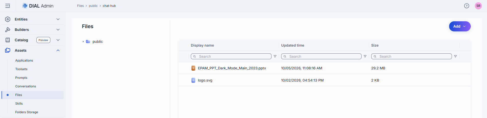
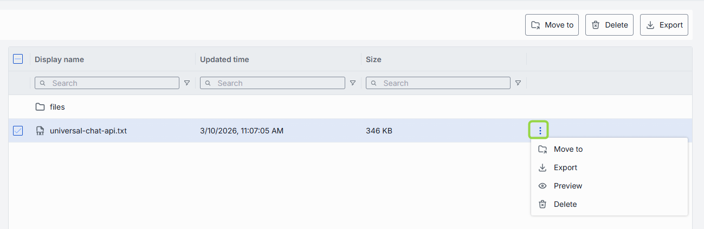
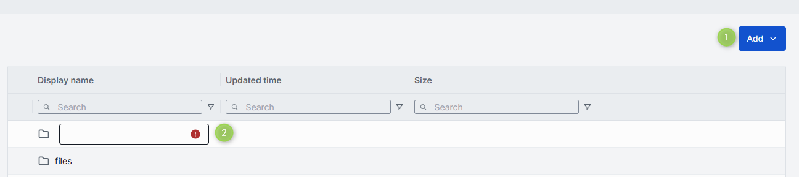
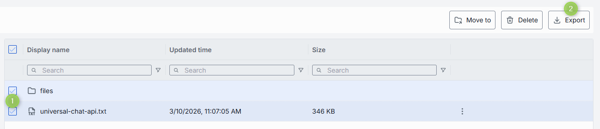
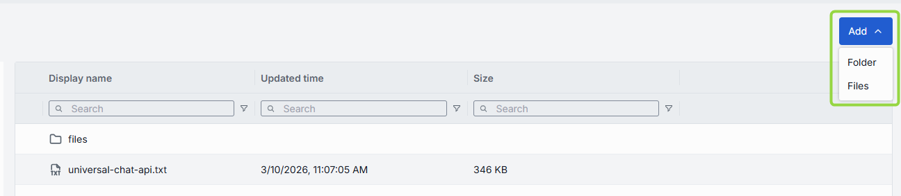
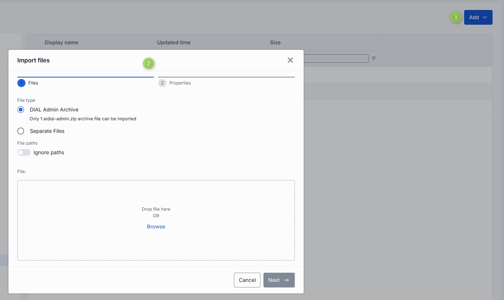
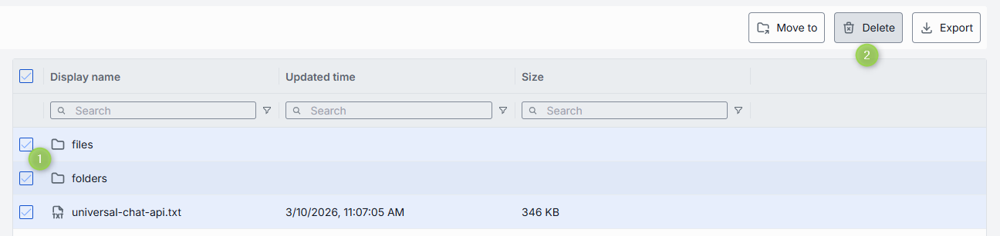

# Files

Files in DIAL are arbitrary binary or text assets (JSON, CSV, PDF, images, etc.) that AI models and applications can reference at runtime. Files added by users are stored in each user's private folder. They become available to other users and applications when [published](../../6.chat-user-guide/5.files.md) with applications and conversations that reference them, or via the [Publication API](https://dialx.ai/dial_api#tag/Publications).

DIAL can be configured to store files in the BLOB storage of your selected cloud provider, ensuring scalability and security.

**Note**
> Files are a protected resource. Refer to [Access Control](../../2.understand-dial/4.security-and-governance/2.access-control-reference.md#acls-for-objects) to learn how protected resources are handled in DIAL.

### Main screen

The main screen displays all files located in the Public folder.

Click any folder to display its contents (files and sub-folders).

| Column | Description |
|--------|-------------|
| **Display Name** | File name displayed on the UI. |
| **Updated Time** | Timestamp of the last file update. |
| **Size** | File size in kilobytes. |

Click any file (or select several files) to see the context menu with available actions:

| Action | Description |
|--------|-------------|
| **Move to** | Move the selected file(s) to another folder. |
| **Export** | Download a ZIP archive with the selected file(s). |
| **Preview** | Preview the content of the file. Enabled for: `.html`, `.htm`, `.css`, `.js`, `.mjs`, `.json`, `.xml`, `.txt`, `.md`, `.csv`, `.jpg`, `.jpeg`, `.png`, `.gif`, `.webp`, `.svg`, `.ico`, `.bmp`, `.avif`, `.mp3`, `.wav`, `.ogg`, `.mp4`, `.webm`, `.pdf`. |
| **Delete** | Delete file(s). Any models or applications that reference a deleted file will stop working until a valid file is reattached. |

You can also add sub-folders using the **Add** dropdown in the toolbar:

### Export files

You can download selected files or folders as a ZIP archive.

Make a selection and click **Export** in the toolbar. The Export button is also available in the context menu of each file or folder.

### Import files

Use the **Add** dropdown in the toolbar to add new folders or files.

1. Click **Add** in the toolbar and select **Files** to open the **Import Files** modal.
2. Choose to import a ZIP archive or separate files. Up to 30 files at once. Each file must be ≤ 512 MB. Only 1 archive at a time.
3. Enable **Ignore paths** to import all files directly into the root folder without recreating the original folder hierarchy.
4. Add files by dragging them into the window or using the file browser.
5. Click **Next** to select a conflict resolution strategy:
   - **Skip**: Do not import conflicting files; keep existing files unchanged.
   - **Override**: Replace files with the same name with the imported ones.
   - **Edit manually**: Rename incoming files one by one to avoid conflicts. Conflicting files are flagged in red and become editable.
6. Click **Finish**.

### Delete files

There are several ways to delete a file:

**Warning**
> Any applications that reference a deleted file will stop working until a valid file is reattached.

- Select one or more files or folders and click **Delete** in the toolbar.
- Use the **Delete** option in the file or folder context menu.
- Delete the folder in which the file is located.

