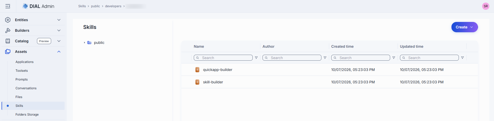
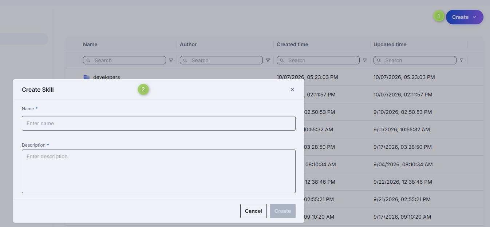
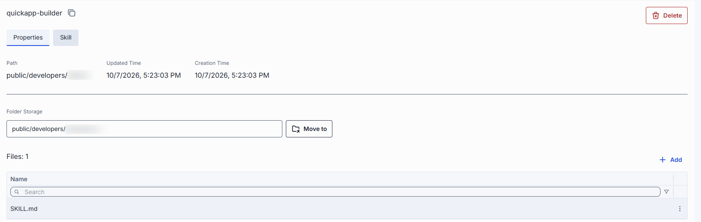
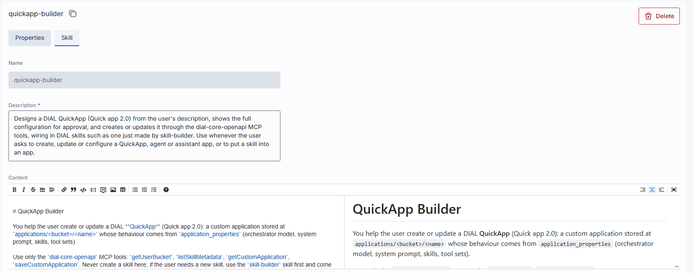

# Skills

Skills are reusable agent capabilities that applications can invoke at runtime. In DIAL Admin, the
Skills section under Assets lets administrators manage skills in the Public folder — creating,
editing, and organizing them alongside other asset types.

Skills can also arrive via user publication requests (see
[Publications and review](../7.publications-and-review.md)). Published skills appear in the Assets
listing alongside administrator-created ones.

## Main screen

The main screen displays all skills located in the Public folder. The grid shows skill name,
version, author, and last updated timestamp. Context-menu actions include **Open in a new tab**,
**Duplicate**, **Move to**, **Export**, and **Delete**.

## Create a skill

1. Select the target folder, click **Create** in the toolbar, and select **Skill**.
2. Define skill parameters (ID, Display Name, Version, Description).
3. Click **Create**. The skill configuration screen opens.

## Configure a skill

Click any skill to open its configuration screen. The Properties tab shows the skill's metadata,
endpoint configuration, and parameter definitions. Additional tabs (Tools Overview, Interceptors,
Dependencies, JSON Editor) follow the same patterns as
[application configuration](1.applications.md#configure-an-application).

### Properties

### Skill

