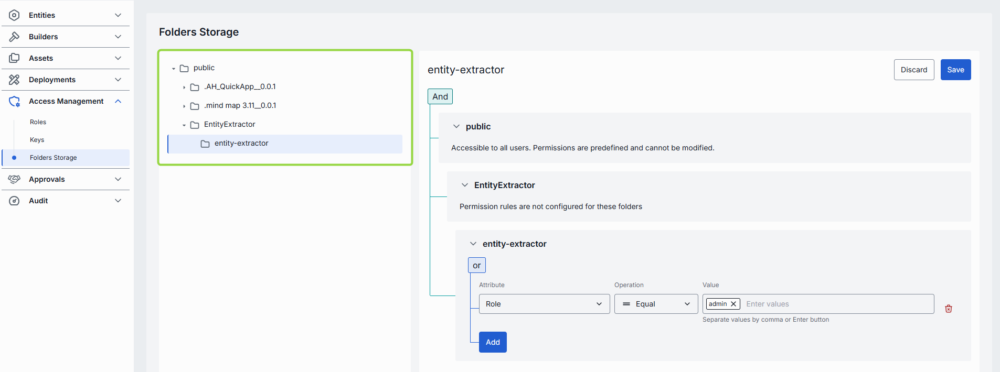
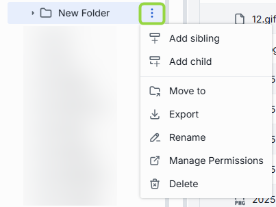
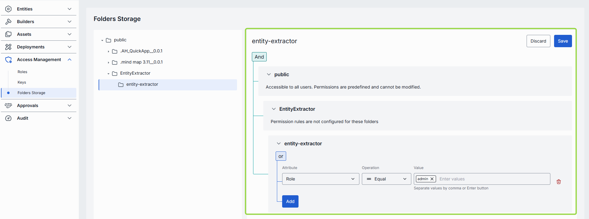
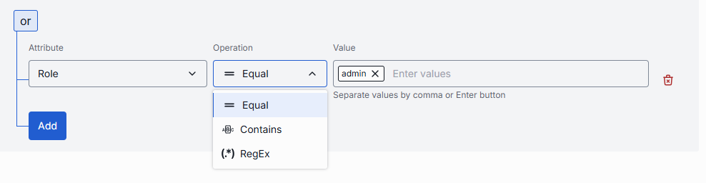
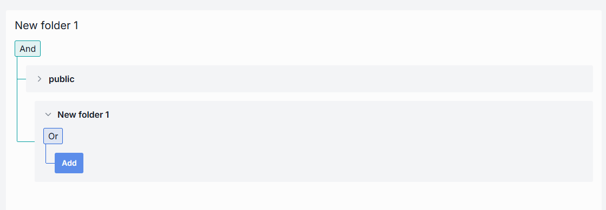

# Folders Storage

All asset types—Applications, Toolsets, Prompts, and Files—share a common folder model. Objects land in the Public folder when end users publish them or when administrators add them directly. The Public folder is visible to all authorized DIAL users; private objects of individual users are never shown in this view.

**Note**
> Refer to [Access Control](../../2.understand-dial/4.security-and-governance/2.access-control-reference.md) to learn more about Private and Public logical spaces for object storage in DIAL.

### Folder structure

Objects in the Public folder are arranged hierarchically, similar to a file system. A
**breadcrumb trail** at the top of the page shows your current location in the folder hierarchy.
Click any breadcrumb segment to navigate directly to that level. When the breadcrumb trail is too
long to display in full, hidden segments are accessible via a dropdown menu.

- **Root folder**: The Public root is visible to all authorized users. Objects published without a target sub-folder are placed in the root by default.
- **Sub-folders**: Use sub-folders for logical organization. One object per sub-folder is recommended. Folders support a maximum nesting depth of **4 levels** (excluding the root folder). Attempting to create folders beyond this limit is blocked.

The effective authorization rule for any object in a sub-folder includes restrictions from all parent folders up to the root. Refer to [Work with publications](../../3.building-with-dial/7.working-with-dial-resources/2.publications-api.md#effective-rules) to learn about effective rules for folders.

### Folder actions

Hover over any folder in the left or right panel to display the actions menu. The following actions are available on all asset-type pages:

| Action | Description |
|--------|-------------|
| **Add sibling** | Create a new sub-folder sharing the same parent as the selected folder. |
| **Add child** | Create a new sub-folder inside the selected folder. |
| **Move to** | Select a target location in the hierarchy to move the selected folder. |
| **Export** | Download the folder's content (with nested folders) as a ZIP archive or raw JSON file. |
| **Rename** | Rename the selected folder. |
| **Manage permissions** | Navigate to Folders Storage to manage access rules for the folder. |
| **Delete** | Delete the folder along with all objects inside it. |

**Note**
> Folder names must not exceed 160 characters.

### Access rules

Click any sub-folder to display its access rules. Access to the root Public folder is predefined and available to all authorized DIAL users. Sub-folders can have custom access rules set by administrators or requested by users in publication requests.

Access rules for objects in sub-folders are evaluated by matching `claims` from identity providers (IDPs) with the defined rules. Each rule is built from three parameters:

| Parameter | Description |
|-----------|-------------|
| **Attribute** | A specific `claim` in the JWT token payload (e.g. `role`). |
| **Value** | An array of claim values to match against (e.g. `admin`). |
| **Operation** | The matching function (e.g. `Equal`). |

Rules can be nested under **And/Or** blocks to form complex policies:

- **And**: All rules must be satisfied.
- **Or**: At least one rule must be satisfied.

**Note**
> If a folder has a parent folder, all access rules of the parent also apply to the child. Refer to [Work with publications](../../3.building-with-dial/7.working-with-dial-resources/2.publications-api.md#effective-rules) to learn about effective rules.

**Note**
> Refer to [JWT](../../4.operating-dial/5.auth-and-access-control/2.jwt.md) and [API Keys](../../4.operating-dial/5.auth-and-access-control/1.api-keys.md) for how to enable access to DIAL resources. Refer to [Configure IDPs](../../4.operating-dial/5.auth-and-access-control/4.sso-idp/0.index.md) for supported identity service provider configurations.

---
