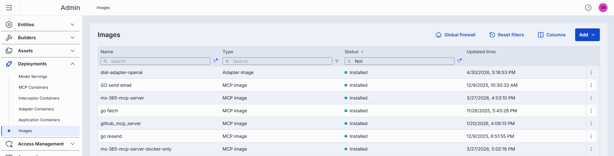
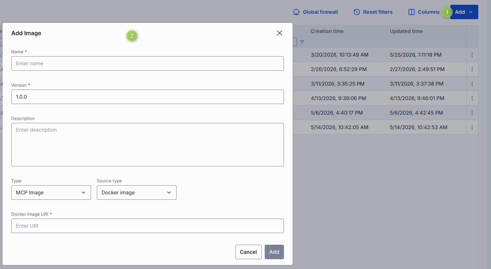
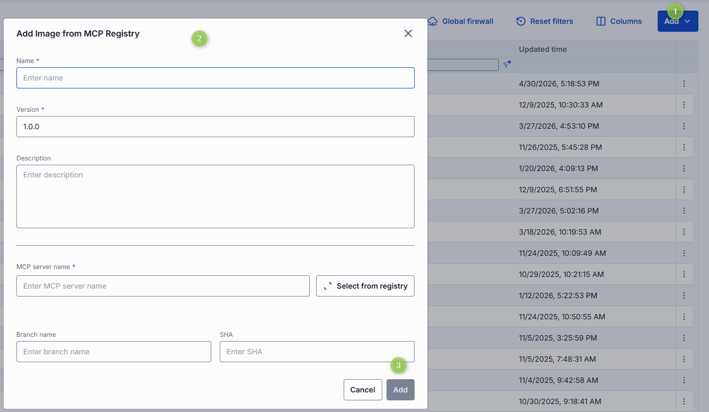
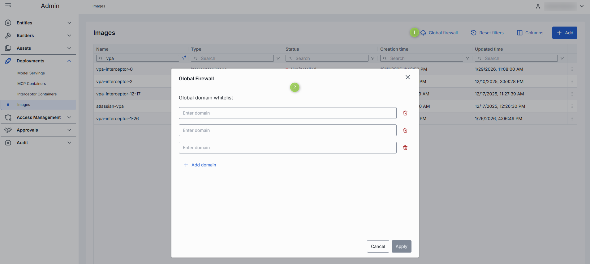
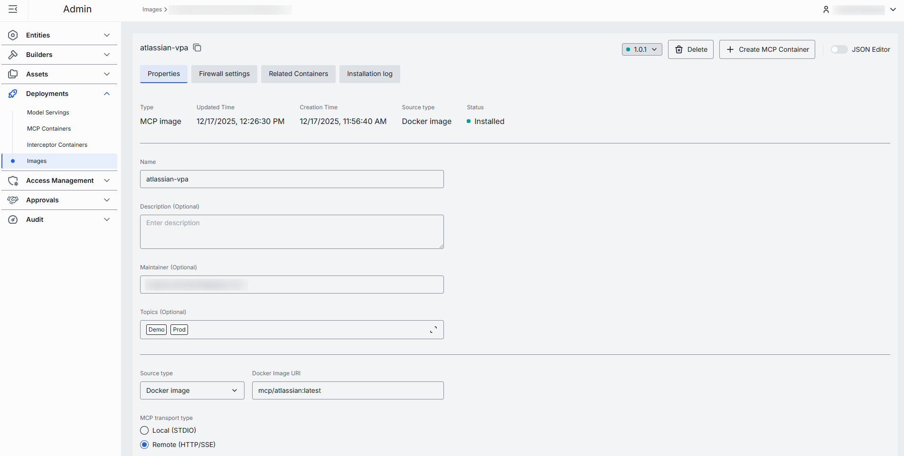
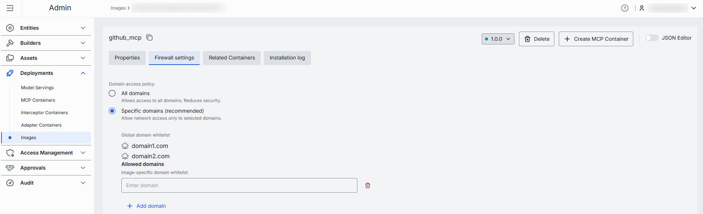
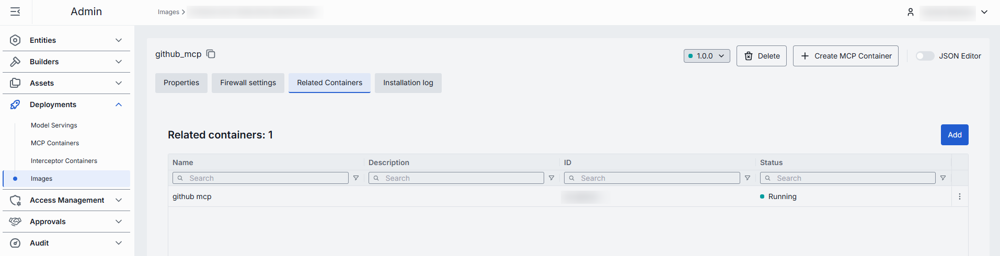
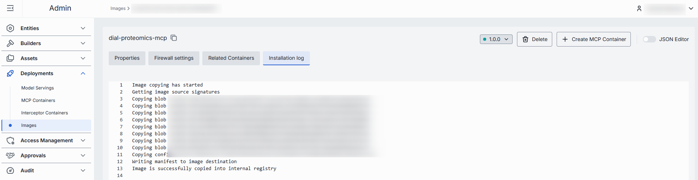

# Manage deployment images

This page explains how to view, create, and configure deployment images in DIAL Admin. Images are the build sources for MCP server, adapter, application, and interceptor containers. Administrators use this page to add new images, manage versions, set firewall rules, and monitor build logs.

**Prerequisite**: The Deployments section requires the [Deployment Manager Backend](https://github.com/epam/ai-dial-admin-deployment-manager-backend) to be installed and configured in your DIAL environment.

## Images grid

The main screen lists all available images and their current state.

| Column | Description |
|--------|-------------|
| ID | Unique identifier of the image. |
| Version | Version of the image. |
| Name | Name of the image. |
| Author | Email address of the creator. |
| Description | Brief description of the image. |
| Type | Type of the image: MCP, Adapter, Application, or Interceptor. |
| Source | Image source type: Docker image or source code repository. |
| Status | Current build/install status of the image. |
| Updated Time | Timestamp of the last update. |
| Creation Time | Creation timestamp. |
| Topics | Topics associated with the image. |
| Transport type | Applies to MCP images only. Transport type used: - **Remote**: HTTP (default) or SSE (deprecated) - **Local** (STDIO) |
| Actions | Per-row actions: - **Open in a new tab**: Open image properties in a new browser tab. - **Delete**: Remove the image. - **Duplicate**: Create a copy of the image. |

## Add an image

Use this flow to add images for MCP servers, AI model adapters, applications, and interceptors. After creating and installing an image, use it to deploy containers for specific entities.

**To add a new image:**

1. Click **Add** on the main screen and select **Add Image**.
2. Fill in the required fields in the **Add Image** form and click **Add**.

| Field | Required | Description |
|-------|----------|-------------|
| Name | Yes | Name of the image. |
| Version | Yes | Version of the image. |
| Description | No | Brief description of the image. |
| Type | Yes | Type of the image: MCP, Adapter, Application, or Interceptor. |
| Source type | Yes | **Docker Image**: Use an external Docker image as the source. **Source Code**: Use a source code repository as the source. |
| Docker Image URI | Conditional | URI of the Docker image. Available when **Source type = Docker Image**. |
| Repo URL | Conditional | URL of the source code repository. Available when **Source type = Source Code**. |
| Branch name | Conditional | Branch name in the source code repository. Available when **Source type = Source Code**. |
| SHA | Conditional | The 40-character hexadecimal Git commit SHA that uniquely identifies a commit in the repository's history. Available when **Source type = Source Code**. |

## Add an image from MCP Registry

You can add images for MCP servers directly from the [MCP Registry](https://registry.modelcontextprotocol.io/), a centralized catalog of MCP servers that provides server details and simplifies discovery.

**To add an image from MCP Registry:**

1. Click **Add** on the main screen and select **From MCP Registry**.
2. Fill in the required fields and click **Add**.

| Field | Required | Description |
|-------|----------|-------------|
| Name | Yes | Name of the image. |
| Version | Yes | Version of the image. |
| Description | No | Brief description of the image. |
| MCP server name | Conditional | Name of the MCP server from the MCP Registry. Start typing to search, or click **Select from registry** to browse available servers. |
| Source type | Conditional | Applies when the selected MCP server has both an OCI package and a source code repository. **Docker Image**: Deploy from the Docker image in the OCI package. **Source Code**: Deploy from the source code repository. Open server details in the registry dialog to see which options are available. |
| Branch name | Conditional | Branch name in the source code repository. Available when **Source type = Source Code**. |
| SHA | Conditional | The 40-character hexadecimal Git commit SHA. Available when **Source type = Source Code**. |

## Global firewall

Global firewall settings define an allowed-domains list that applies to all image builds in the environment. This avoids repeating common allowed domains on every individual image. [Per-image firewall rules](#firewall-settings) extend the global list.

**Domain name requirements**: Enter domain names without a protocol prefix, for example `github.com`. Each domain must contain at least one dot. Labels may include letters, numbers, and hyphens (1–63 characters each, not starting or ending with a hyphen). The top-level domain must be at least two letters. Labels must not include leading or trailing hyphens.

## Image configuration

Click any image on the main screen to open its configuration screen, where you can view and edit all image settings.

### Actions

The configuration screen header provides the following actions:

| Action | Description |
|--------|-------------|
| **Version** | Create a new image version or view a selected version's configuration. Versioning logic: - New image with a new name: version defaults to `1.0.0`. - New image whose name already exists: version is patch-bumped from the highest existing version for that name. - New version of the same image name: version is patch-bumped from the current image name's highest version. |
| **Save / Save as new version / Save as new image** | The available action depends on what changed: - **Save**: For installed images, applies when only Description, Maintainer, or Topics changed. - **Save as new image**: Applies when the Name changed. The dialog title is **Save new image**. - **Save as new version**: Applies when the Name is unchanged but a new version is wanted. The dialog title is **Save new version**.  |
| **Create Interceptor / MCP / Adapter / Application Container** | Available for installed images. Use to create a new [MCP](./3.mcp-containers.md), [adapter, application, or interceptor container](./2.container-management.md) from the selected image. |
| **Install / Stop** | **Install**: Available for images not yet installed. Click to install the selected version. **Stop**: Appears during installation and can interrupt the process. |
| **Delete** | Remove the selected image. **Warning** > Deleting an image affects all related containers. |

### Properties

The **Properties** tab shows the image's configuration fields.

| Field | Required | Editable | Description |
|-------|----------|----------|-------------|
| ID | — | No | Unique read-only identifier of the image. |
| Type | — | No | Image type: MCP, Adapter, Application, or Interceptor. |
| Creation Time | — | No | Creation timestamp. |
| Updated Time | — | No | Timestamp of the last update. |
| Status | — | No | Current build/install status. |
| Name | Yes | Yes | Display name. 2–255 characters. Letters, numbers, spaces, underscores, and hyphens only. |
| Description | No | Yes | Brief description of the image. |
| Maintainer | No | Yes | Email address of the person or team responsible for this image. |
| Topics | No | Yes | Semantic labels for filtering and navigation. Custom topics: maximum 255 characters, no leading or trailing spaces. |
| Build privileges | Yes | Yes | Permission level applied during image build. |
| Source type | Conditional | No | Read-only. **Docker Image** or **Source Code**. |
| Docker image URI | Conditional | Yes | Valid Docker image URI; must not start or end with `/`. Applies to MCP (when source type = Docker image), Adapter, Application, and Interceptor images. Auto-populated and read-only for images created from MCP Registry. |
| Source code repository parameters | Conditional | Yes | Parameters for the source code repository. Applies when source type = Source Code for MCP, Adapter, Application, and Interceptor images. For MCP Registry images, some values may be read-only. - **Repo URL** (required): Must not start or end with `/`. Read-only for MCP Registry images. - **Branch name**: Branch in the repository. - **SHA**: The 40-character hexadecimal Git commit SHA. - **Base directory**: Path containing the Dockerfile. Must not start or end with `/`. |
| MCP server name | Conditional | Yes | Applies to MCP images only. MCP server name from the MCP Registry. Start typing to search, or click **Select from registry** to browse. |
| MCP transport type | Conditional | Yes | Applies to MCP images only. **Remote**: HTTP (default) or SSE (deprecated). **Local** (STDIO). |

**Note**
> Advanced users can switch to the JSON editor view for bulk updates, copying configuration between environments, or adjusting settings not exposed in the form UI.

### Firewall settings

The firewall settings for an individual image specify which external domains the build process can reach — for example, to download dependencies or pull files during image creation. These rules apply only during the build and do not affect containers created from the image.

**Note**
> Firewall settings for a specific image apply in addition to the [global firewall settings](#global-firewall).

**Note**
> These firewall rules do not apply to containers created from this image. Containers can have their own firewall settings.

**Domain name requirements**: Enter domain names without a protocol prefix, for example `github.com`. Each domain must contain at least one dot. Labels may include letters, numbers, and hyphens (1–63 characters each, not starting or ending with a hyphen). The top-level domain must be at least two letters.

### Related containers

**Note**
> This tab is enabled for installed images.

The **Related Containers** tab shows all MCP, adapter, application, or interceptor containers associated with the selected image version.

**To add containers:**

1. Click **Add** to open the container selection modal.
2. Toggle **Show containers related to this image** to switch between showing containers for all versions or only the selected version.
3. Select one or more containers and click **Apply**.

**Warning**
> Running containers are restarted when their associated image changes.

**Note**
> Every container must be linked to an image version. Once linked, a container cannot be removed from this list — you can only change which image it uses.

### Installation log

**Note**
> This tab is enabled for installed images.

The **Build Log** tab shows the complete output from the image build process, including step-by-step command output, warnings, and errors that occurred during creation.

### Audit

The **Audit** tab shows activity, usage, and operational metrics for the selected image version, including build history and configuration change history.

**Note**
> This tab shows the same data as the global [Activity](../8.audit/1.activity-and-rollback.md) section, scoped to the selected image.

## Next steps

- [Manage containers](./2.container-management.md) — deploy and manage adapter, application, and interceptor containers based on your images
- [Manage MCP containers](./3.mcp-containers.md) — deploy MCP server containers and create tool sets from them
- [Manage entities — models](../2.entities/1.models.md) — register AI models that use adapter containers as their source
