# Manage containers

This page explains how to create, run, stop, configure, and delete containers for AI model adapters, applications, interceptors, and model servings in DIAL Admin. Administrators use this page to deploy self-hosted workloads and register the resulting endpoints as DIAL entities. Familiarity with DIAL deployment images is assumed.

**Prerequisite**: The Deployments section requires the [Deployment Manager Backend](https://github.com/epam/ai-dial-admin-deployment-manager-backend) to be installed and configured in your DIAL environment.

---

## Shared container lifecycle

The following steps, properties, and behaviors apply to all container types (adapter, application, interceptor, and model serving) unless a per-type section below states otherwise.

### Container grid columns

Each container list screen shows the following columns:

| Column | Description |
|--------|-------------|
| Display Name | Name of the container rendered in the UI. |
| Description | Brief description of the container. |
| Status | Current status (e.g., Running, Stopped). |
| ID | Unique identifier of the container. |
| Source type | **Docker Image Reference** for external Docker images; **Internal \<Type\> Image** for DIAL self-hosted images. |
| Source Name | Docker image name or ID of the internal image. |
| Container URL | URL to access the running container. |
| Author | Email address of the container creator. |
| Creation Time | Container creation timestamp. |
| Updated Time | Timestamp of the last update. |
| Topics | Semantic labels associated with the container. |
| Actions | Per-row actions: **Open in a new tab**, **Duplicate**, **Stop/Run**, **Delete**. |

### Create a container

On the main screen of any container type, click **Create** and choose a source:

- **From Internal \<Type\> Image**: Select the desired [image](./1.images.md) from the list and choose an installed version (marked with a green indicator).
- **From Docker Image Reference** (or **External Docker Image Reference**): Provide the URI of the external Docker image you want to use.

Specify **ID**, **Display Name**, and **Description**, then click **Finish** (or **Create**) to create the container. The configuration screen opens. You can modify settings, run, stop, or delete the container from there.

**Note**
> Configuration fields are disabled for editing when a container is in a transition state (pending or stopping).

### Configuration actions

The configuration screen header provides the following actions for all container types:

| Action | Description |
|--------|-------------|
| **Create \<Entity\>** | Available for running containers. Opens a dialog to create the corresponding DIAL entity (adapter, application, interceptor, or model). See per-type sections for details. |
| **Run / Stop** | Start or stop the container. |
| **Delete** | Remove the container. Deleting a container affects entities created from it. |

### Properties

The **Properties** tab contains the following fields for all container types. Per-type differences are noted in each type's section.

| Property | Required | Editable | Description |
|----------|----------|----------|-------------|
| ID | — | No | Unique read-only identifier. 2–36 characters. Lowercase letters, numbers, and hyphens only. |
| Source Type | — | No | Read-only source type used to create the container. |
| Creation Time | — | No | Container creation timestamp. |
| Updated Time | — | No | Timestamp of the last update. |
| Status | — | No | Current status (e.g., Running, Stopped). |
| URL | — | No | URL to access the running container. |
| Restarts | — | No | Restart counter for launching containers. Use to identify crash loops. Details are in the [Execution log](#execution-log). |
| Display Name | Yes | Yes | Name rendered in the UI. 2–255 characters. |
| Description | No | Yes | Brief description of the container. |
| Maintainer | No | Yes | Email address of the maintainer. |
| Topics | No | Yes | Semantic labels (e.g., "finance", "support") for navigation. Custom topics: maximum 255 characters, no leading or trailing spaces. |
| Image reference | Conditional | Yes | The internal image or external Docker image used for this container. See per-type sections for exact field names. Changing the internal image redeploys the container. |
| Endpoint Configuration | No | Yes | Endpoint and port settings for the container. Changes to a running container trigger a RollingUpdate restart. |
| Autoscaling | No | Yes | Replica scaling settings: - **Automatic scale to zero**: Reduce replicas to zero after a period of inactivity (default: 5-minute delay for new containers). - **Min and Max Replicas**: Minimum and maximum number of running instances. Default for new containers: 0 to 1 replica. - **Pending requests to trigger autoscaling**: Queue depth that triggers scale-up. **Note** > Existing containers retain their current autoscaling configuration after an upgrade. |
| Environment Variables | No | Yes | Environment variables for the container. Changes trigger a RollingUpdate restart. - **Name**: 1–253 characters. Letters, numbers, dots (`.`), hyphens (`-`), and underscores (`_`). - **Value**: 1–253 characters. Letters, numbers, dots (`.`), hyphens (`-`), and underscores (`_`). |
| Resources | No | Yes | CPU, memory, and GPU resource requests and limits. Changes trigger a RollingUpdate restart. Validation rules: - Values must be numeric and greater than 0. - Maximum allowed values for `cpu`, `memory`, and `nvidia.com/gpu` are defined on the backend. - For each resource key (e.g., `cpu`), the limit must not be less than the request. |
| Configuration | No | Yes | Executable command and arguments used to launch the container. |
| Startup probe | No | Yes | Health check that signals when the container is ready to serve traffic. - **Type**: HTTP (GET request; success = HTTP 200–399) or TCP (connection success). - **Port**: Container port for the probe. - **Path**: Request path. Applies to HTTP type only. - **Initial delay seconds**: Wait time after container start before the first probe. - **Period seconds**: Interval between consecutive probes. - **Timeout seconds**: Maximum time allowed for a single probe to complete. - **Failure threshold**: Consecutive failures before the container is marked as failed. |

**Note**
> Advanced users can switch to the JSON editor view for bulk updates, copying configuration between environments, or adjusting settings not exposed in the form UI.

### Firewall settings

The firewall settings for a container specify which external domains the container is allowed to connect to. This controls outgoing traffic, restricting communication to trusted domains only.

**Domain name requirements**: Enter domain names without a protocol prefix, for example `github.com`. Each domain must contain at least one dot. Labels may include letters, numbers, and hyphens (1–63 characters each, not starting or ending with a hyphen). The top-level domain must be at least two letters.

### Execution log

The **Execution Log** tab shows real-time logs generated by the container, including errors and operational events.

When a container starts with more than one pod, logs are shown per pod:

When issues occur, health indicators appear:

| Indicator | Description |
|-----------|-------------|
| Restarts | Restart counter. Use to identify crash loops. |
| Last restarted at | Timestamp of the last restart. |
| Last reason | Restart failure reason. |

### Events

The **Events** tab shows significant state changes, such as start and stop actions, errors, and configuration changes.

### Audit

The **Audit** tab shows activity, usage, and operational metrics for the container, including configuration changes and runtime actions.

**Note**
> This tab shows the same data as the global [Activity](../8.audit/1.activity-and-rollback.md) section, scoped to the selected container.

---

## Adapter containers

Adapter containers host self-hosted AI model adapters. Once running, register the exposed endpoint as an adapter in DIAL Builders.

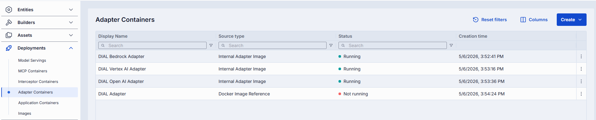

### Create an adapter container

Follow the [shared creation steps](#create-a-container). Select from **Internal Adapter Image** or **External Docker Image Reference**.

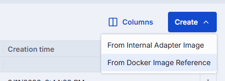

### Adapter-specific actions

| Action | Description |
|--------|-------------|
| **Create Adapter** | Available for running containers. Opens a dialog to create a new adapter in DIAL Builders. |

### Create an adapter from a running container

1. In the configuration screen of the running container, click **Create Adapter**.
2. Fill in the dialog:
   - **ID**: Unique identifier. Auto-populated from the container.
   - **Display Name**: Name shown in the UI. Auto-populated from the container.
   - **Description**: Brief description.
3. Click **Create**. The adapter appears in [Builders/Adapters](../3.builders.md). Repeat to create additional adapters.

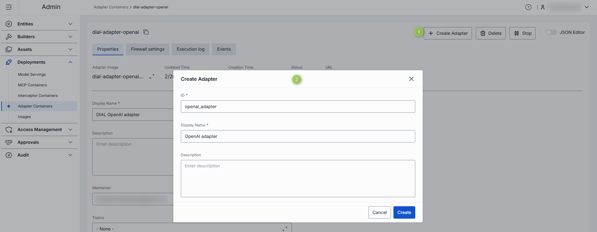

### Adapter-specific properties

In addition to the [shared properties](#properties), adapter containers include:

| Property | Editable | Description |
|----------|----------|-------------|
| Adapter Image | Yes | Internal Adapter image used to create the container. Click to change the source image. Changing the image redeploys the container. |
| Docker Image Reference | Yes | External Docker image reference. Available only when the container was created from an external image. |

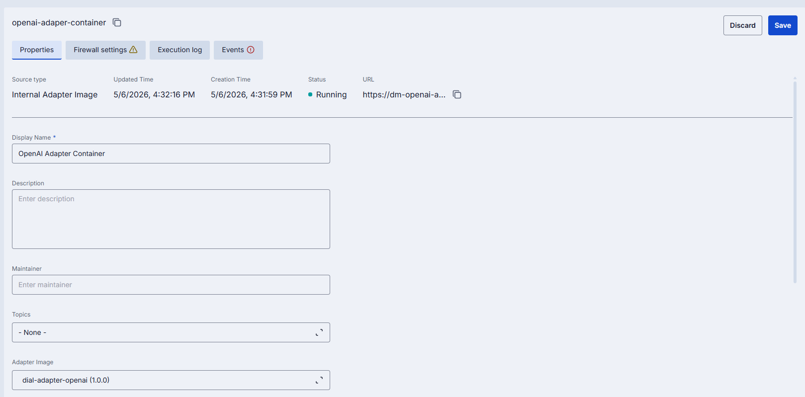

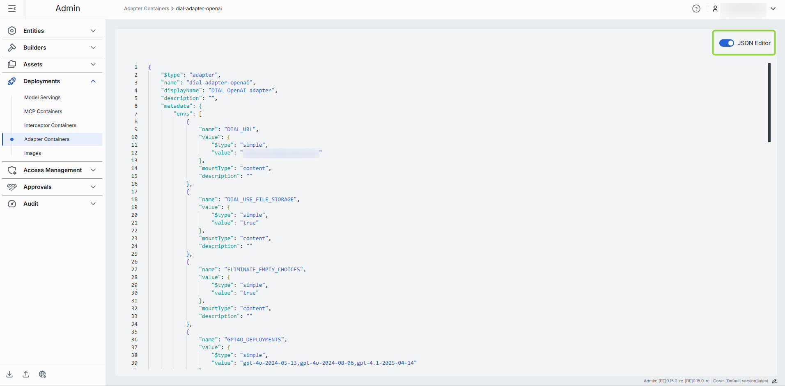

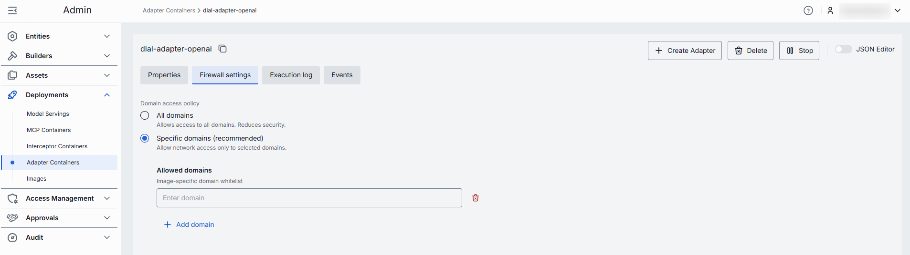

---

## Application containers

Application containers host self-hosted DIAL applications. Once running, register the exposed endpoint as an application entity in DIAL.

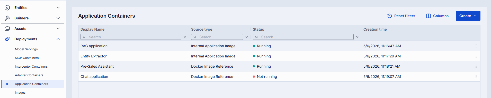

### Create an application container

Follow the [shared creation steps](#create-a-container). Select from **Internal Application Image** or **Docker Image Reference**.

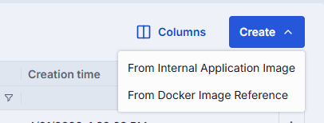

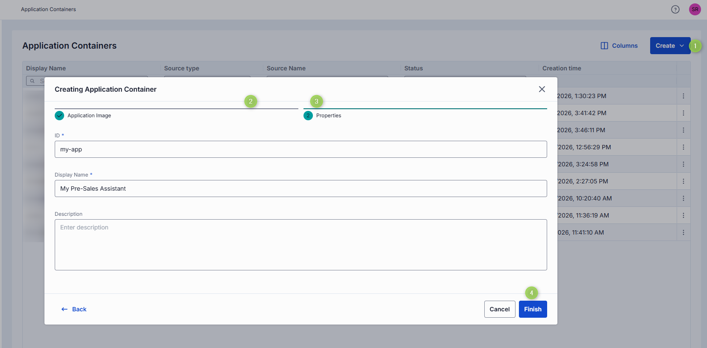

### Application-specific actions

| Action | Description |
|--------|-------------|
| **Create Application** | Available for running containers. Opens a dialog to create a new application in DIAL Entities. |

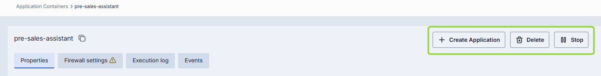

### Create an application from a running container

1. In the configuration screen of the running container, click **Create Application**.
2. Fill in the dialog:
   - **ID**: Unique identifier. Auto-populated from the container.
   - **Display Name**: Name shown in the UI. Auto-populated from the container.
   - **Description**: Brief description.
3. Click **Create**. The application appears in [Entities/Applications](../2.entities/2.applications.md). Repeat to create additional applications.

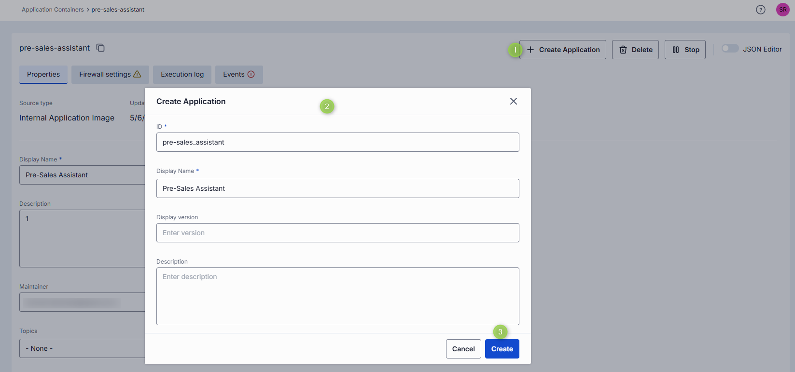

### Application-specific properties

In addition to the [shared properties](#properties), application containers include:

| Property | Editable | Description |
|----------|----------|-------------|
| Application Image | Yes | Internal application image used to create the container. Disabled when an external Docker image was used. |
| Docker Image Reference | Yes | External Docker image reference. Disabled when an internal image was used. |

**Note**
> For new application containers, autoscaling defaults to **scale to zero** enabled with a 5-minute inactivity delay and a replica range of 0 to 1.

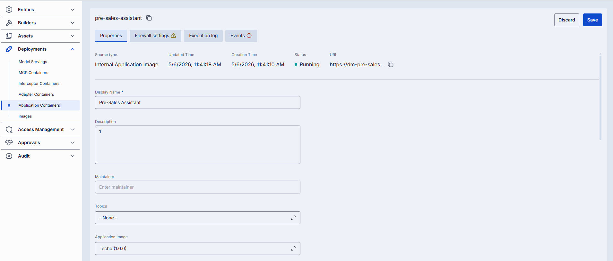

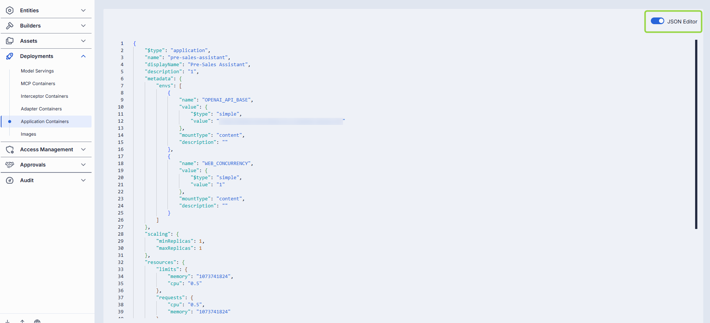

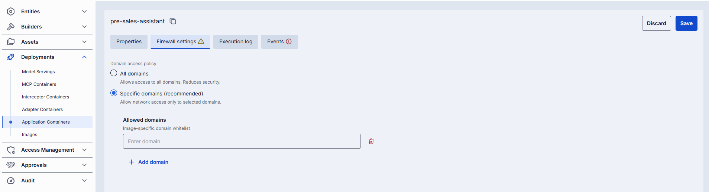

---

## Interceptor containers

Interceptors are middleware components that modify incoming or outgoing requests to or from applications and AI models. Use cases include PII obfuscation, guardrails, and safety checks. Interceptor containers host self-hosted interceptors deployed from Docker images.

There are three ways to add interceptors in DIAL:

- Provide the endpoint of your custom interceptor directly using the External Endpoint source type in [Entities/Interceptors](../2.entities/4.interceptors.md).
- Define [Interceptor Templates](../3.builders.md) and use them as a source type.
- Deploy custom interceptors using Docker [images](./1.images.md), create containers, and use the container as a source type — as described on this page.

**Tip**
> Use the [Interceptors SDK](https://github.com/epam/ai-dial-interceptors-sdk) to create custom interceptors.

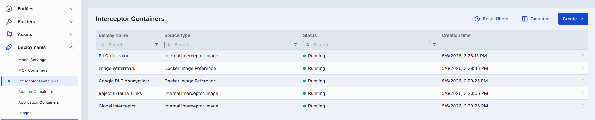

### Create an interceptor container

Follow the [shared creation steps](#create-a-container). Select from **Internal Interceptor Image** or **External Docker Image Reference**.

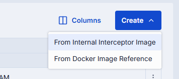

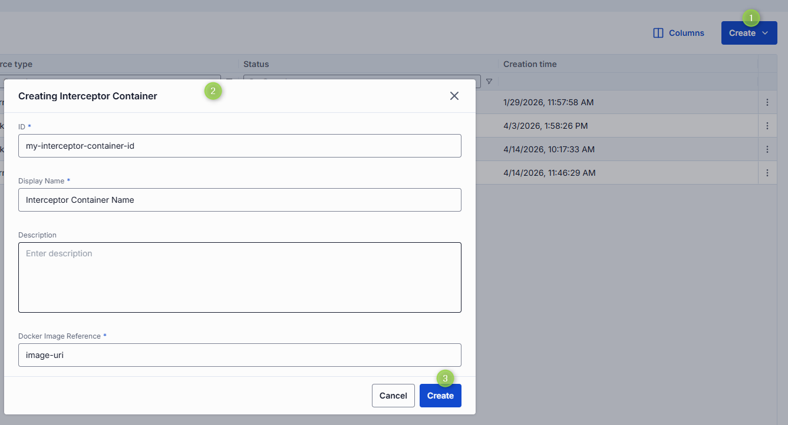

### Interceptor-specific actions

| Action | Description |
|--------|-------------|
| **Create Interceptor** | Available for running containers. Opens a dialog to create a new interceptor in DIAL Entities. |

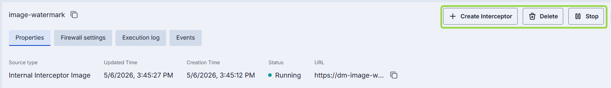

### Create an interceptor from a running container

1. In the configuration screen of the running container, click **Create Interceptor**.
2. Fill in the dialog:
   - **ID**: Unique identifier. Auto-populated from the container.
   - **Display Name**: Name shown in the UI. Auto-populated from the container.
   - **Description**: Brief description.
3. Click **Create**. The interceptor appears in [Entities/Interceptors](../2.entities/4.interceptors.md) and can be used by DIAL applications, tool sets, and models, or set as a [global interceptor](../1.config-backup-and-global-settings.md). Repeat to create additional interceptors.

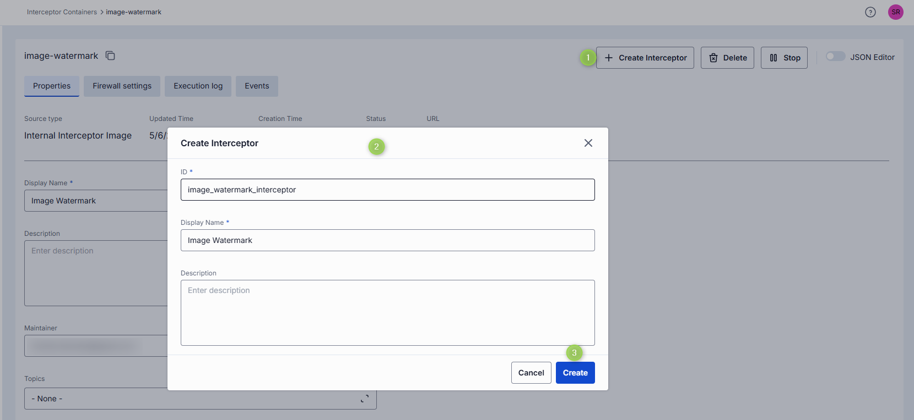

### Interceptor-specific properties

In addition to the [shared properties](#properties), interceptor containers include:

| Property | Editable | Description |
|----------|----------|-------------|
| Docker Image Reference | Yes | External Docker image reference. Available only when the container was created from an external image. |
| Interceptor Image | Yes | Internal Interceptor image used to create the container. Click to change the source image. Changing the image redeploys the container. |

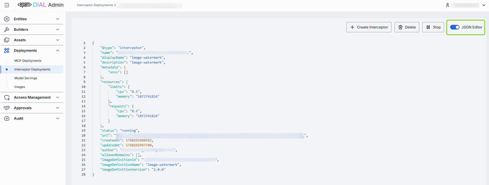

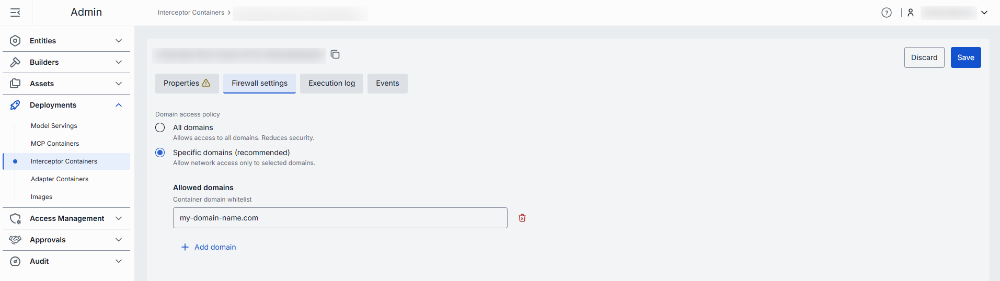

---

## Model serving containers

Model serving containers deploy AI models from [NVIDIA NIM](https://build.nvidia.com/models) and [Hugging Face](https://huggingface.co/models) within DIAL infrastructure. After a model serving container is running, you can register it as a DIAL model entity.

### How to use models in DIAL

To make an AI model available in DIAL, you need an adapter that aligns the model's API with the DIAL Unified API. DIAL includes adapters for [Azure OpenAI](https://github.com/epam/ai-dial-adapter-openai), [GCP Vertex AI](https://github.com/epam/ai-dial-adapter-vertexai/?tab=readme-ov-file#supported-models), and [AWS Bedrock](https://github.com/epam/ai-dial-adapter-bedrock) models. You can create custom adapters for other models using the [DIAL SDK](https://github.com/epam/ai-dial-sdk).

For OpenAI-compatible models on Hugging Face or NVIDIA NIM, use the DIAL OpenAI adapter. For models that are not OpenAI-compatible, create a custom adapter.

**Full enablement flow:**

1. Create and run a model serving container with an OpenAI-compatible model from Hugging Face or NIM.
2. If not already part of your DIAL setup, create a new adapter based on the [DIAL Azure OpenAI Adapter](https://github.com/epam/ai-dial-adapter-openai) and add it in Builders/Adapters.
3. In [Entities/Models](../2.entities/1.models.md), create a new model entity:
   - Set **Source Type** to your OpenAI adapter.
   - Set **Override Name** to the model name from the running container. Find it in the container logs.
   - Add an **Upstream Endpoint** following the pattern: `http://<container_url>/openai/v1/chat/completions`.
4. The AI model is now available to users and applications according to your permissions configuration.

### Model servings grid

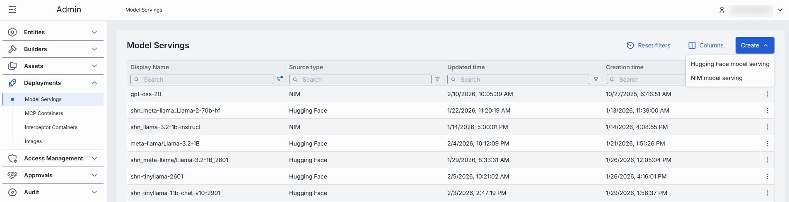

The model servings grid includes the standard [container grid columns](#container-grid-columns) plus:

| Column | Description |
|--------|-------------|
| Source Type | NIM or Hugging Face. |

### Create a model serving container

**Note**
> Available deployment options depend on the current setup.

Click **Create** on the main screen and select the type of model serving (Hugging Face or NIM).

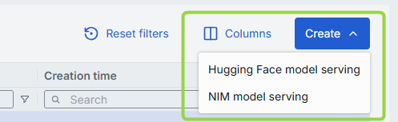

Fill in the form:

- **ID**: Unique identifier for the model serving.
- **Display Name**: Name displayed in the UI.
- **Description**: Brief description.
- **Hugging Face Model Name**: Applies to Hugging Face source type. Start typing to see suggestions, or click **Select from registry** to pick from the modal.
- **Docker Image URI**: Applies to NIM source type. Docker image URI for the model.

Click **Create** to submit the form.

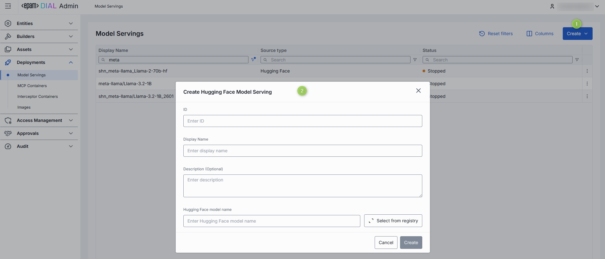

### Model serving actions

| Action | Description |
|--------|-------------|
| **Create Model** | Available for running model servings. Creates a new [model entity](../2.entities/1.models.md) from this container. |
| **Run / Stop** | Start or stop the model serving. |
| **Delete** | Remove the model serving. Deleting affects model entities created from it. |

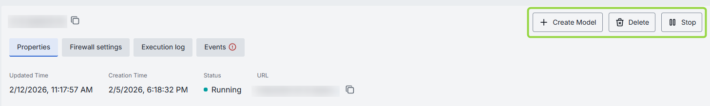

### Create a model from a running container

1. In the configuration screen of the running model serving, click **Create Model**.
2. Fill in the dialog:
   - **ID**: Unique identifier. Auto-populated from the model serving.
   - **Display Name**: Name shown in the UI. Auto-populated from the model serving.
   - **Display Version**: Version of the model.
   - **Description**: Brief description.
3. Click **Create**. The model appears in [Entities/Models](../2.entities/1.models.md). Repeat to create additional models.

Refer to [How to use models in DIAL](#how-to-use-models-in-dial) for the full enablement flow.

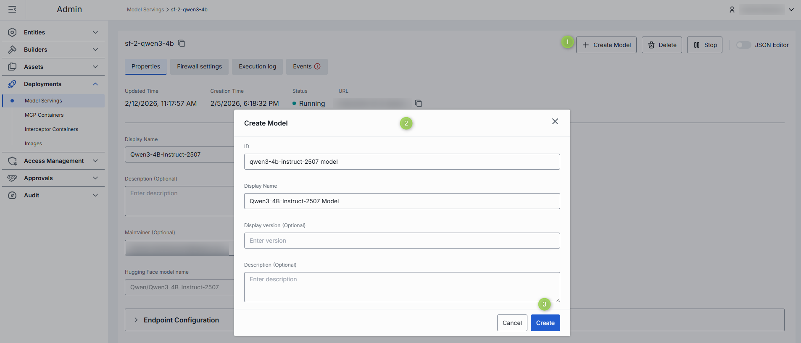

### Model serving properties

In addition to the [shared properties](#properties), model serving containers include:

| Property | Required | Editable | Description |
|----------|----------|----------|-------------|
| Hugging Face model name | Conditional | Yes | Applies to Hugging Face models. Start typing to see suggestions, or click **Select from registry** to pick from the modal. |
| Docker Image URI | Conditional | Yes | Applies to NIM models. The Docker image URI for the model. |
| Autoscaling | No | Yes | **Note** > Autoscaling controls for **scale to zero** are available only for Hugging Face model servings. NIM and Hugging Face model servings default to 1 replica for both Min and Max. Existing containers retain their current configuration. |

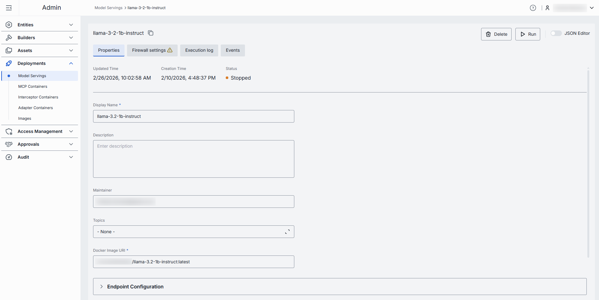

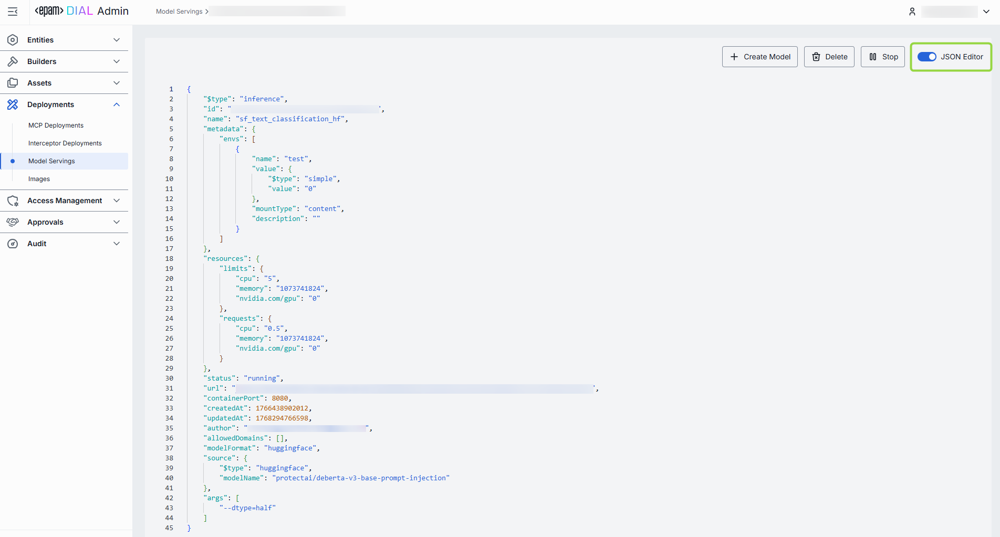

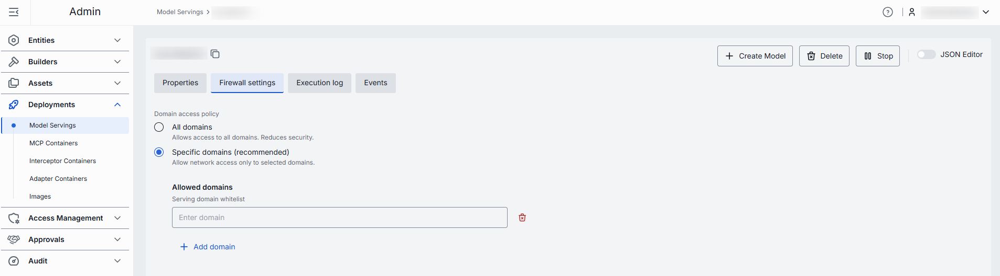

The execution log for model servings also includes the following health indicators when issues occur:

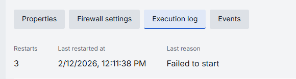

| Indicator | Description |
|-----------|-------------|
| Restarts | Restart counter. Use to identify crash loops. |
| Last restarted at | Timestamp of the last restart. |
| Last reason | Restart failure reason. |

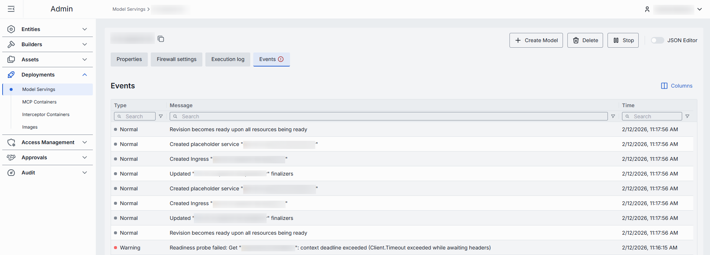

## Next steps

- [Manage deployment images](./1.images.md) — build and version the images that containers are based on
- [Manage MCP containers](./3.mcp-containers.md) — deploy MCP server containers and create tool sets
- [Manage entities — models](../2.entities/1.models.md) — register and configure AI models in DIAL
